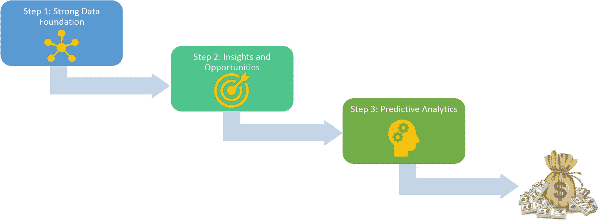

# 人工智能在采购中的应用:三步之旅

> 原文：<https://towardsdatascience.com/ai-adoption-in-procurement-3-step-journey-1a9426992586?source=collection_archive---------4----------------------->

3-Step Journey of AI Adoption within Procurement

每个人都想节省和减少他们的支出，包括各行各业各种规模的公司。然而，试图在一家公司的支出池中找到节省的资金通常就像大海捞针一样。当然，也有一些唾手可得的果实，但它们很快就会被消耗掉，这就给采购团队留下了寻找不断更新的节约途径的繁重任务。在之前的一篇文章中，我谈到了这是一个需要解决的复杂问题，以及人工智能在应对相关挑战中可以发挥的作用。

仔细看看人工智能可以改变游戏规则的具体方面，对于理解它在采购环境中的更广泛价值很重要。在采购领域使用人工智能和分析可以被认为是一个三步走的旅程。

**第一步:建立强大的数据基础**:一个组织的支出数据充满了问题——它通常分布在多个不协调的 ERP 和其他系统中；它有不同的格式、结构和术语；它经常有缺失的信息；即使是现有的信息也很少是可靠的，随着时间的推移，会出现许多人工输入错误。因此，大多数采购从业者都认为，创建一个强大的支出数据基础的任务极具挑战性。

这就是人工智能元素可以出手相救的地方。重要的是要记住，仅仅将各种数据源缝合在一起的解决方案是远远不够的——将它们整合在一起是问题的最小部分。人工智能驱动的支出分析将超越 it 许多步骤，以确保数据不仅跨来源全面捆绑在一起，而且得到清理和丰富。关键浓缩步骤包括以下内容:

*   持续的数据审计，以检查并标记不完整和不一致的数据
*   基于文本和自然语言处理(NLP)的项目、供应商等领域聚类。确保可用于分析的信息得到简化
*   准确的支出分类，确保数百万行交易中的每一行都正确而细致地标记到它们所涉及的项目上

> 数据基础可能是实现有效采购计划的最关键的方面。正如他们所说——你不知道的，你无法控制。没有准确的数据基础，采购根本不知道谁在什么地方花了多少钱，为什么要花！

**第二步:** **寻找美元美元:**一旦强大的数据基础到位，世界就唾手可得了！拥有正确的数据是成功的一半。下一步是找出这些数据中隐藏的节约和机会。考虑到典型采购数据的规模和复杂性，手工处理效率很低。人工智能和领域专业知识的结合可以大大提高任务的成效。

植根于采购知识的算法可以不断解析公司的支出数据，并识别机会领域。这些领域将跨越不同的杠杆，所有这些都需要不同类型的分析和相应的算法。一些例子:

*   **价格差异**:在购买的成千上万的 SKU 中，确定不同供应商收取的不同单价的存在和程度。确保这是一个苹果对苹果的比较是关键。一旦确定了节约，捕获就变得快速而简单。
*   **营运资本优化**:这可能是最容易实现的节约，但如果没有先进的分析工具，几乎不可能实现。哪里过早付款？同一个供应商在哪里有多个付款条件？你在哪里错过了提前付款的折扣？这些是人工智能驱动的系统可以为你提供的一些问题。
*   **合同合规**:采购团队花费大量时间和精力来确保与供应商签订有效的合同。但是一旦合同签订，跟踪合规性就完全是另外一回事了！你的机器军队也可以部署在这里。利用分析有助于将合同和费率卡与交易数据联系在一起，并主动标记任何不合规的情况—从超额收费到未履行承诺的 SLA，以及介于两者之间的任何情况。
*   **欺诈和异常检测:**我敢打赌，如果大多数采购团队能够及时发现欺诈或异常交易，而不是事后追溯，他们会非常高兴，因为到那时可能很难采取纠正措施。再说一次——在你的工具箱里有了人工智能——这马上就可以实现了！

**第三步:预测分析:**最后，一旦您有了数据基础，并且能够发现隐藏在it 中的节约，就可以开始下一步的旅程，即利用高级预测建模技术来解决复杂的采购任务，包括:

*   请求预报
*   存货管理
*   物流规划
*   采购价格分析

上述三个步骤中的一部分可能通过一次性的手动计划在一定程度上是可行的(尽管我可以向您保证，这将导致大量的心痛，因为要花费大量的时间来处理数据！).然而，做好这件事的关键是能够以可持续和可扩展的方式坚持做下去。这正是数据科学可以发挥巨大作用的地方。

不幸的是，采购部门在采用新技术方面往往落后。然而，随着人工智能在一个组织的许多方面的扩散，它没有理由在这个问题上保持中立。无论是从底线影响还是从采购职能如何促进组织更大目标的整体效率来看，收益都是巨大的。

