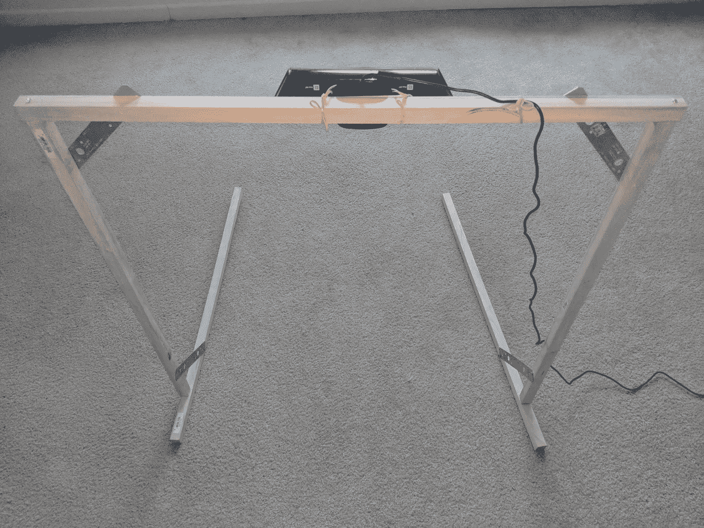
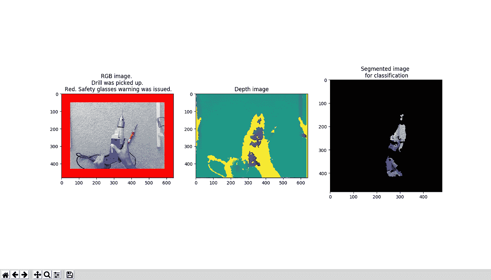

# 人工智能辅助眼睛:一个计算机视觉系统，提醒操作员戴上安全眼镜

> 原文：<https://towardsdatascience.com/ai-aids-eyes-a-computer-vision-system-to-remind-operators-to-wear-safety-glasses-ba0a1fe51b0?source=collection_archive---------22----------------------->

# 演示

这是该系统的演示。

当系统检测到有人拿起电钻时，它会自动发出安全眼镜警告。为了表示安全眼镜警告的存在，在演示视频中，RGB 图像的边框是红色的。

当系统检测到没有钻头被拾起时，它不会发出任何安全眼镜警告。为了表示没有安全眼镜警告，在演示视频中，RGB 图像的边框是绿色的。

如演示视频所示，计算机视觉系统成功检测到操作员是否拿起了钻头。

Demo

# 五金器具

我用木材(来自家得宝)形成一个支撑结构。然后，我在支撑结构上安装了一个微软 XBOX 360 Kinect 传感器(来自亚马逊)，以监控地面上的活动。



Hardware

# 分割

下面示出了由 RGB 图像、深度图像和提取的对象的图像组成的示例。



RGB image, depth image and the image of the segmented object for classification

对于计算机视觉算法来说，仅从 RGB 图像来确定操作者的手是否拿着钻头是具有挑战性的。但是，有了深度信息，问题就简单了。

我的分割算法将 RGB 图像上像素的颜色设置为黑色，如果其对应的深度在预定义的范围之外。这使我能够分割被拾取的对象。

# 分类

我通过分别拍摄自己手持电钻/挥舞双手来收集数据。

然后，我使用迁移学习技术来调整一个 VGG 神经网络，该网络是使用 ImageNet 预先训练的。但是结果并不好。也许提取的图像与 ImageNet 中的自然图像不相似。

因此，我从头开始使用提取的图像来训练卷积神经网络。结果还算不错。在验证集上，分类器的准确率约为 95%。

该模型的一个片段如下所示。

```
from keras.preprocessing.image import ImageDataGenerator
from keras.models import Sequential
from keras.layers import Conv2D, MaxPooling2D
from keras.layers import Activation, Dropout, Flatten, Dense
from keras import backend as K# dimensions of our images.
img_width, img_height = 120, 120train_data_dir = '/home/kakitone/Desktop/kinect/data/train4/'
validation_data_dir = '/home/kakitone/Desktop/kinect/data/test4/'
nb_train_samples = 2000
nb_validation_samples = 1000
epochs = 5
batch_size = 8if K.image_data_format() == 'channels_first':
    input_shape = (3, img_width, img_height)
else:
    input_shape = (img_width, img_height, 3)model = Sequential()
model.add(Conv2D(4, (3, 3), input_shape=input_shape))
model.add(Activation('relu'))
model.add(MaxPooling2D(pool_size=(2, 2)))model.add(Conv2D(8, (3, 3)))
model.add(Activation('relu'))
model.add(MaxPooling2D(pool_size=(2, 2)))model.add(Conv2D(16, (3, 3)))
model.add(Activation('relu'))
model.add(MaxPooling2D(pool_size=(2, 2)))model.add(Flatten())
model.add(Dense(16))
model.add(Activation('relu'))
model.add(Dense(1))
model.add(Activation('sigmoid'))model.compile(loss='binary_crossentropy',
              optimizer='rmsprop',
              metrics=['accuracy'])# this is the augmentation configuration we will use for training
train_datagen = ImageDataGenerator(
    rescale=1\. / 255,
    shear_range=0.2,
    zoom_range=0.2,
    horizontal_flip=True)# this is the augmentation configuration we will use for testing:
# only rescaling
test_datagen = ImageDataGenerator(rescale=1\. / 255)train_generator = train_datagen.flow_from_directory(
    train_data_dir,
    target_size=(img_width, img_height),
    batch_size=batch_size,
    class_mode='binary')validation_generator = test_datagen.flow_from_directory(
    validation_data_dir,
    target_size=(img_width, img_height),
    batch_size=batch_size,
    class_mode='binary')model.fit_generator(
    train_generator,
    steps_per_epoch=nb_train_samples // batch_size,
    epochs=epochs,
    validation_data=validation_generator,
    validation_steps=nb_validation_samples // batch_size)
```

# 最后的话

# 2000

每天大约有 2000 名美国工人因工作导致眼部受伤，需要接受治疗。

# 60%

[近 60%](https://www.ehstoday.com/ppe/eye_face_head/watch_importance_protecting) 受伤工人在事故发生时没有佩戴护目镜，或者佩戴了不适合工作的护目镜。

安全应该永远放在第一位。每当我听到涉及电动工具的事故，我的心就沉了下去。我希望这篇文章可以提高人们的意识，即人工智能可以为我们提供额外的保护。

做东西开心，注意安全！