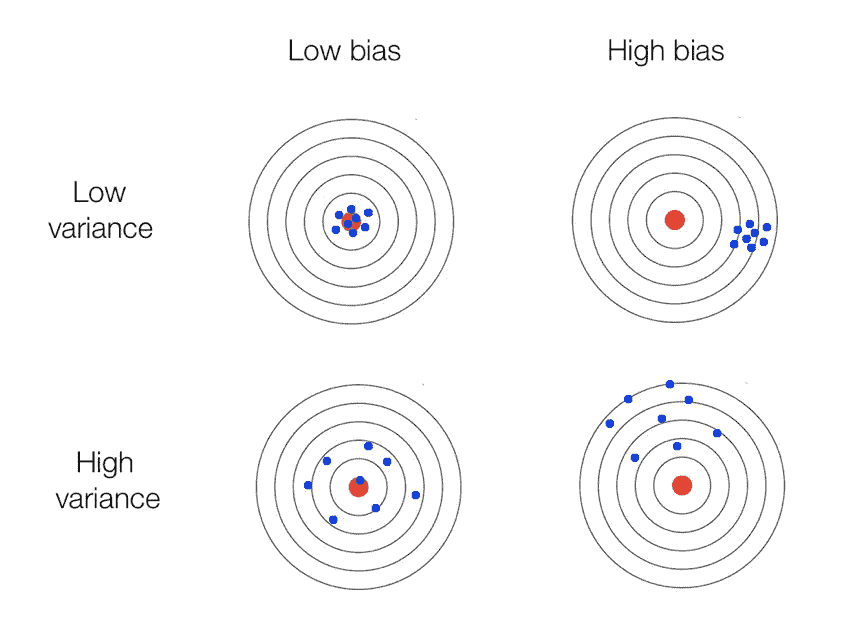
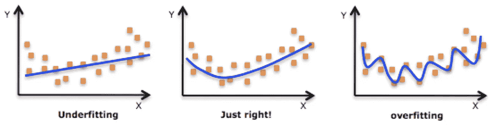

# 艾:从育儿角度的解释

> 原文：<https://towardsdatascience.com/ai-an-explanation-from-a-parenting-perspective-59d0a7d53f29?source=collection_archive---------10----------------------->

[https://parentzone.org.uk/files/artificial-intelligence-21678351920jpg](https://parentzone.org.uk/files/artificial-intelligence-21678351920jpg)

人工智能(AI) 这个术语每天都在媒体上出现，在普通人群中引发兴奋和恐惧，包括终结者接管世界的流行陈词滥调。我想借此机会，在许多人都熟悉的背景下，简明地尝试为一般人群解释人工智能，为人父母。

我是两个小男孩的骄傲的父亲，一个两岁，另一个七个月。我对**数据科学**、 **ML(机器学习)**和 **AI** 世界的涉足早于我作为父亲的经历，所以当我和妻子开始研究如何抚养孩子时，我对儿童学习和人工智能领域的相似之处感到惊讶。

人工智能不是凭空神奇地创造出来的东西，它是必须经过训练的东西，在可预见的未来，必须由人类来训练。机器可以进行三种主要类型的学习，称为**监督**、**非监督**和**强化**。为了这个类比的目的，我将在监督学习的环境中进行描述。我们也不会在本文中讨论数据准备领域，尽管它在人工智能世界中非常重要，并且通常构成了数据科学家的大部分工作。

**建立模型—获取数据并训练**

训练机器或孩子最重要的第一步是获取数据。为了训练计算机理解基本的形状和颜色，我首先需要尽可能多地获取标记数据的例子，比如数千幅不同大小和颜色的三角形图像，并将这些图像标记为三角形 T21。

我会对其他的形状做同样的处理，比如*方形*、*圆形*、*等等*。为了理解颜色，我可能会得到数以千计的形状图像，这些图像标有特定的颜色*蓝色*、*绿色*、*红色*。我还可以获得数以千计带有形状和颜色标签的图像(*蓝色圆圈*、*绿色方块*、*红色方块*、*等*)。

本次培训的目标是建立一个**模型，**，它只是机器用来确定未来场景中的形状和颜色。不进入不同的训练算法的技术细节，损失函数，参数，超参数等可以使用，让我们只说，训练和测试发生在许多迭代，直到我们达到一个点，我们相信我们的模型将执行和**推广**在这些未来的形状和颜色的真实世界场景中非常好。如果你想知道*的概括*是什么，我们稍后会讲到。

为了教或“训练”我们的儿子学习形状和颜色，我会坐下来和他一起翻阅一本书，指着一个绿色的正方形说“正方形”或“绿色”。我可能会指着一个*绿色圆圈*，然后是*绿色三角形*，在这两种情况下都说“绿色”。实际上，我是在为他标记数据，就像机器在受监督的 ML 中必须标记数据一样。

我和妻子会对他重复这个过程很多次。随着时间的推移，我们会注意到逐渐增加的改进，直到我们相信他已经理解了这个概念，并建立了他自己的*内部模型*来应用于未来的形状和颜色识别任务。

这个*学习过程*是一个极其重要的概念。如果我和妻子只是给我们的儿子书本/图片，而没有花时间为他“贴标签”,他在成长过程中除了能够视觉识别它们并知道它们在某种程度上是相关的之外，对什么是颜色或形状没有任何概念。这个概念被称为*无监督学习*,因为我们的儿子不会被赋予任何标签，但能够将事物抽象和聚集在一起。

你可以想象，遵循这个策略会让我们的儿子在现实世界中成功的概率很低。机器也是如此。在没有任何人类交互(包括由人类编写的自动化软件)的情况下训练的 AI 在训练前“标记”数据，在现实世界中的成功概率也很低。使用无监督学习的最新技术很有前途，但在动态和不受控制的环境中仍然表现不佳。

**准确但有偏差**

在非学术的人工智能世界中，一个经常被忽视的重要概念是**偏见**。解释这一点的简单方法是用种族主义的概念。基于最近的媒体事件，我相信每个人都很清楚这个话题和围绕它的争议。

个人生来就不是种族主义者。这是通过接触不同的种族主义“训练数据”而学到的东西，无论是来自家庭、朋友、媒体还是其他一些特定的环境事件。这就产生了他们看待世界的偏见或特定视角。

Bias vs Variance — [https://prateekvjoshi.files.wordpress.com/2015/10/3-bulls-eye.png](https://prateekvjoshi.files.wordpress.com/2015/10/3-bulls-eye.png)

一台机器也不例外。用带有严重偏见的数据训练的人工智能系统在试图执行任务时总是会带着这种偏见，并将提供偏向于它被训练的观点的结果。因此，系统可能能够提供非常精确的结果，并且可变性很低，但是这些模型在现实世界场景中的有用性就成问题了。

**如果它不能概括，它就没有用**

构建任何模型最重要的部分是它*在真实世界环境中很好地概括了*。我们最近给儿子买了一套塑料玩具工具。它有锤子、螺丝刀、扳手、钉子和螺丝钉。我们玩了几次，最初向他展示了一切是如何工作的，他似乎很喜欢玩它。在几天的时间里，我们挂了一些画，我用锤子在不同的地方做了一些其他的工作，我们的儿子在一旁专注地看着。我承认，对我来说，可能有比锤子更好的工具选择，但尽管如此，它还是随手可得。

此后不久，我注意到我的儿子开始用他的玩具锤子做一切与修理有关的事情。我正在修理的婴儿门的零件，他会用他的锤子敲，当他看着墙上的画时，他会敲墙。甚至当我们在玩的时候，他也会用锤子修理他“假设”坏了的玩具车或玩具角色。基于我们提供的关于锤子做了什么的*培训*的有限背景，他形成了一个关于如何处理它的*内部模型*。因此，他的*模型*不会*很好地概括*在现实世界环境中修复事物。

在 ML 世界中，这种缺乏通用性通常是由**过度拟合**一个模型造成的。发生这种情况是因为模型被训练为基于某个损失函数最小化误差，并且使得模型被构建为精确地符合训练数据。

Overfitting — [https://www.analyticsvidhya.com/wp-content/uploads/2015/02/underfitting-overfitting.png](https://www.analyticsvidhya.com/wp-content/uploads/2015/02/underfitting-overfitting.png)

在我们儿子的例子中，他*过度拟合*他的*内部模型*以从我们向他展示的关于修理东西实际是什么的有限数据中提供最佳结果。因为训练数据只是真实世界数据的一个很小的子集，所以这些不可概括的模型最终在真实世界的场景中提供很差的结果。数据科学家和工程师使用了许多技术来克服这个问题，但不幸的是，这仍然是人工智能商业化世界中的一个现实问题，也是许多应用程序在发布后不能很好工作的原因。

**注意事项**

上面使用的我们儿子的学习和机器学习之间的类比是为了让复杂的人工智能领域的事情更容易理解，即使学习和抽象的确切机制非常不同。我们将在以后的文章中讨论这个问题。

人类如何学习和推理是一个极其复杂的问题，研究人员仍然不能完全确定人类大脑的机制。机器可以非常快速地处理事情，但缺乏人类的抽象能力，这就是为什么复制人类智能是一项非常复杂的任务，我们仍然离它很远。现在还不需要担心终结者。