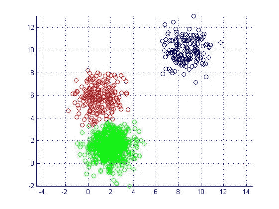
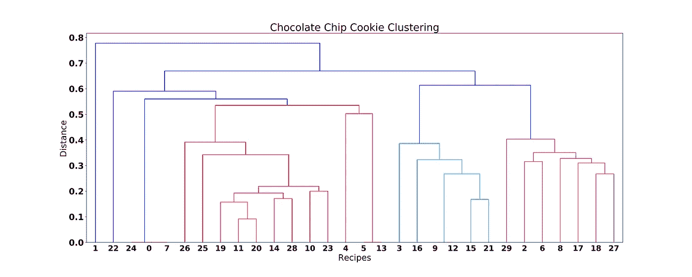
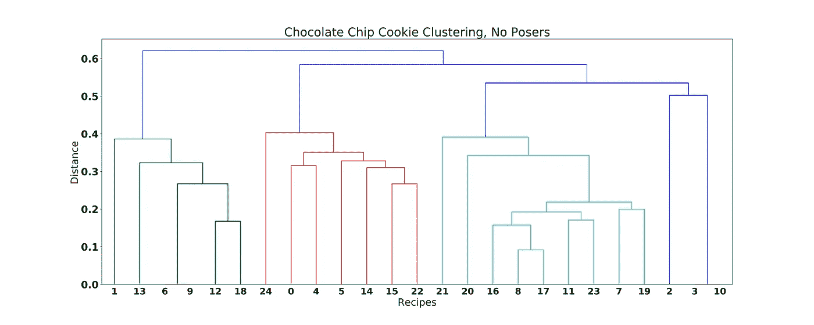

# 人工智能和创造世界上最棒的巧克力饼干

> 原文：<https://towardsdatascience.com/ai-and-creating-the-worlds-ultimate-chocolate-chip-cookies-f8c688fe3f98?source=collection_archive---------7----------------------->

由 JD

作为一个自称巧克力狂的人，我依赖大量的巧克力来度过我的日子，我最喜欢的递送系统是巧克力饼干。我总是在寻找烘烤我最喜欢的食物的新方法，但网上有这么多食谱，每一个都声称它们是“最好的”——我该如何选择？我没有挑选一个，而是决定应用一些数据科学和机器学习技术来组合几个“最佳”食谱，以制作“终极”食谱。

# 数据

通常情况下，这个项目最困难的部分是获取和清理数据。使用我最喜欢的语言 Python(以及 BeautifulSoup)，我尽可能多地搜集了 allrecipes.com 的巧克力曲奇食谱(所有的食谱最终都阻止了我，因为我发送了很多请求:(但我仍然得到了 30 个食谱！吸吧)。由于烘烤巧克力曲奇的程序保持相对稳定，不考虑配料，我只关注配料的成分而不是过程。只需将配料放入碗中搅拌即可。对于每一个食谱，我解析 html，然后一遍又一遍地擦洗数据，给我一个配料列表和它们各自的尺寸。由此，我将每个食谱编码为 n 维空间中的归一化向量，其中 n 是所有食谱中独特成分的数量。例如，配方:

```
1 cup butter, softened
1 cup white sugar
1 cup packed brown sugar
2 eggs
1 teaspoon vanilla extract
2 cups all-purpose flour
2 1/2 cups rolled oats
1/2 teaspoon salt
1 teaspoon baking powder
1 teaspoon baking soda
2 cups semisweet chocolate chips
4 ounces milk chocolate, grated
1 1/2 cups chopped walnuts
```

可能看起来像向量:

```
0.102564102564 ,
0.0512820512821 ,
0.0512820512821 ,
0.0512820512821 ,
0.0512820512821 ,
0.102564102564 ,
0.205128205128 ,
0.0512820512821 ,
0.102564102564 ,
0.025641025641 ,
0.102564102564 ,
0.0512820512821 ,
0.0512820512821 ,
```

实际上，我们的向量会更稀疏，也就是说，对于任何不在给定食谱中的语料成分，它们都是零，但你明白这一点。

终于！数据已经从粗糙和肮脏变成了数字化和干净。让乐趣开始吧！

# 探索性分析

当试图将食谱组合在一起以做出更好的食谱时，想到的一种技术是聚类，这种技术 99%的情况下意味着 K-Means。我想使用聚类中心来创建新的食谱，聚类中心将来自几个食谱的信息结合在一起。K-Means 易于理解和实现，但困难的一步是选择 K，即聚类数。如果你看一个像下面这样的二维图，通常很容易看到集群的数量。



但是当你有 4 维数据时，如何挑选最佳的聚类数呢？5?68?70?就饼干而言，这部分既是科学也是艺术。我们想要一套多样化的食谱，但我们不希望食谱过于接近原来的食谱。为了解决这个问题，我转向了一种稍微不同的聚类类型，叫做*层次聚类*。这种方法随着聚类大小变得越来越小来查看聚类之间的距离。最终的可视化效果非常棒:



由此我们可以立即看出，配方指数 1 和 22(可能还有 24、0 和 7)有一些异常值。让我们看看这些食谱是什么样的:

```
Recipe Index 1:
3 egg whites
3/4 cups semisweet chocolate chips
4 and 1/4 tablespoons unsweetened cocoa powder
1 and 1/2 teaspoons vanilla extract
3/4 cups white sugarRecipe Index 22:
1 cup butter
2 and 1/4 cups chocolate cake mix
4 eggs
2 cups semisweet chocolate chips
```

谁会用巧克力蛋糕粉做饼干？？！！？？？这并不需要一个巧克力饼干爱好者看到这里的问题。这些食谱是离群值，或者我应该说是“说谎者”,聚类算法当场抓住了它们。如果我们忽略这些装腔作势的人，似乎有三组数据，给或拿:



三个集群似乎是一个很好的数字！现在我们可以继续运行 K-Means。有了使用模型中心作为食谱基础的想法，我们可以应用向量到文本的功能来获得这些新的人工智能生成的食谱的文本描述。这个函数获取一个向量，并将其放大，使数字具有合理的大小，并四舍五入到最接近的 1/4——这样，我们的食谱中就有 2 1/2 杯面粉，而不是 2.469 杯。现在，我们来看看 AI 大厨今天煮了什么！：

**食谱#1:“矮胖子”**

```
1 and 1/2 cups all-purpose flour
1/4 teaspoons baking powder
3/4 teaspoons baking soda
1/4 cups butter
1 egg
1/4 egg yolk
1/4 teaspoons ground cinnamon
1/4 large egg
1/4 cups macadamia nuts
1/2 cups packed brown sugar
1/2 teaspoons salt
1 and 1/4 cups semisweet chocolate chips
1/4 cups sifted all-purpose flour
1/4 cups unsalted butter
1 tablespoons vanilla extract
1/2 cups white sugar
```

嗯，这道菜需要很多不同种类的黄油和比例奇怪的鸡蛋。文本清洗没有考虑到成分名称的细微差别，所以“黄油”和“无盐黄油”被分开了。还有，谁用 1/4 蛋黄？不过，总的来说，这个食谱看起来还不错！配料的调制看起来很合理，甚至还包括一点肉桂！

食谱#2:“含糖燕麦”

```
1 and 1/2 cups all-purpose flour
3/4 teaspoons baking soda
1/2 cups butter
1 and 1/2 eggs
1/4 cups packed brown sugar
1/4 cups packed light brown sugar
1/4 cups quick-cooking oats
1/4 cups rolled oats
1/2 teaspoons salt
1  cups semisweet chocolate chips
1  tablespoons vanilla extract
1/4 cups water
1/4 cups white chocolate chips
1/2 cups white sugar
```

啊，是的，这有一个伟大的食谱你需要的一切:糖，巧克力，和更多的糖。这里又出现了成分名称不同的问题。也许在未来的版本中，我会加入一个特性，如果成分的名字相似，就把它们组合在一起，也许会使用 DP 算法，但那是另外一个故事了。

食谱#3:“极简主义者”

```
3/4 cups all-purpose flour
3/4 teaspoons baking powder
4 cups butter
1/4 cups confectioners' sugar
1 and 1/4 eggs
1/4 teaspoons salt
1 and 1/4 cups semisweet chocolate chips
3/4 tablespoons vanilla extract
3/4 cups white sugar
```

在创造的三个食谱中，这个是我最喜欢的！它有一个合理的成分组成，确保包括必需品(尽管我会注意到，你永远不会在你的饼干里有足够的巧克力片)。

**最后的想法**

使用 K-Means 算法来选择配料和它们的比例，对于食物和饮料来说效果很好，在这些食物和饮料中，组合配料的方法相对简单。然而，对于步骤顺序很重要的食品，必须使用更复杂的算法。但那是以后的事了。