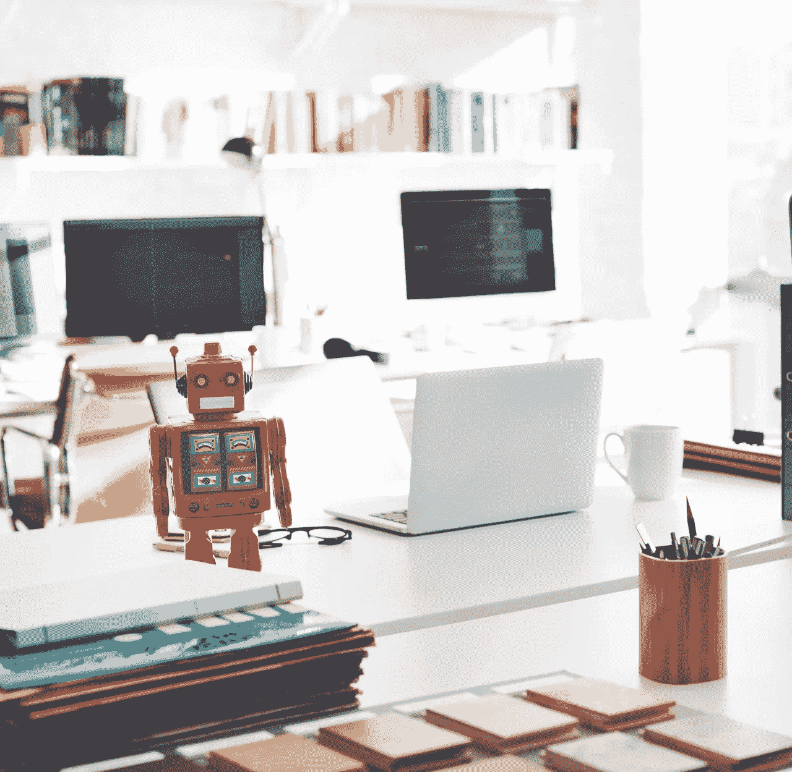

# 人工智能和隐私的未来

> 原文：<https://towardsdatascience.com/ai-and-the-future-of-privacy-3d5f6552a7c4?source=collection_archive---------1----------------------->

隐私的基本定义是，为了限制他人对我们行为的影响，有权将自己或关于自己的信息隐藏起来。隐私历来被认为是行使言论自由、结社自由和选择自由等人权的先决条件。

在信息时代，隐私取决于我们控制我们的数据如何被存储、修改和在不同方之间交换的能力。

近几十年来，随着先进的基于互联网的数据挖掘技术的出现，隐私已经成为一个相关的社会问题。经常利用这些技术的社会行为者，如政府机构和企业，现在能够识别、描述和直接影响人们的生活，而无需他们的同意。随着日益复杂的人工智能系统的出现，这些隐私问题只会加剧。

[人工智能带来的](https://servisbot.com/the-intersection-of-smart-bots-and-robotic-process-automation-rpa/)是收集、分析和组合来自不同来源的大量数据的能力，从而提高了使用这项技术的社会行为者的信息收集能力。人工智能对隐私的潜在影响是巨大的，这就是为什么必须提高对这些问题的认识。

要了解更多关于人工智能如何塑造隐私辩论的信息，可以考虑阅读我关于这个主题的简短指南，你可以在下面找到。

# 人工智能如何损害隐私

首先，让人工智能在信息收集中有吸引力的是三件事:速度、规模和自动化。人工智能进行计算的速度已经超过了人类分析师的能力，而且还可以通过添加更多硬件来任意提高。

人工智能还天生擅长利用大型数据集进行分析，并且可以说是在合理的时间内处理大数据的唯一*方式。最后，人工智能可以在没有监督的情况下执行指定的任务，这大大提高了分析效率。人工智能的这些特征使其能够以多种不同的方式影响隐私:*

# 数据开发

从智能家电到计算机应用，众多消费产品往往具有一些特性，使其容易被人工智能利用。更糟糕的是，人们经常不知道他们的软件和设备产生、处理或共享了多少数据。随着我们在日常生活中越来越依赖数字技术，剥削的可能性只会增加。

# 识别和跟踪

人工智能可以用于在多种设备上识别、跟踪和监控个人，无论他们是在工作中、在家里还是在公共场所。这意味着，即使你的个人数据一旦成为大型数据集的一部分就被匿名化，人工智能也可以根据来自其他设备的推断[取消这些数据的匿名化。这模糊了个人数据和非个人数据之间的区别，而这种区别必须根据现行法律予以保留。](https://www.georgetownlawtechreview.org/re-identification-of-anonymized-data/GLTR-04-2017/)

# 语音和面部识别

语音识别和面部识别是人工智能越来越擅长的两种识别方法。这些方法有可能严重危及公共领域的匿名性。例如，执法机构可以使用面部识别和语音识别来查找个人，而没有可能的原因或合理的怀疑，从而绕过他们原本必须维护的法律程序。

# 预言；预测；预告

AI 可以利用复杂的机器学习算法，从非敏感形式的数据中推断或预测敏感信息。例如，某人的键盘打字模式可以用来推断他们的情绪状态，如紧张、自信、悲伤和焦虑。更令人担忧的是，一个人的政治观点、种族身份、性取向甚至整体健康状况也可以通过活动日志、位置数据和类似指标等数据来确定。

# 压型

人工智能不仅仅局限于执行信息收集任务。它还可以使用信息作为输入，用于对人进行排序、评分、分类、评估和排名。这通常是在没有被分类的人的任何同意的情况下进行的，他们通常没有能力影响或挑战这些任务的结果。[中国的社会评分系统](https://www.bbc.com/news/world-asia-china-34592186)就是一个例子，说明这些信息如何被用来限制获得信贷、就业、住房或社会服务。

# 如何保护自己的隐私

隐私受到如此关注的原因之一是，人们对可以用来保护隐私的措施不够了解。为了澄清这个问题，我列出了一些任何人都可以采取的步骤，以减少他们的在线足迹，从而增加对数据挖掘尝试的阻力。

# 浏览匿名网络

互联网用户可以选择使用 Tor、I2P 或 Freenet 等匿名网络来保护自己的隐私。这些网络支持端到端加密，这意味着你发送和接收的数据不会被窃听。

# 使用开源网络浏览器

您选择的网络浏览器是保护您隐私的另一个重要因素。Firefox 等开源浏览器可以免费接受安全漏洞审计，这使得它们比 Chrome 等专有浏览器更受欢迎。

# 使用开源操作系统

苹果和微软等操作系统制造商有各种后门，他们可以利用这些后门未经许可收集数据。规避这个问题的一个方法是使用众多免费开源 Linux 发行版中的一个。

# 使用安卓手机

现代智能手机在设计上存在隐私风险。硬件制造商和应用程序开发人员都需要您的数据来提供手机的预期功能，但代价是失去对数据使用方式的控制。安卓手机比微软和苹果手机更安全，这得益于它们的开源软件，但它们仍然存在隐私风险。

# 结论

人工智能等数字技术已经对我们生活的许多领域做出了重大贡献。通过使用这些工具，我们能够收集和分析的大量信息使我们能够解决以前没有解决方案的社会弊病。

不幸的是，这些技术也可以被各种社会行为者用来对付我们，从个人到公司，到政府机构。我们失去隐私只是人工智能等技术如何损害我们的一个例子。然而，如果我们设法正确理解这些技术，以及它们对我们日常生活的影响，我们将获得保护自己免受那些恶意使用它们的人利用的手段。