# 我们知道他们在听，但他们听到了什么？

> 原文：<https://towardsdatascience.com/ai-assistant-rankings-32dfdd1841bc?source=collection_archive---------10----------------------->

## 4 个家庭人工智能助手，根据数据隐私和如何保护数据进行排名

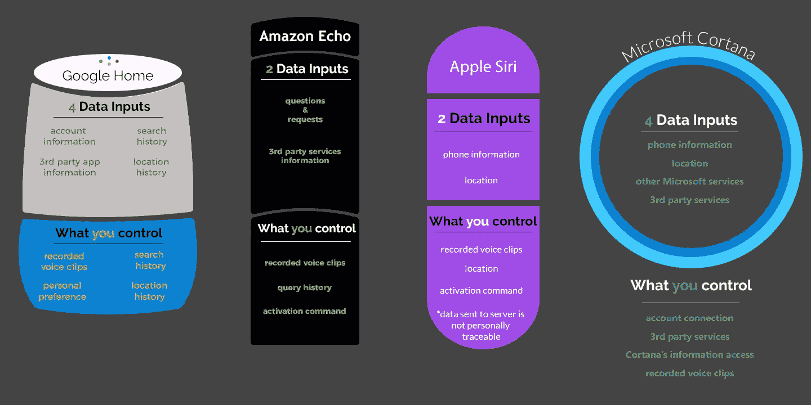

在 Humanlytics，我们只关心数据。当我们的工具可以访问大量高质量数据时，我们可以发现业务洞察，从而提供个性化的有效建议。

然而，在*数据时代*,消费者已经开始对他们生产的数据——企业正在收集的数据——感到紧张。

这种情况已经持续了一段时间，但随着物联网(IoT)(不断收集数据并将其发送回公司服务器的物理设备网络)随着大众市场“始终监听”人工智能设备的出现而扩展到我们的家庭，数据安全问题变得越来越紧迫。

> ***当这些设备进入我们的家时，我们最私密的地方就成了某种监控的对象。***

这会导致权威人士为了他们的目的可能[从你的设备中获取数据](http://www.cnn.com/2017/03/07/tech/amazon-echo-alexa-bentonville-arkansas-murder-case/)。

太恐怖了。但是，不管喜欢与否，我们每天都在越来越多地进入一个以数据为中心的世界。我们都需要接受数据革命不仅仅是不可避免的，它已经到来了。但我们不需要盲目接受。

那么，我们来谈谈吧。为了确保你了解情况，我们将讨论由谷歌、微软、亚马逊和苹果生产的人工智能听力设备。在讨论其含义之前，我们将讨论该产品本身以及它能让您对数据进行何种控制。

然而，在我们单独讨论这些器件之前，我们先来概括地讨论一下。

人工智能听音设备通过音频命令获取线索。其实现方式是利用“唤醒词”。它一直在听你说话，但只有当它听到这个唤醒词时才开始注意。

这实际上是通过记录短脉冲来实现的。如果检测到唤醒词，设备会继续记录，如果没有，则该片段会被删除。一旦它被触发，设备就开始记录或流式传输你说的话。

在这一点上，理解这是一个由两部分组成的系统是很重要的。你家里的设备实际上不做任何计算。相反，通过互联网，它被连接到数英里以外的计算机服务器上，而服务器才是真正的工作。

***这意味着您的语音记录(或流)不会留在您的家中，而是在制定正确的应对措施之前进行分析，然后发送回您的设备，在您家中播放。***

# 谷歌主页

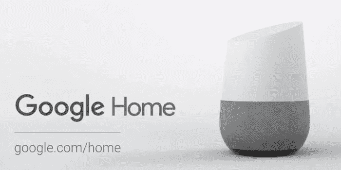

## **产品**

谷歌主页被描述为“谷歌助手”，提供“免提帮助”。

这涵盖了广泛的功能，谷歌将其分为六个类别:1)获得答案，2)享受娱乐，3)管理任务，4)规划你的一天，5)控制你的家，6)享受乐趣。

为了使用它，你需要做的就是把它插上电源，在你的手机上运行一个应用程序的设置，然后，当在设备的耳边时，说:“好的谷歌”。这将激活设备，在这一点上，它将开始积极处理和执行您所请求的行动。

## **它收集的数据**

谷歌对此有点奇怪。

在关于数据隐私的 Google Home FAQ 页面上，他们或多或少地承认收集你通过你的账户、你的搜索历史、你的位置历史以及第三方应用程序提供给他们的信息。

然而，如果你看一下谷歌的隐私政策，你会发现他们收集了更多更深入的信息。

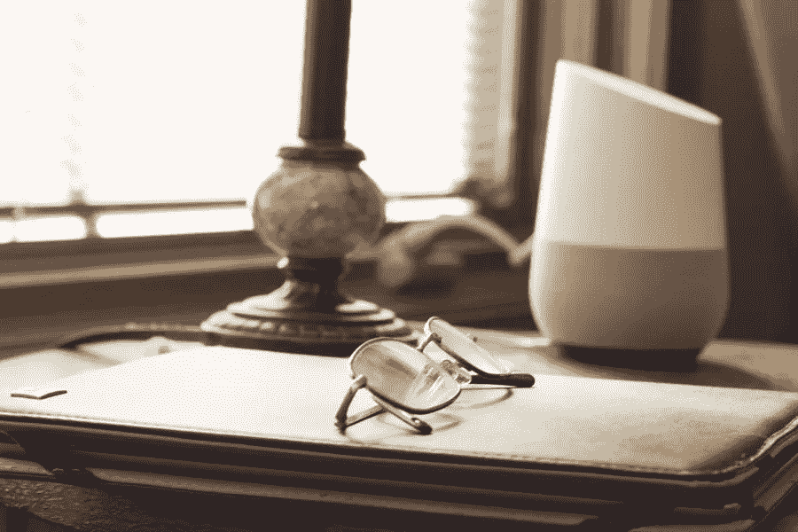

***这包括，您提供的任何账户信息以及关于您如何在他们的服务上做什么的信息。这包括设备、日志、位置和应用程序信息。***

此外，他们使用本地存储以及 cookies 和类似的工具来收集和存储基于你在 Google 上所做的事情的信息，包括你如何与他们的合作伙伴提供的服务进行交互。

## **你的控制**

理论上，你有完全的控制权。

你录制的语音剪辑会自动存储在谷歌的数据中心，并与你的账户相关联，然后你可以去 myactivity.google.com 手动删除。如果你不删除它们，它们会永远留在那里。

你也可以调整你的设置，以确定谷歌主页可以访问你的个人偏好和其他信息(这是指我们上面提到的“服务信息”)。

您的控制权受限的一个例子是关于“服务相关信息”。即使你已经删除了你的账户，谷歌可能会保留一些信息，你对此无能为力。

更广泛地说，你可以决定谷歌收集哪些数据，以及这些信息如何与你的账户相关联。此外，您可以控制它是否可以访问您的搜索历史记录、位置历史记录和应用程序信息。

奇怪的是，尽管从逻辑上讲，如果另一个人亲自向你的谷歌主页索要信息，你对自己的信息没有控制权。作为最后一招，你可以关闭录音功能，但这将使设备失去功能。

# 亚马逊的 Alexa

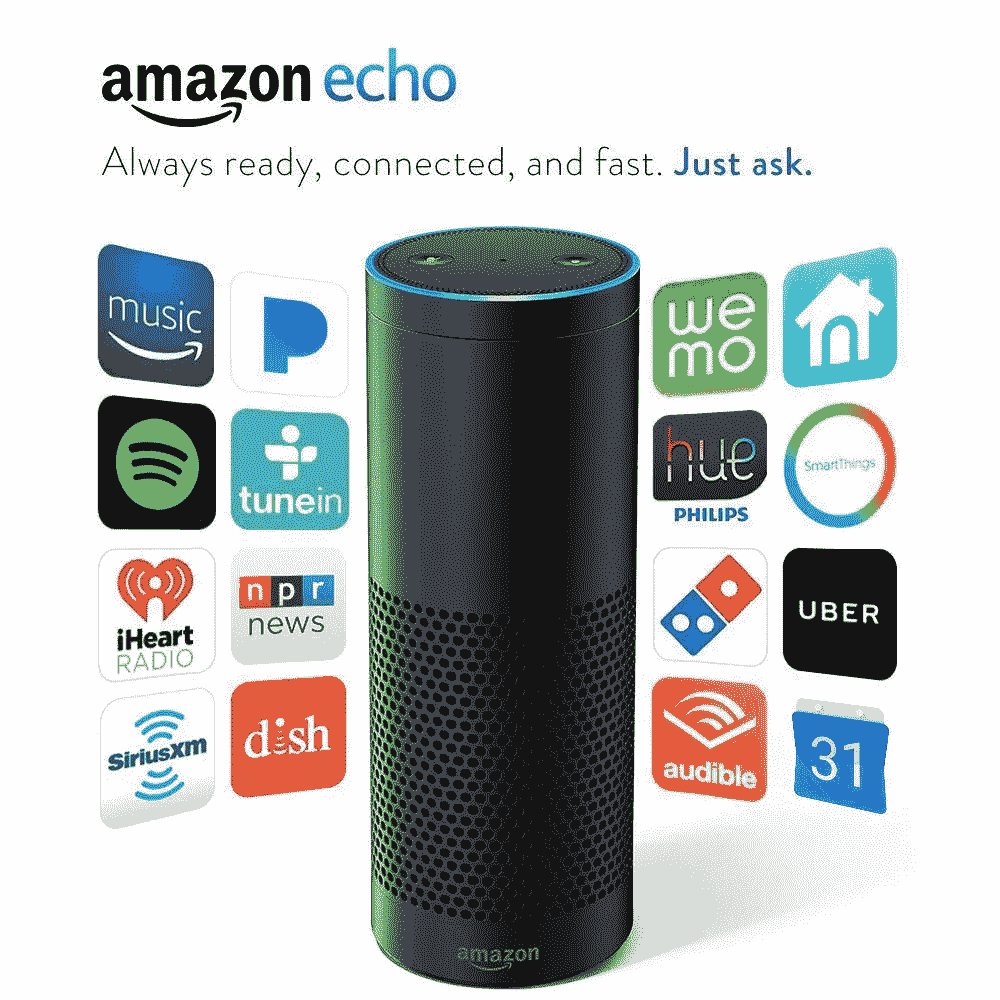

## **产品**

亚马逊的这款产品有几种不同的形式。有回声、圆点和敲击声。尽管名称不同，但它们做的都差不多。

它完成了亚马逊定义的八个类别之一的任务:音乐和娱乐，新闻和信息，问题和答案，家庭帮助，智能家居，娱乐和游戏，购物和 Alexa 技能。

Alexa 的特殊之处在于它利用了“技能”,这些技能基本上是由第三方开发的应用程序，用于该平台提供的语音功能。

## **它收集的数据**

一旦你的请求和问题被记录下来，Alexa 就会记录下来。它还处理来自第三方服务的信息(您可能已经向其提供了个人信息)。

虽然 Amazon Echo 的工作原理是“唤醒词”,只有在识别出这个词后，它才会将你的声音传输到服务器，但它也包括了你说出唤醒词之前所说的部分录音。

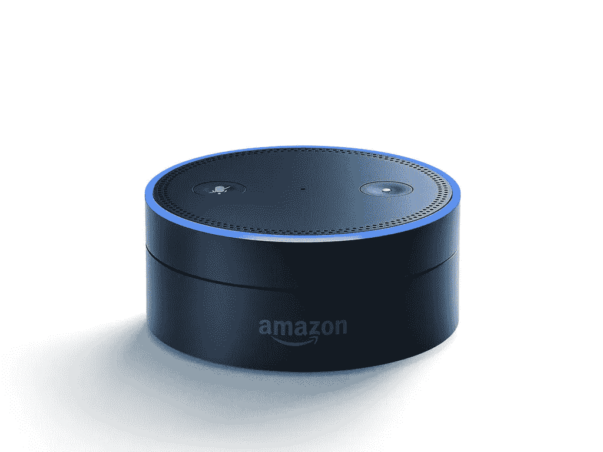

## **你的控制**

首先，您可以控制自己的查询。这些都记录在您的历史记录中，您可以单独删除它们。此外，通过前往 www.amazon.com/mycd[或联系客户服务，您可以一次删除产品的所有录音。](https://www.amazon.com/mycd)

由于可能会不小心提到唤醒词并将录音传输到云端，亚马逊提供了不同的设置来防止这种情况。例如，您可以将监听限制为仅在您按下激活按钮或激活提示音以通知您设备开始和结束录音时发生。你也可以让设备静音，尽管这实际上会破坏它的功能。

# 苹果的 Siri

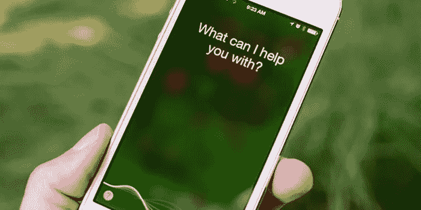

## **产品**

苹果的 Siri 可能是最初的“永远听”设备，于 2015 年首次亮相，目前提供苹果定义的八类功能。

这包括:基础知识、保持联系、变得有条理、运动、娱乐、外出、家庭用品和获得答案。

Siri 还值得一提的是它的与众不同之处，它是第一个出现在手机上的始终监听的人工智能，可以在所有 iphone 上运行。

## **他们收集的数据**

Siri 会收集和使用手机上已有的信息，如您的姓名、通讯录和歌曲。

此外，如果您在请求时打开了定位服务，该信息将与您的请求捆绑在一起。

此外，苹果规定一些功能需要“来自苹果服务器的实时输入”为了描述这种需求，他们给出了一个地图示例，其中服务器需要知道您的目的地地址和您的当前位置。

## **你的控制**

苹果在这场竞赛中的地位有些奇怪。

一方面，它似乎不允许你大量控制 Siri 能访问或不能访问的内容。您可以关闭定位服务、其他“主动服务”，或者完全关闭 Siri。

此外，您可以关闭 Siri 的“始终聆听”功能，以便它只根据您的物理命令操作(通过按住 home 键激活)。

另一方面，苹果擅长以匿名和安全的方式保护你的数据。

例如，苹果没有将你的 Siri 查询与你的个人账户相关联，而是将它们与分配给你的设备的随机标识符相关联，该标识符会在六个月后自动删除。

同样，每当苹果从你的设备向服务器发送信息时，它都会使用“匿名的旋转标识符”，这样你的信息就不会被追踪到你个人。

苹果做的最后一件事是保留 Siri 在你手机上使用的大部分信息。

这意味着 Siri 用来提出建议的来自您的电子邮件、通讯录、应用程序使用和日历的信息会留在您的设备上，而不会发送到服务器。

# 微软的 Cortana

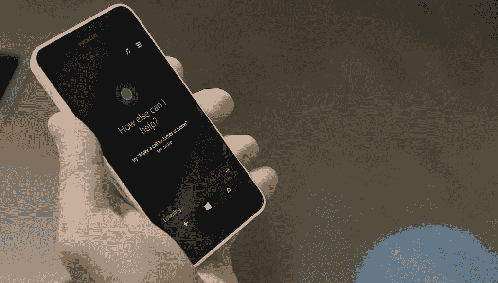

## **产品**

微软的“永远倾听”人工智能的迭代是 Cortana。被描述为可以做一系列活动的“数字代理”。

微软将其功能分为大约八个类别:提醒、跟踪、通信、日历、列表、游戏、查找信息和打开应用程序。

## **它收集的数据**

如果您使用 Windows 帐户登录 Cortana，Cortana 将从您的设备、其他 Microsoft 服务以及您连接的第三方服务中收集信息。

这包括你的浏览历史、日历、联系人、位置历史(无论你是否与手机互动，都会定期收集)等信息，以及有点令人不安的“来自消息、应用和通知的内容和通信历史”

值得注意的是，如果您在登录 Windows 帐户时使用 Cortana，您的录音将被存储并与您的帐户相关联。

## **你的控制**

微软允许相当程度的控制。首先也是最重要的，它不需要一个帐户就可以使用，这意味着你可以进行永远不会连接到你的帐户的查询(尽管它们仍然会保存在你的浏览器上)。

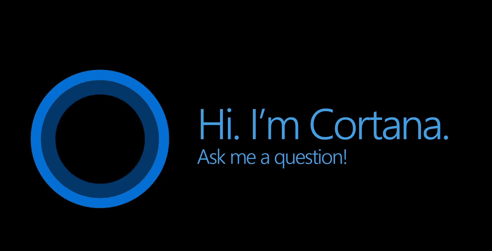

此外，您可以决定连接哪些第三方服务。此外，任何时候你问一个需要使用更多数据的问题，Cortana 都会在进入之前请求许可。

此外，如果你后来改变了主意，你可以通过进入 Cortana 的设置来单独管理权限(尽管你不能管理所有的事情)。

Cortana 还允许您通过编辑“笔记本”来具体管理 Cortana 对您的了解。但是，这样做不会删除服务器中的相关数据。为了做到这一点，并管理你的录音，你需要访问 account.microsoft.com/privacy.

# 结论

那么这给我们留下了什么？人工智能监听设备很酷，但它们也可能跨越我们许多人不愿考虑的数据收集线。

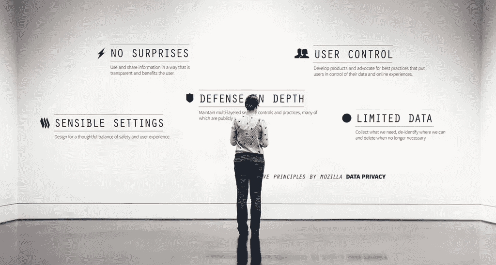

5 Data Privacy Principles by Mozilla. [Image via Flickr.](https://www.flickr.com/photos/vintagedept/15704560667)

更具体地说，它们允许意外记录你的声音和你可能说的任何东西。虽然网络搜索需要有意识的输入和搜索，但口误可能会唤醒你一直在听的人工智能，它会急切地记录你说的任何话。

这有点令人不安，但好消息是你有一个选择。你可以决定哪个人工智能监听设备住在你的家里，它能听到什么。利用这个选择，并保持你的隐私。

在这篇文章的帮助下，你现在拥有了做出明智选择的工具。我甚至可以帮你一点忙，通过数据隐私对这些设备进行排名。

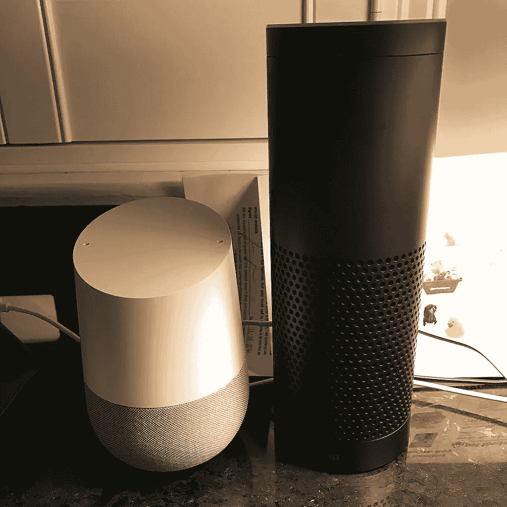

Google Home vs Amazon’s Alexa devices.

## 我们的语音助手数据隐私排名

1.  微软 Cortana(微软 Cortana)- Siri 和 Cortana 之间的争夺非常激烈，但最终微软允许你控制 Cortana 的粒度控制让它占据了上风。这不仅允许您控制它收集的数据，还可以确保 Cortana 在您做出这些选择后保持正常运行的能力。简而言之，它允许隐私与操作能力之间的巨大平衡。
2.  **苹果 Siri-** 老实说，苹果在隐私方面做得很好。他们保持你的数据匿名，将你的大部分数据保存在手机上而不是服务器上，并在六个月后自动删除你的请求。这些都是很好的东西，但是把它降低到两点是因为你的控制是有限的。您只有几个自定义选项，这使得很难找到微软提供的隐私和操作能力之间的平衡。
3.  **亚马逊 Alexa-** 亚马逊获得第三名，因为虽然他们没有做什么过分的事情，但他们也没有做什么伟大的事情。删除你的数据可能是一件苦差事，虽然它允许你对你的数据进行一些控制，但激活太多这些选项，你会有效地扼杀设备的功能。不错的亚马逊，但也不伟大。
4.  谷歌主页 -谷歌，哦谷歌。我纠结于这个排名。像微软一样，谷歌允许对设备可以收集和访问的数据进行相当精细的控制。然而，与微软不同的是，谷歌 Home 需要一个谷歌账户才能运行。这使它能够立即访问大量信息，虽然您可以更具体地指定它可以访问的数据，但这也会严重限制它的功能。

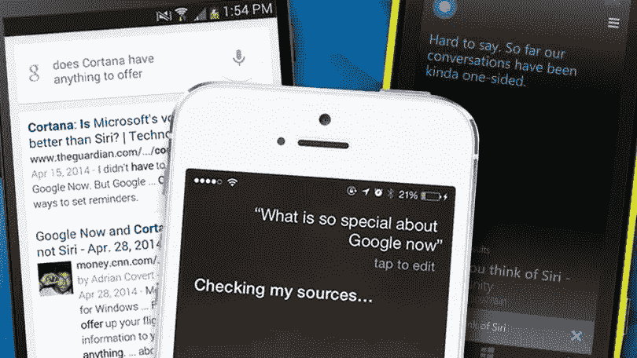

Microsoft’s Cortana vs Apple’s Siri. [Image via PC Mag.](https://www.pcmag.com/article2/0,2817,2457910,00.asp)

# 每个科技公司都应该认真对待的步骤

AI 很厉害，但数据隐私也很厉害。

数据自由化是未来的重要工具。它允许详细和个性化的建议，以及将改变我们生活方式的人工智能。然而，与此同时，数字隐私对于保护我们社会的价值观和权利是不可或缺的。

例如，这就是为什么我们 Humanlytics 采取具体措施来确保您的私人数据保持不变。我们记住的两个解决方案是**算法透明**和**最小可行数据收集**。

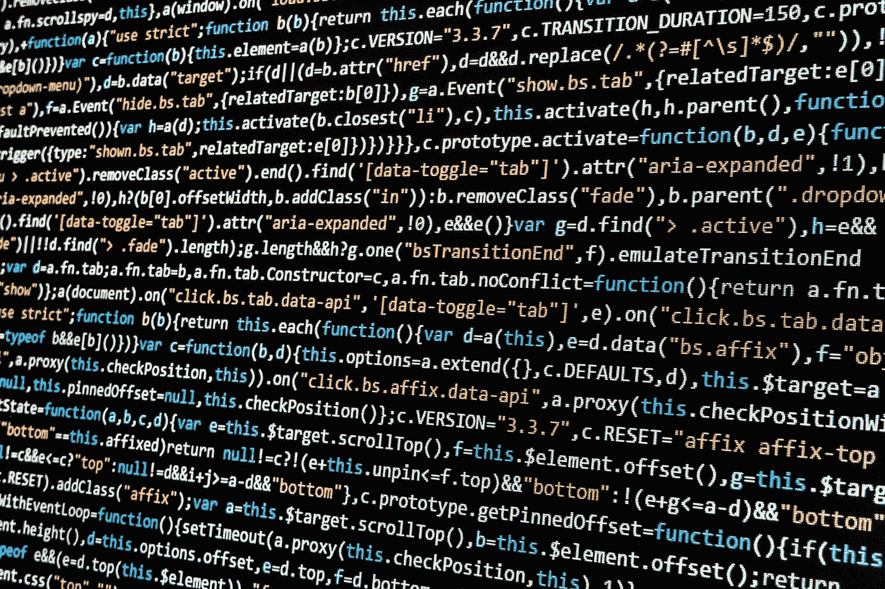

Transparency of algorithms and data collection are key to building trust with users.

**算法透明**是指你写的代码应该对消费者可用。这将使他们能够全面彻底地监督数据收集过程。

虽然这个想法很激进，有一些复杂之处，但它是我们致力于努力实现的理想。现在，这意味着我们将始终致力于尽可能透明地公开我们的收集/分析算法。

至于**最小可行数据收集**，想法很简单。我们只会收集我们需要的数据，仅此而已。这不会影响我们产品的功效，我们收集的数据越少，滥用数据的风险就越小。每个人都赢了。

技术进步的每一天都是消费者隐私遭受攻击的另一天。但是，如果你尽自己的一份力，保持信息畅通，而我们(即科技公司)尽自己的一份力，负责任地收集数据，那么我们每个人都可以帮助实现一个未来，让隐私成为现实，而不是白日梦。

科技公司和消费者还能做些什么来保护数据隐私？请在下面评论，或者给我发邮件到 bill@humanlytics.co，让我们知道你的想法。 [*在这里了解更多关于 Humanlytics*](http://humanlytics.co)*。*

*原载于 2017 年 4 月 19 日 medium.com**T21*[。](https://medium.com/analytics-for-humans/hey-listen-how-four-big-tech-companies-are-collecting-and-using-your-data-8ddb6ea857dc)