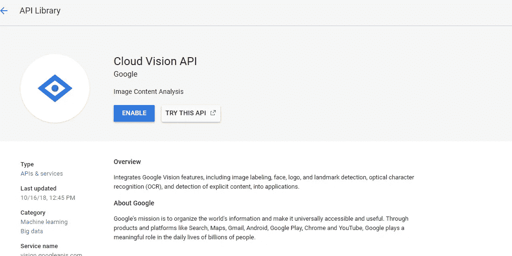
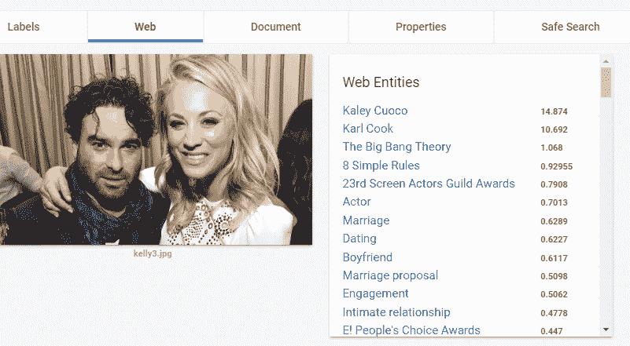
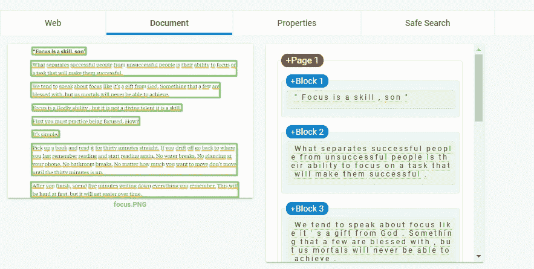
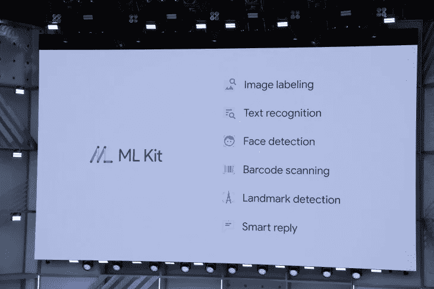
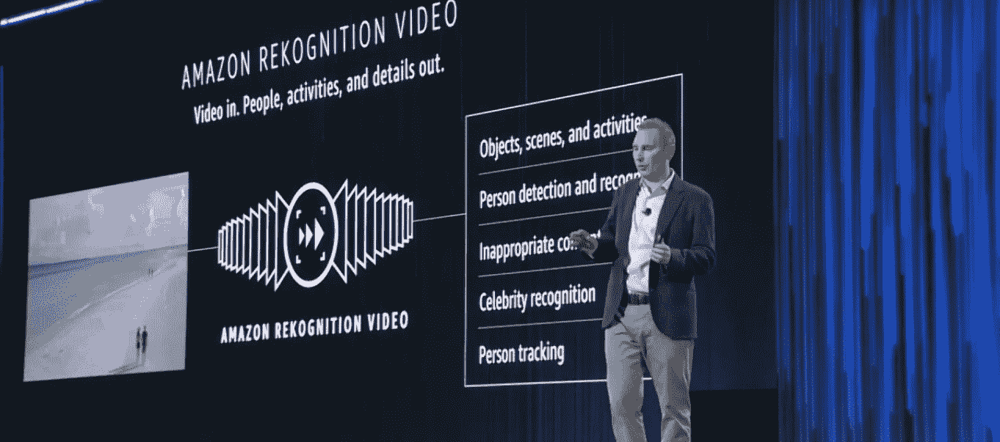
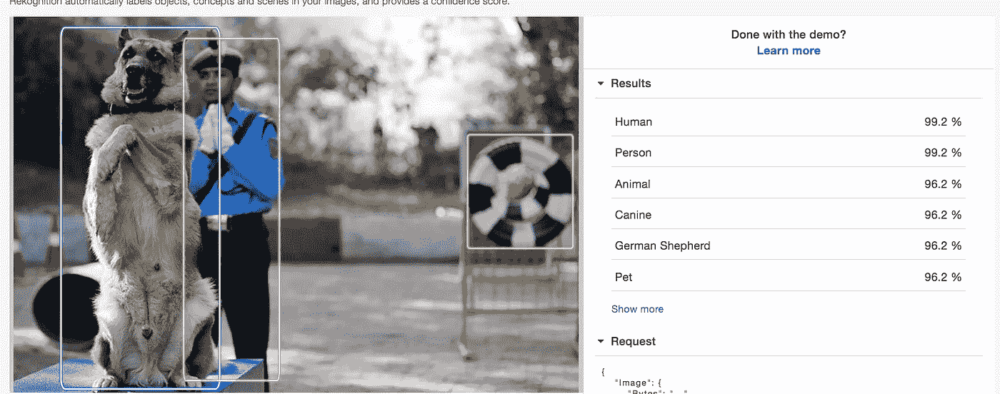
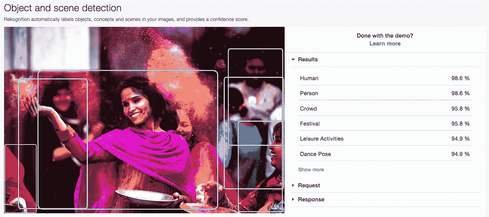
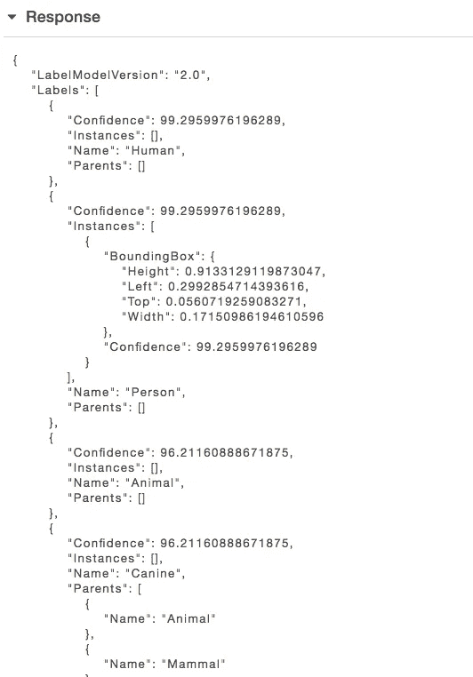

# 图像识别中的人工智能能力

> 原文：<https://towardsdatascience.com/ai-capabilities-in-image-recognition-7d79aec5222f?source=collection_archive---------16----------------------->

随着 AWS 和谷歌提供的大规模云托管人工智能和人工智能平台的出现，应用程序开发人员在他们的应用程序中集成人工智能和人工智能，并利用复杂的人工智能/人工智能算法的高级功能，甚至无需内部人工智能专家，已经变得更加容易。

人工智能最普遍的应用是模仿人类互动或人类感知信息的方式——视觉和语音。虽然语音是人工智能中同样重要的领域，在这个领域也有同样多的发展，但本文的重点是*视觉*。视觉领域的主要部分是理解图像和视频。如今，配备了高质量移动摄像机的互联网用户每天都在制作和消费大量的图像/视频内容。对图像数据进行分类、过滤、编辑和解析是一个典型的用例。借助基于云的平台提供的 AI/ML 产品，我们获得了许多具有巨大优势的强大工具。本文试图阐明这些功能。

在处理图像时，最常见的用例是检测和识别图像中的内容。使用人工智能平台，我们能够做以下事情:

1.  人脸识别——是否是人脸？如果是，它是与我的数据库中的人脸之一相匹配的人脸吗？
2.  检测对象—图像中存在哪些对象？我们能探测并命名所有这些物体吗？
3.  文本检测—如果是文本文档，我们能提取文本吗？
4.  徽标、地标检测——我们能否精确检测并命名自然或人工地标或公司徽标？

现在让我们深入了解这些平台是如何解决这些问题的。让我们首先看看谷歌的人工智能产品——谷歌视觉。

# 谷歌视觉

它现在是谷歌云平台的一部分，它提供了一系列功能，几乎涵盖了我们上面提到的所有需求。Google Vision 向开发人员提供 API(称为云视觉 API)以实现各自的功能。根据官方文件——

> **云视觉 API** 通过将强大的机器学习模型封装在一个易于使用的 REST API 中，使开发者能够理解图像的内容。它可以快速地将图像分为数千种类别(例如，“帆船”)，检测图像中的单个对象和人脸，并读取图像中包含的印刷文字。您可以在您的图像目录上构建元数据，缓和攻击性内容，或者通过图像情感分析实现新的营销场景。

Cloud Vision homepage

# 特性/功能

1.  **图像标记** —视觉 API 通过识别其检测到的信息，根据不同的标识符或标签为给定图像添加标签。标签范围很广——动物、交通工具、地点、颜色、食物..任何事。
2.  **人脸、标志和地标检测** —在检测人脸(和动物)、品牌标志、纪念碑和著名景点方面表现出色。它可以检测图像中出现的多张脸，还可以识别一张脸是否是名人脸。它还给出精确的面部属性和情绪状态。
3.  **光学字符识别(OCR)又称文本检测** —输入图像或文件，它会读出所有文本。即使文本几乎不存在或者文档是全文文档。
4.  **检测露骨内容** —这是一个很棒的功能，使用它我们可以从用户生成的图像数据中检测成人内容。它提供了出现露骨或暴力内容的可能性。
5.  **谷歌搜索** —利用谷歌搜索数据和算法的力量，它试图在给定图像和网络上可用图像之间建立关系。利用这一点，它可以在网上搜索类似的图片。

 [## 谷歌云平台

### Google 云平台让您可以在同一基础设施上构建、部署和扩展应用程序、网站和服务…

console.cloud.google.com](https://console.cloud.google.com/apis/library/vision.googleapis.com)  [## 移动视觉简介|移动视觉|谷歌开发者

### 移动视觉 API 现在是 ML 工具包的一部分。我们强烈建议您尝试一下，因为它提供了新的…

developers.google.com](https://developers.google.com/vision/introduction) 

使用上页中的演示功能，可以针对不同类型的输入对服务进行测试。

Cloud Vision API demo 1

Cloud Vision API demo 2

关于 Google Vision 的一个令人兴奋的事情是，该产品有一个专注于移动的兄弟——移动视觉(现在作为 **ML Kit** 的 Firebase 的一部分),这是为移动应用程序开发者准备的。它提供了使用云 API 进行图像识别的功能，以及针对有限功能的设备图像识别功能。。ML kit 本身是一个令人兴奋的新框架，为移动应用开发者提供了极其简单的 Rest API。

Introducing ML Kit — Image grab from Google I/O, 2018

# 亚马逊认知

“…服务可以识别对象、人员、文本、场景和活动，并检测任何不适当的内容。”

Amazon Rekognition 平台由 Amazon 作为 AWS 中的服务捆绑提供。S3 桶托管的图像和视频内容可以输入 Rekognition 进行分析。它提供了许多类似于谷歌视觉的功能，如文本提取、对象检测和显式内容检测，但也有一些令人印象深刻的附加功能。

“…if you want to be able to open up your garage when camera detects your license plate.”— Andy Jassy, CEO, AWS at re-Invent, 2018

AWS Rekognition 有两个独特的功能— *人员跟踪*和*实时视频分析*。人员跟踪允许检测和跟踪特定人员的移动，并在此基础上做出决策。实时视频分析有助于根据实时视频中检测到的对象或活动做出即时决策。

“亚马逊 Rekognition 基于亚马逊计算机视觉科学家开发的同样经过验证、高度可扩展的深度学习技术，每天分析数十亿张图像和视频，不需要使用机器学习专业知识。”

[这里的](https://aws.amazon.com/rekognition/)是服务的官方页面。还有一个演示页面来使用和测试这个特性。

Amazon Rekognition Demo 1

Amazon Rekognition Demo 2

rest 服务给出一个 JSON 响应，详细说明检测到的对象和活动。

Rekognition API response.

亚马逊还非常强调 Rekonition 的特定人脸识别能力(除了检测之外)，即从图像中检测人脸，并通过与你自己数据库中存储的人脸进行匹配来识别它。如果有足够的数据，任何人都可以使用它来创建一个人识别应用程序。虽然在[这篇文章](https://www.forbes.com/sites/thomasbrewster/2018/06/06/amazon-facial-recognition-cost-just-10-and-was-worryingly-good/#4013f00f51db)中提到了一些隐私问题。

谷歌云视觉和亚马逊 Rekognition 的详细对比可以在[这里](https://cloudacademy.com/blog/google-vision-vs-amazon-rekognition/)找到。

除了云视觉和 Rekognition，还有一些其他的解决方案。OpenCV 在这里值得一提，它是一个开源框架或库，拥有大量用于检测对象或活动的 ML 算法。OpenCV 不是云托管解决方案。