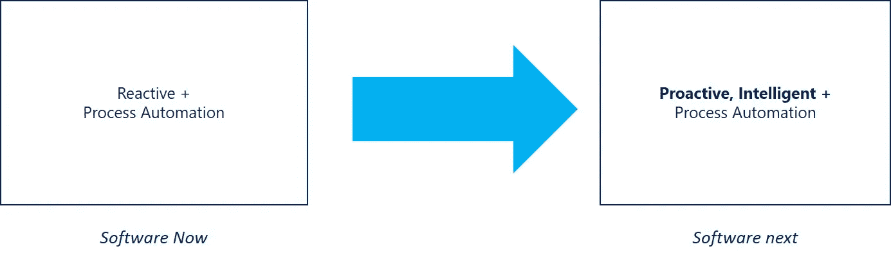
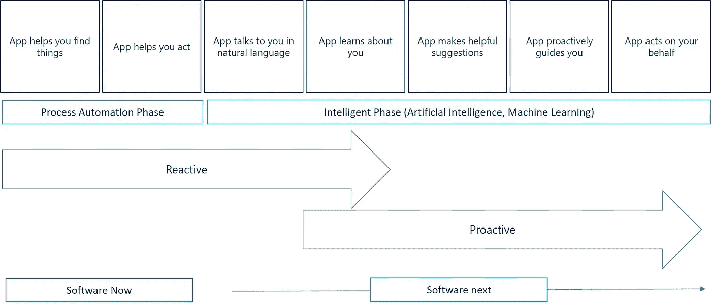

# 人工智能吞噬软件的未来

> 原文：<https://towardsdatascience.com/ai-eats-future-of-software-27d3a0d8eaed?source=collection_archive---------5----------------------->

在这篇文章中，我将分享人工智能如何塑造软件未来的观点。我们日常使用的传统软件在未来的日子里会发生怎样的巨大变化。

让我们从软件的当前状态(称之为“遗留”)开始。

# “遗产”

历史上，软件应用程序大多被设计成自动化一组特定的过程——生活中的过程或企业中的过程

让我们举两个例子来理解这一点:

在面向消费者的场景中，一个合适的例子是“出租车预订”过程。从前，你打电话给出租车公司，告诉他们你的上车地点、时间、目的地、你想要什么类型的出租车等等。随后出租车会来接你。那么“遗留”应用程序(我们使用的)是如何产生的呢？让我们以优步为例。优步应用程序自动化了这一过程(同时还做了许多其他很酷的事情)。类似地，Booking.com 应用程序自动化了“酒店预订”过程，Yelp 自动化了“餐馆搜索”过程等等。拿你最喜欢的应用程序来说，它的核心肯定是自动化了一些过程

在企业环境中，Outlook 等应用程序会自动执行“电子邮件管理”流程。Microsoft Dynamics 自动化了“客户关系管理”流程，Slack 自动化了“企业协作”流程，这样的例子不胜枚举。

因此“过程自动化”通常是任何“遗留”软件应用程序的核心。目前为止。

但不是前方。

# “未来”

鉴于这些过程中的大部分已经自动化，软件应用的下一个前沿是什么？优步、网飞等国家的软件应用前景如何？长什么样？Outlook、Gmail、Slack 在未来会有什么与众不同的特点？

当然，下一代软件应用不仅仅是过程自动化！！！

但远不止如此。下一代应用程序更加智能、个性化、自我学习和自我改进。

这就是人工智能(和机器学习)作为未来软件的核心 DNA 发挥作用的地方。

正如我所讨论的，我们周围的大多数软件应用程序仍然属于过程自动化时代(我们所处的时代！).它们本质上是高度反应性的。非常类似于 Eric Schmidt 提到的:软件总是像那只被要求时会叫的宠物狗。肯定不主动。非常非常被动。

展望未来，三个驱动因素都将使软件变得更加主动、个性化，并最终变得更加智能。

但是是什么推动了这种变化呢？海量数据、对大型计算基础设施(云 GPU 等)的可用性和智能算法成为跨越学术界边界的主流。

“未来”应用程序的一些其他特征:

1.  软件应用程序将以“自然”的无缝方式与用户互动，而不仅仅是点击或触摸。与应用程序交互的常见方式将是自然语言文本、语音、手势、情感。Cortana、Allo、Siri 和 Alexa 已经为这个领域的更多创新铺平了道路。
2.  随着更多的使用，软件应用程序将了解用户，变得更加“个性化”、“相关”。应用程序的响应将不被预定义，因此变得更加个性化。这也是可能的，因为关于用户的大量上下文、行为信息的可用性以及快速处理的能力。网飞就是一个很好的例子——你用得越多，个性化的体验就越多。
3.  app 会提出更有帮助的建议。利用对用户行为和偏好的了解，下一代应用程序将以无缝的方式将正确的内容和资源映射到用户。
4.  下一步将是代表一个人主动采取行动——更多地在人工智能助手中。这将产生巨大的生产力需求。

在下一篇文章中，我们将看看如何构建融合人工智能的应用程序。

对于帖子上的任何问题、评论和意见，请随时联系我。我的坐标:@saunakdg 在 Twitter