# 艺术家的人工智能:第一部分

> 原文：<https://towardsdatascience.com/ai-for-artists-part-1-8d74502725d0?source=collection_archive---------2----------------------->

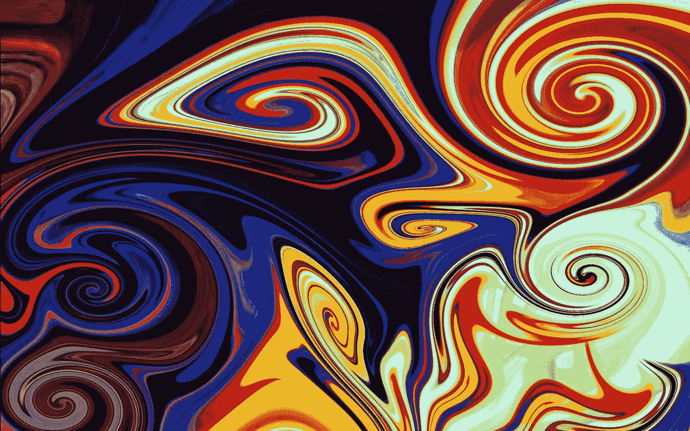

> 艺术不仅仅是对自然现实的模仿，事实上，它是对自然现实的一种形而上学的补充，为了征服自然而与自然并列。
> 
> 弗里德里希·尼采

***注意，本文是艺术家 AI 系列的一部分。*** [***第一部分***](/ai-for-artists-part-1-8d74502725d0)*[***第二部分***](/ai-for-artists-part-2-c3e41653747a)*

*艺术和技术的历史总是交织在一起的。历史上发生的艺术革命是由制作作品的工具促成的。燧石刀的精确性使得人类能够用猛犸象象牙雕刻出第一批形象艺术作品。在当代，艺术家使用从 3D 打印到虚拟现实的工具，拓展了自我表达的可能性。*

*我们正在进入一个时代，人工智能越来越多地出现在几乎每个领域。埃隆·马斯克认为，到 2030 年，艺术将在所有方面超过人类，但艺术一直被视为人类的万神殿，是人工智能永远无法复制的人类事物。在这一系列文章中，我们将在机器学习的帮助下创作出令人惊叹的艺术作品。*

# *项目 1:神经风格转移*

*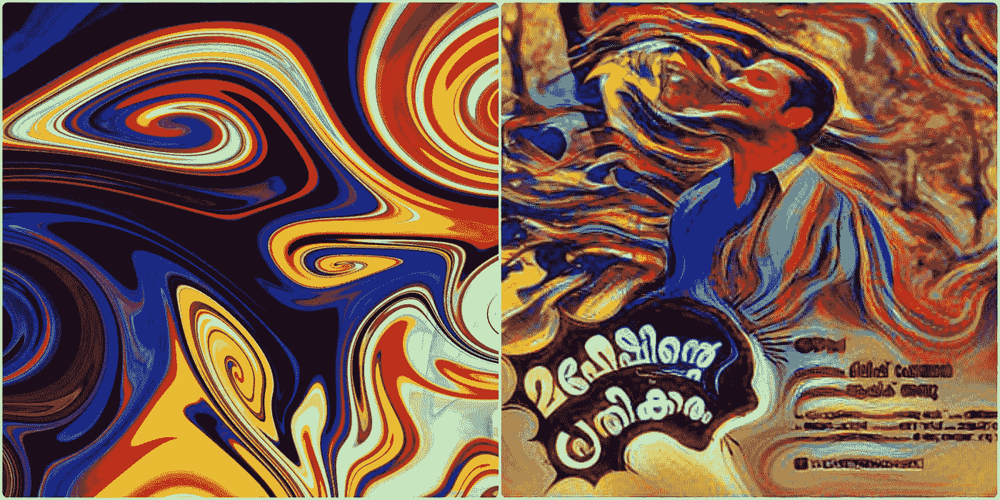*

*什么是神经风格转移？*

*它仅仅是以另一种方式重新想象一幅图像的过程。这是使用卷积神经网络进行图像处理的最酷的应用之一。想象一下，你可以让任何一位著名的艺术家(例如米开朗基罗)在几毫秒内为你画出你想要的任何东西。在这篇文章中，我将尝试给出一个关于实现细节的简要描述。欲了解更多信息，您可以参考 [Gatys 等人的论文，2015](https://arxiv.org/abs/1508.06576) 。本文实现了我们试图做的优化问题*

*在我们开始之前，我们将介绍一些基础知识，这可以帮助你更好地理解概念，或者如果你只对代码感兴趣，你可以直接进入下面的链接[https://github.com/hnarayanan/artistic-style-transfer](https://github.com/hnarayanan/artistic-style-transfer)或[https://github.com/sav132/neural-style-transfer](https://github.com/sav132/neural-style-transfer)。绝对推荐[卷积神经网络(CNN)](https://www.coursera.org/learn/convolutional-neural-networks) 吴恩达课程，以便更深层次地理解概念。*

# *基本原则*

*让我们想象一下，我们正在尝试建立一个图像分类器，它可以预测图像是什么。我们使用监督学习来解决这个问题。给定一个由 D = W×H×3(色深= 3)组成的彩色图像(RGB 图像)被存储为一个数组。我们假设有“n”个类别可以分类。任务是提出一个将我们图像分类为“n”个图像之一的函数。*

*为了建立这一点，我们从一组先前分类标记的“训练数据”开始。分数函数我们可以用一个简单的线性激活函数[F(x，W，b) = Wx +b]。W —大小为 n X D 的矩阵称为权重，大小为 n X 1 的向量 b 称为偏差。为了预测每个类别的概率，我们将这个输出通过一个叫做 [*softmax*](https://en.wikipedia.org/wiki/Softmax_function) *的函数**将分数压缩为一组 0 到 1 之间的数字，加起来等于 1。假设我们的训练数据是一组 *N* 预先分类的示例 **xi** ∈ℝ *D* ，每个示例都有正确的类别*易* ∈1，…， *K。确定所有这些示例的总损失是* [*交叉熵*](https://en.wikipedia.org/wiki/Cross_entropy) *损失:***

> ***L(****s****)=∑I log(syi)***

**对于优化部分，我们使用梯度下降。我们必须找到最小化这种损失的权重和偏差。**

**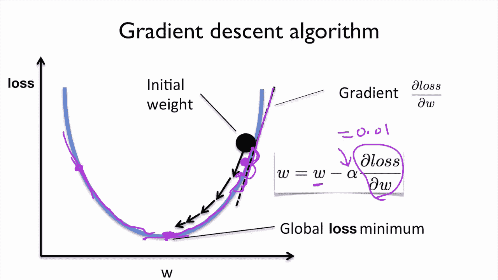**

**我们的目标是找到曲线底部的全局损失最小值。我们还使用一个称为学习率(α)的参数，这是一个衡量我们修改权重速度的指标。**

**综上所述，最初我们给出了一些图像作为一个原始的数字数组，我们有一个参数化的得分函数(线性变换后是一个 softmax 函数),带我们去分类得分。我们有一种评估其性能的方法(交叉熵损失函数)。然后，我们改进分类器的参数(使用梯度下降优化)。但是这里的精度较低，因此我们使用卷积神经网络来提高精度。**

## **卷积神经网络(CNN)基础**

**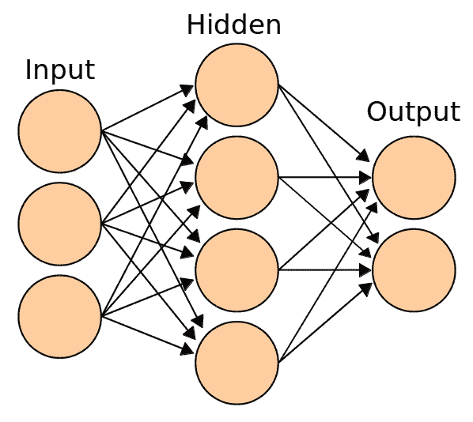**

**Diagram of a simple network from Wikipedia**

**以前我们使用线性得分函数，但这里我们将使用非线性得分函数。为此，我们使用*神经元*，它们是*函数*，它首先将其每个输入乘以一个权重，并将这些加权的输入相加为一个数字，并添加一个偏差。然后，它将这个数字通过一个称为*激活*的非线性函数，并产生一个输出。**

**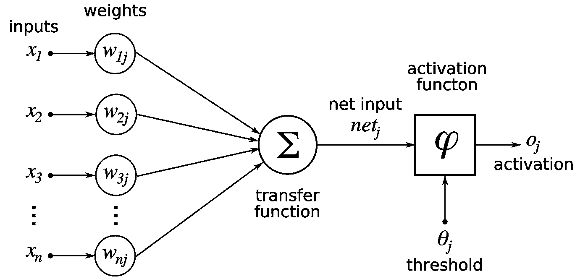**

**通常，为了提高我们的分类器的准确性，我们可能会认为通过向我们的得分函数添加更多的层来做到这一点是很容易的。但是有一些问题-**

**1.通常，神经网络完全忽略图像的 2D 结构。例如，如果我们将输入图像作为一个 30×30 的矩阵，他们将输入图像作为一个 900 的数组。你可以想象，共享邻近像素的一些有用信息正在丢失。**

**2.当我们添加更多的层时，我们需要学习的参数数量增长非常快。**

**为了解决这些问题，我们使用卷积神经网络。**

**普通网络和 CNN 之间的区别在于，它不是使用线性阵列的输入数据，而是使用具有宽度、高度和深度的输入数据，并输出 3D 数量。人们想象的 2D 输入图像( *W* × *H* )通过引入颜色深度作为第三维( *W* × *H* × *d* )被转换成 3D。(灰度为 1，RGB 为 3。)类似地，人们可能想象的长度为 *C* 的线性输出实际上表示为 1×1× *C* 。我们使用两种类型的图层**

**1.卷积层**

**第一层是卷积(Conv) 层*。*这里我们有一组过滤器。让我们假设我们有 K 个 T21 这样的过滤器。每个滤波器都很小，其范围由 *F* 表示，并具有其输入的深度值。例如，典型的滤波器可能是 3×3×3 (3 个像素宽和 3 个像素高，3 个像素来自输入 3 通道彩色图像的深度)。**

**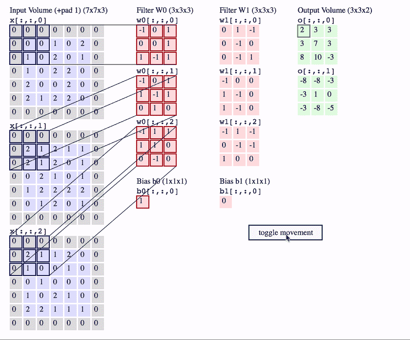**

**Convolutional layer with K = 2 filters, each with a spatial extent F = 3 , moving at a stride S = 2, and input padding P = 1\. (Reproduced from CS231n notes)**

**我们以表示我们移动速度的步幅 *S* 在输入音量上滑动滤波器组。根据控制输出空间尺寸的需要，该输入可以用零进行空间填充( *P* )。当我们滑动时，每个过滤器计算输入的点积以产生 2D 输出，当我们将这些过滤器堆叠在我们集合中的所有过滤器上时，我们得到 3D 输出体积。**

**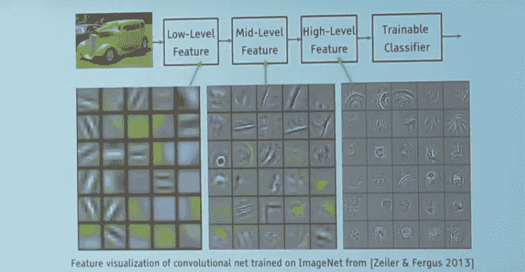**

**2.汇集层**

**它的功能是逐渐减小表示的空间大小，以减少网络中的参数和计算量。它没有任何要学习的参数。**

**例如，空间范围 *F* =2 且跨度 *S* =2 的最大池图层将输入尺寸从 4×4 减半至 2×2，深度保持不变。它通过选取每组 2×2 数中的最大值，并仅将这些值传递给输出来实现这一点。**

**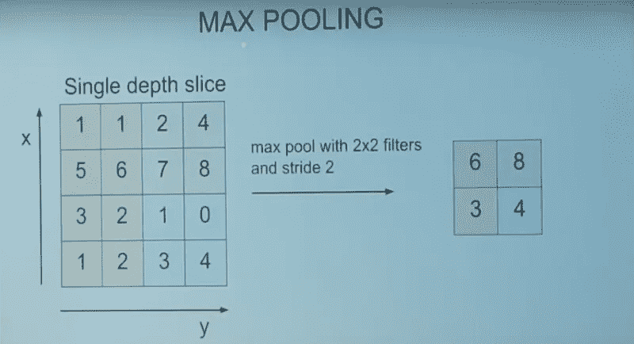**

**这就结束了基本原理，我希望你已经了解了基本的工作原理。**

# **我们开始吧！**

****内容图像和样式图像****

**内容图像(c)是您想要重新创建的图像。它为新的输出图像提供主要内容。它可以是一只狗的任何图像，一张自拍照或者几乎任何你想以新的风格画出来的东西。另一方面，风格图像提供图像的艺术特征，例如图案、笔触、颜色、曲线和形状。让我们称风格转移输出图像为 **x** 。**

****损失函数****

***Lcontent* ( **c** ， **x** ):这里我们的目标是最小化内容图像和输出图像之间的损失，这意味着当两个输入图像( **c** 和 **x** )在内容上非常接近时，我们有一个趋向于 0 的函数，并且随着它们的内容偏离而增长。我们称这个函数为*内容损失*。**

***Lstyle* ( **s** ， **x** ):这个函数显示*两幅图像在风格上*有多接近。同样，该函数随着其两个输入图像( **s** 和 **x** )在风格上趋于偏离而增长。我们称这个函数为*风格损失*。**

**现在我们需要找到一个图片 **x** ，这样它与内容图片和风格图片就没有什么不同。**

**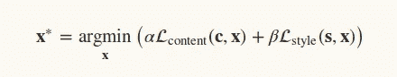**

**α和β用于平衡结果图像中的内容和样式。**

**在这里，我们将使用 [VGGNet](https://arxiv.org/abs/1409.1556) ，这是一个基于 CNN 的图像分类器，它已经学会对感知(例如，笔画大小、空间样式控制和颜色控制)和语义信息进行编码，我们需要这些信息来测量这些语义差异术语。**

**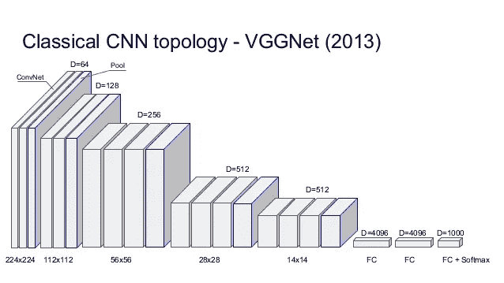**

**VGGNet 通过将相同的较小卷积滤波器配置重复 16 次，大大简化了 ConvNet 的设计:VGGNet 中的所有滤波器都限制为 3×3，跨距和填充为 1，以及跨距为 2 的 2×2 最大池滤波器。**

**我们将首先复制用绿色标记的 16 层变体，用于分类，在下一个笔记本中，我们将看到它如何重新用于样式转换问题。**

**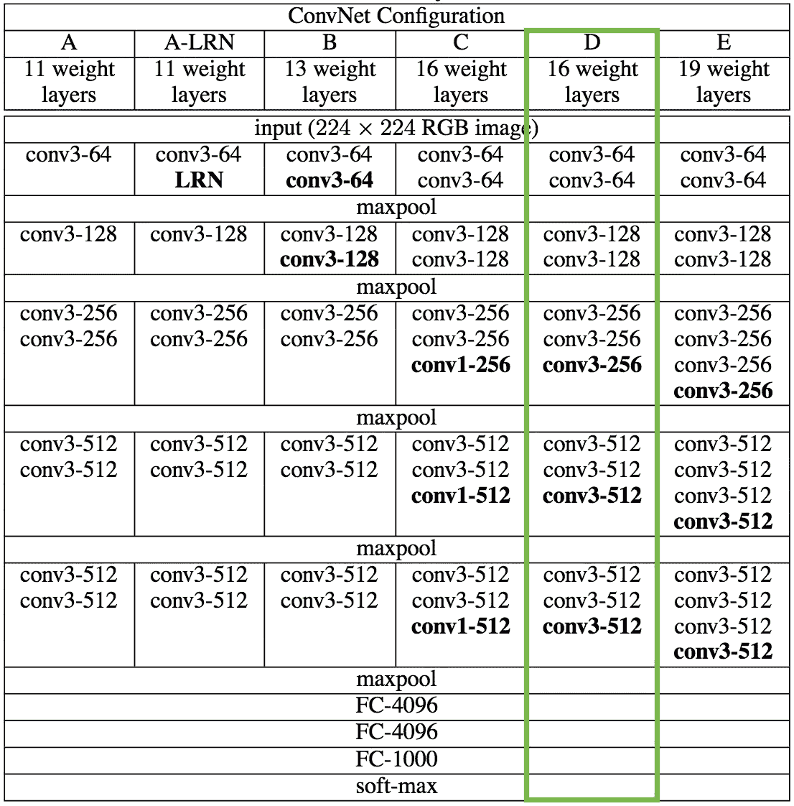**

**普通的 VGG 获取图像并返回类别分数，但是这里我们获取中间层的输出并构建 *Lcontent* 和 *Lstyle* 。这里我们不包括任何完全连接的层。**

**让我们开始编码，**

**导入必要的包。**

```
**from keras.applications.vgg16 import preprocess_input, decode_predictionsimport time
from PIL import Image
import numpy as npfrom keras import backend
from keras.models import Model
from keras.applications.vgg16 import VGG16from scipy.optimize import fmin_l_bfgs_b
from scipy.misc import imsave**
```

**加载并预处理内容和样式图像**

```
**height = 450
width = 450content_image_path = 'images/styles/SSSA.JPG'
content_image = Image.open(content_image_path)
content_image = content_image.resize((width, height))style_image_path = 'images/styles/The_Scream.jpg'
style_image = Image.open(style_image_path)
style_image = style_image.resize((width, height))** 
```

**现在我们将这些图像转换成适合数字处理的形式。特别是，我们添加了另一个维度(超出高度 x 宽度 x 3 个维度),以便稍后我们可以将这两个图像的表示连接到一个公共数据结构中。**

```
**content_array = np.asarray(content_image, dtype='float32')
content_array = np.expand_dims(content_array, axis=0)
style_array = np.asarray(style_image, dtype='float32')
style_array = np.expand_dims(style_array, axis=0)** 
```

**现在，我们需要压缩这些输入数据，以匹配“[用于大规模图像识别的甚深卷积网络](https://arxiv.org/abs/1409.1556)”中所做的工作，该论文介绍了 *VGG 网络*。**

**为此，我们需要执行两个转换:**

**1.从每个像素中减去平均 RGB 值(之前在 ImageNet 训练集上计算的，可以从 Google 搜索中获得)。**

**2.将数组的排序从 *RGB* 更改为 *BGR。***

```
**content_array[:, :, :, 0] -= 103.939
content_array[:, :, :, 1] -= 116.779
content_array[:, :, :, 2] -= 123.68
content_array = content_array[:, :, :, ::-1]

style_array[:, :, :, 0] -= 103.939
style_array[:, :, :, 1] -= 116.779
style_array[:, :, :, 2] -= 123.68
style_array = style_array[:, :, :, ::-1]**
```

**现在我们准备使用这些数组来定义 Keras 后端中的变量。我们还引入了一个占位符变量来存储组合图像，该组合图像保留了内容图像的内容，同时合并了样式图像的样式。**

```
**content_image = backend.variable(content_array)
style_image = backend.variable(style_array)
combination_image = backend.placeholder((1, height, width, 3))**
```

**最后，我们将所有这些图像数据连接成适于由 Keras VGG16 模型处理的单个张量。**

```
**input_tensor = backend.concatenate([content_image,
                                    style_image,
                                    combination_image], axis=0)**
```

**原始论文使用来自 [Simonyan 和 Zisserman (2015)](https://arxiv.org/abs/1409.1556) 的 19 层 VGG 网络模型，但我们将改为遵循 [Johnson et al. (2016)](https://arxiv.org/abs/1603.08155) 并使用 16 层模型(VGG16)。由于我们对图像分类不感兴趣，我们可以设置`include_top=False`，这样我们就不包括任何完全连接的层。**

```
**model = VGG16(input_tensor=input_tensor, weights='imagenet',
              include_top=False)**
```

**我们想要最小化的损失函数可以分解为*内容损失*、*风格损失*和*总变化损失*。**

**这些术语的相对重要性由一组标量权重决定。这些价值观的选择取决于你，但是下面的对我来说更好**

```
**content_weight = 0.050
style_weight = 4.0
total_variation_weight = 1.0**
```

**对于内容损失，我们从`block2_conv2.`中提取内容特征。内容损失是内容和组合图像之间的平方欧几里德距离。**

```
**def content_loss(content, combination):
    return backend.sum(backend.square(combination - content))layer_features = layers['block2_conv2']
content_image_features = layer_features[0, :, :, :]
combination_features = layer_features[2, :, :, :]loss += content_weight * content_loss(content_image_features,
                                      combination_features)**
```

**对于风格损失，我们首先定义一个叫做*克矩阵*的东西。[一组图像的 Gram 矩阵](https://inst.eecs.berkeley.edu/~ee127a/book/login/def_Gram_matrix.html)，表示两幅图像之间的相似性或差异性。如果你有一个(m x n)的图像，把它整形为(m*n x 1)的向量。类似地，将所有图像转换为矢量形式并形成一个矩阵，比如说 A.
那么这组图像的克矩阵 G 将为**

```
**G = A.transpose() * A;**
```

**每个元素 G(i，j)将表示图像 I 和 j 之间的相似性度量**

**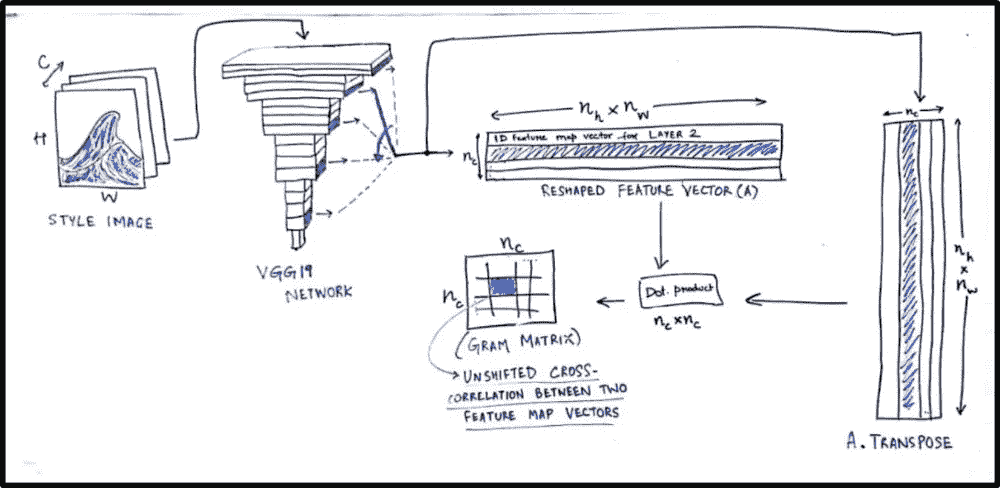**

```
**def gram_matrix(x):
    features = backend.batch_flatten(backend.permute_dimensions(x, (2, 0, 1)))
    gram = backend.dot(features, backend.transpose(features))
    return gram**
```

**我们通过计算风格和组合图像的 Gram 矩阵之间的差的 Frobenius 范数(它是定义为其元素的绝对平方和的平方根的矩阵的矩阵**范数**)来获得风格损失。**

```
**def style_loss(style, combination):
    S = gram_matrix(style)
    C = gram_matrix(combination)
    channels = 3
    size = height * width
    return backend.sum(backend.square(S - C)) / (4\. * (channels ** 2) * (size ** 2))

feature_layers = ['block1_conv2', 'block2_conv2',
                  'block3_conv3', 'block4_conv3',
                  'block5_conv3']
for layer_name in feature_layers:
    layer_features = layers[layer_name]
    style_features = layer_features[1, :, :, :]
    combination_features = layer_features[2, :, :, :]
    sl = style_loss(style_features, combination_features)
    loss += (style_weight / len(feature_layers)) * sl**
```

**现在我们计算总变异损失，**

```
**def total_variation_loss(x):
    a = backend.square(x[:, :height-1, :width-1, :] - x[:, 1:, :width-1, :])
    b = backend.square(x[:, :height-1, :width-1, :] - x[:, :height-1, 1:, :])
    return backend.sum(backend.pow(a + b, 1.25))

loss += total_variation_weight * total_variation_loss(combination_image)**
```

**现在我们有我们的总损失，它的时间来优化结果图像。我们从定义梯度开始，**

```
**grads = backend.gradients(loss, combination_image)**
```

**然后，我们引入一个`Evaluator`类，它在一次通过中计算损失和梯度，同时使用`loss`和`grads` 函数检索它们。**

```
**outputs = [loss]
outputs += grads
f_outputs = backend.function([combination_image], outputs)

def eval_loss_and_grads(x):
    x = x.reshape((1, height, width, 3))
    outs = f_outputs([x])
    loss_value = outs[0]
    grad_values = outs[1].flatten().astype('float64')
    return loss_value, grad_values

class Evaluator(object):

    def __init__(self):
        self.loss_value = None
        self.grads_values = None

    def loss(self, x):
        assert self.loss_value is None
        loss_value, grad_values = eval_loss_and_grads(x)
        self.loss_value = loss_value
        self.grad_values = grad_values
        return self.loss_value

    def grads(self, x):
        assert self.loss_value is not None
        grad_values = np.copy(self.grad_values)
        self.loss_value = None
        self.grad_values = None
        return grad_values

evaluator = Evaluator()**
```

**这个合成图像最初是像素的随机集合，我们使用`fmin_l_bfgs_b()` 函数( [**有限内存 BFGS** ( **L-BFGS** 或 **LM-BFGS** )](https://en.wikipedia.org/wiki/Limited-memory_BFGS) 是一个[优化算法](https://en.wikipedia.org/wiki/Optimization_(mathematics)))对其进行迭代改进。**

```
**x = np.random.uniform(0, 255, (1, height, width, 3)) - 128.

iterations = 10

for i in range(iterations):
    print('Start of iteration', i)
    start_time = time.time()
    x, min_val, info = fmin_l_bfgs_b(evaluator.loss, x.flatten(),
                                     fprime=evaluator.grads, maxfun=20)
    print('Current loss value:', min_val)
    end_time = time.time()
    print('Iteration %d completed in %ds' % (i, end_time - start_time))**
```

**要恢复输出图像，请执行以下操作**

```
**x = x.reshape((height, width, 3))
x = x[:, :, ::-1]
x[:, :, 0] += 103.939
x[:, :, 1] += 116.779
x[:, :, 2] += 123.68
x = np.clip(x, 0, 255).astype('uint8')

image_final = Image.fromarray(x)**
```

**生成的图像在 image_final 中可用。**

**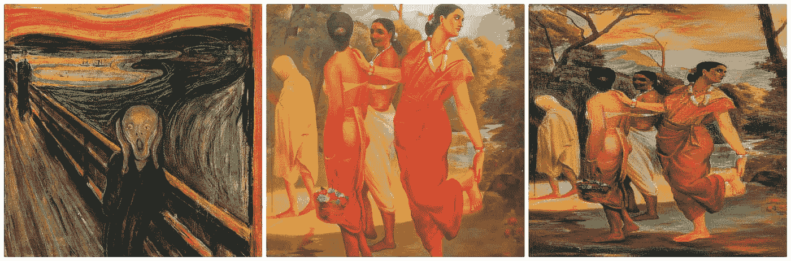**

**Raja Ravi Varma painting in the style of Edvard Munch**

***如果你是初学者，想入门深度学习领域，可以访问我的博客*[*AI for art*](https://aiforart.wordpress.com/)*。***

# **结论**

**这个项目将让你对 CNN 的工作有一个大致的了解，并澄清许多基本的疑问。在这一系列文章中，我们将探索深度学习用于创造性目的的各种方式。**

**感谢您的宝贵时间！**

****参考:****

**[](https://medium.com/data-science-group-iitr/artistic-style-transfer-with-convolutional-neural-network-7ce2476039fd) [## 基于卷积神经网络的艺术风格转换

### 我们都使用过像 Prisma 和 Lucid 这样的应用程序，但有没有想过这些东西是如何工作的？就像我们从我们的…

medium.com](https://medium.com/data-science-group-iitr/artistic-style-transfer-with-convolutional-neural-network-7ce2476039fd) [](https://www.coursera.org/learn/convolutional-neural-networks) [## 卷积神经网络| Coursera

### 本课程将教你如何建立卷积神经网络…

www.coursera.org](https://www.coursera.org/learn/convolutional-neural-networks) [](https://github.com/hnarayanan/artistic-style-transfer) [## hnarayanan/艺术风格转移

### 艺术风格转移——用于艺术风格转移的卷积神经网络。

github.com](https://github.com/hnarayanan/artistic-style-transfer)  [## [1409.1556]用于大规模图像识别的超深度卷积网络

### 摘要:在这项工作中，我们研究了卷积网络的深度对其在大规模数据传输中的准确性的影响

arxiv.org](https://arxiv.org/abs/1409.1556) 

*   [http://cs231n.stanford.edu/](http://cs231n.stanford.edu/)
*   (神经类型转移:综述)[https://arxiv.org/pdf/1705.04058.pdf](https://arxiv.org/pdf/1705.04058.pdf)
*   [http://cs231n.github.io/](http://cs231n.github.io/)
*   (一种艺术风格的神经算法)[https://arxiv.org/pdf/1508.06576.pdf](https://arxiv.org/pdf/1508.06576.pdf)
*   [http://bangqu.com/0905b5.html](http://bangqu.com/0905b5.html)**