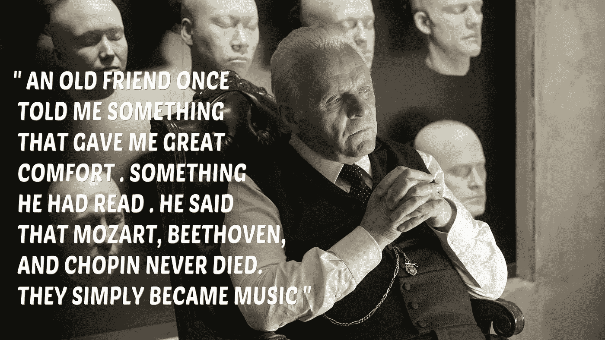
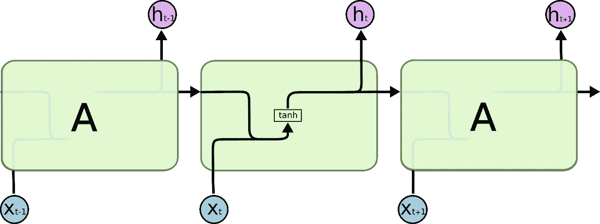
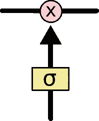

# 艺术家的人工智能:第二部分

> 原文：<https://towardsdatascience.com/ai-for-artists-part-2-c3e41653747a?source=collection_archive---------14----------------------->

Quote from Westworld TV show

***注意，本文是艺术家 AI 系列的一部分。*** [***第一部分***](/ai-for-artists-part-1-8d74502725d0)*[***第二部分***](/ai-for-artists-part-2-c3e41653747a)*

*音乐是一种强有力的工具，它能让世界上一些最聪明的头脑变得不可思议。其中有弗里德里希·尼采、叔本华、弗吉尼亚·伍尔夫等等。尼采在他的书《偶像的黄昏》中说“没有音乐的生活将是一个错误”。*

*在本文中，我们将使用简单的 LSTM 网络来创作音乐，但在此之前，让我们先简要了解一下音乐创作史上出现过的算法作曲。*

# *穿越时间的简史……*

*从古希腊时代开始，就有许多关于音乐理论的论文，但它们并不是任何纯粹意义上的“算法作品”。但在古典时期，算法音乐最常被引用的例子之一是莫扎特的音乐。*

*Combinations obtained by rolling a dice.*

*1958 年，亚尼斯·克塞纳基斯在他的作品中使用了马尔可夫链。*

## *马尔可夫链*

*马尔可夫链用于描述一组可能的事件，其中每个事件发生的概率只取决于前一个事件达到的状态。这些用于预测序列中的下一个数据，其中数据可以是单词、音符等。它基本上模拟了一个音符序列播放后出现的概率。马尔可夫链的一个主要限制是它只能产生存在于原始数据中的子序列。但是用这种方法不可能扩展到那些精确的子序列之外。然后出现了递归神经网络(RNNs)尝试这样做。*

## *什么是 RNN？*

*我们打个比方来理解这一点。假设你想预测晚餐会吃什么。食物只有三样——煎饼、炒饭和面包。我们试图拟合一个模型，根据厨师迟到、特殊场合、鸡肉价格下跌等因素来预测每天的食物。如果我们开始在晚餐数据的历史上训练这一点，我们学会了预测某个特定夜晚的食物。我们可以看到，即使我们正确地选择输入和训练数据，预测的准确性也不会超过某一点。现在，当我们看一看数据时，我们可以看到食物——炒饭、煎饼和面包在一个循环中重复，不依赖于任何因素。如果前一天是 Chapati，那么第二天就会是面包，这就像一个序列。在这里，预测某一天的食物最重要的是前一天的食物数据。通过收集以前的食物数据，我们可以预测下一次的数据。*

**

*source : [http://colah.github.io/posts/2015-08-Understanding-LSTMs/](http://colah.github.io/posts/2015-08-Understanding-LSTMs/)*

*在正常的神经网络中，所有的输入都是相互独立的，但是在 RNN，所有的输入都是相互关联的。首先，它从输入序列中取出 x(0 ),然后输出 h(0 ), h(0)和 x(1)是下一步的输入。因此，h(0)和 x(1)是下一步的输入。类似地，下一步的 h(1)是下一步的 x(2)的输入，依此类推。这样它在训练的时候就一直记住了上下文。假设我们必须生成给定音乐序列中的下一个音符，在这种情况下，所有先前音符之间的关系有助于预测更好的输出。但问题是，由于消失梯度问题，标准 RNN 不能学习长期序列。*

## *消失梯度问题*

*当我们不断增加越来越多的隐藏层时，以及在反向传播过程中，就会发生这种情况，结果误差(导数)会变得很大或很小。这意味着与层级中较后层的神经元相比，较前层的神经元学习非常慢。这样做的问题是训练过程耗时太长，模型的预测精度会下降。解决方案之一是使用 LSTM 网络。2002 年，道格·埃克改变了这种方法，将标准的 RNN 细胞转换成“长短期记忆”(LSTM)细胞。*

## *LSTM 网络公司*

*长短期记忆网络(LSTM)是一种 RNN，能够学习长期依赖性，这意味着他们可以长时间记住信息。在正常的 RNNs 中，这种重复模块将具有类似单个 tanh 层的简单结构。*

**

*Simple RNN (source:colah’s blog)*

*LSTMs 具有链状结构，重复模块具有不同的结构。不是只有一个神经网络层，而是有四个网络。*

**

*LSTM*

*LSTM 网络不是神经元，而是连接成层的记忆块。块包含管理块状态和输出的门。*

**

*cell state highlighted*

*LSTMs 的关键是单元状态，即贯穿图表顶部的水平线。它沿着整个链条直线向下，只有一些微小的线性相互作用。*

**

*LSTM gate*

*门是决定是否让信息通过的一种方式。sigmoid 层输出 0 到 1 之间的数字。*

**0→没有东西通过**

**1→一切经过**

*一个 LSTM 有三个这样的门，用来保护和控制细胞状态。*

****忘记门→*** 决定从单元中丢弃什么信息。
***输入门→*** 决定输入哪些值来更新存储器状态。
***输出门→*** 根据输入和单元内存决定输出什么。*

*有许多方法可以使用从马尔可夫链到卷积神经网络(Wavenet)的不同网络来生成音乐。在这里我选择了 LSTM 网络生成音乐。对于训练数据，我们使用诺丁汉音乐数据库。我使用了由 [Panagiotis Petridis](https://github.com/PanagiotisPtr) 创建的预训练模型。数据集采用 ABC 格式。如果有好的 gpu 或者 cpu 也可以自己训练模型。 [**提供了*这里的***](https://github.com/sav132/music-generation-lstm) 为 jupyter 笔记本。如果你想了解代码[的解释，请点击此链接](https://artofmachinelearning.wordpress.com/2018/06/07/code-explanation-for-ai-for-artists-part-2/)。*

*将生成五个文本文件作为输出。您可以使用 abcmidi 之类的软件将生成的文本文件转换为 midi。您也可以使用各种项目，如 magenta、wavenet、deepjazz 等来生成音乐。*

*My output*

**如果你是初学者，想入门深度学习领域，可以访问我的博客* [*机器学习的艺术*](http://artofmachinelearning.wordpress.com) *。**

*感谢您的宝贵时间！！*

*参考:*

* [## 算法作曲:用普通 LISP 和普通…

### 使用程序生成一段音乐的一个非常简单的例子是使用 12 面骰子(编号为 1-12)来…

quod.lib.umich.edu](https://quod.lib.umich.edu/s/spobooks/bbv9810.0001.001/1:5/--algorithmic-composition-a-gentle-introduction-to-music?rgn=div1;view=fulltext)  [## ABC 音乐项目-诺丁汉音乐数据库

### 这些曲子最初不是手工核对的，所以很可能到处都有错误。诺丁汉音乐…

abc.sourceforge.net](http://abc.sourceforge.net/NMD/)  [## 马尔可夫链直观地解释了

### 当然，真正的建模者并不总是画出马尔可夫链图。相反，他们使用“转移矩阵”来计算…

setosa.io](http://setosa.io/ev/markov-chains/)  [## 了解 LSTM 网络——colah 的博客

### 这些循环使得循环神经网络看起来有点神秘。然而，如果你想得更多一点，事实证明…

colah.github.io](http://colah.github.io/posts/2015-08-Understanding-LSTMs/) 

[https://www.youtube.com/watch?v=qhXZsFVxGKo](https://www.youtube.com/watch?v=qhXZsFVxGKo)

 [## 用于生成音乐的神经网络

### 算法音乐创作在过去的几年里有了很大的发展，但是这个想法已经有很长的历史了。在一些…

medium.com](https://medium.com/artists-and-machine-intelligence/neural-nets-for-generating-music-f46dffac21c0)  [## 泛音乐主义者/音乐一代-RNN

### 音乐生成-RNN -一个使用 TFLearn 中 LSTM 层的神经网络，学习如何作曲。

github.com](https://github.com/PanagiotisPtr/Music-Generation-RNN)*