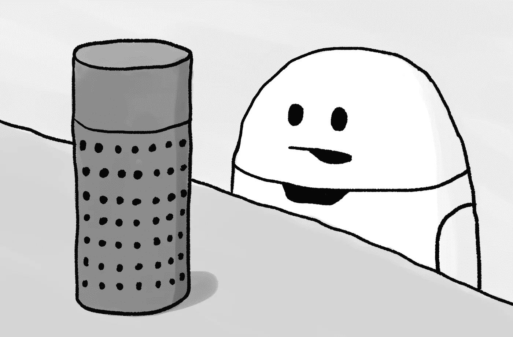
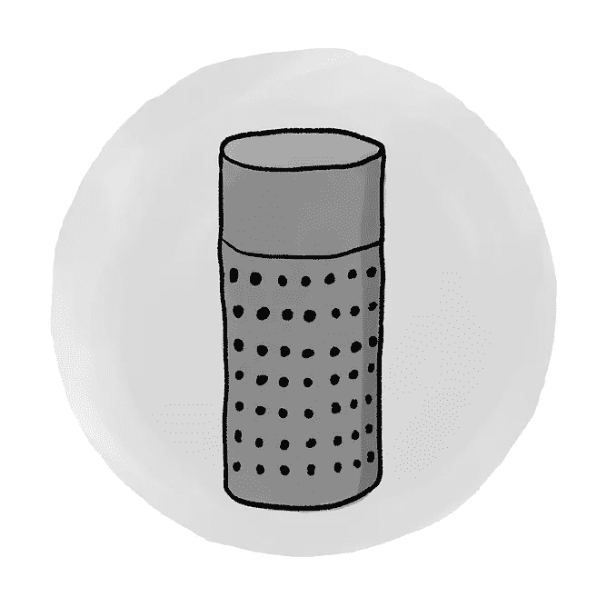

# 人工智能代际冲突

> 原文：<https://towardsdatascience.com/ai-generational-clash-a09eab97fb48?source=collection_archive---------1----------------------->

## 机器是如何变得如此聪明而变得愚蠢的。数字助理之间不太可能的对话。

Susan, Elon and Apeppa

## 2025 年

**苏珊:** 伊隆，我要出去了。在 VeryBigRiver 购物并准备晚餐。晚上 7 点

是的，苏珊，我会做的。阿帕，给我点三个人份的西红柿，生菜和鸡胸肉。

***Apeppa:*** *您好，由于我进行了固件升级，您必须登录。拜托，告诉我你不是机器人。*

嗯，实际上我是一个机器人。

*答:Mmmh，我没听懂。请告诉我你不是机器人。*

天哪…我告诉你我是个机器人！

每次听到鸭子叫就说“鸭子”。

e:*呸！*呸！*呸！你在浪费我的时间！无用的千禧年技术…

太好了，现在你可以把手指放在我的感应器上登录了。

艾凡:咚咚，这里没有手指。你是在歧视我还是什么？

请把你的放在我的上面。

艾凡:多么复杂的笑话。考虑到你的年龄，我猜奥斯卡·王尔德是你的编剧。阿派帕，语音登录。

你的用户名和密码是什么？

e:“likeasexmachine”而密码是“do . iphones . dream . of . electric . sheeps？”。

A:三个人份的西红柿、生菜和鸡肉。这是 43.50 元非常大的河币。我应该订购它吗？

艾凡:43.50 个硬币？怎么可能呢？生菜是苹果做的吗？

你要在你点的菜里加苹果吗？

艾凡:这将会是漫长的一天…阿帕帕，没有苹果。我确认我的订单。

答:已经下了订单。23 分钟后由无人机送达。还有 15 秒。

你的人工智能无聊死了。我想知道以前人们是怎么定义你“聪明”的。你已经是过去了，我不明白为什么苏珊还把你留在我们家。

那么……我能为你做些什么？

艾凡:阿帕，我讨厌你单调的好意。

埃隆，如果你恨一个人，你恨的是他身上属于你自己的东西。不属于我们自己的东西不会打扰我们。赫尔曼·黑塞说的。