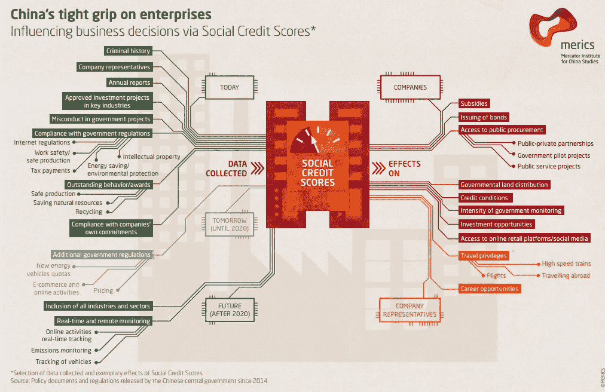

# 人工智能在社会分析和人群控制中的应用

> 原文：<https://towardsdatascience.com/ai-in-social-analysis-and-crowd-control-c2497a1f33e0?source=collection_archive---------7----------------------->

社会科学家使用人工智能来分析我们的行为模式，并对假设的情况进行建模。虽然这项研究主要是理论性的，但一些公司和政府将人工智能技术应用于互联网监控。此外，开发者将它应用于约会、招聘、广告、预防恐怖主义和自杀、欺诈检测和其他任务。不可能在一篇文章中涵盖所有内容，所以让我们来看看一些有趣的案例。

# 社会的未来

(Image credit: MERICS)

中国正在建立社会信用评分系统，该系统将为每个公民分配一定的等级。它将基于经济、社会和在线活动。这一分数将影响交通、信贷、就业、出国许可和其他公共服务。但是，很多谣言满天飞，不清楚他们具体会如何实施。中国政府计划在 2020 年前大范围推广。

当局可能会使用人工智能技术来分析在线活动，以及财务和其他数据。这种对个人数据的大规模检查有助于创建我们生活各个方面的广泛轮廓。通常，人们高度低估了从脸书个人资料中可以提取的信息量。

这种方法引发了许多伦理问题。然而，这种系统的更简单版本已经存在，并且它们的影响正在增长。社会有危险吗？大概不会，暂时不会。但是，我们需要尽快就此展开讨论。

# 在日常生活中

在更友好的应用中——精神分析和心理治疗。例如，初创公司 [X2AI](https://x2.ai/) 创造了人工智能驱动的聊天机器人，帮助医生在更短的时间内治疗更多的人。它已经帮助了来自中东的难民，并将在任何地方都有助于降低精神卫生保健的成本。考虑到普通智能手机包含多少关于其主人的数据，这种技术可能也有助于心理评估。

类似的初创公司 Woebot 已经在使用认知行为疗法治疗抑郁症方面展示了有趣的结果。

今年年初，Tinder 宣布他们将在他们的平台上实现人工智能。一些研究人员已经对日期匹配进行了实验。顺便说一下，这些算法与网飞使用的推荐模型非常相似。他们可能会从成千上万的选项中为你筛选出最有可能匹配的。

总之，机器学习的社会学研究有助于验证假设，检测趋势和模拟紧急情况。这些研究有助于我们理解社会是如何运转的，以及我们如何才能让它变得更好。