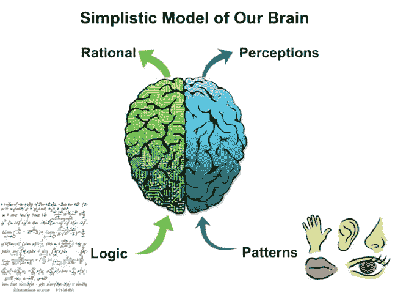
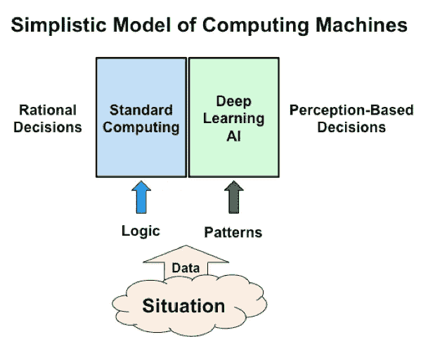

# AI 本质上是“人工感知”

> 原文：<https://towardsdatascience.com/ai-is-essentially-artificial-perception-f69f0493613d?source=collection_archive---------2----------------------->

人类的智慧来自于惊人的双重性，即基于对模式的感知得出结论，相反，基于非常结构化和理性的决策得出结论。这两种形式各不相同，但相辅相成。基于机器的智能也有两种形式:基于深度学习的人工智能解释数据中的模式以得出结论，从而模仿我们大脑基于感知的智能；标准的逐指令计算(就像在 PC 中一样)模拟了我们大脑的理性智能。

我一直想知道为什么我能很容易地回忆起一首歌的曲调，却记不住歌词。比起名字，我更记得一张脸。我能察觉到某种特定香水的气味，但无法给它贴上标签。我能辨别葡萄酒的味道，但不能准确地描述它。我可以凭直觉触摸织物，辨别它是丝绸、羊毛还是棉，但我说不出确切的原因。

似乎我能比理性或口头描述更好地储存和回忆声音、面孔、气味、味道和感觉的复杂模式。感知是我们通过感官看到、听到或意识到某种事物的能力。感知是从感觉过程中衍生出来的单一统一的意识。然而，当我做涉及物理、数学、规划、计算、账目或制定战略和战术的逻辑思维时，很少有来自过去的模式。我的大脑处理模式的方式和处理逻辑情况的方式不同吗？

# 我们大脑的简单模型

如果我根据我的观察来模拟大脑，它将由两部分组成:

1.正确——基于感知

2.左-基于理性

我们的感官——味觉、视觉、触觉、嗅觉和听觉——为我们大脑的右脑提供产生感知的模式。而我们所有的逻辑解释都影响左边部分，并产生对一个情况或问题的结构化和理性的理解。

Duality of Human Intelligence

当我们学习物理或数学时，我们大多使用大脑中最适合为我们提供主题逻辑结构的理性部分。然而，当我们处理由我们的感官创造的模式时，我们正在使用大脑的感知部分。我们的五种感官是创造感知模式的主要来源。由于大多数情况是逻辑和模式的混合，我们协同使用大脑的理性和感知部分来得出结论和做出决定。感知和理性这两个部分都是人类智慧不可或缺的来源。

在决策过程中，还有另一个关键因素——可能是最主要的因素:情绪和感觉。我相信，我们的情感是过去经历的情景锁定在大脑中的感知的残余。如果一个情景的声音和景象的模式在我心中产生了一种恐惧的感觉，那么与这种模式相关的恐惧就作为一种情绪被留下了。情绪有各种形式，如恐惧、喜欢、厌恶、亲和、愤怒、嫉妒和爱。即使在新的情况下，情绪也会被感官产生的模式所激发，并对整体感知做出贡献。例如，如果一个中国人的微笑和声音让我产生了愉快的感觉，它会留下一种被喜欢的积极情绪。当我看到另一个微笑的中国人时，过去留下的情绪会影响我的感知。我如何将情绪融入大脑的简化模型中？它们就像一种“内在”感觉，影响着其他感觉的模式。我们常常意识不到，也无法重建哪种感觉、模式或情感对整体感知贡献最大。众所周知，如果餐厅的装饰和音乐与食物的类型相匹配，影响对味道的感知，那么食物的味道会更好，而如果服务很差，同样的食物会很难吃。

大脑的两个部分在所有情况下都同时活跃。右脑部分可能会忙于根据模式产生感知，但同时，在相同的情况下，大脑的理性部分会忙于根据某种逻辑结构构建对情况的理性解释，并得出理性的结论。谁赢了？右脑还是左脑？看情况吧。当与微笑的中国人交谈时，感觉可能是积极的，但理性的大脑可能不同意他的论点，导致重大冲突。谁决定我是否继续和微笑的中国人打交道？右脑还是左脑？

让我用一个购物的小例子来说明我们大脑的两个部分之间的动力。有一天，我路过一家体育用品店，一件骑车运动衫吸引了我的目光。我进去查看了一下。布料的颜色、形状、设计和手感立刻吸引了我。它非常适合商店里的马内奎因。我的情绪，由我去年买的类似的东西引发，给了它一个非常积极的认知。我的右脑(感知部分)说:去吧。然而，我大脑理性的一面说，我已经有了类似的东西，如果我买了这件，我就再也不会穿以前的那件了。此外，它相当昂贵，而且不打折。我应该等着看它上市。但是右边坚持，就是这么爽；我必须得到它，担心它可能很快就卖完了。左边的人说，我有这么多球衣，我没有空间来保存它们，我的钱可以花在更好的东西上，比如更好的自行车鞋。最终，我的情感投下了否决票，让我买下了这件球衣。我相信每个人都经历过类似的情况，无论是关于一件球衣，鞋子，葡萄酒，房子，甚至是一个合作伙伴。

# 这一切如何应用于人工智能？

今天大多数人工智能系统都是基于深度学习的，通过将人工智能系统暴露在成千上万个说明性的例子中来进行学习。深度学习方法涉及将图片、视频或声音中错综复杂的细节和微妙的细微差别吸收到人工智能系统的神经网络参数中。参见:"[AI 机器如何学习——就像人类一样](https://medium.com/@sharad.gandhi/how-humans-and-machines-learn-c48de5360527#.1l2g9vee0)https://medium . com/@ sharad . Gandhi/How-humans-and-machines-learn-c48de 5360527 # . 1l 2g 9 vee 0 . "经过训练后，AI 系统能够根据输入系统的图像、人脸、物体、动作或声音中的模式来感知输入数据。人工智能系统的决策是基于对输入数据模式的感知，就像大脑的右侧一样——专门感知模式。

Duality of Computing

左边是关于理解和处理情况的逻辑。这更像是我们从个人电脑(PC)或智能手机中了解的标准计算。这是关于由规则清晰构建的编码情况，这些规则可以用“IF-THEN-ELSE”逻辑来表达。它可以与我们简单模型中的左脑相比较。我想提醒读者，这里使用的这些简单化的模型与现实大相径庭。他们的目的只是用一种非常容易理解的方式来说明大脑中两个过程的工作，并提供一个比喻来说明两种形式的计算是如何工作的。

# 有趣的观察和结论

1.人工智能处理对某一情况的输入数据中的模式的理解，并基于其对特定主题的深度学习来导出感知。这些看法被表达为对在这种情况下要采取的决策的“信心水平”。人工智能实际上是人工感知。人工智能机器模仿人脑的感知能力。

2.标准计算机(如 PC)中的软件是结构化逻辑，类似于大脑的理性部分。

3.有趣的是，人类的智力与理性思考者有关——例如牛顿、爱因斯坦等。然而，深度学习人工智能实际上是关于我们大脑的感知技能。

4.人类的感知智能有数百万年的进化史，因此比我们现代人的理性能力要深刻得多。

5.基于人类感知的决策很难用语言详细描述，因为它几乎是自动的和潜意识的。相比之下，根据定义，逻辑是可以精确描述的。

6.我们通过大脑的理性和感知部分之间的密切联系来解决大多数情况。我们大脑的两种技能之间的内部网络仍然是个谜。人类判断的独特性来自于同时利用两个部分的能力。

7.今天的(狭义)人工智能神经网络通常只专注于一个专业领域。将 100 或 1000 个不同领域的神经网络相互连接起来，可能会产生更广泛的通用智能——类似于我们大脑中各种专门区域的相互连接。

8.我们正处于将标准计算和人工智能在真实系统中互联的早期阶段，以从它们的互补角色中受益。这种互联将使未来的人工智能系统更加多样化。

9.我们的大脑有大量的维度——远远超过我们今天试图用人工智能机器模仿的维度。人类的潜力使我们能够解决非常复杂的多学科问题，赋予我们想象从未存在过的事物和情况的能力，创造力，产生非常强大的情感和动力去实现看似不可能的事情，并赋予我们难以置信的意识和自我意识。

10.今天的人工智能系统，即使范围狭窄和有限，仍然能够革命性地改变我们的生活和工作方式。它为简化和个性化产品的使用以及提供全新的服务提供了不可思议的机会。我们正处于巨大变化的开端。

总之，我们可以说，就像我们人类大脑的两个主要决策技能——通过模式感知和理性，通过逻辑——也反映在基于计算的决策中。今天的人工智能，基于深度学习技术，导致基于感知的决策，而标准计算，像个人电脑一样，是基于理性决策的结构化逻辑。更好、更平衡的决策来自于两种口味的结合。

更多关于人工智能的信息:[AI&U——将人工智能转化为商业](https://www.amazon.com/AI-Translating-Artificial-Intelligence-Business/dp/1521717206/ref=sr_1_1?)

[https://www.amazon.com/AI-Translating-Artificial-Intelligence-Business/dp/1521717206/](https://www.amazon.com/AI-Translating-Artificial-Intelligence-Business/dp/1521717206/)

*****

**联系人** : [沙拉德](mailto:gandhi.sharad@gmail.com)，[克里斯蒂安](mailto:c@ehl.do)，[www.ai-u.org](http://www.ai-u.org)

阅读我们的其他文章:

[人工智能——去神秘化](https://medium.com/towards-data-science/artificial-intelligence-demystified-a456328e193f)

[人工智能机器如何学习——就像人类一样](http://•	How AI machines learn — just like humans)

[马上从人工智能开始！](https://medium.com/@cehl/start-with-artificial-intelligence-right-now-1eef98ea87b0)

[人工智能促进更好的决策](https://medium.com/@sharad.gandhi/making-better-decisions-f6272f144f01)