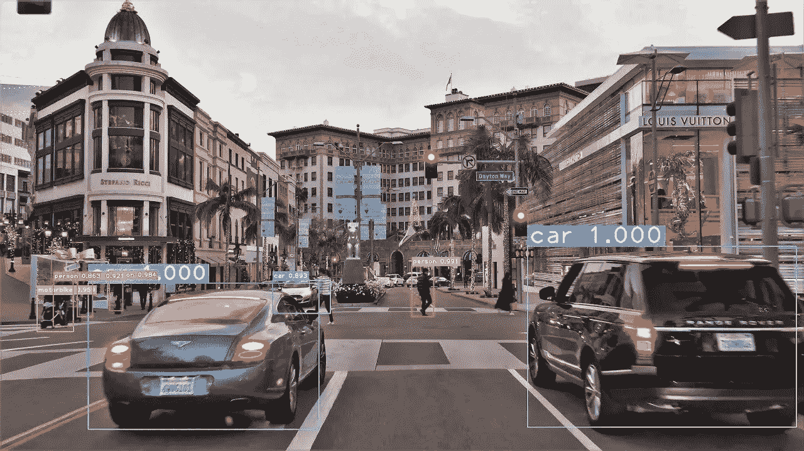
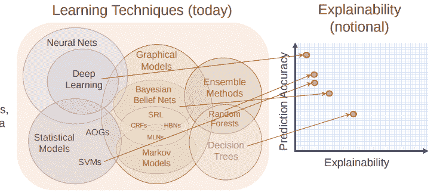

# 人工智能在学会如何解释自己之前毫无用处。

> 原文：<https://towardsdatascience.com/ai-is-unless-until-it-learns-how-to-explain-itself-7884cca3ba26?source=collection_archive---------7----------------------->

几年来，神经网络和深度学习一直处于人工智能行业的前沿。这些矩阵乘法和反向传播机器通常是新手和有经验的开发者选择的机器学习算法。问题是——这些算法(以及其他算法)如何描绘和解释它们预测的结论？

如何调试一个神经网络…

上图虽然是如何调整神经网络的一个有趣的抽象，但却总结了这种情况的严峻现实。以我个人使用 TensorFlow 和 MatLab 的经验来看，开发这些算法最欢乐的时期就是它们真正编译生成纯垃圾的时候。没有几个小时的令人流泪的调试，就不可能看到不良性能的原因——但在一天结束时，你应该为它的工作感到高兴，所以如果我是你，我会收拾行李，回家，在高潮中结束一天。

正如 Slav Ivanov 所描述的，在他题为[‘你的神经网络不工作的 37 个原因’](https://blog.slavv.com/37-reasons-why-your-neural-network-is-not-working-4020854bd607)的中型文章中，他的列表只是你可以查看以解决问题的事情的子集。如果我是诚实的，大多数这些事情需要以前的知识和经验，关于为什么这些事情会发生，以便有效地解决它。作为一个非常高级的例子，训练一个学习率(α)为 0.01 的小型编码器/解码器神经网络可能是一个很好的开始——但打赌这是否会在不吐出大量空白字符甚至纯垃圾的情况下工作，将与在彩票中赢得头奖的几率大致相同。

那么你从哪里开始呢？什么时候应该衰减这个值？你应该以什么速度衰变？它真的在工作，但你只是没有给它足够的时间来运行吗？你对这些问题给出什么答案并不重要，它们可能很好，但很可能不会是最好的。这是一个在反复试验中茁壮成长的领域。

开发人员和数据科学家已经炮制了一个大型的调试技术工具包，让他们对正在发生的事情有一个大致的了解，这意味着有可能揭开黑盒的盖子。然而，这些技术不允许算法告诉我们为什么它会做出某些决定。

学习技巧的可解释性

现代人工智能算法的密度令人难以置信。你可以有数百层，一个新的基准世界纪录，甚至可以将其应用于医疗领域——像 IBM Watson 这样的产品已经在这些任务上做得很好了。但是它需要能够解释它的决策，特别是对于任务/安全关键的应用，如国防和航空航天。神经网络擅长给我们准确的结果，但它们在连贯的答案和解释方面失败了。

想象一下，你有一个这样的神经网络，可以用来识别不同品种的狗。让我们给它看一只拉布拉多。一个训练有素的神经网络会发出*“嘿，那是一只拉布拉多！”*这很好，但如果你问它为什么认为它是拉布拉多犬，它会说*“它看起来像我以前见过的东西，所以我认为它是拉布拉多犬！”。*网络的解读没有任何智能或科学的尝试。在理想的情况下，它会说*“嗯，它是金色的，看起来像一只中等大小的狗，而且看起来很友好。很像以前见过的很多拉布拉多犬“*”。这是一个基本的例子，但这种程度的解释将允许开发人员甚至用户完全理解算法的训练数据和计算架构的缺陷。

想象一下，如果我们给同一个网络看一张田里一些草的照片，神经网络会说*“是的，那是另一只拉布拉多犬】*，这很难理解为什么。草是绿色的。如果网络声称桑德看起来像一只拉布拉多犬，我能明白为什么，因为它们至少是同样的颜色。添加推理和解释的元素将向开发人员显示网络正在看到什么，然后可以对架构甚至输入数据和训练参数进行清楚的调整，以便在将来减轻这个问题。给这个场景添加一个解释元素可能意味着开发人员回到训练数据，并看到为训练提供的所有拉布拉多图片都在一个大的绿色区域中，因此猜测拉布拉多-所以下一步将通过噪声添加一些数据变化，或者甚至在不同位置(如人行道上或水中)找到更多拉布拉多图片。

谈论拉布拉多似乎很琐碎，但它突出了一个相当重要的问题。虽然对于大多数应用来说，能够指向某样东西并对其进行分类是很好的，但对于安全关键系统来说，这还不够。安全关键系统不能失败，而且必须可以解释——这是神经网络所不能解释的。像无人驾驶汽车这样的产品正日益成为现实，我们需要一种车辆来解释为什么它会做出决策，尤其是在发生事故的情况下。能够解释和诠释使得法律能够解决争端并找到那些对这些系统问题负责的人——管理自治系统的法律几乎没有得到发展，这都是由于未来产品的不可预测和不可解释的性质。

我们不能让这些类型的产品负责我们的道路、军队以及我们和我们家人的工作生活，直到它们能够学会提供解释，以便我们能够找到那些对所做决定负责的人。

我是一名健身运动员&软件工程师，对健美和机器学习充满热情。我经营着自己的博客和网站，在那里我讨论这些话题，甚至更多。我提供了我的 Github 资源库的链接，这样你就可以看到我正在进行的项目和社交媒体账户(脸书、Instagram、Twitter 等)。)所以你可以跟着我健身改造。

[http://lukealexanderjames.com/](http://lukealexanderjames.com/)

如果你喜欢你所读的，请考虑按住鼓掌按钮一会儿！