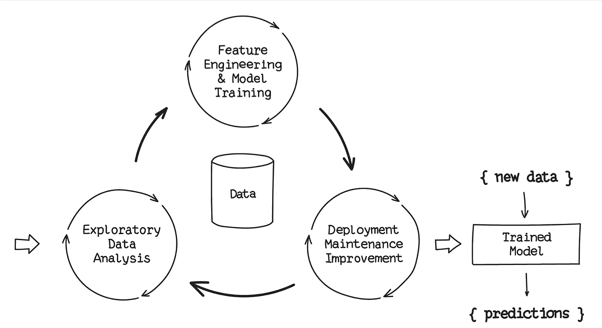
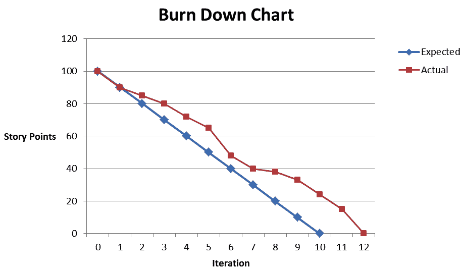
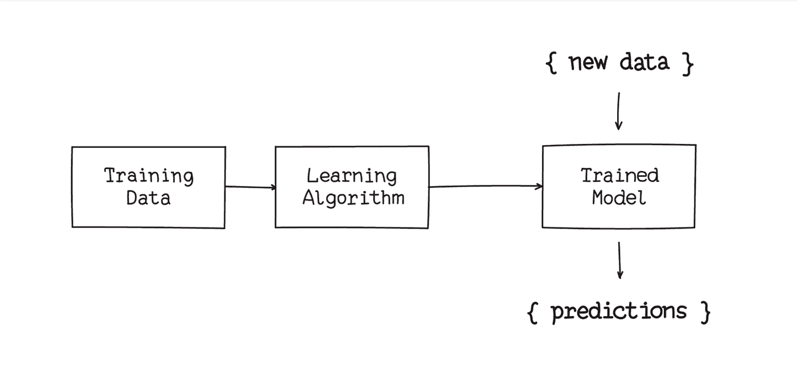
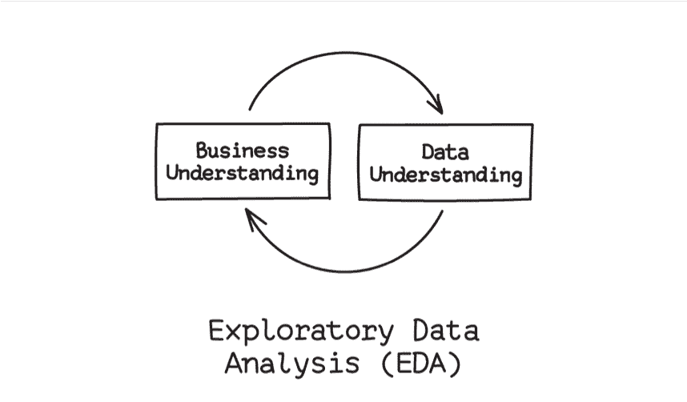
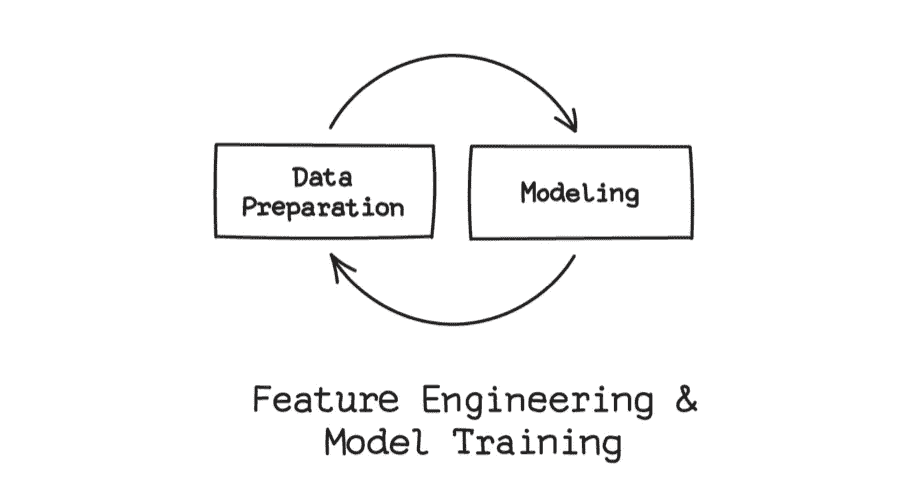
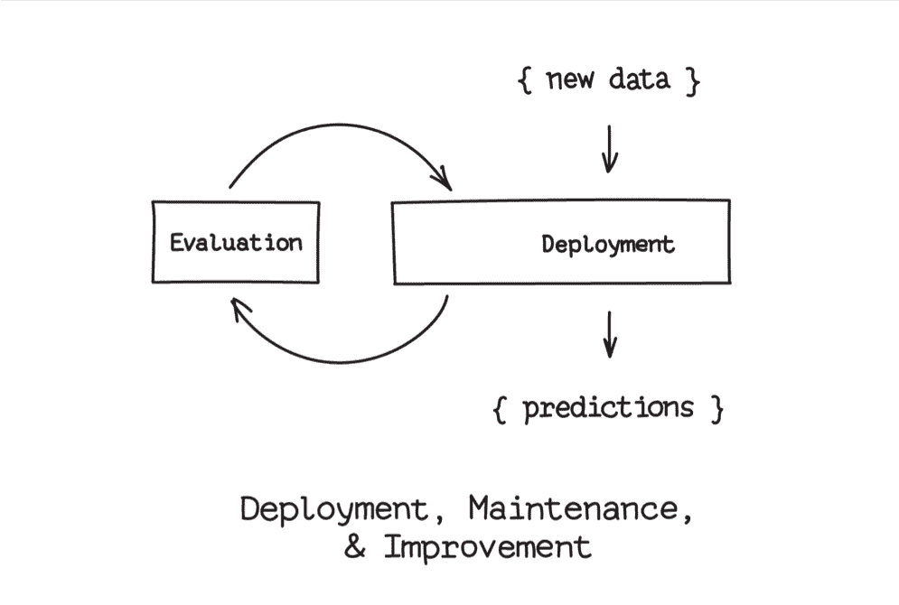
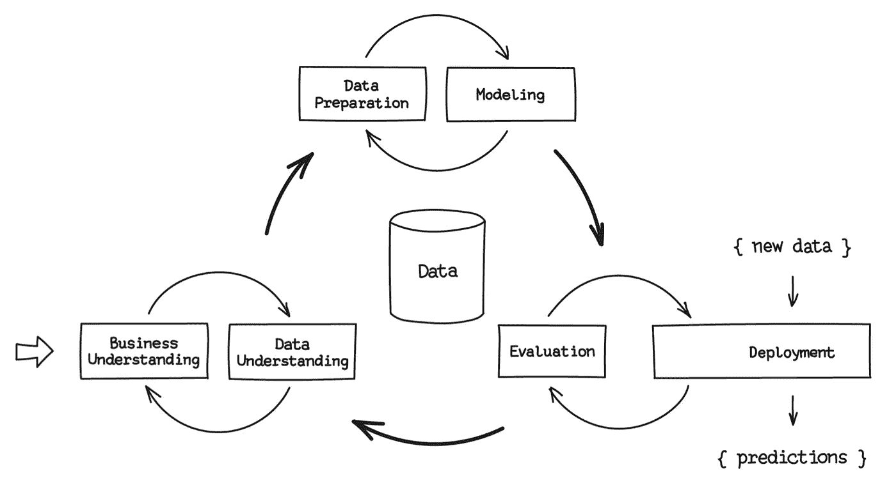

# 实验的循环

> 原文：<https://towardsdatascience.com/ai-ml-practicalities-the-cycle-of-experimentation-fd46fc1f3835?source=collection_archive---------16----------------------->

## [AI/ML 实用性](https://towardsdatascience.com/tagged/ai-ml-practicalities)

## 作为一名软件开发背景的人，机器学习真正让我吃惊的一件事是它是多么的*经验性*。

*本文是* [*AI/ML 实用性*](/ai-ml-practicalities-bca0a47013c9) *系列的一部分。*

虽然机器学习项目可能乍一看很像软件开发项目，但它们的路径和结构更像科学调查。成功的项目由一系列实验组成，这些实验可能会有结果，也可能没有结果，或者激发出完全不同的研究过程，但最终都会带来有用的见解。此外，每个实验中都有一系列微型实验。

如果你计划和 ML 一起工作或者雇佣其他人来为你建立 ML 模型，了解从业者如何工作是值得的。

# 软件开发项目

相比之下，一个软件开发项目从这样一个问题开始，“我们如何构建 X？”建成后就结束了。在这个过程中，团队通常不得不改进 X 的定义，因为它是模糊和不完整的。但是，在成功的项目中，需求、设计和开发最终会汇聚到一些明显类似于需求的东西上。

快乐软件项目的进展是渐进的，并遵循一条非预定的路径，但它是有意识地向前推进的。这就是敏捷燃尽图受欢迎的原因。他们沿着基线路径跟踪预期不确定性的影响。

# 机器学习项目

ML 模型开发(以及一般的数据科学)更有可能从这个问题开始，“我们能构建什么？”并在达到三种结果之一时停止:

1.  已经发现了足够好的结果来发布或使用
2.  制约因素(财政、时间、计算能力)限制了进一步的发展
3.  努力被改变方向或完全放弃

而且，如果数据不支持，即使是具体的目标也必须让步。

# 机器学习模型是如何开发的

数据分析的目标是创建一个(或多个)模型，告诉我们一些关于数据的深刻见解。最典型的情况是，这意味着接受新的输入，放弃预测。

机器学习通过告诉计算机分析一些数据并自我训练来实现这一点。更具体地说，我们将训练数据输入到学习算法中，该算法产生一个模型，该模型经过训练可以告诉我们与训练集相似的数据的有趣事情。

构建 ML 模型的数据科学工作可以大致分为三个阶段:

1.  探索性数据分析—分析数据以确定如何使用数据
2.  选择和配置学习算法，准备和操作数据(也称为“特征工程”)，以及运行训练算法
3.  评估，也许，部署结果

这个过程多次到达提议的部署阶段。在早期，评估发现了进一步探索和改进的机会。但是，即使在一个模型成功推出后，也将不断评估新数据的性能，并确定探索和改进的途径。

这个“过程”实际上是一个循环。迄今为止，它产生的训练模型实际上是一系列反映最佳假设的训练模型。

让我们来看看阶段。

# 探索性数据分析

没有比数据分析更能说明细节决定成败的了。

在从数据集中提取任何见解之前，必须理解数据并将其与对其所代表的领域的理解联系起来。

从技术角度理解数据包括生成汇总统计数据、使用各种可视化策略来查看值之间的关系、制定关于数据的假设以及手动测试它们。

这种技术上的理解使分析师能够思考数据可能揭示的领域。专注于领域的探索寻找与理解业务活动相关的关系和信息。例如，如果建立一个消费者信用模型，分析师可能会钻取代表借款人偿还贷款能力的输入，并查看它们如何与支付历史以及彼此之间相关联。

数据集总是有需要解决的问题，有时需要创造性地解决。值可能会丢失、重复或看起来不正确。要批判性地思考数据，我们至少需要形成一个可以分析的形状。通常，没有单一的正确方法来解决这些问题。例如，如果消费者信用数据库缺少大量申请人的年收入或 FICO 评分，我们该怎么办？从分析中排除 FICO 和收入？假设平均值？

EDA 是一个开放式的过程。每一次进步都带来新的曙光和新的问题。修复数据问题会导致对该数据的重新分析。与业务理解的某些元素不一致的可视化提出了要问的问题，并运行实验来回答这些问题，等等。

这个过程不是自然结束，而是继续下去，直到向前发展并训练一个模型似乎比继续分析更有成效。未决问题被推迟。

# 特征工程和模型训练

一旦选择了训练一个模型，并且目标明确，仍然有许多工作要做。

有许多类型的模型和训练算法可供选择。而且，大多数都是高度可配置的。例如，神经网络可以被配置成复杂程度不同的数量级。从业者知道哪些模型可能在特定问题上表现良好。但是，任何选择都是最佳猜测；一个有待验证的假设。并且，模型配置通常在一系列训练尝试中被修改多次。有时模型会被完全不同的模型所取代，甚至是扩充。

无论选择哪种模型和配置，都必须相应地准备数据，并将其处理成能使培训有效的形式。

首先，每一个输入都必须转换成某种数量。日期通常变成天数(或小时数，或分钟数，等等。)从某个时间点开始。分类值，如婚姻状况或出生城市，通常被简化为一大组标志，如已婚、单身、离婚、出生在辛辛那提、出生在巴黎等。

其次，数据必须以一种便于算法提取重要信息的方式提供。例如，如果城市的纬度和繁荣程度是进行预测的关键因素，用唯一的数字表示城市可能不够好。在准备训练时，*城市*甚至可以从数据集中移除，并替换为例如*城市纬度*和*城市人均收入*。

操纵数据为训练做准备被称为*特性工程*，这将是本系列另一篇文章的主题。简而言之，这是一种转换数据的黑暗艺术，以便其重要方面可以被训练算法消化和突出。特征工程通常被认为是机器学习周期中最关键和最耗时的部分。

对于准备训练所涉及的所有工作，模型的实际训练相对简单，因为这是计算机接管并完成其工作的时候。有几个方面使这一过程变得复杂:

1.  与目标模型一样，训练算法也有配置选项，称为“超参数”。对于某些算法和模型，调整超参数可能需要大量的工作。
2.  许多模型都是计算密集型的，并且许多数据集都很大。并行和优化培训是额外的工作，不容易。

既然我们已经将所有的部分放在一起，你可能会想为什么特征工程与模型训练而不是探索性的数据分析放在一起，它实际上是从那里开始的。EDA 依赖于许多相同的数据转换和操作。认为特征工程与模型训练密切相关有两个重要原因。

1.  一些特征工程是特定于模型的。每个模型都需要或受益于其他模型不需要的转换。
2.  模型训练和特征工程形成一个迭代循环。每次模型训练的尝试都会(希望)产生改进性能的想法。有时，改进来自于模型或训练算法配置的改变。但通常，结果会建议进一步的特征工程，即添加、移除或转换输入。

# 评估和部署

将任何软件部署到生产环境都是一个关键的过程。但是，对于训练一个模型所涉及的所有工作和特殊挑战，部署一个 ML 模型实际上很像一个典型的软件开发项目。

最终，模型是数据泵，就像大部分手工编码的过程。尽管有些可能很大而且难以操作，但大多数 ML 模型在生产中不会带来特殊的资源挑战。这是因为经过训练的模型通常比训练它们的算法运行速度快几个数量级。(这应该不会太意外。40 和 7 相乘需要多长时间？你花了多长时间学会乘法？)

虽然模型部署可能存在逻辑上的挑战，但这些挑战往往类似于典型软件部署的挑战。机器学习模型更独特的是它们需要的维护水平和类型。

大多数模型是根据历史数据训练的，但是生活在一个不断产生新数据的世界中。可能与原始数据集不同的数据，表明模型可以改进或者建模的关系已经改变。例如，用于预测借款人还款表现的模型非常好，但开始下滑。

从根本上来说，这意味着模型必须不断地被评估，并且很可能被更新。因此，与其说部署是流程的终点，不如说它实际上是不断评估和改进的第三个周期的一部分。(关于这个话题有很多要说的，我会留到另一篇文章中去说。)

# 把所有的放在一起

我们从 ML 过程的一个天真的观点开始这篇文章:获得一些数据，运行一个训练算法，产生一个模型。任何过程的简单描述背后总是隐藏着细节，但在某种意义上，最初的描述是正确的。数据被输入产生模型的算法，然后该算法独立进行预测。

但是从某种意义上来说，这个流程图是有误导性的:机器学习开发是一个循环，而不是一个过程。其实就是周而复始的循环。这不仅仅是因为从业者发现小增量工作是有效的。这是因为 ML 开发本质上是一种经验性的活动，每个实验步骤的反馈对下一步都是至关重要的。