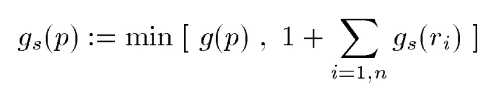
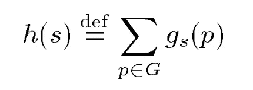

# 人工智能规划历史发展

> 原文：<https://towardsdatascience.com/ai-planning-historical-developments-edcd9f24c991?source=collection_archive---------4----------------------->


Photo by [Possessed Photography](https://unsplash.com/@possessedphotography?utm_source=medium&utm_medium=referral) on [Unsplash](https://unsplash.com?utm_source=medium&utm_medium=referral)

在这篇文章中，我将考察**人工智能规划研究**领域的三大进展。对于每个开发，我将提供原始论文的简短摘要以及适当的例子来演示几个用例。我将首先描述一个通用的框架，STRIPS，在这个框架下所有的规划问题都可以被公式化。然后，我将研究在 STRIPS 公式下工作的两种最先进的算法。GraphPlan 算法不是从一开始就贪婪地搜索解决方案，而是构造一个可用于获得解决方案的规划图对象。规划图对象还可以用于对 STRIPS 框架中指定的任何规划问题进行自动化启发式搜索。最后，我将研究一种算法，它使用启发式搜索规划器来自动产生有效的启发式搜索。最终算法获得了 1998 年 AIPS98 规划竞赛的冠军。

## 发展 1:条(1971 年)

1971 年，斯坦福研究所的 Richard Fikes 和 Nils Nilsson 开发了一种在问题解决中应用定理证明的新方法[1]。该模型试图在世界模型空间中找到一系列操作符，以将初始世界模型转换成目标状态存在于其中的模型。它试图将世界建模为一组一阶谓词公式，旨在处理由大量公式组成的模型。

在 STRIPS 公式中，我们假设存在一组将世界模型转换成其他世界模型的适用算子。问题求解器的任务是找到一系列操作符，将给定的初始问题转化为满足目标条件的问题。运算符是构建解决方案的基本元素。每个操作符对应一个动作例程，例程的执行会导致代理采取某些动作。在 STRIPS 中，定理证明和搜索的过程通过世界模型的空间分离。

从形式上讲，条带的问题空间是由初始世界模型、一组可用操作符及其对世界模型的影响以及目标陈述来定义的。可用的操作符被分组到称为模式的系列中。每个操作符由两个主要部分组成的描述定义:操作符具有的效果和操作符适用的条件。据说当 STRIPS 生成一个满足目标声明的世界模型时，问题就解决了。

现在让我们考虑一个使用计划搜索代理将 STRIPS 语言应用于航空货物运输系统的例子。假设我们有一个初始状态，货物 1 在 SFO，货物 2 在 JFK，飞机 1 在 SFO，飞机 2 在 JFK。现在，假设我们想要制定一个最优计划，将货物 1 运输到 JFK，将货物 2 运输到 SFO。总结这个问题描述，我们有:

`Init(At(C1, SFO) ∧ At(C2, JFK)
∧ At(P1, SFO) ∧ At(P2, JFK)
∧ Cargo(C1) ∧ Cargo(C2)
∧ Plane(P1) ∧ Plane(P2)
∧ Airport(JFK) ∧ Airport(SFO))
Goal(At(C1, JFK) ∧ At(C2, SFO))`

我们可以编写一个函数，将这个公式正式定义如下:

```
def air_cargo_p1() -> AirCargoProblem:
    cargos = ['C1', 'C2']
    planes = ['P1', 'P2']
    airports = ['JFK', 'SFO']
    pos = [expr('At(C1, SFO)'),
           expr('At(C2, JFK)'),
           expr('At(P1, SFO)'),
           expr('At(P2, JFK)'),
           ]
    neg = [expr('At(C2, SFO)'),
           expr('In(C2, P1)'),
           expr('In(C2, P2)'),
           expr('At(C1, JFK)'),
           expr('In(C1, P1)'),
           expr('In(C1, P2)'),
           expr('At(P1, JFK)'),
           expr('At(P2, SFO)'),
           ]
    init = FluentState(pos, neg)
    goal = [expr('At(C1, JFK)'),
            expr('At(C2, SFO)'),
            ]
    return AirCargoProblem(cargos, planes, airports, init, goal)
```

AirCargoProblem 类将按如下方式初始化:

```
class AirCargoProblem(Problem):
    def __init__(self, cargos, planes, airports, initial: FluentState, goal: list):
        """:param cargos: list of str
            cargos in the problem
        :param planes: list of str
            planes in the problem
        :param airports: list of str
            airports in the problem
        :param initial: FluentState object
            positive and negative literal fluents (as expr) describing initial state
        :param goal: list of expr
            literal fluents required for goal test
        """
        self.state_map = initial.pos + initial.neg
        self.initial_state_TF = encode_state(initial, self.state_map)
        Problem.__init__(self, self.initial_state_TF, goal=goal)
        self.cargos = cargos
        self.planes = planes
        self.airports = airports
        self.actions_list = self.get_actions()
```

我们使用 get_actions 方法来实例化所有可以作用于状态的 action/operator 对象的列表。在这个空运货物问题上，我们可以采取三种行动:装货、卸货和飞行。get_actions 类方法收集了所有这些可能的操作。

为了定义可以作用于某个状态的操作符，我们可以定义 actions 类方法如下:

```
def actions(self, state: str) -> list:
 """ Return the actions that can be executed in the given state.:param state: str
 state represented as T/F string of mapped fluents (state variables)
            e.g. 'FTTTFF'
        :return: list of Action objects
        """
        # TODO implement
        possible_actions = []
        kb = PropKB()
        kb.tell(decode_state(state, self.state_map).pos_sentence())
        for action in self.actions_list:
              is_possible = True
              for clause in action.precond_pos:
                if clause not in kb.clauses:
                    is_possible = False
              for clause in action.precond_neg:
                if clause in kb.clauses:
                    is_possible = False            
              if is_possible:
                possible_actions.append(action)

        return possible_actions
```

动作方法通过检查动作的前提条件是否在由输入状态指定的子句集中，有效地输出可能动作的列表。我们还需要定义一个方法来将一个动作应用到一个给定的状态。在状态 *s* 中执行动作 *a* 的结果被定义为状态*s’*，其由从 *s* 开始形成的一组流来表示，移除在动作效果中表现为负文字的流，并添加在动作效果中为正文字的流。

```
def result(self, state: str, action: Action):
        """ Return the state that results from executing the given
        action in the given state. The action must be one of
        self.actions(state).:param state: state entering node
        :param action: Action applied
        :return: resulting state after action
        """
        # TODO implement
        new_state = FluentState([], [])
        old_state = decode_state(state, self.state_map)

        for fluent in old_state.pos:
            if fluent not in action.effect_rem:
                new_state.pos.append(fluent) # add positive fluents which are in the old state and should not be removed

        for fluent in action.effect_add:
            if fluent not in new_state.pos:
                new_state.pos.append(fluent) # add positive fluents which should be added and have not already been added

        for fluent in old_state.neg:
            if fluent not in action.effect_add:
                new_state.neg.append(fluent) # add negative fluents which are in the old state and should not be added

        for fluent in action.effect_rem:
            if fluent not in new_state.neg:
                new_state.neg.append(fluent) # add negative fluents which should be removed but have not already been removed from the negative state

        return encode_state(new_state, self.state_map)
```

最后，我们需要定义目标测试方法，该方法提供一个布尔值来指示目标状态是否得到满足。

```
def goal_test(self, state: str) -> bool:
        """ Test the state to see if goal is reached:param state: str representing state
        :return: bool
        """
        kb = PropKB()
        kb.tell(decode_state(state, self.state_map).pos_sentence())
        for clause in self.goal:
            if clause not in kb.clauses:
                return False
        return True
```

这个类提供了一个 STRIPS 公式的例子。特别是，我们已经指定了初始状态、目标状态和一组指定前提条件和后置条件的动作。此计划例程的计划是一系列操作符，可以从初始状态开始执行并导向目标状态。我们可以使用级数搜索算法来形成这个示例问题的最佳计划。在这个问题上使用广度优先搜索，最佳计划将是装载(C2，P2，JFK)，装载(C1，P1，旧金山)，飞行(P2，JFK，旧金山)，卸载(C2，P2，旧金山)，飞行(P1，旧金山，肯尼迪)，卸载(C1，P1，肯尼迪)。

## 发展 2:规划图表(1997 年)

1997 年，卡内基梅隆大学的 Avrium Blum 和 Merrick Furst 开发了一种在条状域中进行刨削的新方法[2]。它包括构建和分析一个全新的对象，称为规划图。他们开发了一个叫做 GraphPlan 的例程，该例程使用规划图构造来获得规划问题的解决方案。

这个想法是，我们首先创建一个规划图对象，而不是贪婪地搜索。规划图是有用的，因为它固有地显式编码有用的约束，从而减少未来的搜索开销。规划图可以在多项式时间内构造，并且具有多项式大小。另一方面，状态空间搜索是指数级的，需要做更多的工作。规划图不仅基于领域信息，还基于问题的目标和初始条件以及时间的明确概念。

规划图具有与动态规划问题解决程序相似的特性。GraphPlan 算法使用规划图来指导其对计划的搜索。该算法保证找到最短的计划(类似于 BFS)。

规划图中的边表示动作和命题之间的关系。如果条带公式中存在有效的计划，则该计划必须作为计划图的子图存在。规划图的另一个基本特征是指定互斥关系。如果没有有效的计划可以同时包含两个动作，则两个动作是互斥的；如果没有有效的计划可以使两个动作同时为真，则两个状态是互斥的。排除关系在整个图中直观地传播关于问题的有用事实。

GraphPlan 算法对规划图的操作如下:从仅编码初始条件的规划图开始。在阶段 *i，* GraphPlan 从状态 *i-1* 获取规划图，并将其扩展一个时间步长，然后在扩展的规划图中搜索长度为 *i* 的有效规划。如果它找到一个解决方案，那么它停止，否则它继续下一个阶段。该算法找到的任何计划都是合法的计划，并且如果存在计划，它总是会找到计划。该算法还具有大多数规划者不提供的终止保证。

现在让我们构建一个基本的规划图对象，并用它来解决上面的空运货物问题。为了缩短本文的篇幅，我省略了底层的实现细节。和往常一样，代码存放在我的 GitHub 上。我们将结构初始化如下:

```
class PlanningGraph():
    """
    A planning graph as described in chapter 10 of the AIMA text. The planning
    graph can be used to reason about 
    """def __init__(self, problem: Problem, state: str, serial_planning=True):
        """
        :param problem: PlanningProblem (or subclass such as AirCargoProblem or HaveCakeProblem)
        :param state: str (will be in form TFTTFF... representing fluent states)
        :param serial_planning: bool (whether or not to assume that only one action can occur at a time)
        Instance variable calculated:
            fs: FluentState
                the state represented as positive and negative fluent literal lists
            all_actions: list of the PlanningProblem valid ground actions combined with calculated no-op actions
            s_levels: list of sets of PgNode_s, where each set in the list represents an S-level in the planning graph
            a_levels: list of sets of PgNode_a, where each set in the list represents an A-level in the planning graph
        """
        self.problem = problem
        self.fs = decode_state(state, problem.state_map)
        self.serial = serial_planning
        self.all_actions = self.problem.actions_list + self.noop_actions(self.problem.state_map)
        self.s_levels = []
        self.a_levels = []
        self.create_graph()
```

create_graph 方法如下:

```
def create_graph(self):
        """ build a Planning Graph as described in Russell-Norvig 3rd Ed 10.3 or 2nd Ed 11.4The S0 initial level has been implemented for you.  It has no parents and includes all of
        the literal fluents that are part of the initial state passed to the constructor.  At the start
        of a problem planning search, this will be the same as the initial state of the problem.  However,
        the planning graph can be built from any state in the Planning ProblemThis function should only be called by the class constructor.:return:
            builds the graph by filling s_levels[] and a_levels[] lists with node sets for each level
        """
        # the graph should only be built during class construction
        if (len(self.s_levels) != 0) or (len(self.a_levels) != 0):
            raise Exception(
                'Planning Graph already created; construct a new planning graph for each new state in the planning sequence')# initialize S0 to literals in initial state provided.
        leveled = False
        level = 0
        self.s_levels.append(set())  # S0 set of s_nodes - empty to start
        # for each fluent in the initial state, add the correct literal PgNode_s
        for literal in self.fs.pos:
            self.s_levels[level].add(PgNode_s(literal, True))
        for literal in self.fs.neg:
            self.s_levels[level].add(PgNode_s(literal, False))
        # no mutexes at the first level# continue to build the graph alternating A, S levels until last two S levels contain the same literals,
        # i.e. until it is "leveled"
        while not leveled:
            self.add_action_level(level)
            self.update_a_mutex(self.a_levels[level])level += 1
            self.add_literal_level(level)
            self.update_s_mutex(self.s_levels[level])if self.s_levels[level] == self.s_levels[level - 1]:
                leveled = True
```

互斥方法留给读者作为练习。规划图的另一个应用是启发式评估。我们可以从状态 *s* 估计实现任何子目标的成本，作为目标第一次出现在规划图中的级别。如果我们假设所有的子目标都是独立的，我们可以简单地将总目标成本估计为规划图中给出的子目标成本的总和。该启发式算法将在计划图类中实现，如下所示:

```
def h_levelsum(self) -> int:
        """The sum of the level costs of the individual goals (admissible if goals independent):return: int
        """
        level_sum = 0
        goals = [PgNode_s(g, True) for g in self.problem.goal]
        # for each goal in the problem, determine the level cost, then add them together
        for g in goals:
            if g not in self.s_levels[-1]:
                # the problem is unsolvable
                print('Unsolvable')
                level_sum = float('inf')
                break
            else:
                for level, s in enumerate(self.s_levels):
                    if g in s:
                        level_sum += level
                        break
        return level_sum
```

我们可以在 AirCargoProblem 类中调用此方法，如下所示:

```
def h_pg_levelsum(self, node: Node):
        """This heuristic uses a planning graph representation of the problem
        state space to estimate the sum of all actions that must be carried
        out from the current state in order to satisfy each individual goal
        condition.
        """
        # requires implemented PlanningGraph class
        pg = PlanningGraph(self, node.state)
        pg_levelsum = pg.h_levelsum()
        return pg_levelsum
```

使用这种启发式算法，我们可以使用 A*算法非常有效地解决复杂的规划问题。我用几种试探法考虑了更复杂的规划问题，发现 level_sum 试探法明显优于(在时间和空间复杂性方面)所有标准搜索算法，包括带有宽松问题试探法的 A*。

## 发展 3:启发式搜索规划(HSP) (1998)

HSP 基于启发式搜索的思想。启发式搜索提供了到目标的距离的估计。在领域独立规划中，启发法需要从行动和目标的表示中导出。推导启发式函数的一个常见方法是求解问题的一个宽松版本。主要的问题是，通常放松问题启发式计算是 NP 难的。

相反，HSP 算法估计松弛问题的最优值。该算法通过从条带编码中自动提取启发式信息，将问题转化为启发式搜索。

该算法迭代地工作，通过动作产生状态，这些动作的前提条件在前一个状态集合中[3]。每次应用一个动作时，一个度量 *g* 被更新，其目的是估计实现一个子目标所涉及的步骤的数量。例如，假设 *p* 是一个子目标。我们将 *g* 初始化为零，然后当应用具有前提条件的动作 *C = r_1，r_2，…，r_n* 时，我们更新 *g* 如下:



可以看出，上面解释的过程等效于计算函数:


其中 *C — > P* 代表断言 *p* 且有前提条件 *C = r_1，r_2，…，r_n* 的动作。那么如果我们让 *G* 成为目标状态的集合，最终的启发式函数将如下:



请注意，我们假设所有子目标都是独立的，这可能是启发式算法不可接受的情况:这通常在实践中效果很好。这种 HSP 方法是有用的，因为它允许我们将启发式计算推广到任何一般的 STRIPS 问题公式。

## 结论

本文讨论的发展构成了人工智能规划领域的三大进步。STRIPS 公式为研究人员提供了一个通用框架，从这个框架可以构建更高级的语言。规划图结构是一种革命性的数据结构，它为最优规划技术提供了一个全新的视角。最后，HSP 算法给出了一种自动的方法来确定一般规划问题的启发式算法。

这就是所有人——如果你已经做到了这一步，请在下面评论并在 LinkedIn 上加我。

我的 Github 是这里的。

## 参考

[1] [纸条](http://ai.stanford.edu/~nilsson/OnlinePubs-Nils/PublishedPapers/strips.pdf)

[2] [GraphPlan 论文](https://www.cs.cmu.edu/~avrim/Papers/graphplan.pdf)

[3] [HSP 论文](https://bonetblai.github.io/reports/aips98-competition.pdf)