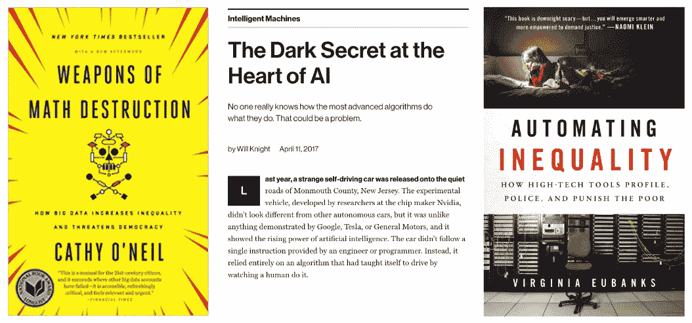
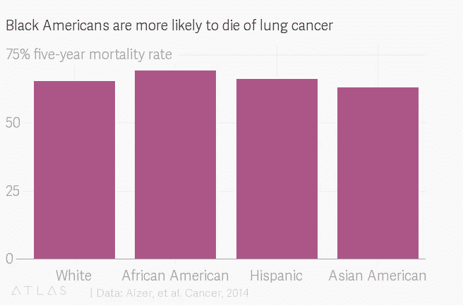
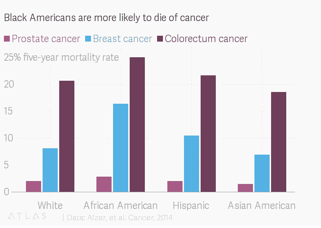
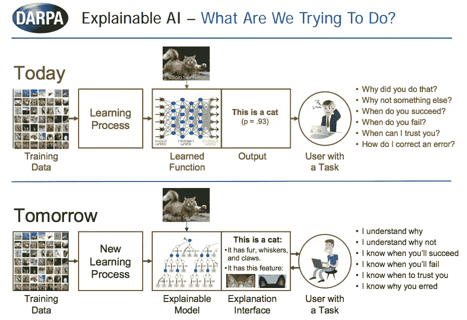
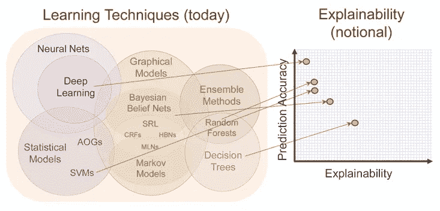
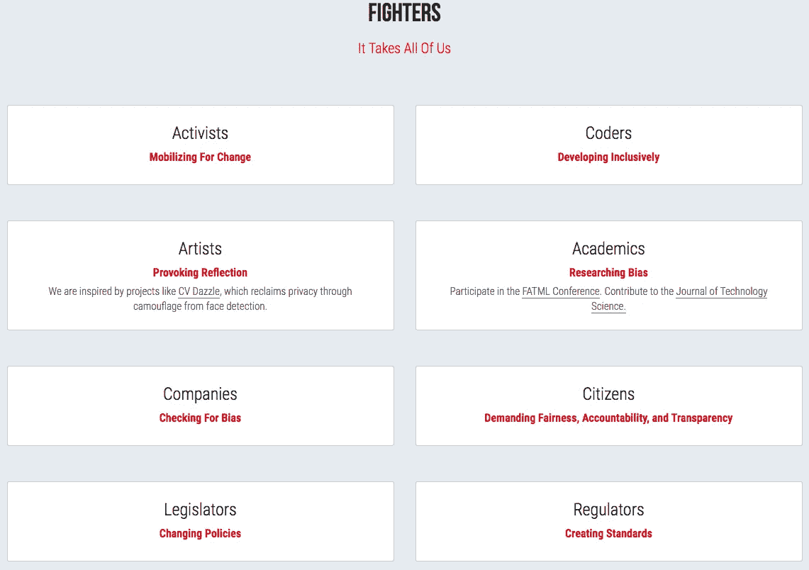
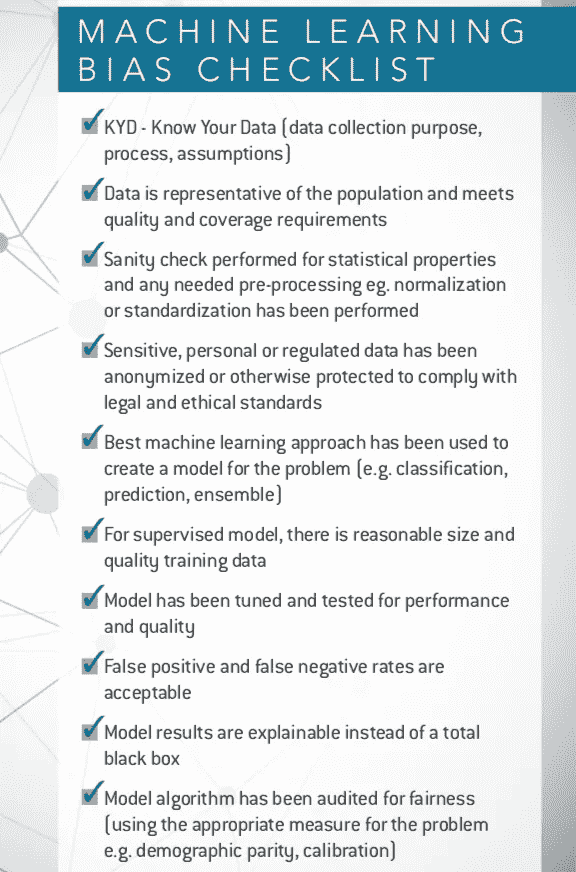

# 人工智能政策制定第 4 部分:公平和负责任的 ML 和人工智能入门

> 原文：<https://towardsdatascience.com/ai-policy-making-part-4-a-primer-on-fair-and-responsible-ml-and-ai-28f52b32190f?source=collection_archive---------15----------------------->

*偏见。歧视。不平等。不公平。不负责任。不道德。不公平。*所有这些术语是如何与机器学习(ML)和人工智能(AI)联系在一起的？在这篇文章中，我将讨论对决策者和政策制定者来说至关重要的三个主题——人工智能和人工智能的公平、责任和透明度(或可解释性)。

O 你今天的生活正被算法所统治，其中大部分对我们来说是一个神秘的黑匣子。人们意识到，只有在公平和透明的情况下，自动决策(自治系统)才会被接受。许多媒体文章、书籍以及智库和书籍的研究报告提高了人们对不公平和[不道德的人工智能和算法伦理](https://www.london.edu/faculty-and-research/lbsr/algorithmic-ethics-lessons-and-limitations-for-business-leaders)的认识。

第二个问题是:我们是否在以负责任的方式使用人工智能和人工智能，这种方式以人类为中心，并将造福于所有人类？它会让少数掌握技术的强大企业和政府受益吗？人工智能会让我们的世界变得更加不平衡、不平等、更加危险吗？

第三件事是使 ML 模型足够透明，以便当事情没有按照预期发展时，我们可以找出发生了什么，并通过改进算法和允许添加人类判断来尝试修复它。

Source: [2] — [4]

人工智能和人工智能中的空气质量是一个非常活跃的研究领域，有许多相互竞争的理论。这篇文章的目的是为决策者和政策制定者介绍 ML 和 AI 中的公平性，并提供关于测量、避免和减轻偏见的有用建议。

ML 中偏差的定义:无意中的偏差或歧视，或者通过不适当的设计，或者通过在建立偏差的数据中隐含编码偏差。公平机器学习旨在确保由算法指导的决策是公平的。

这不仅仅是一种避免麻烦的方式(谷歌如何处理其产品中的性别偏见)——它将为人类带来更好的模式和更好的结果。因为这是一本入门书，所以我不会深究技术细节，而是提供对该主题进行全面论述的参考文献。

[AI Now Institute](https://ainowinstitute.org/) 在这个话题上做了出色的工作，我强烈鼓励对这个话题感兴趣的读者去看看[他们的 2018 年报告](https://ainowinstitute.org/AI_Now_2018_Report.pdf)。也看看世界顶级科技公司(谷歌、IBM、微软)是如何通过教育、工具和技术来解决这个问题的[7] — [10]。

## 最大似然偏差的几个例子

*   [犯罪风险评分偏差](https://www.propublica.org/article/bias-in-criminal-risk-scores-is-mathematically-inevitable-researchers-say) — ProPublica
*   [当你的老板是一个算法师](https://www.nytimes.com/2018/10/12/opinion/sunday/uber-driver-life.html) — NYT
*   Joy Buolamwini 的性别阴影项目

[QZ.com Article](https://qz.com/1367177/if-ai-is-going-to-be-the-worlds-doctor-it-needs-better-textbooks/)

为了深入了解概况和历史背景，我向你推荐 AI Now 研究员凯特·克劳福德(Kate Crawford)的 2017 年 NIPS 主题演讲视频。

Kate Crawford — NIPS 2017 Keynote

# 偏见和歧视的根源

人工智能和人工智能中的偏差可能是由于糟糕的设计、有偏差的信息(数据)来源或无意中被编码到我们的数据、算法中的人为偏差，或者两者都有。

**数据偏差**

[数据](https://www.newscientist.com/article/mg23230971-200-the-irresistible-rise-of-artificial-intelligence/)是任何人工智能和人工智能工作的基础，也是许多偏见和公平问题的起点。

数据→包括过去的人为偏见→输入模型

> 人工智能(AI)在所有行业所有类型的业务职能中的引入将加速和扩大。尽管如此，人工智能仍将受到其从虚假信息中可靠辨别真实内容的能力的限制。— Gartner。

根据[11]的数据，有三个主要的偏差领域:

*   标签偏差—观察到的成为数据，例如逮捕而不是犯罪
*   亚组有效性——特征的预测能力因组而异
*   代表性-训练数据是否代表总体？我们有偏斜的样本吗？是否存在样本量差异？功能限制。例如，训练数据中地理多样性的缺乏将影响从更广泛的一组位置提取的图像的分类性能。

作者指出了社会上两个众所周知的歧视概念:

1.  经济因素:有两个:第一，统计因素(例如，因为男性开车，所以向他们收取更多的保险费)。第二，基于品味(牺牲利润以避免某些交易，通常是出于无知)
2.  法律:基于动机(例如基于分类的平等保护原则)

**算法设计中的偏差**

Sam Corbett-Davies 和 Sharad Goel [11]回顾了三种常见的 ML 公平性测量模型。

> (1)反分类，意味着受保护的属性——如种族、性别和它们的代理——没有明确地用于决策；
> 
> (2)分类奇偶性，意味着预测性能的普通度量(例如，假阳性和假阴性率)在由受保护属性定义的组之间是相等的；和
> 
> (3)校准，意味着以风险估计为条件，结果独立于受保护的属性。

提出的定义是作为衡量公平性的可能方式。然而，关于这些测量的缺点存在争议(例如，这些定义彼此不相容),一些研究人员认为这些定义实际上会加剧偏倚问题。斯坦福大学的 Sam Corbett-Davies 和 Sharad Goel 认为，所有这三个公平定义都存在显著的统计局限性。在许多情况下，基于阈值的风险估计是更好的选择。这种方法意味着“基于人们所能产生的最精确的风险统计估计，以相似的方式对待相似的风险人群。”

**外部性的影响——群体与个人选择**

外部性和均衡效应有时会被忽略，但在某些情况下它们很重要。

> 有些决定最好被认为是集体的而不是个人的选择。在大学招生中，多样化的学生群体可能有利于整个机构，在申请者之间建立相互依存关系。预测算法也会产生反馈循环，导致意想不到的后果。

# 负责任的 AI

负责任的人工智能是一个广义的术语，旨在描述符合道德规范、具有包容性(而不是社会特权群体独有的)、不伤害社会(没有武器化)并把社会福祉放在首位和中心的人工智能。大多数国家级人工智能政策和战略都强调这一点。

隐私是伦理和负责任的人工智能的一部分。ML powered 在过去几年中在面部识别方面取得了重大进展，引起了包括[算法正义联盟](https://www.ajlunited.org/)在内的许多人对隐私、数据所有权和公平性的担忧。

 [## 面部识别技术旨在识别善恶

### 面部识别正在成为主流。这项技术越来越多地被执法机构和学校使用…

www.wsj.com](https://www.wsj.com/video/series/moving-upstream/facial-recognition-tech-aims-to-identify-good-and-evil/0C19B7EA-D8FC-4AF1-8FC3-EEAA1FD9F2B4) 

加拿大和法国率先在 2018 年夏天发布了一份联合声明。他们成立了一个独立的专家组，该专家组将“汇集来自政府的专家、国际公认的科学家以及来自工业界和民间社会的代表。”

近来，负责任的人工智能的话题越来越受到关注，多个团体正在全球范围内领导这些努力。下面提到了两个高质量的工作，并链接到他们的综合工作。

1.  [蒙特利尔宣言](https://www.montrealdeclaration-responsibleai.com/the-declaration)正式提出了负责任人工智能的愿景。
2.  [欧盟道德与可信赖人工智能报告草案](https://ec.europa.eu/futurium/en/system/files/ged/ai_hleg_draft_ethics_guidelines_18_december.pdf)，2018 年 12 月。

# 可解释性、透明度和信任

一个可解释的人工智能是其行为能被人类容易理解的人工智能。它与机器学习中的“黑匣子”概念形成对比，黑匣子意味着复杂算法工作的“可解释性”，在这种情况下，即使是它们的设计者也无法解释为什么人工智能会做出特定的决定。

在人工智能有多“聪明”和它有多透明之间经常存在权衡，随着人工智能系统内部复杂性的增加，这些权衡预计会变得更大。

由于显而易见的原因，这是一个非常活跃的研究领域，Darpa 已经为此分配了大量资金[18]。

> 我们从决策树到随机森林。

应该能够审计算法和数据。记住上面关于使用哪种度量的讨论！

> 什么时候应该依赖算法？可以观察到错误，反馈可靠、快速且可行。—尼科斯·萨瓦，London.edu

这是看待它的一种方式

Source: DARPA Explainable AI

另一个是直觉。

DARPA, [Nautil.us](http://nautil.us/issue/40/learning/is-artificial-intelligence-permanently-inscrutable)

ML 的可解释性和可解释性是一个很大的话题，所以我建议你参考[17]-[20]了解细节。

反驳点:如果人们知道模型或算法工作的所有方式，他们会尝试游戏系统吗？

# 减轻 ML 和 AI 中的偏见和不信任

你可以采取哪些切实可行的措施来避免和减轻偏见？

*   提高认识
*   问一些尖锐的问题
*   集合不同专家
*   专家审核数据和算法
*   创建人工审查流程

**多元化和多个利益相关方**

拥有一个多元化的利益相关者群体应该是任何国家人工智能政策的重要组成部分。

[https://www.ajlunited.org/](https://www.ajlunited.org/)

你需要留出时间和资源，让一个全面的专家小组(不仅仅是技术专家)从多个角度审视整个链条。

**偏差清单**

以下是我对偏见的快速回顾列表——这并不是一个全面的资源，而是一个起点。

# 关键要点

公平，道德，负责任和可解释的 ML 和 AI 终于得到了应有的重视。正如技术造成的其他重大破坏一样，解决这些挑战需要时间。这篇文章描述了这个主题的一个非常简短的、非技术性的介绍。下面的参考资料提供了大量的细节和材料的附加链接。正如任何活跃的研究领域一样，这里还没有包括更多的资源——主要是因为我的时间有限。然而，如果我错过了一些应该在邮件中的东西，请让我知道。

**参考文献**:

[1]尼科斯·萨瓦。领导者的教训和局限。伦敦商学院，2017 年 11 月。[https://www . London . edu/faculty-and-research/lbsr/algorithmic-ethics-lessons-and-limits-for-business-leaders](https://www.london.edu/faculty-and-research/lbsr/algorithmic-ethics-lessons-and-limitations-for-business-leaders)

[2]凯西·奥尼尔。[数学毁灭武器](https://www.amazon.com/Weapons-Math-Destruction-Increases-Inequality/dp/0553418831):大数据如何增加不平等并威胁民主。百老汇图书，2017 年 9 月。

[3]威尔·奈特。人工智能核心的黑暗秘密——麻省理工科技评论，2018 年。[https://www . technology review . com/s/604087/the-dark-secret-at-the-heart-of-ai/](https://www.technologyreview.com/s/604087/the-dark-secret-at-the-heart-of-ai/)

[4]弗吉尼亚·尤班克斯。[自动化不等式](https://www.amazon.com/Automating-Inequality-High-Tech-Profile-Police/dp/1250074312)。圣马丁出版社，2018 年 1 月。

[5] AI Now Institute:一个研究人工智能社会意义的研究机构，https://ainowinstitute.org/。2018 年报道[https://ainowinstitute.org/AI_Now_2018_Report.pdf](https://ainowinstitute.org/AI_Now_2018_Report.pdf)

[6] [Dave Gershgorn](https://qz.com/author/dgershgornqz/) ，如果 AI 要做世界医生，它需要更好的教科书，2018 年 9 月 6 日。石英[https://qz . com/1367177/if-ai-is-to-be-the-world-s-doctor-it-needs-better-textbooks/](https://qz.com/1367177/if-ai-is-going-to-be-the-worlds-doctor-it-needs-better-textbooks/)

[7]谷歌开发者:机器学习公平性[https://Developers . Google . com/Machine-Learning/Fairness-overview/](https://developers.google.com/machine-learning/fairness-overview/)

[8]Google 的“假设”工具(PAIR initiative)。【https://pair-code.github.io/what-if-tool/】https://ai . Google blog . com/2018/09/the-what-if-tool-code-free-probing-of . html，

[9] IBM 公平 360[https://www.ibm.com/blogs/research/2018/09/ai-fairness-360/](https://www.ibm.com/blogs/research/2018/09/ai-fairness-360/)

[10]微软公平决策机器学习[https://www . Microsoft . com/en-us/research/blog/Machine-Learning-for-Fair-Decisions/](https://www.microsoft.com/en-us/research/blog/machine-learning-for-fair-decisions/)

[11]科比特-戴维斯，萨姆，戈埃尔，沙拉德(2018)。公平的测量和错误测量:公平机器学习的评论。[https://arxiv.org/pdf/1808.00023.pdf](https://arxiv.org/pdf/1808.00023.pdf)

[12] Agarwal，a .，Beygelzimer，a .，Dud k，m .，Langford，j .，Wallach，H. (2018 年)。公平分类的简化方法。机器学习国际会议。

[13] Angwin，j .，Larson，j .，Mattu，s .，和 Kirchner，L. (2016 年)。机器偏见:全国各地都有用来预测未来罪犯的软件。而且对黑人有偏见。ProPublica。

[14]关于机器学习公平性的教程，作者[钟子元](https://medium.com/u/7f7e630c5d74?source=post_page-----28f52b32190f--------------------------------)[https://towardsdatascience . com/A-Tutorial-on-Fairness-in-Machine-Learning-3ff 8 ba 1040 CB](/a-tutorial-on-fairness-in-machine-learning-3ff8ba1040cb)

15《负责任的大赦国际蒙特利尔宣言》。2017 年 11 月。[https://www . Montreal declaration-responsible ai . com/the-declaration](https://www.montrealdeclaration-responsibleai.com/the-declaration)

[16]欧盟关于道德和可信人工智能的报告草案，2018 年 12 月。[https://EC . Europa . eu/futurium/en/system/files/ged/ai _ hleg _ draft _ ethics _ guidelines _ 18 _ December . pdf](https://ec.europa.eu/futurium/en/system/files/ged/ai_hleg_draft_ethics_guidelines_18_december.pdf)

[17]地面 AI。可解释的人工智能[https://www . ground ai . com/project/可解释的人工智能理解可视化解释深度学习模型/](https://www.groundai.com/project/explainable-artificial-intelligence-understanding-visualizing-and-interpreting-deep-learning-models/)

[18]大卫·冈宁，《可解释的人工智能》(XAI)。[https://www . cc . gatech . edu/~ Alan wags/dlai 2016/(Gunning)% 20IJCAI-16% 20 dlai % 20ws . pdf](https://www.cc.gatech.edu/~alanwags/DLAI2016/(Gunning)%20IJCAI-16%20DLAI%20WS.pdf)

[19]克里斯托夫·莫尔纳尔*，*可解释的机器学习——让黑盒模型变得可解释的指南。[https://christophm.github.io/interpretable-ml-book/](https://christophm.github.io/interpretable-ml-book/)

[20] [Zelros AI](https://medium.com/u/67b9b5a1eef4?source=post_page-----28f52b32190f--------------------------------) 机器学习模型可解释性简史[https://medium . com/@ zel ROS/A-Brief-History-of-Machine-Learning-Models-explability-f1c 3301 be 9 DC](https://medium.com/@Zelros/a-brief-history-of-machine-learning-models-explainability-f1c3301be9dc)