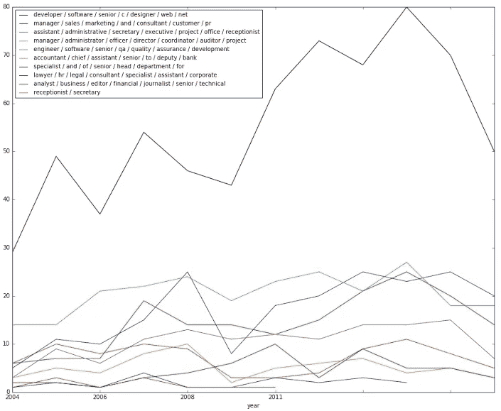
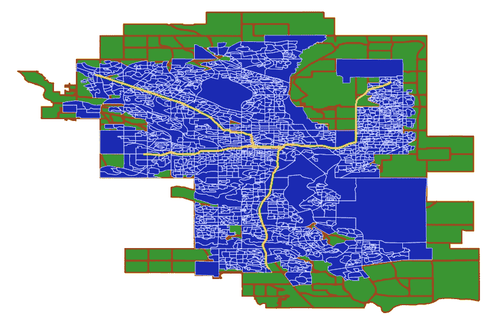

# 作为营销策略的客户人工智能原型

> 原文：<https://towardsdatascience.com/ai-prototypes-for-clients-as-a-marketing-strategy-70de404d27b5?source=collection_archive---------5----------------------->

线在哪里？目标不就是为了得到报酬吗？

在 2017 年的大部分时间里，我们将公司的重点转移到深度学习咨询服务上，我们尝试了各种方法来解释和向潜在客户展示我们在做什么以及我们是如何做的。作为一家人工智能咨询公司，我们有着与其他任何公司一样的成长烦恼，外加每天都在变化的技术的易变性。

# 动机

我们的许多潜在客户带着一个共同点来找我们:他们都在我们之前尝试过另一家人工智能商店。“我们为一份报告花了 25 万美元”，一位首席执行官哀叹道。“他们消失了 9 个月，我们最多只能得到不冷不热的结果”，另一个人说。

这时，我们意识到外面有很多骗子和想成为骗子的人，这取决于我们来证明我们能够说到做到。金钱的承诺吸引着形形色色的人；甩字服和烟镜魔术师绝对是其中的一部分。

这并不是说有不可思议的团队存在；相反，需求已经远远超过了供给，这使得在域名上放置人工智能的[的权力关系发生了倾斜。](https://qz.com/786438/want-your-startup-to-be-funded-add-ai/)

# 达到极限

既然我们已经确定了可能需要展示技能，那么在没有签订合同的情况下，顾问能做多少工作呢？以下是我们制定的内部指导方针，旨在保持照明，让每个人都能买到食品杂货。

## 方法 1:24 小时原型

最简单的方法是:向客户展示你可以做一些与他们领域相关的事情。有许多可用的[公共数据集](http://kaggle.com)，因此根据工作范围，客户没有必要为您提供这些。

A prototype for an HR firm. We took a job posting dataset from Kaggle, clustered the postings by similarity of text, found the most common words in the job titles, and tracked the demand by year. We therefore know how to manipulate job postings, a core need of the project.

## 方法 2:样本数据

除了基于开放数据的原型构建，您还可以从客户端数据本身获得最直接的见解。

“让我看看你能做什么，”一位客户在下载了一堆 pdf 文件到我们的服务器后说道。他们选择了一些感兴趣的报告，我们向他们展示了实体如何根据共现进行分组。搞定搞定，签合同。

## 方法 3:解决方案架构

如果您要构建理想的解决方案，它会是什么样的？在几十个项目完成之后，我们现在可以去找客户，讨论部署是什么样的:技术、阶段控制阶段和经验教训。毕竟，你的客户不正是因为这个原因雇佣你的吗？

因为我们的秘方不在于我们为项目选择的乐高积木，而在于我们如何将它们组合在一起，所以这个解决方案是我们迄今为止最成功的方法(总努力与成交率)。

# 过去的教训

虽然我们随着时间的推移磨练了这些经验，但它们也是在将知识用于金钱的烈火中锻造的。哪里有钱，哪里就有贪婪。

## 知识产权盗窃

“他们不是要偷你的创意吗？”非常好的问题。让我用另一个问题来回答这个问题:如果他们要欺骗你，在未来关系的开始阶段发现这一点不是更好吗？

让他们了解一下本来会是灾难性的情况。满足他们内心的盗窃癖，然后屏蔽他们的电话号码。

## 选择合适的客户

难相处的客户自始至终都很难相处。如果他们开始挑剔你的原型，那么他们要么 1)不知道什么是原型，而不是完整的产品，要么 2)他们试图用更少的钱得到更多。

一个简单的客户会清楚:

*   “我想要那个。要花多少钱？”我的最爱。确保你完全理解自己的定价逻辑。以下是我的 CTO 对此事的看法:[https://towards data science . com/how-to-price-an-ai-project-f 7270 CB 630 a 4](/how-to-price-an-ai-project-f7270cb630a4)
*   "我们能把它安装在 X 上，或者连接到 Y 上吗？"明确要求。非常低范围蠕变的良好指标。
*   “我们可以从 X 开始，然后从那里发展。”限制范围。爱死了。

## 远离问题，而不是金钱

或者，以下是一些危险信号:

*   “那么贵，嗯？”是的。你根据特定的小时费率来计划你的时间。他们可能真的没有钱。
*   "我能看一眼源代码吗？"没有。你的秘制酱是你的命根子。一旦你的客户付了钱，你可以和他们分享，但是永远不要，永远不要。
*   “只要把它做得漂亮，我们就可以照原样出售。”没有功能性？既然*你的*名字受到指责，客户会对*你*说什么？
*   "如果你再扩建一点，我就可以卖掉它。"这是一个难题，因为它可能是真的。在这种情况下，在客户端要求时间表、预算和冠军。如果这些都不存在，退出。

与任何事情一样，您的里程可能会有所不同。信任，但要核实。

A simple GIS prototype. The city of Calgary, with an overlap of Statistics Canada’s Dissemination Areas and light rail tracks, in order to show the impact of future policies on public housing and social welfare. One hour and 12 minutes total to generate this image.

# 简而言之…

请记住，这些原型的目的是展示技能**，这样你就可能被录用，而不是做所有的前期工作**。

编码快乐！

马特。
[马特@ lsci . io](mailto:matt@lsci.io)
[LemaySolutions.com](http://lsci.io)