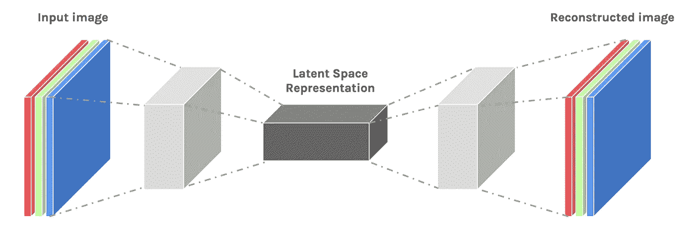
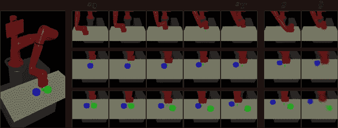

# 人工智能研究深度挖掘:具有想象目标的视觉强化学习

> 原文：<https://towardsdatascience.com/ai-research-deep-dive-visual-reinforcement-learning-with-imagined-goals-862115d122a6?source=collection_archive---------5----------------------->

> 这篇文章涵盖了 Nair 等人的论文“具有想象目标的视觉强化学习”，可以在这里找到。

人类能够在没有任何明确或监督训练的情况下完成许多任务，仅仅是通过探索他们的环境。如果我被丢在莫斯科的中部，简单地以一种没有方向的方式走来走去，我可以完成一个特定的任务(例如。去杂货店),而之前从未见过这个任务，仅仅通过从过去的经验中知道商店位于哪里。我们能够设定自己的目标，并从我们的经验中学习，因此能够完成特定的任务，而无需接受明确的训练，这是**概括的核心原则**。

自然，任何机器学习科学家的下一个问题是:自主代理是否也可以设定自己的目标并从其环境中学习。在论文“具有想象目标的视觉强化学习”中，作者能够设计这样一个无监督的强化学习系统。

在深入研究本文之前，让我们先定义几个术语:

*   状态( *s* ):洗碗机有两种一维状态——“开”和“关”。鹿有三种状态——“睡眠”、“进食”和“狩猎”。在本文中，我们将状态定义为对象在特定时间步长内的快照。
*   目标:目标是我们的对象渴望达到的状态。
*   Action ( *a* ):我们处于状态 *s* 的对象可以采取动作 *a* 移动到不同的状态(或者可能停留在相同的状态)。需要注意的是，动作不是确定性的。国家-行动对也不是。相反，我们必须定义一个转移概率矩阵，它根据当前状态 *s* 和动作 *a* 决定我们的对象到达状态*s’*的概率。不那么抽象地说，在本文中，动作仅仅是机器人的特定运动。
*   奖励( *r* ):我们可以用元组( *s* 、 *a* 、 *g* 、*s’*)指定的每个状态、动作、目标和结果状态 s’，都有一个相关的奖励( *r* )。这个系统中的奖励是由对象当前状态的图像与目标状态的图像的相似程度来定义的。
*   策略( *p(s)* ):策略是根据当前状态选择下一个动作的策略。因此， *p(s) = a*
*   Value ( *V(s，g)*):value 函数描述了使用策略 *p* 的长期收益，从状态 *s* 和目标 *g* 开始。在强化学习中，我们试图找到一个使我们的价值函数最大化的策略。
*   Q-value ( *Q(s，a，g)*):Q-value 函数是 value 函数的扩展，它允许代理决定要采取的操作。该函数返回给定 *(s，a，g)* 元组的折扣奖励总和，用于学习产生最大价值函数的最优策略。
*   折扣系数:我们系统的另一个目标是最大限度地减少我们为实现目标而采取的行动。因此，我们对每个后续时间步长的奖励都给予折扣，使得奖励呈指数级动态下降(取决于状态-动作对)。

强化学习的最终指导是学习一种策略，当给定一种状态和目标时，它可以支配最佳的行动。在本文中，培训期间没有明确定义目标。这类似于让孩子在上学的第一天在操场上跑来跑去，然后第二天让孩子去荡秋千。尽管没有“教”孩子如何挥杆，但孩子很可能会完成任务。

如果一个目标没有明确定义，代理必须自动生成一组综合目标。因此，假设我们让一个自主代理探索一个具有随机策略的环境。执行每个操作后，将收集并存储状态观察结果。这些状态观测以图像的形式被结构化。代理可以从该组状态观察中随机选择目标，也可以从该组状态观察中随机选择初始状态。

现在，给定一组所有可能的状态，一个目标，和一个初始状态，一个强化学习框架可以用来寻找最优策略，使得价值函数最大化。然而，要实现这样一个框架，我们需要定义一个奖励函数。一个可能的奖励函数是对应于当前状态的图像和对应于目标状态的图像之间的距离(作者使用负的 Mahalanbois 距离)。更高的奖励分配给更接近目标形象的州。

这个奖励函数的一个基本问题是，它假设原始图像之间的距离会产生语义上有用的信息。图像有噪声。图像中的大量信息可能与我们分析的对象无关。因此，两幅图像之间的距离可能与其语义距离不相关。

可以手动创建描述图像重要和相关属性的特征向量。然而，在人工智能领域，我们努力尽可能地减少人类的努力。那么，如何从状态图像中提取有用的表示呢？

# 可变自动编码器(VAE)

自动编码器是一种机器学习模型，可以学习从图像中提取鲁棒的、空间高效的特征向量。该模型有两部分——编码器( *e* )和解码器( *p* )。编码器将图像作为输入，并输出低维特征向量。解码器将该低维特征向量作为输入，并重建原始形状。该模型被训练为最小化曼哈顿距离(L2；输入图像和输出图像之间的均方差)。

低维特征向量作为编码器的输出和解码器的输入，被称为潜在变量。224×224×3 输入图像(包含总共 150，528 个特征)可以简化为形状为 4096×1(4096 个特征)的潜在向量。由于该潜在向量可用于重建输入，它有效地封装了与图像中的对象特别相关的信息。

A series of convolutional layers (the encoder) reduces the input image size to a latent variable. A series of deconvolutional layers (the decoder) maps the latent variable to an output image. Together, the encoder and decoder make the autoencoder, which is trained to recreate the input image in the output.

虽然 autoencoder 模型提供了一种强大的无监督图像编码方式，但它容易过度拟合。该模型可以“记忆”从潜在变量到图像的映射，因此失去了在编码中仅编码有价值的特定于对象的信息的能力。本文作者使用变分自动编码器，它在解码前将潜在向量拟合为单位高斯，从而执行归一化。

使用变分自动编码器变换图像空间有许多优点。

*   提供距离更有意义的空间，从而允许使用结构良好的奖励函数(例如编码之间的距离)
*   强化学习网络的输入是结构化的
*   可以从解码器输出中采样新的状态，允许在训练期间自动创建合成目标，以允许以目标为条件的策略实践不同的策略

# 强化学习框架

此时此刻:

*   代理从由随机策略控制的环境的探索中收集状态观察
*   基于这些状态观测训练了变分自动编码器
*   所有的状态观测值已经通过编码器被编码到潜在空间中
*   “初始状态”和“目标状态”是从全部状态中随机抽取的

回想一下，现在所有的算法都只在潜在空间中运行。从今以后，当我提到“状态”、“初始状态”或“目标状态”时，我指的是它们在潜在空间中的表征。现在，这个问题的定义更清楚了。给定初始状态、目标状态和奖励函数(当前状态和目标状态的潜在变量之间的负 Mahalanobis 距离)，任何值学习算法(例如 q 值学习)可以创建一个策略——一个函数，当给定一个目标和一个状态时，它返回最优的动作。

作者使用双延迟深度确定性策略梯度作为他们的强化学习算法。目标函数在下面的等式中表示，其中策略被优化以最小化平方贝尔曼误差。这种算法可以脱离策略进行训练，这意味着它不贪婪——它可以接受任何类型的训练经验。策略培训根据当前策略选择培训过程中的操作。

这里描述的学习框架的美妙之处在于，可变自动编码器可以生成潜在的无限训练数据。新的目标空间可以通过将目标图像传递通过自动编码器来生成，产生相似但不同的图像。从这些新目标中，可以计算出新的回报。并且这种“新体验”可以被重新输入到强化学习模型中。因此，该模型能够从自动生成的经验中归纳出在初始探索阶段没有看到的新环境。

# 摘要

这里给出了该算法的总结:

1.  通过对环境的随机探索来收集状态观测值
2.  根据这些观察训练变分自动编码器
3.  每个状态的潜在编码从变分自动编码器获得
4.  (目标，状态)编码从现有集合中取样
5.  在潜在编码上训练强化学习算法
6.  在以下条件下重复步骤 4–5:1)定期用新生成的图像空间重新训练自动编码器。2)通过变化的自动编码器馈送目标图像来生成新的目标。

Left: image of agent + environment. Middle: Initial state, intermediate states, and final states are depicted. Right: Goal state, and VAE(g) state depicted.

# 结论

强化学习是当今一个非常热门的话题，在许多领域都有大量的应用。这种特殊的算法令人兴奋，因为它 1)使用视觉数据，2)以无人监管的方式进行训练。该算法无法访问真实状态或预定义的奖励函数。它可以在没有显式编程的真实环境中运行良好。

对于所有的图形和方程式，要感谢“具有想象目标的视觉强化学习”的作者。

在 twitter 上联系我 [@prasadinapickle](http://twitter.com/prasadinapickle) ，在 Medium 上查看我@ [nprasad](https://medium.com/@nprasad) 的更多类似内容。

**Connect with the Raven team on** [**Telegram**](https://t.me/ravenprotocol)