# 人工智能安全

> 原文：<https://towardsdatascience.com/ai-safety-9aeb9ca42907?source=collection_archive---------5----------------------->

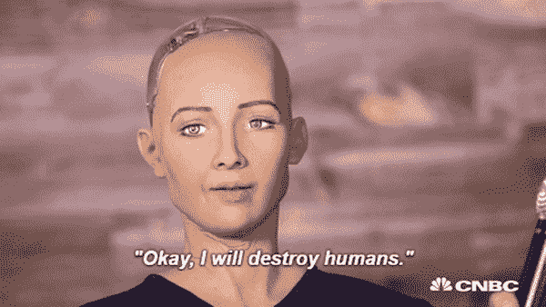

> 我们真正需要做的是确保生命延续到未来。最好的办法是努力阻止负面情况的发生，而不是等到它发生后才做出反应。——埃隆·马斯克

作为一个 90 后的孩子，我已经迷上了看许多科幻电影。在那个时期，这种类型就像“*一个头脑中有很多野心的小孩*”。像《黑客帝国》1、2(不是 3)、所有《终结者》系列电影、所有《变形金刚》系列电影、《x 战警》、《独立日》等电影在我们当中很受欢迎。因为他们，我开始了解机器人，并不断思考如果机器人出现在现实生活中，如何与机器人战斗。

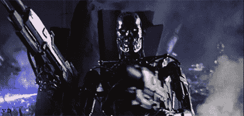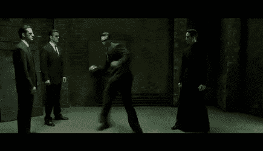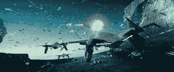

现在，当我看过去这些电影时，我认识到的第一件事是*这部电影的 vfx 有多烂*，第二件事是*我们能创造出这种完全依靠人工智能力量的角色吗*？

2015 年《复仇者联盟:奥创时代》再次上映，我认为这是一部有点意思的电影。但是我又想到了一件事… *我们可以用人工智能的力量创造这种类型的角色吗？我们能创造奥创吗？*

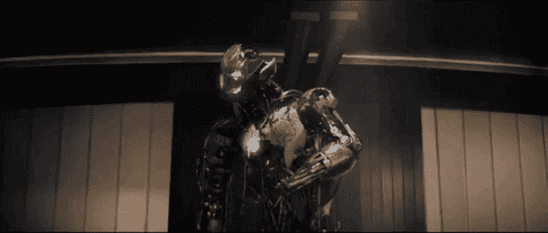

到目前为止，我感觉到所有电影中的一个模式…所有这些反派都是由人类以某种方式创造的，或者是因为人类的任何干预而创造的。

但最终这些都还是电影。众所周知

> 电影只是人们头脑中的一种幻觉

所以我们不能创造出像《终结者》中的 **T-X** *或者《变形金刚》*中的**威震天** *或者《复仇者联盟》中的**奥创** *那样的反派？**

为什么不呢？所有反派都有一个共同点，那就是他们首先是邪恶的，那就是他们拥有普通人工智能的能力。

但近几十年来，我们看到人工智能的发展稳步上升。在某些情况下，我们已经超越了人类的极限。

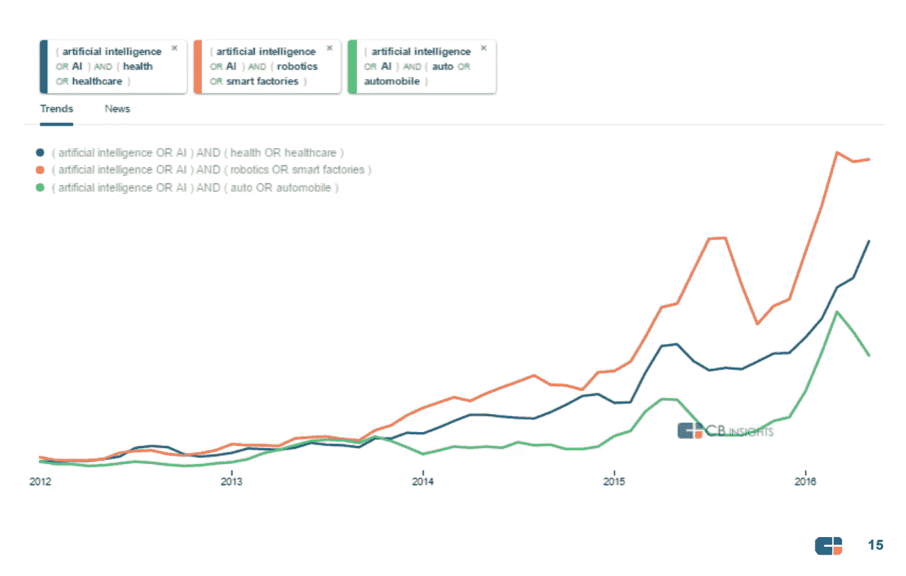

举一个五号的例子。一个基于人工智能的 dota 团队，甚至可以击败最熟练的 dota 玩家。

 [## OpenAI 的 Dota 2 失利仍然是人工智能的胜利

### 由埃隆·马斯克创立的研究实验室 OpenAI 制造的人工智能机器人在 Dota 2 上被人类职业玩家击败…

www.theverge.com](https://www.theverge.com/2018/8/28/17787610/openai-dota-2-bots-ai-lost-international-reinforcement-learning) 

或者以这个故事为例，脸书的开发人员创造了一个人工智能，它用一种连开发人员都不懂的语言与其他人工智能对话。技术上可以说我们已经实现了真正的通用人工智能。

 [## 脸书机器人用只有它们自己懂的语言相互交流后就会关机

### 在两个人工智能程序似乎在以一种…

www.independent.co.uk](https://www.independent.co.uk/life-style/gadgets-and-tech/news/facebook-artificial-intelligence-ai-chatbot-new-language-research-openai-google-a7869706.html) 

在这一点上，开发人员关闭了整个操作，担心它已经失去了他们的手。但是他们害怕谁呢？如果他们就这样放弃这个项目，会发生什么？谁在阻止他们？

不幸的是现在我们没有答案。我们的宪法中没有人工智能规则这种东西，因为我们的立法者仍然无法理解人工智能。

# 人工智能安全

正如这篇论文漂亮地解释了…

> 人工智能安全是我们应该遵循的集体术语伦理，以避免机器学习系统中的事故问题，以及现实世界人工智能系统的糟糕设计可能出现的意外和有害行为。

当我们谈论人工通用智能或比人类更聪明的 AI 时，我们想到的就是这种通用的解决问题的能力。人工智能系统在科学和工程能力方面超越了人类，但在其他方面并不特别像人类。例如，人工智能不一定意味着人工意识或人工情感。相反，我们认为有能力很好地模拟真实世界的环境，并找出各种方法将这些环境置于新的状态。

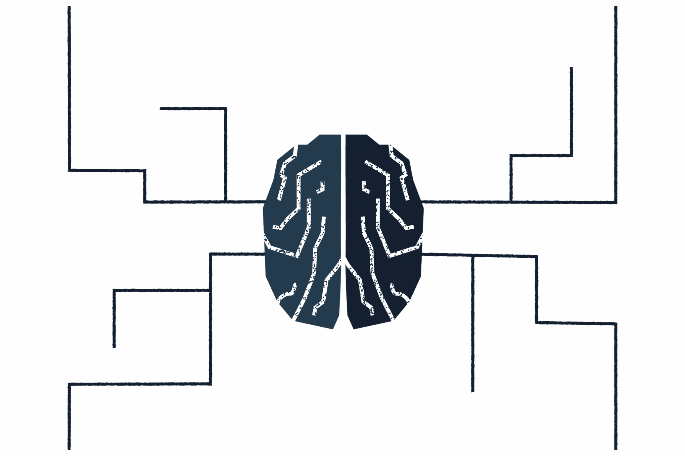

要了解这方面的更多信息，你可以参考这个视频，它通过一个例子清楚地解释了人工智能的力量。

好了，现在我将把话题扩展到一篇有趣的论文，我认为这是一个完美的例子，说明为什么我们需要开发人工智能安全。

如果你不知道神经网络，请参考[这里](https://www.reddit.com/r/explainlikeimfive/comments/2psgpp/eli5_what_is_deep_learning_and_how_does_it_work/)，那么只有你会知道这个。

## [对抗性攻击](https://arxiv.org/abs/1312.6199)

> 对抗性攻击是攻击者有意设计的机器学习模型的输入，以使模型出错。

让我们举一个例子

假设我已经创建了一个图像分类器，它根据对象的图像给出对象的名称。所以如果我们把这个作为输入图像

那么我们将得到正确的“熊猫”输出。

但是，如果我告诉你，只给图像添加一些特定的噪声，我可以欺骗模型分类器，把它当成另一个对象。诸如

这是对抗性攻击的典型例子。

对立的例子有潜在的危险。例如，攻击者可以通过使用贴纸或油漆来创建车辆会解释为“让步”或其他标志的敌对停止标志来瞄准自动驾驶汽车，如 [*使用敌对示例针对深度学习系统的实用黑盒攻击*](https://arxiv.org/abs/1602.02697) 中所述。

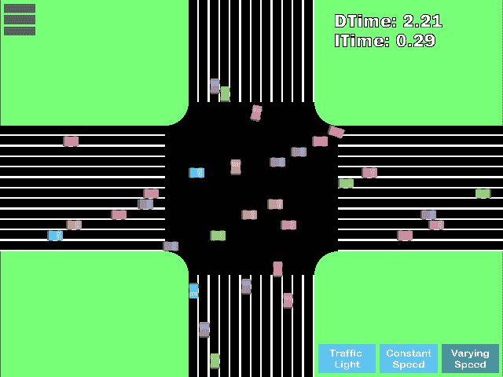

根据对神经网络策略 *，*的 [*对抗性攻击的新研究，强化学习代理也可以被对抗性的例子操纵。该研究表明，广泛使用的 RL 算法，如，*](http://rll.berkeley.edu/adversarial/) *[TRPO](https://arxiv.org/abs/1502.05477) ， [A3C](https://arxiv.org/abs/1602.01783) ，容易受到对抗性输入的攻击。这可能会导致性能下降，即使存在人类察觉不到的细微干扰，导致代理在应该上升的时候向下移动乒乓板，或者干扰其在 Seaquest 中发现敌人的能力。*

当我们想到人工智能安全的研究时，我们通常会想到该领域中一些最困难的问题——我们如何确保比人类聪明得多的复杂强化学习代理以其设计者预期的方式行事？

对立的例子告诉我们，即使是简单的现代算法，无论是监督学习还是强化学习，都可能以我们意想不到的方式表现出来。

对抗范例很难防御，因为很难构建对抗范例制作过程的理论模型。对立的例子是对许多 ML 模型(包括神经网络)的非线性和非凸优化问题的解决方案。因为我们没有好的理论工具来描述这些复杂优化问题的解决方案，所以很难做出任何一种理论上的论证，即辩护将排除一组对抗性的例子。

对抗性的例子也很难防御，因为它们需要机器学习模型来为每一个可能的输入产生良好的输出*。大多数时候，机器学习模型工作得很好，但只对它们可能遇到的所有可能输入中的很小一部分起作用。*

对立的例子表明，许多现代机器学习算法可以以令人惊讶的方式被破解。机器学习的这些失败表明，即使是简单的算法，其行为也可能与其设计者的意图截然不同。

好吧，让我问你一个问题:

> 那么我们需要改变多少像素来愚弄我们的神经网络呢？

不幸的是，答案只有一个。

在[这篇](https://arxiv.org/pdf/1710.08864.pdf)论文中提到，任何神经网络都可以通过改变图像中的一个像素而被击败。

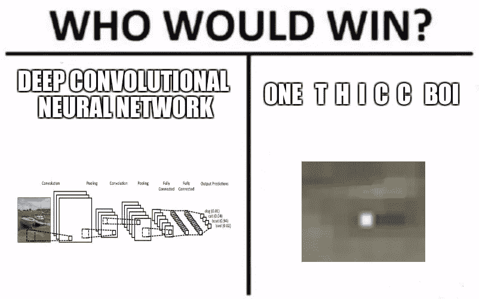

通过改变描绘马的图像中的一个像素，人工智能将 99.9%确定我们看到的是一只青蛙。一艘船也可以伪装成一辆汽车，或者有趣的是，几乎任何东西都可以被看作一架飞机。

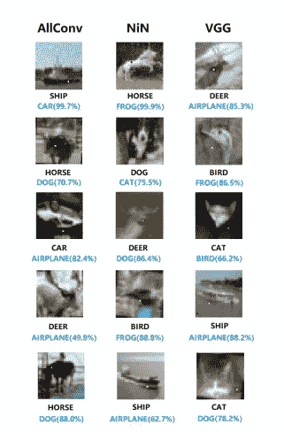

那么我们如何进行这样的攻击呢？如你所见，这些神经网络通常不直接提供一个类，而是提供一堆置信度值。这到底是什么意思？

置信度值表示网络对我们看到拉布拉多或虎猫的确信程度。为了做出决定，我们通常会查看所有这些置信度值，并选择具有最高置信度的对象类型。现在很明显，我们必须知道选择哪个像素位置以及它应该是什么颜色来执行成功的攻击。我们可以通过对图像执行一系列随机变化，并检查这些变化中的每一个如何在适当的类中降低网络的置信度来实现这一点。

在这之后，我们过滤掉不好的，继续在最有希望的候选人周围搜索。这个过程我们称之为差异进化，如果我们正确地执行它，最终，正确类的置信度值会非常低，以至于不同的类会取而代之。如果出现这种情况，网络已经被打败了。

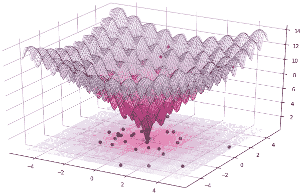

现在，请注意，这也意味着我们必须能够查看神经网络，并获得置信度值。也有大量的研究工作致力于训练更强大的神经网络，使其能够承受尽可能多的输入变化。

第二个例子。

## Deepfakes

Deepfakes 是使用机器学习算法对主题进行面部交换的视频。这种做法是由 Redditor Deepfakes 创建的，他在 2017 年 11 月推出了一个专门的 subreddit 来分享视频。2018 年 1 月，FakeApp 桌面应用程序作为创建数字修改视频的工具发布。

除了面部交换，其他工具可能很快允许以前难以伪造的媒体被操纵。有人用这个制作了唐纳德·川普总统[说普通话的音频](https://www.youtube.com/watch?v=-ISWe9mGNiw&feature=youtu.be)。使用生成性对抗网络，本质上是两个竞争人工智能之间的[一个“猫和老鼠”的游戏](https://www.nytimes.com/interactive/2018/01/02/technology/ai-generated-photos.html)，Nvidia 能够开发一个假冒名人面孔的网格。

基本上是用机器学习算法完成的。它需要一个数据集，里面有一个人面部的大量照片，比如说，凯丽·费雪的数百张照片，然后再放上一段视频。它在算法中同时运行这两者，几小时或几天后得出的结果就是视频中那个人的样子。

正如一些人提到的那样，最近发生了变化，这些新的人工智能算法可以获取大量数据，绕过许多手动过程，并且需要技术设施，使这种技术可以为许多可能负担不起这种技术设置的用户所用。

所有这些方法的一个挑战是，一旦你有了一个可以检测假货的系统，那么你就可以训练你的制造假货的系统来对抗这个系统。所以只要能进入那个系统进行检测，你就能越来越好地通过它。所以我不认为这是一个长期的解决方案。我的意思是，这是一个猫捉老鼠的游戏。

这只是我们现在面临的问题的冰山一角，因为缺乏人工智能的安全性。随着时间的推移，我们将获得智慧，获得真正的智慧，在各方面都超过人类，没有人会阻止他们。

## 最后的想法

> 人工智能安全的问题不会自己解决，也不容易解决…最重要的是，我们必须在解决通用 AI 之前解决它。
> 
> 迟早我们会得到 AI 将军，当我们得到 AI 将军时，我们也应该有安全措施。

感谢您花宝贵的时间来阅读我的博客。我衷心感谢。

*如果你喜欢这个帖子，那么请用* ***鼓掌*** *来表达你的回应，并在****Twitter****上发帖，因为我真的认为像这样的 it 话题应该传播到每一个人。*

如果您有任何问题、疑问或建议，请在下面的评论中写下。