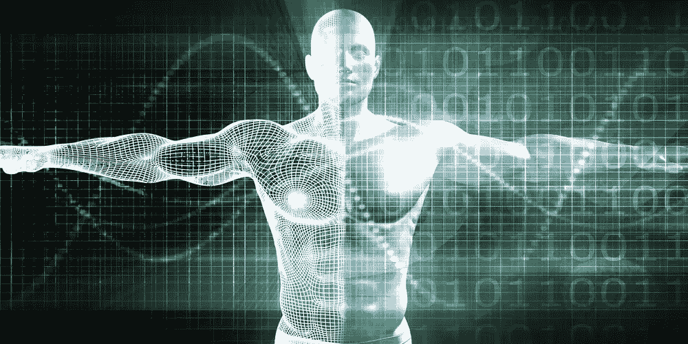

# AI 系列:寻找“认知操作系统”

> 原文：<https://towardsdatascience.com/ai-series-looking-for-a-cognitive-operating-system-b21ea20c374d?source=collection_archive---------24----------------------->

> “我见过你们这些人不会相信的事情。猎户座附近的攻击舰着火了。我看着 C 型光束在 tannhuser 门附近的黑暗中闪闪发光。所有那些时刻都将消失在时间中，就像雨中的泪水。是时候去死了。”(《银翼杀手》，1982)

每次听到雷德利·斯科特杰作中复制人罗伊·巴蒂(由鲁特格尔·哈尔饰演)的独白，我的皮肤都难免会起鸡皮疙瘩。

尽管雷德利·斯科特的电影达到了完美，但我们目前的人工智能相关技术和进化水平还远远不能制造任何类型的复制人。

电影业以及深度学习发展的最新成就所带来的大肆宣传，在人们中间产生了强烈的情绪反应，导致了对人工智能目前是什么以及能够为我们做什么的普遍扭曲的看法和期望。

人工智能是一个研究领域，旨在理解、开发智能行为并将其实施到硬件和软件系统中，以模仿和扩展类似人类的能力。

为了实现其承诺，AI 在*机器学习* (ML)领域实施了各种技术，这是一个研究的子集，专注于开发能够通过试错或应用已知规则从经验中学习新技能的软件系统。*深度学习* (DL)，是迄今为止机器学习中的技术，在语音和图像识别、语言翻译等领域提供了最令人兴奋的结果和实际用例，并在当前广泛的人工智能应用中发挥着作用。

例如，在语音识别方面，深度学习导致了像苹果 Siri 或亚马逊 Alexa 这样的个人语音助理设备。在对象识别方面，它可以检测和识别不同对象的图像，为从视频监控和安全到医疗保健和农业等许多领域的各种应用提供支持。通过结合这些基本能力，有可能实现更具挑战性的目标，比如无人驾驶汽车。

深度学习如此受欢迎，以至于它的名字经常与机器学习互换使用，有时甚至与人工智能互换使用，但本质上，它是一种在基于大样本数据集的训练课程之后，用于识别和分类模式的统计技术。

正是在这里，深度学习的所有限制都出现了:为了学习如何正确地对模式进行分类，DL 系统通常需要在长时间的训练会话中使用大量先前清理和标记的数据。

但是现实世界的学习提供的数据要零散得多，问题也不那么简洁。缺乏适当数量的定性训练数据降低了 DL 相关技术的有效性，并限制了它们在已知训练示例空间之外概括所学模式的能力。

例如，谷歌的 DeepMind 通过其 Alpha 程序将深度学习推向了顶峰。2016 年，AlphaGo 在中国经典战略游戏围棋中击败了一名人类冠军。但是，即使有了 Alpha 这样最先进的系统，很明显深度学习也无法提取出导致常识的教训:要在 21 乘 21 的棋盘上而不是标准的 19 乘 19 的棋盘上玩围棋，人工智能必须重新学习游戏。

深度学习目前缺乏学习抽象的机制。是的，它可以识别以前未识别的模式或待解决的问题。但是它不是自主创新的，并且它不会从没有证据的事实(数据)或在提供与训练阶段使用的数据有很大不同的数据的新情况中自发地开发新的假设，导致基于真实世界知识管理开放式推理的能力有限。

机器学习领域有大量的计划正在努力扩展深度学习的能力，并克服其当前的局限性。有趣的是，它们往往直接来自对我们自然大脑如何工作的非常准确的观察，因为这基本上是我们在试图制造人工智能时可以参考的唯一例子，因此我们取得的许多进展直接来自神经科学世界的新发现和进展产生的想法。

例如，一个非常有趣的研究领域正在试图将传统的深度学习方法与存在于我们自然大脑中的一个基础组件的人工版本相结合:记忆。

这种机器学习模型(称为可微分神经计算机或 DNC)，可以学习使用其外部存储器来成功回答旨在模拟自然语言中推理和推断问题的问题。

但尽管如此，即使考虑到许多重要的成就，与分类关系不大、与常识推理关系更大的问题本质上仍不在深度学习适用的范围之内。人类通过完全不同的来源整合知识，因此，距离深度学习式感知分类的最佳点还有很长的路要走。

这并不意味着深度学习没有实现它的承诺。截至今天，它基本上为我们周围的所有智能技术提供了动力，增加了类似于人类智能的“魔法”接触。今天，深度学习是所谓的“实用人工智能”的核心，实际上它将学习的范围缩小到了非常特定的领域，在这些领域它可以超越并提供“智能块”，这些智能块可以单独使用，也可以像乐高积木一样组合起来，产生更惊人的结果。

围绕深度学习的真正问题是对它实际上是什么以及能为我们做什么的误解，而不是将深度学习视为可以给我们带来*银翼杀手*中的复制人配备的‘纯人工智能’的技术， 它应该被视为一个更广泛的架构的组成部分之一，该架构不仅包括学习能力，还包括访问和使用长期记忆的能力，以及管理人类从数百万年的进化中继承的核心知识和本能的许多规则，赋予我们非凡的认知智能、灵活性和力量。

我喜欢认为我们所缺少的是一种操作系统，它将所有不同的技术结合在一起，协调衍生能力，以提供更接近“纯人工智能”的东西。

全新一代人工智能的认知操作系统。

我不知道当我们到达那里时，人类是否会绕着猎户座的肩膀旅行，或者在 tannhuser 门附近玩 C 形梁，但我确信如果是这样，这些记忆不会像雨中的眼泪一样丢失。

*最初发表于*[T5【https://www.linkedin.com】](https://www.linkedin.com/pulse/ai-series-looking-cognitive-operating-system-michele-vaccaro/)*。*