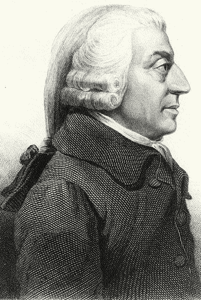
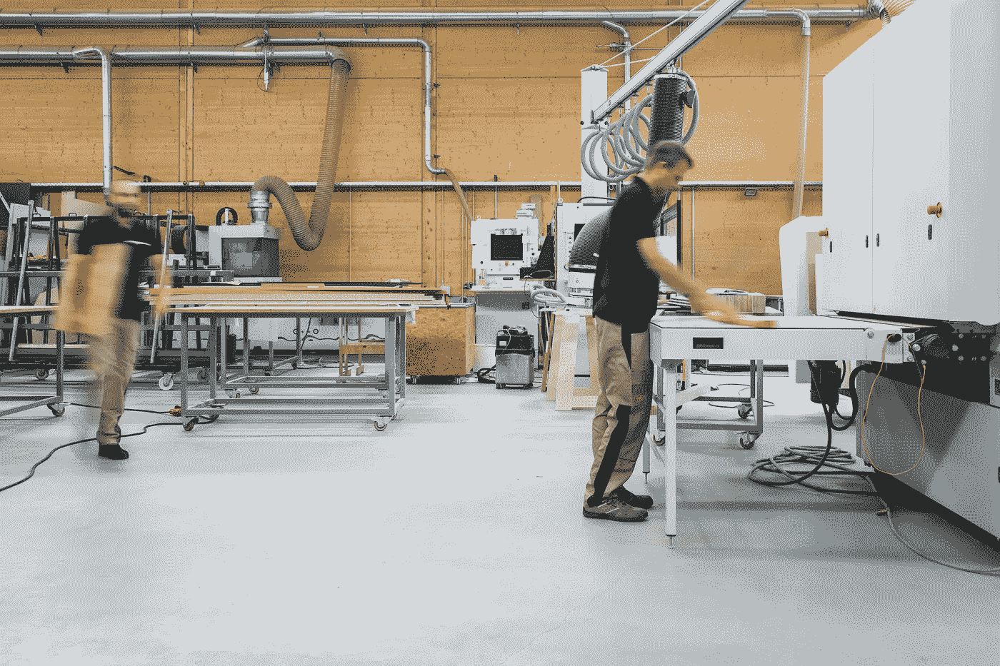

# 艾:国富论

> 原文：<https://towardsdatascience.com/ai-the-wealth-of-nations-f197037f182b?source=collection_archive---------8----------------------->

Image via Unsplash

亚当·斯密的《国富论》应该是每个国家元首的必读之作。花了 17 年写成并改变了整个世界的东西，只需要几天就可以读完。就在第一页，斯密断言“每个国家的财富……受两种不同情况的制约；首先是其劳动通常运用的技巧、灵巧和判断力；其次，通过有用劳动力中被雇用的人数之间的比例，”斯密还指出，第一种情况，即熟练劳动力，比第二种情况，即就业率更重要。当其他国家和领导人为就业市场的自主革命做准备时，美国政府做得很少。中国、韩国和其他国家一直在对人工智能进行大量投资，并将其作为优先事项。在本文中，我将讨论为什么国家财富取决于劳动力的技能组合，以及自主革命将如何导致产出增加。

Permission: Any version is in the public domain in their country of origin and the United States as all are older than 100 years.

史密斯断言，创造财富的第二个驱动力是就业人数(就业率)，因为劳动创造财富。更多的人工作，更多的商品和价值被创造出来。就业是最受欢迎的竞选承诺之一。两个因素解释了这种痴迷:1)选民期望政府刺激经济和创造就业机会，2)这是一个相对容易实现的政府承诺。创造就业对政府来说是一项相对容易的任务，因为它可以增加政府支出，在公共部门雇佣更多的人，降低利率，减少税收(当然，这往往会带来有害的后果)。我们都需要一份工作，我们都想工作(令人惊讶的是，[包括没有工作也能生活的富人](http://www.bbc.com/capital/story/20161208-if-you-get-rich-you-wont-quit-working-for-long))。充实生活的一部分是为我们自己和社会创造价值。政客们喜欢讨论“带回家”和“创造”更多的工作岗位，即使已经没有空间了。2016 年，失业率约为 [5%，根据 OCDE](https://www.oecd.org/eco/outlook/2086120.pdf) ，这被视为充分就业。尽管如此，在上届总统竞选中，创造就业是候选人的首要任务。

Image via Unsplash

向充分就业的人口承诺更多的工作岗位似乎很荒谬。事实上，的确如此。在 2016 年大选中，唯一能够塑造“创造/带来就业机会”对话的候选人是唐纳德·特朗普，他从纯粹创造就业机会转向将创造什么样的就业机会，以及谁将有权获得什么样的就业机会。根据特朗普的说法，要创造的工作类型是传统的制造业工作(煤炭、钢铁等)，应该给美国公民。对于经济来说，这是两个不合理的想法，因为这些工作已经被海外的低技能工人取代，这创造了一个难以置信的机会来继续增加高技能工作的存在。然而，候选人对就业市场的变化如何影响经济关注不够。

根据斯密的观点，国家财富的首要和最重要的条件是“技能、灵巧和判断力，人们通常运用这些技能、灵巧和判断力来劳动；如果两个国家有相似的人口和自然资源，他们生产的产品的唯一区别取决于他们人民的技能和政府机构。拥有高技能的劳动力可以创造更多的产出和财富。如果 A 国在采矿和农业领域雇佣大部分劳动力，而 B 国在工程和机器人领域雇佣劳动力，很明显 B 国的效率更高，因此 GDP 增加。B 国有两个显著的优势。首先，它的劳动力将生产机器来实现生产自动化(这将直接增加产量)。其次，在劳动力规模相同的情况下，来自 B 国的工人有更多的空闲时间来进一步提高他们的技能。

Image via Unsplash

第一次资本主义革命被称为工业革命，在这场革命中，英国、法国、德国、日本和美国从手工生产转向机器辅助生产中受益最大。第二个将被称为自主革命，由于他们的承诺和投资，很可能来自中国、韩国、新加坡和日本。在自主革命中，使用人工智能的机器人将取代人类仍在执行的剩余手工任务。从低技能劳动力向高端技术的过渡需要巨大的努力和适当的激励。它要求政治家们理解这一变化的重要性。

资本主义将永远导致自主革命。在 21 世纪，只有三种东西可以创造更多的财富:自然、人类和机器。自然产生“自发”的财富，如农作物和牲畜，但极难控制(增加降雨量会增加产量)。此外，像马磨坊这样的动物在过去也帮助提高了产量，但(幸运的是)它们被引擎取代了。人类的劳动可以创造巨大的财富，然而，劳动是昂贵的，而且矛盾的是，与资本主义不相容，因为它寻求降低成本。因此，具有成本效益的选择是高效和自主的机器。

国际劳工组织预计明年全球失业人数将达到 1 . 92 亿左右，这是一个稳定但很高的趋势。机器和机器人在短期内不会取代人类，但低技能员工的工资预计会进一步下降。中国致力于成为人工智能的全球领导者。T2 政府在机器人和人工智能上投资超过 60 亿美元。

Image via Unsplash

尽管美国在技术和科学研究方面仍然处于全球领先地位，但它主要是由私营部门推动的。脸书和谷歌等大型科技公司正在大力投资人工智能软件，因为他们明白，为了让机器自动化，我们需要理解人工智能。建设先进的人工智能技术可以比作在全国范围内建设铁路。这将需要大量的投资，小建筑块，但一旦完成，它会成倍增加产量。

政府应该致力于培训人才的项目，增加非军事目的的研究，并创建一个竞争性的自主产业。自主革命将改变我们的生活和工作方式。预测这些变化将使我们能够朝着正确的方向前进，并减少技术滥用的风险。人工智能可以显著提高每个人的生活水平，不仅自动化重复的任务，而且自动化需要决策的行动。为了跟上这一新部门的发展，政府应该加快步伐，增加投资和经济激励措施。预计到 2030 年，中国将成为人工智能领域的世界霸主。这将使中国在知识产权方面迎来又一波指数级增长。制造机器人比给它们一个大脑更容易，这就是人工智能是国家的下一个财富。