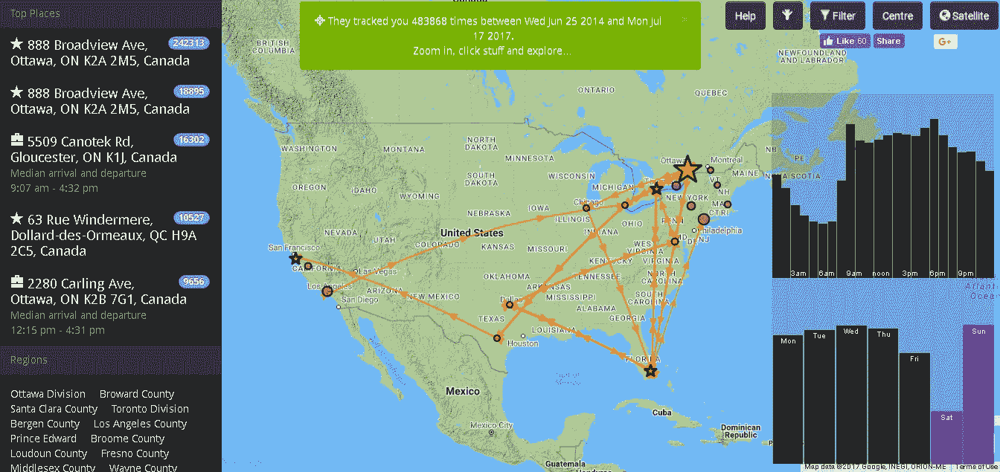
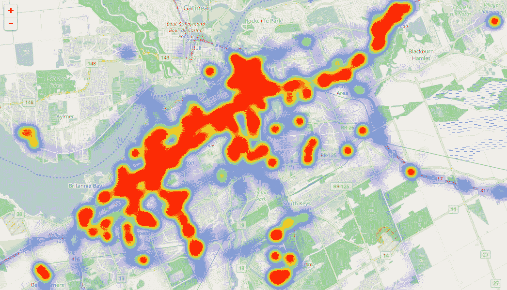
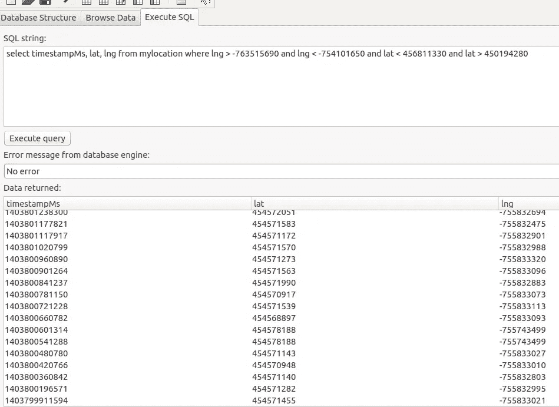

# 艾:跟踪我

> 原文：<https://towardsdatascience.com/ai-track-me-325833522043?source=collection_archive---------10----------------------->

我的手机收集的数据量令人震惊。让我们看看我的谷歌历史，看看我们能看到什么。这是一篇两篇文章。这篇文章是关于数据收集的，下一篇是关于数据的机器学习。如果您不了解 python，甚至不知道如何编程，您应该仍然能够理解。如果您了解 python，那么您应该能够毫不费力地在您的数据上复制本文中的步骤。简单地 apt-get 或 pip 安装缺少的库。就是这样。

首先，我们从[谷歌外卖](https://www.google.com/settings/takeout)为我的一个工作账户抓取了 133MB 的位置追踪数据。数据是 2014 年到 2017 年的。它没有我所有的数据，但它有很多。

为了制作下面的两张地图，从谷歌外卖收集的 JSON 文件由在线服务进行了解释。这让我们在编写任何代码之前对数据集的形状和大小有一个概念。



Map of business trips to Montreal, Toronto, Florida, Texas, San Francisco, New York, L.A., Washington, Chicago, and other fun destinations. Somehow trips to San Diego, Israel, Arizona, Mexico, Cuba, etc were not tracked or were tracked under another business account. Graph [generated here](http://theyhaveyour.info).

乍一看，我们看到我使用这个工作帐户进行了一些商务旅行。该手机在 2014 年 6 月至 2017 年 7 月期间跟踪了 483，868 次旅行。[那是大约 1126 天](https://www.timeanddate.com/date/duration.html)和**每天 430 次“旅行”**(从 483868 次旅行/1126 天)被追踪。即便如此，数据中还是少了几次旅行，要么是因为手机落在家里，要么是数据记录在了另一个工作账户中，或者可能是我带了不同的手机。也许我们应该称这些记录为运动记录或位置记录，而不是“旅行”。还有，很多都是我睡着的时候拍的。那个；这不完全是一次旅行。看上面的图片，在右下角的插图中，很明显我周六旅行最少，这与我在周六发多少邮件的帖子[非常吻合](https://medium.com/@lemaysolutions/ai-read-my-email-e69a833dd0f1)。

下面的热图显示了我在渥太华去过的地方。很明显，咨询师的生活需要在城市中四处奔波，而不是在工作和家庭之间来回奔波。这被与孩子、健康、购物等相关的周末旅行放大了。当你想到渥太华的工业和商业区在哪里时，这张地图就有意义了。主要的东西向蠕虫状斑点是渥太华的 417 高速公路。



Heat map of my trips within Ottawa 2014–2017\. Graph [generated here](http://locationhistoryvisualizer.com).

让我们忽略数据上的注释，包括谷歌记录位置时认为我在做什么:

```
"activity" : [ {
        "type" : "STILL",
        "confidence" : 100
      } ]
```

我们将关注我的手机在特定时间(时间戳)的经度和纬度。下面的短程序将 Google 外卖的 133MB JSON 文件处理成 20MB 的 SQLite 数据库文件。

```
import sqlite3, json
from pprint import pprint    
if __name__ == '__main__':
    with open('LocationHistory.json') as data_file:    
        conn = sqlite3.connect("locationData.db")
        c = conn.cursor()
        c.execute("create table if not exists mylocation (timestampMs INTEGER, lat INTEGER, lng INTEGER)")
        i=0
        for location in json.load(data_file)["locations"]:
            i+=1
            #use pprint(location) to see the data
            c.execute("insert into mylocation (timestampMs, lat, lng) VALUES (?,?,?)",(location["timestampMs"],location["latitudeE7"],location["longitudeE7"],))
            if i % 1000 == 0:
                conn.commit()
```

现在在数据库表 mylocation 中正好有 483，000 行。我找到了 303019 对不同的经度和纬度点。缩小到渥太华，它位于北纬 45.4215 度，西经 75.6972 度，我们可以找到上面热图中的所有点。我们通过以下简单的查询来实现这一点:

```
select lat, lng from mylocation where lng > -763515690 and lng < -754101650 and lat < 456811330 and lat > 450194280 order by timestampMs asc
```

请注意，存储的纬度和经度没有小数点。上面的查询定义了一个盒子，其东、西墙由 Arnprior (45.436555， **-76.351569** )和 Cumberland (45.518922， **-75.410165** )组成，而盒子的南北两侧是 La Peche ( **45.681133** ，-75.931882)和 Kempville/North Grenville()结果是**416，558 行 T11 数据，它们标记了渥太华地区的地点和时间。**



该数据代表一个序列。让我们看看是否可以根据这些数据，用 LSTM 来预测我的运动，然后绘制出结果。

首先，让我们把数据转换成张量/numpy 格式。数据非常简单。让我们通过忽略时间戳并将数据转换成两个数的流来进一步简化它:位置数据。每个位置都是一对数字[ *lat，lng* ]。现在的目标是训练一个回归模型来逼近序列。简单来说，它可以在看到我去过的一系列地方后，猜测出我在经度和纬度上的位置。

让我们下次做那件事。请继续关注第二部分。

编码快乐！

-丹尼尔
[丹尼尔@lemay.ai](mailto:daniel@lemay.ai) ←打个招呼。
[LEMAY . AI](https://lemay.ai)
1(855)LEMAY-AI

您可能喜欢的其他文章:

*   [人工智能和坏数据](/artificial-intelligence-and-bad-data-fbf2564c541a)
*   [人工智能:超参数](/artificial-intelligence-hyperparameters-48fa29daa516)
*   [人工智能:让你的用户给你的数据贴上标签](https://medium.com/towards-data-science/artificial-intelligence-get-your-users-to-label-your-data-b5fa7c0c9e00)