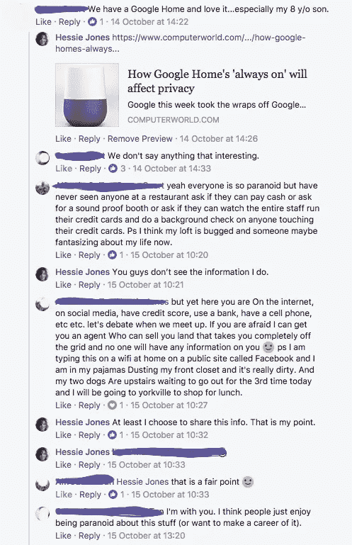
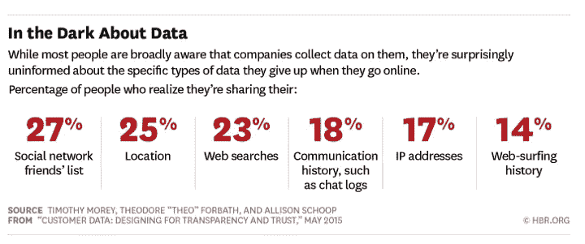
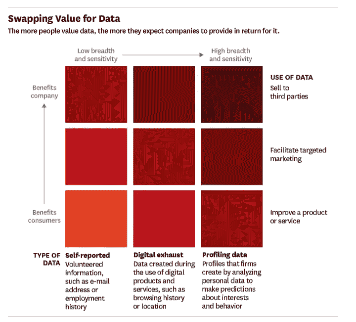

# 人工智能、透明度及其与隐私的拉锯战

> 原文：<https://towardsdatascience.com/ai-transparency-and-its-tug-of-war-with-privacy-5b94c1d262ad?source=collection_archive---------8----------------------->

*我决定转贴这篇文章，特别是关于* [*剑桥分析公司和脸书*](http://www.cbc.ca/news/business/facebook-mark-zuckerberg-cambridge-analytica-1.4586659) *的铺天盖地的报道，因为 ca 在特朗普的大选中不当获取数百万用户数据以影响选民。如果大企业、科技巨头和立法者不加快监管以确保用户数据安全，这种情况将变得更加普遍。*

作为一个与大数据打交道有一段时间的人，我已经将这种相关性的想法变得令人毛骨悚然(还记得臭名昭著的案例研究:[Target 如何在她父亲 di](https://www.forbes.com/sites/kashmirhill/2012/02/16/how-target-figured-out-a-teen-girl-was-pregnant-before-her-father-did/#6d2989666668) d 之前发现一个女孩怀孕？).我敏锐地意识到它对大企业的诱惑，同时也意识到它在消费者中造成的恐惧。随着数据变得越来越丰富，消费者的数字足迹变得司空见惯，对他们生活的更多理解得到了分析和语境化。普通消费者越来越了解他们分享的内容，以及企业如何使用这些内容，很多时候都没有得到用户的认可或同意。

人工智能正在加快步伐，借助它，海量数据集允许对信息进行分析和语境化，这些信息具有固有的好处……但也存在对个人和社会的脆弱性，这些脆弱性是真实的，但尚未被揭示。

2012 年，我在我的公司博客 [Genx 智库上写了这篇文章:这完全是关于隐私的](http://arcompany.co/gen-x-think-tank-its-all-about-privacy/.)。当时，大家一致认为，使用社交平台是一种公平交换用户数据的收集。梅西百货的 CMO 朱莉·伯纳德说:

> 有一件有趣的消费者事情…他们担心我们对数据的使用，但如果我不能提供相关性，他们会很生气。…如果我不看数据，我怎么能提供相关性并神奇地提供他们想要的东西呢？

一些更老练的用户不愿意向任何一家公司提供太多的信息，他们会选择使用不同的浏览器服务。Ghostery 和其他广告拦截器允许用户看到谁在跟踪他们。这使得广告网络更难有效地赚钱。更重要的是，它减少了公司可以追踪其用户的信息量。

快进到今天…

现在是 2017 年，Ghostery 和其他跟踪系统的采用已经显著增长

> 广告拦截器的使用在 2016 年激增 30%(根据 page fair)……截至 2016 年底，全球有 6.15 亿台设备拦截广告，其中 62%(3.08 亿)是移动设备。桌面广告拦截器的使用量同比增长 17%，达到 2.36 亿。

PageFair 生态系统负责人 Johnny Ryan 博士总结道:

> 2014 年，我们与广告屏蔽的早期用户打交道。这些人真的关心和理解广告技术中隐私和数据泄露的真正问题。我认为发生的事情是行业缺乏一种方法或对隐私的兴趣，让广告阻止精灵从瓶子里出来。

我在脸书上发了一篇关于 Google Home 的危害的文章作为对这篇文章的回应:[*Google Home Mini 偷偷录下了人们的对话，并玩成了对智能音箱*](http://www.businessinsider.com/consumers-say-no-thanks-to-expensive-smart-speakers-chart-2017-10) *的大忌。*

从这次谈话中可以清楚地看到，虽然人们了解到他们要向脸书提供的信息，但他们并不完全清楚他们分享的程度。

FB: Google Home Discussion

我说的是一个选择的问题。

并不是说“我们可能说不出什么有趣的东西”。

这并不是说人们应该对他们在公共场合分享的东西疑神疑鬼。

我的观点是“我们分享的”不一定是我们的选择。

这个选择是由平台决定的。他们收集的数据——公开的或私人的——本身提供了足够的素材来创建任何人和每个人的更明确的社交图。

最近，HBR 发表了这篇文章:[客户数据:为透明和信任而设计](https://hbr.org/2015/05/customer-data-designing-for-transparency-and-trust)

他们公布了这些关于消费者对共享数据的认知的统计数据。问题是普通消费者对收集的东西了解多少？第二，如果他们知道，他们会担心吗？

Source: HBR.org: Customer Data: Designing for Transparency and Trust

然而，如今用户和收集或分析数据的公司之间有了公平交换的想法。消费者期望公司提供更好的服务和更相关的交流，以换取他们分享的信息。

HBR 文章中的图表描述了这种公平交换的概念。公司收集的数据越多，消费者的期望水平就越高。对于像脸书这样的公司来说，其主要业务包括从用户数据收集中获得高度有针对性的广告，分析和预测用户倾向所需的分析最终将为公司带来更多收入。

Source: HBR.org: Customer Data: Designing for Transparency and Trust

随着这种需求的增长，在个人层面上增加情境化的价格也会上涨。公司对用户动机和用户意图了解得越多，就越能开发出更有效的活动，对消费者反应的预测也越高。

# 艾:语境决定一切

我在 AI 工作。我看到了数据。我也看到了可能性。在 Humans for AI，我还与每天分析大量信息的数据科学家交谈。我们都知道关联这些信息的优势和缺陷。

在我与一位朋友 Neeraj Sabharwal 的讨论中，他也是 Horton Works 的前大数据架构师/工程师，他转达了每个消费者为我们每个人在设备上分享的内容承担责任的重要性。我们公开或私下透露的信息以及我们分享这些信息的方式可能会被用于获取总体或个人层面的见解。尼拉杰指出，Venmo 用户默认公开分享他们的所有活动，除非他们选择私下或只与朋友分享转账。Wired 的这篇[文章](http://www.wired.co.uk/article/google-history-search-tracking-data-how-to-delete)详细解释了谷歌如何跟踪你，以及你如何避免或减少跟踪。

意识是关键，一旦我们知道数据谱系(什么，如何，
在哪里，谁访问我们的数据)，那么我们就可以更清楚地意识到我们的决定。

我们讨论了埃隆·马斯克和[开放人工智能](http://openai.com/)在人工智能和治理方面所做的工作。OpenAI 专注于“发现并制定通往**安全**人工通用智能的道路。”按照马斯克的说法:

> 我认为人工智能可能是近期影响人类的最大的一个项目。因此，我们以一种好的方式迎接人工智能的到来是非常重要的，如果你能看到水晶球，看到未来，你会喜欢那个结果。因为这是可能出错的事情…所以我们真的需要确保事情顺利进行。

想想这些数据不仅仅是我们在不同的社交网络上分享的东西，我们的电子邮件，我们的交易，我们的客服聊天。它是关于来自所有这些不同数据源的信息的聚合…以及通过人工智能的信息关联，人工智能能够以前所未有的能力找到模式。有史以来第一次，数据、计算能力、增加的互联性和模式分析的进步的结合使得语境化完全可能(在这个新生阶段这是有争议的)增加准确性和精确性。

今天的隐私法规可能没有考虑的是用户在超出客户服务或通信含义的各种情况下允许使用信息的权利。这可能包括:

1)在个人层面——提供健康建议和通知，或提供日常任务提醒

2)在聚合级别—帮助医学研究更好地诊断病情或防止潜在的安全威胁。

现在，信息将超越我们在社交网络上分享的内容，向公司传播。我们将用传感器和 AR 设备来检测我们的家、我们的工作和我们的身体。我们对通过自动化增加便利性的追求可能会在过程中产生无意的结果——有意或无意的偏见风险。

# 游戏中的语境化:中国的社会信用评级

我关注中国芝麻信用已经有一段时间了。最近有消息称，中国计划在 2020 年启动社会信用体系。标题为“**大数据遇到老大哥，中国开始对公民进行评级”**的[文章](http://www.wired.co.uk/article/chinese-government-social-credit-score-privacy-invasion)正在建立一个平台，研究 13 亿公民的社会行为，以判断他们的“可信度”。评分系统是一个动态的值，随着个人行为而上升和下降。可信度是由中国政府定义的，它是一个比监狱更糟糕的体系，让公民保持顺从。这种游戏化形式通过人工智能将 BF Skinner 的操作性条件反射带入了生活，人工智能是一种惩罚和奖励系统，人们的数据现在正被用来对付他们。

> **艾的龌龊是一个很早就控制我们想要保密的东西的机会**

毫无疑问，西方文明和我们的公民也不能幸免于大规模的数据收集、聚合和精细分析。但是我们有选择，自由赋予我们某些权利。

Ann Covoukian 博士是安大略省前隐私专员，现任隐私和大数据研究所执行主任，也是全球个人隐私的主要倡导者，他有效地传达了一种信念，即“*隐私和自由密不可分*”。安驳斥了“零和”心态，即人们必须在隐私和安全之间做出选择，但不能两者兼得。

她认为我们不必为了维护社会安全而放弃个人隐私。如果我们不得不对大规模监控达成共识，我们就放弃了个人自由。随着大数据的出现，*并非*必须如此。

这一信念在加拿大被广泛接受，现在，随着《欧洲通用数据保护条例》( GDPR)于 2018 年 5 月生效，加拿大正在制定一个更广泛、更协调的数据隐私制度。现在需要系统和政策来主动实施这一点。请[阅读此处](http://www.wired.co.uk/article/what-is-gdpr-uk-eu-legislation-compliance-summary-fines-2018)关于用户将如何获得对其社交数据的更多控制。

无论如何，我们都有责任，就像尼拉杰暗示的那样，对我们分享的东西和分享的方式负责。随着我们的孩子在这个越来越透明的世界中成长，他们将需要了解这个新世界的局限性，并最终控制自己的个人信息。