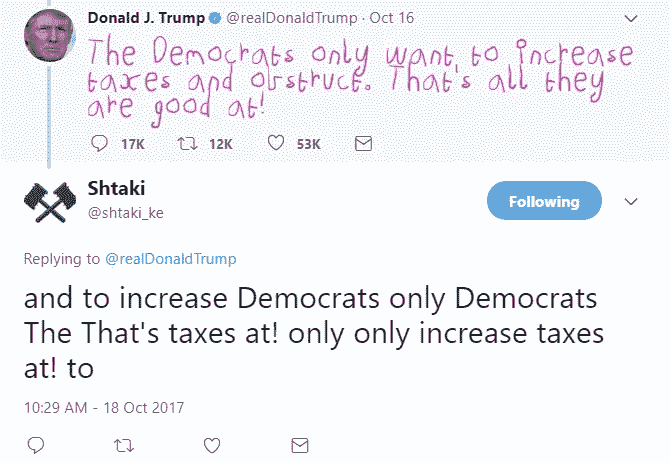

# 人工智能推特机器人

> 原文：<https://towardsdatascience.com/ai-twitter-bot-that-trolls-trump-3219b4338220?source=collection_archive---------3----------------------->

去年，我与人合作创办了一家公司，致力于用人工智能回答你的所有问题(我们从性健康开始)。我们制作了一个基于规则的机器人，并命名她为[索菲机器人](https://medium.com/@iamukasa/chronicles-of-a-bot-startup-c8ab49424956)——她的故事是我第一篇也是唯一一篇博文的主题；-)

过去的一年是试图优化基于规则的人工智能(很多是我们的失败)和创造一个新模型的集合。我们甚至试图用实际的人力投入来弥补她的不足，但这很快就失败了，在将近 3 月份的时候，我们的用户群增长了 100%(改天再发)，随后评论直线下降。我们知道我们已经超越了 MVP，现在我们必须建立一个端到端的问答机器人类型的引擎。我们可以在任何问答数据集上训练它，苏菲机器人将能够学习和回答来自同一个领域的问题。

我们天真地玩着机器学习实现，不管我们如何努力，即使我们有吴恩达的洞察力，它也永远不会工作。然后出现了一个我们根本不想碰的 LSTM 模式的例子。因为首先，我们认为深度学习已经过时了，其次，它使用了 Ubuntu 论坛对话语料库(如 wth)。几个月后，我们终于回到这个话题，看了看更有意义的 [Siraj Naval 的](https://github.com/llSourcell/tensorflow_chatbot)实现，因为它使用了 [Cornell 电影对话语料库](https://www.cs.cornell.edu/~cristian/Cornell_Movie-Dialogs_Corpus.html)。到目前为止，我们一直在优化，并准备投入生产。

尽管我们在努力做一个很棒的模型，但是几行源代码和一个简单的 cli 演示不足以向我们的麻瓜(非科技)利益相关者展示我们的进展。我们决定享受这项技术，并开发两个更轻便、有趣的实现作为演示。其中一个有趣的演示是一个 trolls trump 的机器人。

多亏了 Siraj 的 jupyter [笔记本](https://github.com/llSourcell/LSTM_Networks)中的一个，我从零开始构建了一个 LSTM，除了 numpy 之外没有任何用于矩阵乘法的库，并开始从中获得乐趣。从随机输入文本生成文本。少量的文本会产生类似于胡言乱语的东西，所以我们认为没有比回复胡言乱语更好的用例了。我们通过 LSTM 传递每条推文来实现这一点。

而且效果非常好。

可用源代码:[https://github.com/iamukasa/trolltrump](https://github.com/iamukasa/trolltrump)

推特直播手柄:[https://twitter.com/shtaki_ke](https://twitter.com/shtaki_ke)

接下来:我们能为 https://genius.com/Big-shaq-mans-not-hot-lyrics 创作更多的歌词吗