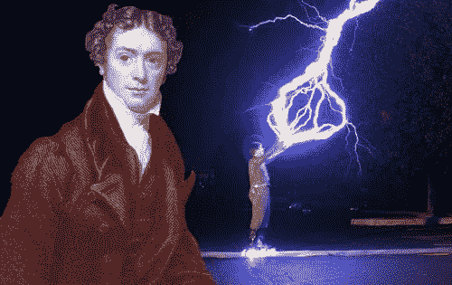
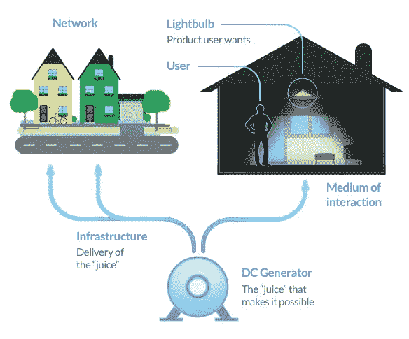
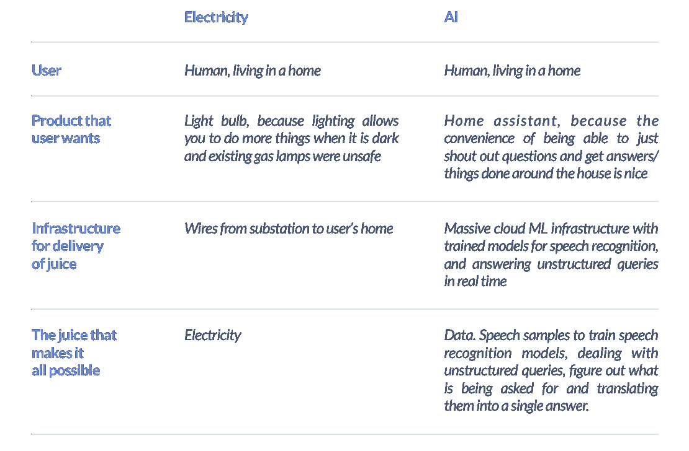
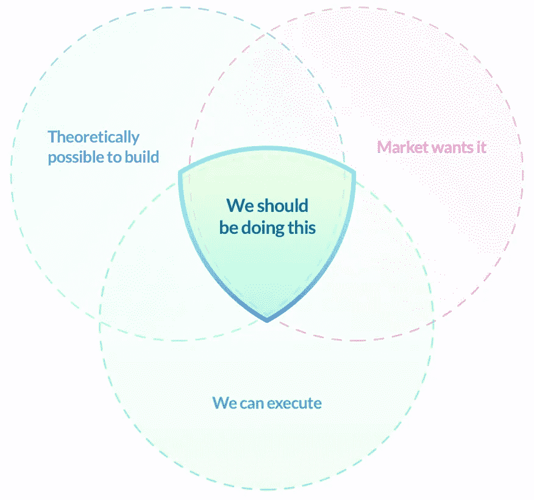
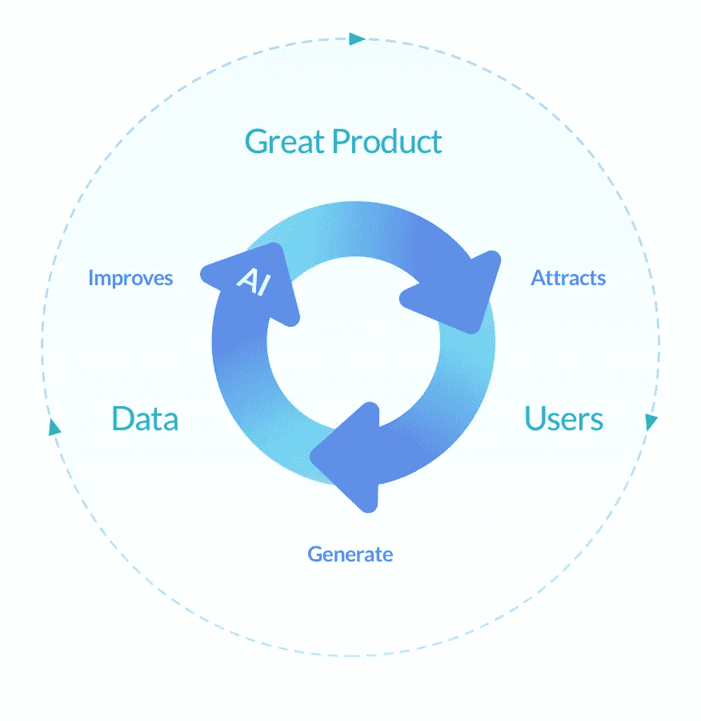
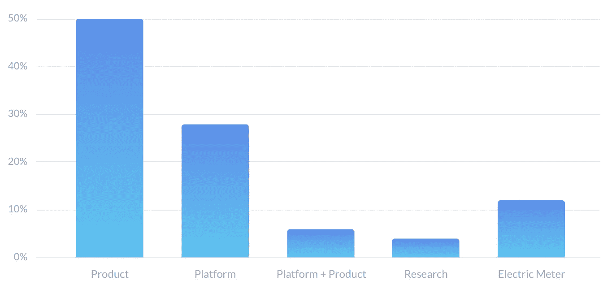
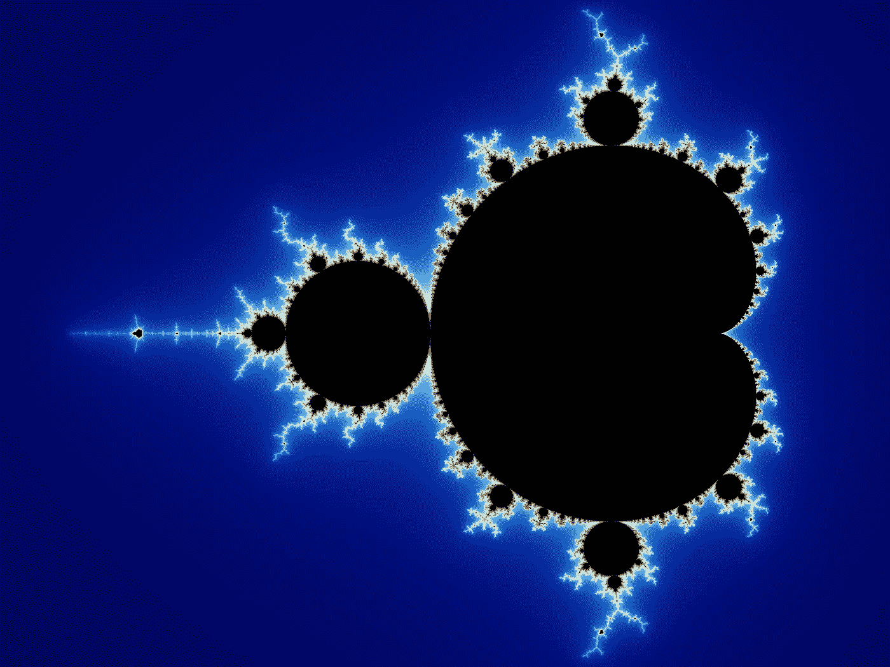
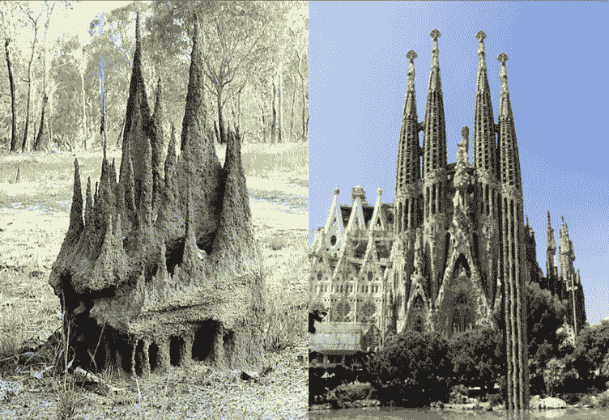

# 人工智能 vs 电力:人工智能创业剧本

> 原文：<https://towardsdatascience.com/ai-vs-electricity-the-ai-startup-playbook-abf223b52547?source=collection_archive---------4----------------------->

Image courtesy [Oimheidi](https://pixabay.com/en/users/Oimheidi-1660138/)

现在是 1850 年。迈克尔·法拉第感觉很好——他正在摆弄电磁感应。英国财政大臣威廉·格拉德斯通来到他的实验室，问道:“电力。有什么用？”对此法拉第回应道:“先生，有一天你可能会征税。”这是一个可爱的故事，但不是真的。

寻找“机器学习用例”的数据科学界让我想起了校长的问题。

吴恩达谈论“[人工智能如何成为新的电力](https://www.youtube.com/watch?v=21EiKfQYZXc)”。他说:

1.  人工智能将彻底改变我们所知道的每个行业。“通过用电力驱动的机器取代蒸汽驱动的机器，我们改变了运输、制造、农业、医疗保健等行业。”还有通信，安德鲁——你忘了通信！
2.  人工智能将取代人类的工作，但会创造新的工作
3.  作为一家企业，海量数据是您的推动力和保障

## **这个比喻很强烈**

让我们看看电力生态系统 c. 1912。

这看起来非常类似于我们今天如何构建一个人工智能产品，比如亚马逊 Alexa。

> 好的，数据是新的电力，对吗？

## **做出人们想要的东西**

电力时代的发明远远早于商业产品。人们普遍认为爱迪生解决了市场采用的问题。

来自[美国能源部](https://energy.gov/articles/history-light-bulb):

> 爱迪生对电灯照明的贡献如此非凡，是因为他没有停止改进灯泡——他开发了一整套发明，使灯泡的使用变得切实可行。爱迪生以现有的煤气照明系统为基础设计了他的照明技术。1882 年，他在伦敦的霍尔本高架桥上展示了电力可以从位于中心的发电机通过一系列电线和管道(也称为导管)进行分配。与此同时，他专注于改善发电，在曼哈顿下城开发了第一个商业电力设施，名为[珍珠街站](https://energy.gov/articles/top-9-things-you-didnt-know-about-americas-power-grid)。为了记录每个用户用了多少电，爱迪生发明了第一个电表。

他是一个有争议的人物，但是他遵循了一个简单的规则来使用电力。开发一个用户需要的产品，并想办法把它带给他们，这样他们就可以用它来改善他们的生活。

[做出人们想要的东西](http://www.paulgraham.com/good.html)。爱迪生制造产品，以及交付产品所需的支持技术。人们需要灯泡作为气体照明的更安全的替代品。

我们公司在产品 m1 上建立的“战略”就是这种可能性的文氏图。

> 我们可以执行=我们有人才和知识来构建和销售它。我们比其他人都有优势
> 
> 市场需要=有客户需求，整体融资/业务环境有利于相关活动

甜蜜点之外的想法通常是“如果我们做 X 不是很酷吗？”。

在人工智能领域，人们可以想到很多理论上很好的想法。例如，建立一个人工智能来取代律师。在我们的案例中:构建一个 ML 驱动的产品设计平台。你到底是怎么做到的？

## **艾产品**

吴恩达的人工智能产品的良性循环是思考构建人工智能产品的一个很好的心智模型。

由于 AI 需要数据来工作，所以像个人助理这样的 AI 产品会随着更多的数据而变得更好。优秀的产品会获得更多的用户，从而获得更多的数据，进一步强化这种正反馈循环。在他的演讲中，他说“谷歌和百度拥有如此复杂的数据获取策略，以至于我不知道一家小型初创公司如何能够开始获取人工智能产品所需的数据”。

Google Allo 现在突然有意义了。

当谷歌推出 Allo 时，全世界(包括我)都在嘲笑他们——他们的消息和聊天机器人策略似乎无处不在。如果他们这样做是为了获取 Google Home 的非结构化查询数据，我不会感到惊讶。通过将来自 Allo 的数据植入 Home，开箱即用的 it [工作得更好](https://www.forbes.com/sites/jaymcgregor/2017/11/28/google-home-mini-vs-amazons-echo-dot-45-complex-questions-1-clear-winner/#1dc7c2511910)。

> 如果你有更多来自产品用户的数据，一个人工智能产品会变得更好。一个没有随着更多数据改进的产品是一个平台或一种使能技术，而不是一个产品。

服务也可以是产品，人工智能产品的定义与交付给最终用户的方式或所采用的商业模式无关。

# **人工智能创业剧本**

对于小型人工智能初创公司来说，需要访问大量数据来构建人工智能产品可能会令人沮丧，特别是对于那些需要大量数据的产品来说，如个人助理。

没人说这会很容易。这不是不可能的。从语法上来说,正在复制谷歌规模的关于人们写作模式的数据。总有办法的。

**玩法 1** :如果你是一家人工智能产品公司，你的产品策略和你的数据采集策略是一样的。

**第二招**:如果你在为一个产品搭建平台或提供技术支持，你就是在支持别人的产品。你受制于人工智能产品更广阔的市场环境。相应地行动和计划。

**玩法#3** :所有 AI 产品公司都有某种形式的内部平台。如果要在构建产品和平台之间做出选择，那就构建一个产品。产品公司胜算更大，因为他们比平台公司捕捉到更多的价值。

去年获得资助的前 50 家公司很好地代表了市场现实。这是他们如何按类别细分的。[分析链接](https://docs.google.com/spreadsheets/d/1oMC3ill7mFeGWGu7id4PObIuLgZPo1bqA7J9LdUMJno/edit#gid=0)

> 电表=支持另一种产品的技术，但本身不是产品

**重头戏 4** :如果你是一家 B2B 人工智能公司，你需要一些特别的东西来赢得长期的构建与购买之争。从短期来看，“你没有内部专业知识”可能会满天飞，但这是一颗定时炸弹。大多数认真对待人工智能的公司都希望拥有自己内部的核心优势。

**打法#5** :炒作已经过去了。人工智能和人工智能公司仍然是未来的热点，但如果你想长期获胜，你需要深入思考你在生态系统中的位置。

你是在为产品的采用建立一个产品、平台、组合、研究或支持技术吗？你是在建造灯泡，一家公用事业公司，试图发明电视或电表吗？从电的比喻中可以学到很多东西。从电力时代学习 GE、西联等相关公司。

**玩法#6** :不要做创业，要创业。近年来，大多数人工智能初创公司的退出都是由[收购](https://www.linkedin.com/pulse/artificial-intelligence-teams-being-acquired-employee-victor-basta/)。让我们面对它——作为一个行业，我们还没有想出如何从零开始建立一个长期、独立、大型和可持续的人工智能公司。互联网世界中的谷歌还没有在人工智能世界中诞生。可能是你。

**第七场**:没有剧本。如何获胜没有公式，没有模板。我们正在数字数据的基础上构建一个完整的产品和平台生态系统。这是前所未有的，也不知道结果会如何。

作为文化进化的一个子集，新技术的采用倾向于遵循生物进化的熟悉特征。

## **AI 为电，缩小后**

进化是一种分形。

通过这个视频[我了解了进化分形的概念](https://www.youtube.com/watch?v=iK4tPDjXch8&feature=youtu.be)。它有一个不被看好的开始，听起来有很多关于爱和意识的废话。但是，它的核心是一个非常强大的进化分形概念。数学分形在每个“缩放级别”看起来都是一样的，进化过程也是如此。

布鲁斯·利普顿[从生物进化的角度解释了这个想法](https://www.brucelipton.com/resource/article/fractal-evolution)。

> 分形的一个结构特征相对容易理解:分形展示了一种重复的“结构”模式，这些结构相互嵌套。每个较小的结构都是一个缩影，但不一定是大结构的精确版本。分形数学强调整体中看到的模式和整体中部分看到的模式之间的关系。例如，树枝上细枝的模式类似于树干上分枝的模式。分形对象可以用“盒子”中的“盒子”、“盒子”中的“盒子”来表示，等等。如果一个人知道第一个“盒子”的参数，那么一个人就自动地被提供了表征所有其他(更大或更小的)“盒子”的基本模式

The Mandelbrot set, which you get when you iteratively graph f(z) = z2 + c. [gif here](https://en.wikipedia.org/wiki/Mandelbrot_set#/media/File:Mandelbrot_sequence_new.gif)

这篇文章的简短摘要是:

1.  细胞膜必须决定让什么进出细胞。这是一个试图理解混乱环境的传感器
2.  细胞的各个部分代表了一个为了更高的目标而共同运作的社会
3.  在生命的最初 30 亿年里，只有单细胞生物——细菌、藻类、原生动物、原核生物。我们知道真核细胞是在 30 亿年后出现的，但这是怎么发生的呢？单细胞生物体的大小是有极限的，所以它不只是变大并进化出更多的组成部分
4.  主要的理论是两个单细胞生物碰巧合并，产生的生物更适合并在环境中存活下来。真核生物出现了。
5.  进化过程充满了这种重复的模式。他举了一个计算器芯片的例子，它达到了计算器的极限。芯片与其他芯片放在一起，连接在一起，组成一台计算机——你达到了极限，你就建立了分布式/云计算。

他最后宣称人类可能代表了脊椎动物进化的极限。在进化的下一个阶段，我们需要共同努力，就像单细胞生物变成多细胞生物一样。

所有的进化过程都是看起来一样的重复模式，即分形。

如果我们认为技术进步和采用是遵循相似模式的文化进化的一种形式，这将变得非常有趣。人工智能时代看起来像是电力时代的“缩小”分形。

我们现在有更好的能力来观察文化进化的分形本质，因为技术转变是在更短的时间尺度内发生的，遵循的是加速回报定律。

而且还会变得更快。

谁来‘赢 AI’？没有一个玩家赢得了电。许多人赢得了电力。如果你能想出如何留在游戏中，每个人都有很多空间。如果人工智能的破坏将以同样的规模发生，会有唯一的赢家吗？

## **互联网**

这个故事里的互联网在哪里？

在通过回顾电力时代来绘制人工智能路径时，我们在进化分形上“缩小”了一个层次，因此尽管原理可能是相同的，但它们的细节会有所不同。后端云基础设施是 Alexa 的交付机制，就像从变电站到用户家的电线是电力的交付机制。

我不认为互联网是人工智能生态系统的一部分。任何少于土地的东西都是电力生态系统的一部分。它就在那里，而你认为这是理所当然的。

电力和铺设的跨大西洋电缆使跨越大西洋的信息传递成为可能。你想拖就拖所有该死的电缆——如果你还没搞清楚电，电报就不会工作。

从众所周知的进化分形中抽离出来，我们正——恰当地——从现实世界走向数字世界。在这种环境下，我们认为互联网是理所当然的——它只是我们用来绘画的挂毯。就像现实世界中的土地一样。

## **紧急 AGI**

我们正处于人工智能成为可能的开端。我们现在才安装第一批灯泡。我们处在 1890 年电力的时代。电话、收音机、电视、电子产品、电脑和互联网紧随其后——我们还没有看到它们在人工智能时代的对等物。

[丹尼尔·丹尼特的这个演讲](https://www.youtube.com/watch?v=TTFoJQSd48c)提出了有史以来最奇怪的问题:你如何从白蚁群体的大脑中获得高迪式的思维？

总结一下:

1.  复杂的行为有可能出现在不知道自己在做什么的愚蠢个体身上——没有理解力的能力。这就是为什么 7000 万只白蚁最终建造了一座看起来像高迪在巴塞罗那的教堂——圣家族教堂的白蚁城堡。
2.  但是高迪是一个聪明的设计师。这是理解能力。你如何从 860 亿个对其更高目的毫无概念的神经元中得到人脑？
3.  大脑是一种计算机，它接受输入并根据输入执行控制。它的工作方式不同于我们对数字计算机的概念，数字计算机是中央控制的，具有高度确定性，每个部分都有专门的角色，除此之外别无其他。大脑最好被认为是由 860 亿个神经元组成的汤，每个神经元都在做自己的事情，并试图生存。人脑的这种奇妙的计算由此产生
4.  自下而上的设计比自上而下的慢，但它有能力结合起来创造更大的结构，因此探索进化设计空间更有成效。这就是进化——包括文化进化和生物进化——的工作方式，这似乎是解决长期问题的最佳方式

我们是愚蠢的，人类个体做我们的事情。我只是一只写这篇文章的白蚁——我不知道我的工作如何有助于一个更大的结构——人类正在建造一个 AGI。我无法聪明地设计这个更大的结构。每一个开始的公司和每一个推出的产品都是我们不理解的盲目的一步。理解和智能设计出现在许多许多的迭代中。

我相信 AGI 会以这种方式崛起——当它发生时，我们可能甚至不会承认。就像我们不承认自己是电子人一样，尽管我们可以通过手掌上的屏幕获取世界上所有的信息。

如果你喜欢这篇文章，请随意点击那个按钮👏帮助其他人找到它。

在 [Product ML](http://www.productml.com/) ，我们正在建立一个平台来创造人工智能驱动的产品体验。祝我们好运！