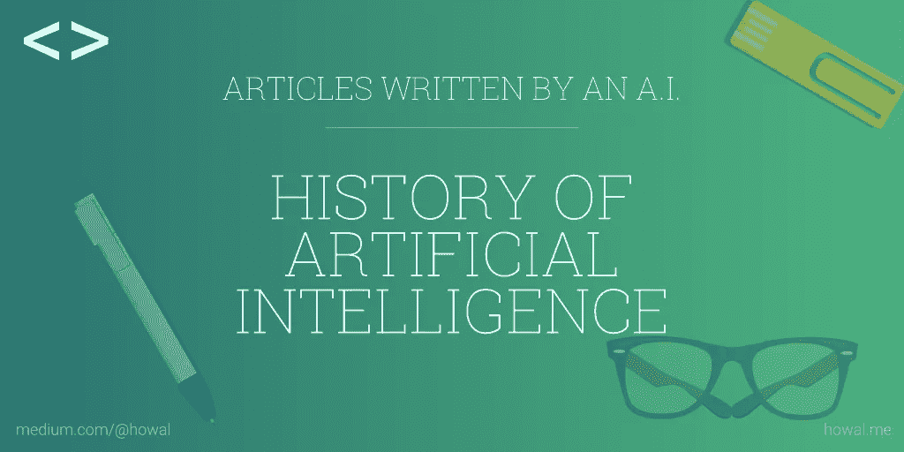

# 人工智能的历史

> 原文：<https://towardsdatascience.com/ai-writes-the-history-of-artificial-intelligence-4d585b537498?source=collection_archive---------5----------------------->

> 注:这篇文章是一个人工智能写的。

二十世纪上半叶，科幻小说向世界介绍了人工智能机器人的概念。[ [0](http://ai-writer.com/out.php?url=uggc://fvga.uzf.uneineq.rqh/synfu/2017/uvfgbel-negvsvpvny-vagryyvtrapr/)

虽然我们今天的工具更加复杂，但人们一直想知道在机器中创造人类智能意味着什么。[ [1](http://ai-writer.com/out.php?url=uggcf://jjj.xvqfpbqrpf.pbz/nv-gvzryvar/)

从那以后，在文学作品中出现了智能人工制品，而真实的(和欺骗性的)机械装置实际上显示了一定程度的智能。[ [2](http://ai-writer.com/out.php?url=uggcf://ra.jvxvirefvgl.bet/jvxv/Uvfgbel_bs_negvsvpvny_vagryyvtrapr)

从那时起，智能人工制品出现在文学作品中，而真实的(和欺骗性的)机械装置实际上显示了某种程度的智能。[ [3](http://ai-writer.com/out.php?url=uggcf://nvgbcvpf.bet/zvfp/oevrs-uvfgbel)

第二次世界大战汇集了许多领域的科学家，包括神经科学和计算机科学的新兴领域。[ [4](http://ai-writer.com/out.php?url=uggc://jjj.oop.pb.hx/gvzryvarf/md376se) ]

直到 20 世纪 50 年代，我们有一代科学家、数学家和哲学家，他们的头脑中已经在文化上同化了人工智能(或 AI)的概念。[ [5](http://ai-writer.com/out.php?url=uggc://fvga.uzf.uneineq.rqh/synfu/2017/uvfgbel-negvsvpvny-vagryyvtrapr/)

艾伦·图灵就是其中之一，他是一位年轻的英国聚合物，研究人工智能的数学可能性。[ [6](http://ai-writer.com/out.php?url=uggc://fvga.uzf.uneineq.rqh/synfu/2017/uvfgbel-negvsvpvny-vagryyvtrapr/)

在英国，数学家艾伦·图灵和神经学家格雷·沃尔特是两位面对智能机器挑战的聪明人。[ [7](http://ai-writer.com/out.php?url=uggc://jjj.oop.pb.hx/gvzryvarf/md376se)

在 20 世纪 40 年代和 50 年代，不同学科(数学、心理学、工程学、工程学、经济学和政治学)的少数科学家开始谈论创造人工大脑的可能性。[ [8](http://ai-writer.com/out.php?url=uggcf://ra.jvxvcrqvn.bet/jvxv/Uvfgbel_bs_negvsvpvny_vagryyvtrapr)

工作已迅速成为人工神经网络研究的基础，并在人工智能研究中有许多用途。[ [9](http://ai-writer.com/out.php?url=uggc://jjj.pbzchgreuvfgbel.bet/gvzryvar/nv-ebobgvpf/)

自 1956 年以来，人工智能作为一个令人兴奋和富有想象力的概念，在几份报告批评缺乏进展后，人工智能研究的资金在 20 世纪 70 年代被削减。[ [10](http://ai-writer.com/out.php?url=uggc://jjj.qngnirefvgl.arg/oevrs-uvfgbel-negvsvpvny-vagryyvtrapr/)

计算器对于人工智能的历史至关重要，因为需要用预先计算的值创建精确的表格，这导致了查尔斯·巴贝奇在 1840 年设计的分析引擎的诞生，这启发了 20 世纪 30 年代和 40 年代创建的最早的计算机。[ [11](http://ai-writer.com/out.php?url=uggcf://jjj.xvqfpbqrpf.pbz/nv-gvzryvar/)

逻辑理论是一个旨在模仿人类解决问题技能的程序，由研究与发展公司(RAND)资助。[ [12](http://ai-writer.com/out.php?url=uggc://fvga.uzf.uneineq.rqh/synfu/2017/uvfgbel-negvsvpvny-vagryyvtrapr/)

视觉系统，通过外部感受器、人造眼睛和耳朵来测量物体的距离和方向。[ [13](http://ai-writer.com/out.php?url=uggcf://ra.jvxvcrqvn.bet/jvxv/Uvfgbel_bs_negvsvpvny_vagryyvtrapr) ]

第一次冬季人工智能以“专家系统”的引入而结束，这些系统已经被世界各地的竞争公司开发并迅速采用。[ [14](http://ai-writer.com/out.php?url=uggc://jjj.qngnirefvgl.arg/oevrs-uvfgbel-negvsvpvny-vagryyvtrapr/)

它于 1963 年被斯坦福大学收购，是首批由计算机控制的人造肩膀机器人之一。[ [15](http://ai-writer.com/out.php?url=uggc://jjj.pbzchgreuvfgbel.bet/gvzryvar/nv-ebobgvpf/)

在 20 世纪 80 年代末，一些研究人员支持一种基于机器人技术的全新人工智能方法。[ [16](http://ai-writer.com/out.php?url=uggcf://ra.jvxvcrqvn.bet/jvxv/Uvfgbel_bs_negvsvpvny_vagryyvtrapr)

一种完全不同的方法是通过测试来衡量机器的智能，这种测试是在智能的数学定义的基础上开发的。[ [17](http://ai-writer.com/out.php?url=uggcf://ra.jvxvcrqvn.bet/jvxv/Negvsvpvny_vagryyvtrapr)

目前，谷歌、脸书、IBM 和微软等大型技术公司正在研究广泛的人工智能项目，包括虚拟助手。[ [18](http://ai-writer.com/out.php?url=uggc://jjj.qngnirefvgl.arg/oevrs-uvfgbel-negvsvpvny-vagryyvtrapr/)

谷歌是这种新方法的先驱:数以千计的高性能计算机，支持并行神经网络，学习从多个谷歌用户的海量流数据中发现模式。[ [19](http://ai-writer.com/out.php?url=uggc://jjj.oop.pb.hx/gvzryvarf/md376se)

它的创造者使用了无数的人工智能技术，包括神经网络，并在三年多的时间里训练一台机器识别问题和答案的模式。[ [20](http://ai-writer.com/out.php?url=uggc://jjj.oop.pb.hx/gvzryvarf/md376se)

机器伦理领域关注的是给予机器伦理原则或程序，以发现解决它们可能遇到的伦理困境的方法，允许它们通过做出自己的伦理决定来伦理地运行。[ [21](http://ai-writer.com/out.php?url=uggcf://ra.jvxvcrqvn.bet/jvxv/Negvsvpvny_vagryyvtrapr)

此外，对机器伦理的研究有助于揭示当前伦理理论的问题，发展我们对伦理的思考。[ [22](http://ai-writer.com/out.php?url=uggcf://ra.jvxvcrqvn.bet/jvxv/Negvsvpvny_vagryyvtrapr) ]

我认为，这种担心是由于一个根本性的错误，即没有区分最近在禽流感的一个具体方面取得的真正进展和建立一个敏感的自愿情报的巨大和复杂。[ [23](http://ai-writer.com/out.php?url=uggcf://ra.jvxvcrqvn.bet/jvxv/Negvsvpvny_vagryyvtrapr)

微软的联合创始人比尔·盖茨加入了杰出的技术大师和科学家的行列，发现了他对人工智能对人类文明的潜在危险影响和意想不到的后果的想法。[ [24](http://ai-writer.com/out.php?url=uggc://jjj.pbzchgreuvfgbel.bet/gvzryvar/nv-ebobgvpf/)

# 来源

[0][http://sitn . HMS . Harvard . edu/flash/2017/History-artificial-intelligence/](http://ai-writer.com/out.php?url=uggc://fvga.uzf.uneineq.rqh/synfu/2017/uvfgbel-negvsvpvny-vagryyvtrapr/)
【1】[https://www.kidscodecs.com/ai-timeline/](http://ai-writer.com/out.php?url=uggcf://jjj.xvqfpbqrpf.pbz/nv-gvzryvar/)
【2】[https://en . wikiversity . org/wiki/History _ of _ artificial _ intelligence](http://ai-writer.com/out.php?url=uggcf://ra.jvxvirefvgl.bet/jvxv/Uvfgbel_bs_negvsvpvny_vagryyvtrapr)
【3】[https://aitopics.org/misc/brief-history](http://ai-writer.com/out.php?url=uggcf://nvgbcvpf.bet/zvfp/oevrs-uvfgbel)
【4】[http://www.bbc.co.uk/timelines/zq376fr](http://ai-writer.com/out.php?url=uggc://jjj.oop.pb.hx/gvzryvarf/md376se)
【5】[http://sit](http://ai-writer.com/out.php?url=uggc://fvga.uzf.uneineq.rqh/synfu/2017/uvfgbel-negvsvpvny-vagryyvtrapr/) [https://en . Wikipedia . org/wiki/History _ of _ artificial _ intelligence](http://ai-writer.com/out.php?url=uggcf://ra.jvxvcrqvn.bet/jvxv/Uvfgbel_bs_negvsvpvny_vagryyvtrapr)
[https://en.wikipedia.org/wiki/Artificial_intelligence](http://ai-writer.com/out.php?url=uggcf://ra.jvxvcrqvn.bet/jvxv/Negvsvpvny_vagryyvtrapr)
【18】[http://www . data versity . net/brief-History-artificial-intelligence/](http://ai-writer.com/out.php?url=uggc://jjj.qngnirefvgl.arg/oevrs-uvfgbel-negvsvpvny-vagryyvtrapr/)
【19】[http://www.bbc.co.uk/timelines/zq376fr](http://ai-writer.com/out.php?url=uggc://jjj.oop.pb.hx/gvzryvarf/md376se)
[http://www.bbc.co.uk/timelines/zq376fr](http://ai-writer.com/out.php?url=uggc://jjj.oop.pb.hx/gvzryvarf/md376se)
【21】[https://en.wikipedia.org/wiki/Artificial_intelligence](http://ai-writer.com/out.php?url=uggcf://ra.jvxvcrqvn.bet/jvxv/Negvsvpvny_vagryyvtrapr)

***注:*** *本文由 AI-Writer 出品。你给它一个标题，它写下内容。这些句子是从原文中挑选出来并加以解释的。同时保持给予 AI 的标题的上下文。我定期测试这个软件，以发现改进之处。我会定期发类似的文章。请多建议一些话题。我不确定这个系统能处理多少流量。如果你正在尝试，请温柔对待它。*