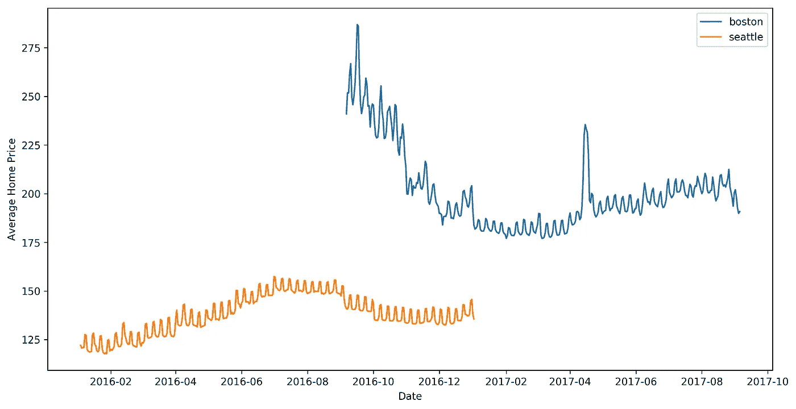
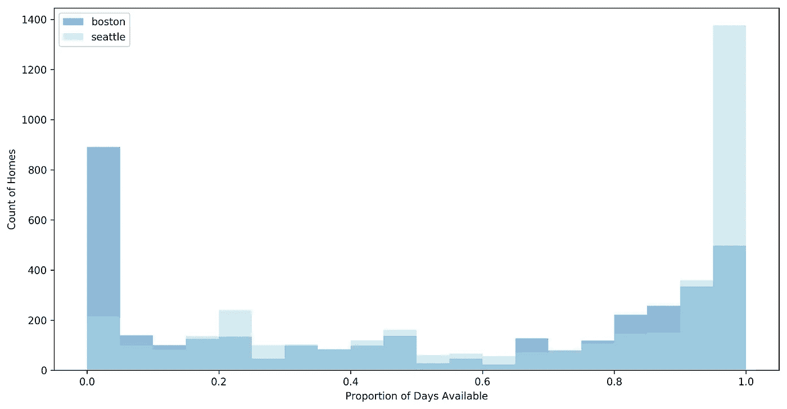
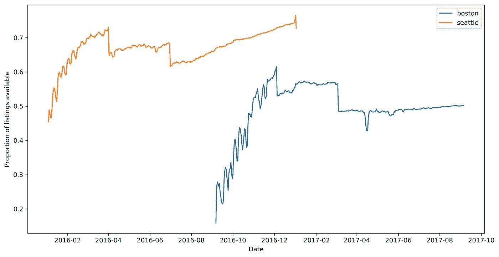
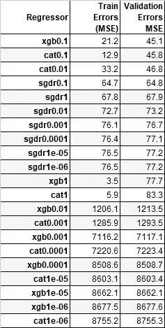
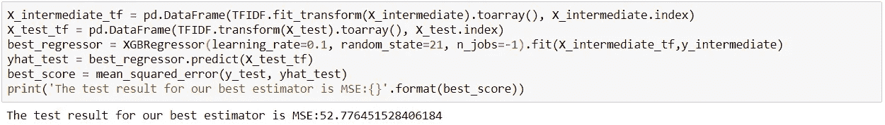
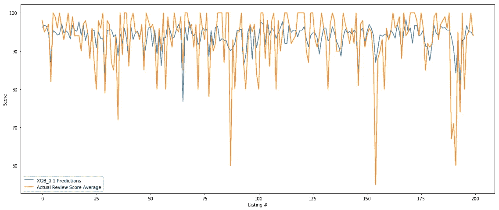

# 双城 AirBnB:西雅图 vs 波士顿

> 原文：<https://towardsdatascience.com/airbnb-in-two-cities-seattle-vs-boston-66fba22fc1c1?source=collection_archive---------7----------------------->

## AirBnB 房源的定价、可用性和评论分析

Photo by [Tom Rumble](https://unsplash.com/@tomrumble?utm_source=medium&utm_medium=referral) on [Unsplash](https://unsplash.com?utm_source=medium&utm_medium=referral)

对于旅行者来说，AirBnB 已经成为常规酒店预订网站越来越受欢迎的替代品。它有助于将那些有多余房间或公寓的人与需要短期住宿的旅行者直接联系起来。

在今天的帖子中，我们将深入研究 Kaggle 为这两个城市提供的 AirBnB 数据集，其中包括三个 csv 文件:日历、房源和评论。

我们将研究 AirBnB 来自数据集的住房数据的定价和可用性机制，并回答两个从数据集中获取宝贵见解的问题。最后，我们将结束第三个问题，展示一个将提供给列表的评论转换成其得分预测的回归。代码和数据可以通过补充的 [github 链接](https://github.com/denizn/AirBnb-Kaggle-Data-Analysis)到达。

**问题 1:波士顿和西雅图的房价如何？它们有季节性吗？有导致价格上涨的事件吗？**

波士顿的预订价格中位数是每晚 150 美元；而西雅图是每晚 109 美元。全年来看，波士顿一晚的费用明显高于西雅图。

总的来说，在夏季期间，这两个城市的预订价格都会上涨。

虽然在西雅图数据中没有明显的峰值，但是在波士顿数据集中出现了一个特别有趣的峰值。在 4 月 17 日举行的波士顿马拉松比赛期间，有超过 3 万名参赛者参加，AirBnB 在该地区的价格似乎上涨了每晚 34 美元左右。

Chart 1: Comparison of Average Home Price over dates

**问题 2:这两个城市全年的房源情况如何？**

在波士顿，在任何给定的时间，有 49%的机会可以找到任何房源，而在西雅图，这个数字要高得多，为 67%。这可以解释为波士顿的供需比高于西雅图。这可能意味着波士顿是一个更受游客欢迎的目的地，因此认为相对于西雅图更难找到房子。

当谈到房子的可用性时，西雅图和波士顿都具有相对均等的分布，除了在 95%以上的时间有房子可用的高峰。这些可能是房子，如那些有不合理的高定价和没有吸引力的方面来支持这一价格。

在波士顿，有 891 栋房子非常受欢迎，而且只有不到 5%的时间可以入住。由于多种因素，如位置、价值和清洁度，这些房子是最受欢迎的。

Chart 2 : Availability of Boston vs Seattle

对于波士顿和西雅图，数据集中记录的列表项的数量全年保持不变，分别为 3586 和 3818，而它们的可用性作为每天变化的布尔值提供。

下面的可用房源比例图中最直接的部分可能是，在数据的前三个月，有一个持续上升的趋势。这是因为所提供的数据是拍摄的快照，越接近快照日期的预订率越高。

Graph 3: Proportion of Listings available

**问题 3:我们可以使用回归从评论中预测评论分数吗？访问者对某个列表的评论是否给了我们足够的信息来猜测该列表的评论分数？**

Reviews.csv 包含用户对预订的评论，Listing.csv 文件包含每个列表的平均评论分数。我想看看从作为练习提供的评论中预测评论分数的潜力。

为此，我将把为一个列表提供的所有评论连接成一个字符串，应用文本清理、特征提取方法和 ML 回归来预测我的响应变量，即 ***评论评分*** *。*

我们将使用的提取特征的方法 TFIDF 类似于单词袋方法，但是考虑到了频率并降低了语料库中更常见的单词(整个单词世界)的影响。

在使用 TFIDF 矢量器进行特征提取后，我们将使用交叉验证来测试三种不同的机器学习算法:Scikit learn 的[随机梯度下降回归器](https://scikit-learn.org/stable/modules/generated/sklearn.linear_model.SGDRegressor.html)，DMLC 的[xgboostrgressor](https://xgboost.readthedocs.io)和 Yandex 的 [CatBoostRegressor](https://tech.yandex.com/catboost/doc/dg/concepts/python-reference_catboostregressor-docpage/) 具有不同的学习速率。通过查看最低的 MSE 验证误差，我们应该能够选择在 NLP 管道中使用的回归变量和参数。

Table 1: Regression Results for XGBoost, CatBoost and SGDR

正如您在上面看到的，XGBoost 和 CatBoost 算法在交叉验证结果中的验证错误率方面非常接近，XGBoost 在 learning_rate 为 0.1 时表现稍好，成为赢家。在这一阶段，我们并不真正关注训练误差，只是因为我们想比较我们的模型在它没有见过的数据上的表现。

注意:XGB 和 Catboost 较低的学习率(如 0.0001)似乎没有收敛，因此产生了非常高的错误率。

最后，我将 TFIDF 矢量器的管道拟合到 X_intermediate 数据，对其进行转换，并将其馈送到学习率为 0.1 的 XGB 回归器。然后，我们对 X_test 进行预测，并使用均方误差评分将它们与 y_test 的实际值进行比较。

Snippet 1 : MSE Result of our best performing estimator

为了比较，我们可以看一下 XGB 预测分数和实际复习分数的曲线图。正如您所看到的，我们的模型在根据提供的评论预测分数方面表现得相当好。

Graph 4: XGB Predictions vs Actual Review Score Average