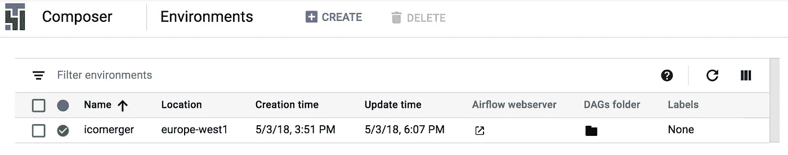
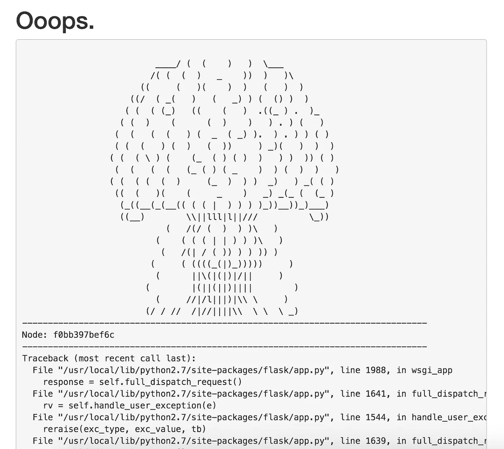

# 谷歌的气流:对 Cloud Composer 的第一印象

> 原文：<https://towardsdatascience.com/airflow-by-google-a-first-impression-of-cloud-composer-f4d9f86358cf?source=collection_archive---------2----------------------->

日前，Google Cloud [公布了 Cloud Composer](https://cloud.google.com/blog/big-data/2018/05/cloud-composer-is-now-in-beta-build-and-run-practical-workflows-with-minimal-effort) 的测试版。简而言之，Cloud Composer 是针对[气流](https://airflow.apache.org/)的托管解决方案，这是一个开源平台，用于以编程方式创作、调度和监控工作流。对于不熟悉气流的数据人员:您主要使用它来编排您的数据管道。

Airflow

由于我一直在寻找气流的托管解决方案，所以我决定本周带着 Cloud Composer 去兜一圈。托管解决方案的好处在于，作为一名数据工程师或数据科学家，您不必在开发运维上花费太多时间——这是您可能不太擅长的事情(至少我不擅长！).

因此，下面是一篇非常简短的关于测试 Cloud Composer 的体验的文章。这绝不是一个详尽的评价——这只是我对 Cloud Composer 的第一印象。

## 我喜欢云作曲家的地方

设置非常简单**。如果你有一个 Google Cloud 帐户，只需点击几下鼠标(外加大约 20 分钟等待你的环境启动)。您还可以从 Python 包索引(PyPI)中轻松列出所需的 Python 库，设置环境变量，等等。**

**部署简单**。你的 DAGs 文件夹位于谷歌云存储的一个专用桶中。这意味着您可以直接拖放 DAG 文件夹的内容来部署新的 DAG。几秒钟之内，DAG 就会出现在气流 UI 中。当然，拖放并不是唯一的选择。您还可以通过使用 Google Cloud 的 gcloud 以编程方式进行部署。

当您的环境启动并运行时，Google Cloud **UI 是干净的**并且没有麻烦:它只是链接到 DAG 文件夹和您的 Airflow 服务器，这是您将花费大部分时间的地方。

Cloud Composer

总的来说，积极方面的主题是简单和易用，这可能是您在托管解决方案中寻找的。

## 有哪些可以改进的地方

Cloud Composer 运行 **Python 2.7** 。至少应该有一个运行 Python 3.6 的选项——老实说，我希望它是默认选项。

仍然有一些**错误**需要解决——毕竟，这是一个测试版。例如，当我试图清除一个任务时，我得到了这个屏幕:

TypeError: can’t pickle thread.lock objects

**定价**可以更加透明。运行 Cloud Composer 3 天后，我收到了一张€25 英镑的账单，所以假设这是线性的，我大概每月支付€250 英镑。这与谷歌云提供的[定价示例](https://cloud.google.com/composer/pricing#pricing_example)非常一致(注意，他们在示例中假设使用率为 25%)。

老实说，如果你的初创公司需要气流，并且你的内部没有很多 DevOps 人员，这是非常有价值的。但是，如果你的业余爱好项目主要着眼于气流，这可能太贵了。

如果你正在寻找另一个气流托管解决方案，在那里你可以获得更多的实践支持和培训，[天文学家](https://www.astronomer.io/airflow/)可能是一个不错的选择。

*您的气流设置是什么样的？请在下面的评论栏告诉我。*