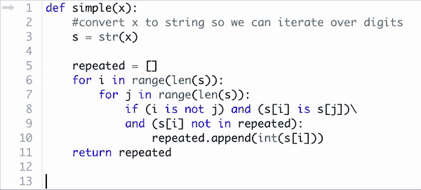
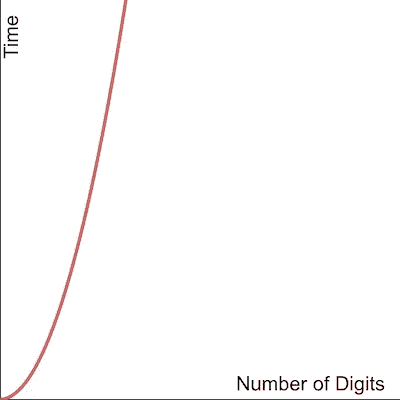
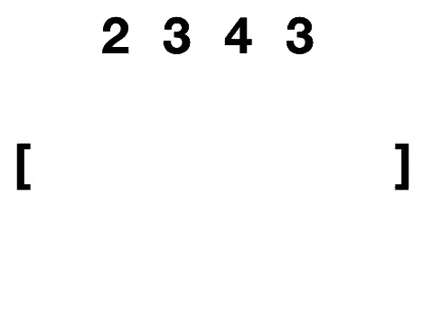
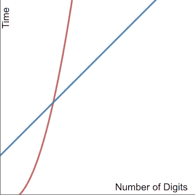

# 算法复杂性[101]

> 原文：<https://towardsdatascience.com/algorithmic-complexity-101-28b567cc335b?source=collection_archive---------9----------------------->


## 思考可伸缩性的介绍

计算机速度很快:它们使用电子信号存储和处理数据，这些电子信号以每小时几十万英里的速度穿过它们的硅内部。相比之下，人类神经系统中最快的信号传播速度约为 250 英里/小时，慢了 3 个数量级，而且这些速度只可能用于无意识信号——为有意识思维和计算观察到的信号速度通常更慢。基本上，我们永远不可能在计算上胜过计算机。

Good luck, Alan.

尽管速度很快，但事实上计算机确实有其极限，而且这些极限很容易量化。如今，处理速度是以 GHz 来衡量的:一个 3GHz 的单核处理器每秒可以执行 30 亿条基本指令。一条基本指令可以被认为是一种算术或逻辑运算，例如将两个数相加，对两个布尔值进行“与”运算，或者在内存中给一个变量赋值。Python、C、Java 或(此处插入您最喜欢的编程语言)等人类可读代码在执行之前被转换为机器可读代码，一行简单的人类可读代码可以转化为十几个或更多的机器基本操作。几十亿条指令看起来很多，但实际上，当你编写和运行一个程序时，除非你是一个拥有自己的专业超级计算机的奇特科学家，否则你的系统在运行你的代码的同时，在后台平衡和运行数百个其他程序。处理能力有限，所以计算机必须给每个程序公平地分配处理器时间。

Processor hogs are almost as bad as ice cream hogs.

就像任何其他有限的资源一样，尽可能地提高效率和避免浪费计算是非常重要的。这对数据科学家来说很重要，因为他们经常处理需要快速运行的复杂算法，以及需要处理、转换或重组的大型数据集；如果我们在方法上不够谨慎和聪明，这些任务会花费大量的时间。

进入算法复杂性的概念——一个相当简单的概念有两个相当大的词:

> **算法复杂度** 对于给定的**任务**，完成该**任务**的**算法**(即步骤列表)被称为**更复杂**，如果它需要**更多的步骤**来完成**。**

# 关于复杂性的推理

根据我的经验，通常最简单的方法是解释如何推理算法的复杂性，并通过使用一个例子来证明它在可伸缩性方面的有用性。所以我们来设定一个简单的任务吧！

**任务:**给定一个数，得到重复位数的集合。例如 301143523->【1，3】

一个简单的方法是检查我们看到的任何数字是否与该数字的字符串表示中的任何其他数字匹配，如果它不在那里，就将其添加到返回的集合中。

```
def simple(x): #convert x to string so we can iterate over digits
    s = str(x)

    repeated = [] for i in range(len(s)):
        for j in range(len(s)):
            if (i is not j) and (s[i] is s[j])\
            and (int(s[i]) not in repeated):
                repeated.append(int(s[i])) return repeated
```

我们需要计算出算法运行的步骤数。什么是台阶？是单行代码吗？我们能计算出运行这个算法需要多少行代码吗？下面是算法在一些样本数据上的执行情况:



Nope.

被执行的 Python 代码的行数很难计算出来，幸运的是，不能用来衡量一个算法的步骤数。这个标准取决于我们如何编写 Python 代码——如果我们让代码更 Python 化(可读性更差),我们可以把上面的代码压缩成一两行。代码仍然会被翻译成相同的机器代码，也就是计算机实际运行的代码。


That’s not how this works, Kevin.

因此，如果我们能以某种方式看到我们的代码被翻译成一行行的机器代码，我们能计算并使用这些代码来衡量一个算法需要的步骤数吗？

这将*非常*乏味，所以谢天谢地答案是否定的。不同的计算机架构运行不同类型的机器代码，每一种都可能将我们的 Python 代码翻译成不同的二进制表示，并且不一定能用相同数量的“机器代码行”来表示。

那么，从代码的角度来看，算法的步骤是由什么组成的呢？典型地，我们使用代码块的概念，一段代码表示关于输入数据的恒定时间操作。

> 一个**代码块**可以被标识为一行或多行代码从**第一行到最后一行**线性运行**而**没有真循环**。**

真正的循环是可变长度的循环。如果我们可以通过查看循环来判断它将迭代多少次，即`for i in range(3): do_something()`，那么我们可以等效地写`do_something()` 3 次来形成一个固定长度的代码块，因此它不是一个真正的循环。

```
for i in range(len(s)):
        for j in range(len(s)): **if (i is not j) and (s[i] is s[j])\
            and (s[i] not in repeated):
                repeated.append(int(s[i]))**return repeated
```

前面定义的`simple`函数中嵌套的 for 循环内部的体就是一个代码块的例子。

对于代码中的算法步骤，这是一个很好的定义，因为它是不变的，即使我们增加或减少不影响算法所做的语义的代码的语法行，它们也只是重新构造它们相应的代码块。

你可能很高兴听到我们可以更进一步，完全忘记代码。事实上，这绝对是做复杂性分析的最好方法。复杂性与代码几乎没有关系；它是算法的属性，而不是算法的实现。在编程中，我们经常强调将算法翻译成代码的重要性，但反过来的过程同样重要，如果不是更重要的话:优秀的程序员应该能够查看代码，通过将其分解成代码块，将其翻译回预期的算法，然后可视化该算法。

```
def simple(n):#convert n to string so we can iterate over digits
    s = str(n)

    repeated = []for i in range(len(s)):
        for j in range(len(s)):
            if (i is not j) and (s[i] is s[j])\
            and (int(s[i]) not in repeated):
                repeated.append(int(s[i]))return repeated
```

`simple`的代码用英语翻译成预定的算法:

> 给定整数 n
> 
> 为 n:
> 中的每一位设置一个集合
> ，为 n:
> _ _ _ _ 中的每一位设置一个集合，比较两者，如果匹配，则添加到集合中
> 
> 归还器械包

该算法转化为一些样本数据的可视化:


我们可以从这种可视化中推理出算法的复杂性。让我们来计算一下:对于`n`中的每一个数字，我们取该数字并与其他数字进行比较，如果比较的数字匹配，就将其添加到一个集合中。这对应几个步骤？对于`n`中的每个数字，我们执行`len(n) — 1`步骤，所以我们总共执行`len(n) x (len(n) — 1)` 恒定时间步骤，相当于`len(n)` `— len(n)`步骤。

那么算法的复杂度是多少？说是`len(n)` `— len(n)`会不会正确？算是吧。这准确地表示了算法完成给定任务所需的步骤数。然而，在实践中，我们实际上并不关心步骤的数量:一个算法比另一个算法少 100 步完成同样的任务听起来好得多，但实际上这种差异可能会转化为纳秒级的计算时间。我们更关心步骤的数量如何与输入数据的大小成比例。

# 大 O

大 O 符号是一种用来简洁地描述算法伸缩性的符号。在除了最理论化的计算机科学家之外的所有人看来，算法的大 O 值和它的复杂性是一回事。如果你在求职面试中被问到算法的复杂性，他们会说计算算法的大 O 值。

我们如何做到这一点？在我们已经做的基础上还有一个额外的步骤。首先，我们对算法的复杂性进行推理，就像我们刚刚对`simple`算法所做的那样，然后我们得到我们最终得到的表达式，并且**丢弃所有非主导项和常系数**。例如:`len(n)` `— len(n)`正好变成`len(n)`，因为这是主导项，我们现在可以表示由`simple`编码的算法具有复杂度`**O**(N²)`，其中`N`是输入的位数(即`N = len(n)`)。通常这被解释为“`simple`就是`**O**(N²)`”。

这是什么意思？这意味着，随着输入的位数增加，我们的算法完成任务所需的时间将呈二次方增加。这告诉我们我们的算法将如何扩展！



Computation time scales quadratically with the number of digits in our input.

让我们将这种可扩展性与解决相同任务的另一种编码算法进行比较:

```
def better(n):
    #convert n to string so we can iterate over digits
    s = str(n)

    #create 10 counting buckets
    buckets = [0 for x in range(10)]

    repeated = []

    #count number of each digit using buckets
    for i in range(len(s)):
        buckets[int(s[i])] += 1

    #get which digits occurred more than once
    for i in range(len(buckets)):
        if(buckets[i]) > 1:
            repeated.append(i)

    return repeated
```

语义翻译:

> 给定整数 n
> 
> 创建 10 个起始值为 0 的计数桶
> 为每个数字创建一个集合
> :
> _ _ 递增该数字的桶
> 中的计数
> 
> 返回集合

视觉翻译:



现在来计算算法的复杂度，给定一个输入`n`。首先，我们列出 10 个计数桶，每个数字一个。这是在固定时间内完成的，因此计为 1 步。接下来，我们迭代数字的位数，并增加相应的计数。这需要`len(n)`个步骤，每个步骤对应`n`中的一个数字。最后，我们对计数桶进行迭代，看看是否有计数大于 1 的桶。这也需要恒定的时间，因为有固定数量的桶，所以也只计为 1 步。

加起来，`better`的复杂度可以表示为`len(n) + 2`。去掉非主导项并去掉常系数:我们得到`better`是`**O**(N)`，其中`N = len(n)`。

## 比较

那么`**O**(N) better`与`**O**(N²) simple`相比如何呢？



Comparison of actual complexity of `simple (red) and better (blue)`

不出所料，`better`比`simple`扩展性强多了！有趣的是，由于在`better`中创建计数桶列表并在之后遍历它所带来的开销，对于非常小的输入数据，`simple`实际上比`better`执行得更好。回想一下，当输入较小时，计算差异最多是相对较少的指令，导致较小输入的时间差异可以忽略不计，而`better`实现了可伸缩性方面的巨大改进。

**当我们要讨论可伸缩性时，为什么要去掉非主导术语和主要常量？**

在我们最初的复杂性计算中，前导常数可以被吸收到一个步骤中…就像我们看到非真循环的想法一样。如果我们重复一个步骤有限次，我们可以简单地重新定义我们的步骤来考虑这个因素。这相当于用代数方法进行替换，去掉了常数。

我们去掉了非主导项，因为我们只关心可伸缩性，这意味着我们只关心随着输入数据变得越来越大，我们的算法的性能如何变化。让我们最后一次以`simple`为例，考虑它的实际复杂度与其大 O 值的比率:

```
 (N² — N) / N²   =  1 - 1/N
```

注意，随着`N`的增加，项 `1 - 1/N`越来越接近 1。事实上，我们可以通过选择足够大的`N`，使这一项尽可能接近 1。如果两个数之比是 1 意味着什么？他们是平等的。所以随着我们的输入数据`N`的增长，`(N² — N)`和`N²`变得越来越接近。这意味着对于足够大的数据来说，大的 O 值是我们算法复杂性的一个很好的度量，这告诉我们我们算法的伸缩性如何，并允许我们轻松地将其与解决相同任务的其他算法进行比较。我们知道，如果一种算法比另一种算法具有更小的大 O 值，那么对于足够大的数据，它会更快。我们还知道，如果两个算法具有相同的大 O 值，那么它们的伸缩性将相似。优秀的程序员平衡代码的可伸缩性和可读性，并且知道什么时候优先考虑这两者。

# 速度不是一切

我们从讨论计算机处理指令的速度比人快多少开始了这个话题。这只是在某种意义上是正确的:他们在处理*线性*指令时更快。人类的大脑已经进化到非常擅长平行化。他们可以同时看到、听到、闻到、触摸和品尝某种东西，同时有意识地思考其他东西，并下意识地控制所有正常的身体功能，如呼吸、消化和温度调节。单个处理器必须在这些任务之间快速切换，无法同时处理所有的信号。如今的计算机确实拥有多核处理器——多个相连的处理器有助于并行执行程序，但与普通人相比，它们的能力仍然非常有限。

人类也有很多记忆。我们可以保存一生的信息，并且(我们大多数人)可以有效地回忆起这些信息来帮助解决问题。关于算法复杂性的讨论的另一个方面是*时间*复杂性(速度)和*空间*复杂性(内存)之间的区别，以及什么时候一个应该优先于另一个——我们将留待另一天讨论。

这是一个总结——感谢阅读！

*如果您喜欢关于复杂性和可伸缩性的讨论，请随时联系我(* [*)了解您的想法或疑问！*](https://medium.com/u/de201d936fa2?source=post_page-----28b567cc335b--------------------------------)