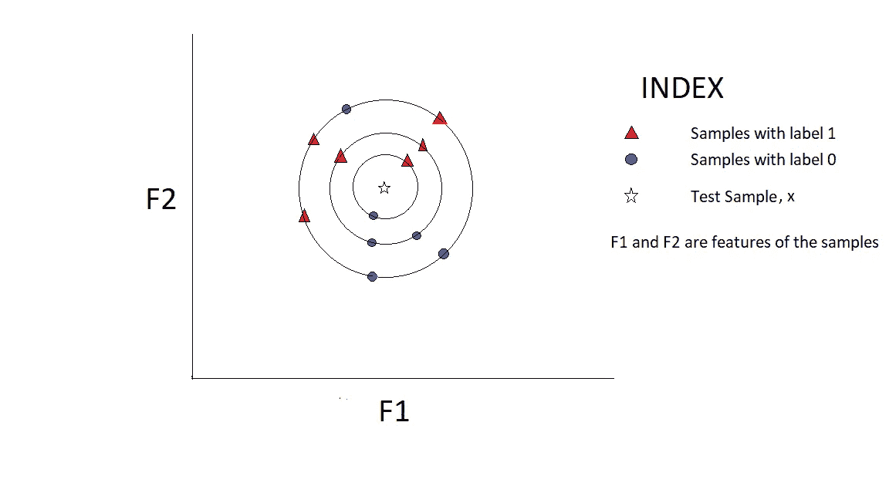

# 二元分类中 k 近邻算法的不完全性

> 原文：<https://towardsdatascience.com/algorithmic-incompleteness-of-k-nearest-neighbour-in-binary-classification-8149bfb97c6c?source=collection_archive---------10----------------------->


我们都知道经典的机器学习分类算法，**K-最近邻**作为最成功的非参数机器学习算法之一。Fix 和 Hodges 于 1951 年在一份未发表的美国空军航空医学学校报告中首次提出了这一规则[1]，该规则被称为 k-最近邻规则，并在随后的几年中经历了进一步的修改。近来，众所周知，在与计算机视觉相关的图像分类问题上工作良好。

但是，在数据高度平衡的情况下，我们是否意识到或小心它的不可预测性呢？事实上，我们中的许多人都太习惯于像 Python 中的 Scikit-Learn、R 编程、MATLAB 机器学习工具箱或 WEKA 这样的机器学习工具箱，以至于机器学习算法在它们的实现层面上往往不被重视。根据一些洗钱从业者的说法:

***对引擎盖下发生的事情有什么必要了解？..谁会要求你给出学习算法的算法描述或者概述？使用工具箱(即 Scikit-Learn)实现(函数调用它们)……最终结果是唯一重要的……深入学习 ML 算法是浪费时间*** ”

此外，在许多书籍中，如

**使用 Scikit Learn 进行机器实践学习& TensorFlow** [2]

不要给出任何算法概述，直接跳到机器学习算法的 Scikit-Learn 实现。我并不认为这本书不合适，只要这本书的作者希望读者在学习 Scikit-Learn 的正确用法之前，至少精通机器学习算法的概述或直观方法。

总之，我深入研究了 kNN 算法，在实现层面上，我发现了算法中一个有趣的异常。

kNN 实际上是使用**特征空间欧几里德几何**构建的，使其成为一种无参数的学习算法。在进入伪代码之前，可视化特征空间中的所有数据点是很重要的。

二进制分类中 kNN 算法的伪代码如下所示:

有几个函数将用在伪代码中，仅用于解释工作原理，而不是用任何语言编程或编码，

1.  nearest_neighbors(x):返回一个二维样本数组，其中第一维表示数组中不同的欧氏距离(降序),第二维表示与 x 具有相同欧氏距离的样本。
2.  find(nb，data):它通过将 nearest_neighbors，nb 返回的样本映射到原始数据集 data 来返回索引。
3.  count(p，num):返回 num(任意数字，此处为标签)在数组 p 中出现的频率
4.  size(m):返回向量的长度，m
5.  y:数据集的原始目标标签。

伪代码如下

```
1\. kNN(x)
2\. {
3\.     k = 0
4\.     c = k
5\.     nearest = nearest_neighbors(x)
6\.     indices = find(nearest[0],data)
7\.     label = y[indices]
8\.     if(size(label)==1)
9\.     {
10\.        prediction = label[0]
11\.    }
12\.    else
13\.    {
14\.        while c == k:
15\.        {    
16\.            n_0 = count(prediction,0)
17\.            n_1 = count(prediction,1)
18\.            if (n_1 > n_0)
19\.            {
20\.                prediction = 1
21\.                break
22\.            }
23\.            else if(n_0 > n_1)
24\.            {
25\.                prediction = 0
26\.                break
27\.            }
28\.            else
29\.            {
30\.                k = k + 1               
31\.                indices = find(nearest[k],data)
32\.                if(size(y[indices])==1)
33\.                {
34\.                    prediction = y[indices][0]
35\.                    break
36\.                }
37\.                else
38\.                {
39\.                    c = c + 1
40\.                }
41\.            }                   
42\.        }
43\.    }    
44\.    result = [prediction;c]
45\.    return result    
46.}
```

这里，使用函数 kNN()构造 k-最近邻算法伪代码，该函数采用单个测试样本或实例 x 作为自变量，并返回包含预测结果作为第一元素和 k 值作为第二元素的 2-D 向量。

现在，到此为止，没有任何问题，算法的公式似乎很好，很具体。但是，里面的算法有很大的异常。

现在，通过深入研究，让我们看看使用 k-最近邻进行二元分类时最坏情况的可能性。

**异常解释**:

最坏的情况出现在偶数(> 1)的时候，比如说 n 个最近的邻居，n 个邻居中的一半属于标签 0，另一半属于标签 1。然后，必须找到第(n+1)个最近的邻居(根据算法),如果再次出现相同的情况，则找到第(n+2)个最近的邻居，依此类推。如果这种情况继续出现(可能出现在高度平衡的数据集中)，在特定时刻，数据集中将不再有剩余的样本，并且在每个第 n 个最近邻考虑中，找到两个标签的相同数量的实例。因此，即使在达到数据集的最大 k 值后，也不能对测试样本的预测做出决定。

**证明异常的样本数据:**

样本数据集在包含 12 个实例的特征空间中示出，并且每个实例具有 2 个特征，F1 和 F2。



**Faulty Case of kNN in Binary Classification**

**未来读者范围:**

读者需要深刻理解，为什么上面的样本数据集的可视化是 kNN 的一个错误案例。还建议他们准备这样一个数据集，并选择适当的测试样本。之后，使用 Scikit-Learn 或 R programming 之类的工具箱来查看分类器做出的预测或决策。如果看到任何新的变化，或者如果有任何关于 kNN 错误案例的复杂情况，请在下面的评论部分提到。

**避免这种错误情况的可能解决方案:**

在特征空间可视化中显示的这样一个数据集处理起来确实非常复杂，选择这样一个测试样本(同心圆的中心)也是如此。当然，可以得出结论，数据集中存在离群值(不重要的实例或性能下降的实例)。因此，这个问题的一个可能的解决方案是**欠采样**。数据挖掘领域最常见和最成功的**欠采样**算法之一是**基于聚类质心的多数欠采样技术(CCMUT)**【3】。因此，通过**欠采样，**数据集的均匀平衡可以被打破，因此 kNN 可以被应用于如此选择的测试样本的分类。

**参考文献:**

[1]http://www.scholarpedia.org/article/K-nearest_neighbor

[2]盖伦，奥雷连诺。*用 Scikit-Learn 和 TensorFlow 实践机器学习:构建智能系统的概念、工具和技术*。《奥莱利媒体公司》，2017。

[3][https://towardsdatascience . com/implementation-of-cluster-centroid-based-majority-under-sampling-technique-ccmut-in-python-f 006 a 96 ed 41 c？FB clid = iwar 380 xy 0 pywovjebdyh 3 rnmmvwbtvlx 6 cqn _ 1 abmsceqqmzpdx 1 eaynj _ I](/implementation-of-cluster-centroid-based-majority-under-sampling-technique-ccmut-in-python-f006a96ed41c?fbclid=IwAR380Xy0pYWOvjEbdyH3dRnMMVwBtvlx6cqN_1aBMscEqqMZpDx1EAynj_I)