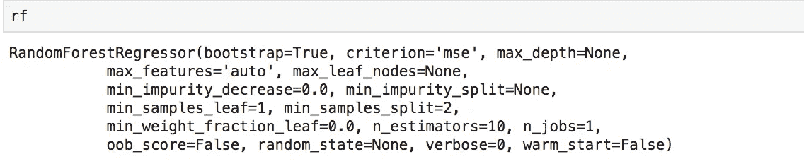
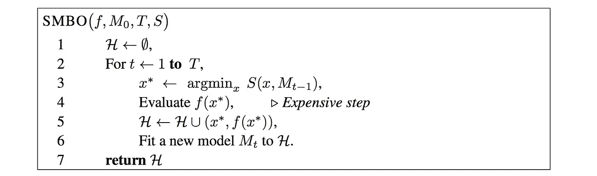
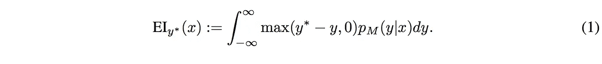
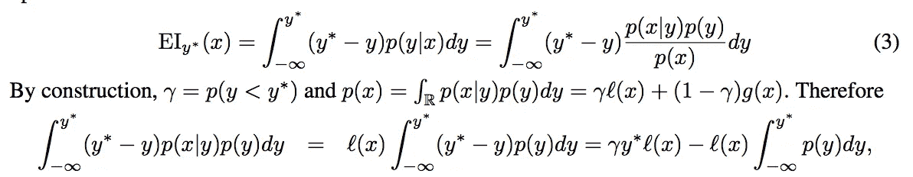
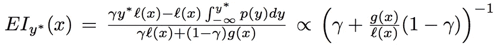

# Python 中超参数优化算法

> 原文：<https://towardsdatascience.com/algorithms-for-hyperparameter-optimisation-in-python-edda4bdb167?source=collection_archive---------5----------------------->

超参数通常对机器学习算法的成功有重大影响。一个配置不良的 ML 模型可能不会比一个配置良好的 ML 模型表现得更好，而一个配置良好的 ML 模型可以达到最先进的结果。

寻找最佳超参数的过程可能非常乏味，与其说是科学，不如说是艺术。这个微调模型参数的过程被称为超参数优化。在模型调整的过程中，我们经常会发现自己处于以下状态:

1.  厌倦了一次又一次地手动重新训练模型(没有任何性能增益)。
2.  等待彻底的网格搜索返回结果。(总感觉像是永恒)
3.  运行固定迭代次数的随机搜索，只希望它返回一些性能增益。
4.  你与原力(YODA)融为一体，并完善了微调模型的艺术。(如果你属于这一类，请与我们普通人分享你的神秘知识)

如果你经常发现自己处于状态 1-3，那么这篇文章将帮助你变得更好。

手动调谐并不都是不好的，因为它在选择下一个参数集时考虑了先前运行的结果( ***)通知搜索*** )。这为我们节省了一些迭代，因为我们不会盲目地运行所有的排列。与此相反，网格/随机搜索独立运行每个排列，但不需要人工干预。为了两全其美，我们需要一个基于历史运行识别有希望的样本空间的自动化过程。实现这一点的有效方法之一是贝叶斯优化。这种技术有效地权衡了参数空间的探索和利用，以返回最佳优化评估标准的配置。一个额外的优势是，即使被优化的基础函数 *f* 是随机的、非凸的或者甚至是非连续的，它们仍然有效。

基于序列模型的优化(SMBO)是贝叶斯优化的简洁形式。SMBO 是一种通用的函数优化技术，号称是最有效的调用技术之一。

> *SMBO 通过识别可能已经绘制的超参数赋值来工作，并且根据损失函数值在其他点看起来是有希望的。*

在这篇博客中，我们将介绍超参数优化的理论，然后使用 hyperopt 进行实际演示。Hyperopt 是 python 中的一个超参数优化库，它使用 TPE(SMBO 的一种风格)进行优化。在深入 SMBO 之前，让我们回顾一下超参数、网格搜索和随机搜索的基础知识。如果您已经熟悉第(1–3)部分，您可以跳过它们。

# **目录**

1.  基本定义
2.  基于序列模型的优化(SMBO)
3.  SMBO 的类型:基于高斯的和基于 TPE 的
4.  使用 Hyperopt 的实际操作示例

## **基本定义**

1. ***超参数*** 是模型内置的配置变量。这些变量需要微调以产生性能更好的模型。这些参数取决于型号，并且因型号而异。例如，随机森林模型将具有以下超参数

Internal features of a random forest model

以上所有特征都是模型的固有特征。对于基于树的集成方法，如随机森林或梯度推进 max_depth、min_sample_leaf 和 n_estimators(集成中的树的数量)是最重要的。

2.**网格搜索**是超参数优化最基本的算法。这就像在内置特性的所有可能值上运行嵌套循环。以下示例中的 rf_params 包含需要微调的模型特征。

在上述情况下，模型将被重新训练 300 次。
2(n _ estimator)* 3(max _ features)* 10(max _ depth)* 5(cv runs)= 300

这是一个非常狭窄的搜索空间，因为我们只搜索 3 个特征。如果我们进行彻底的搜索，组合的数量很容易超过 10k。

3.**随机搜索**是网格搜索，随机选择下一个特征集，总运行次数有上限。

随机搜索的代码与 GridSearch 相同，唯一的区别是我们添加了 n_iter=100，它固定了允许运行次数的上限。网格/随机搜索是 ***无信息搜索*** 的例子，意味着下一个特征集独立于上一次运行的输出。这两种方法都需要在每次迭代中进行重新训练，这导致了巨大的成本。

## **基于序列模型的优化(SMBO)**

SMBO 通过顺序选择不同的超参数集来最小化验证损失，其中下一个集是通过贝叶斯推理选择的(取决于之前的运行)。直观地说，SMBO 会回顾上次运行的结果，以将未来的搜索集中在看起来更有希望的领域。

只要评估适应度函数( *f : X - > R* )的成本很高，就使用 SMBO。在这种情况下，计算一个近似的 *f* ( **代理*M*)。这款 ***M*** 算起来比较便宜。通常，SMBO 中的内部循环是该代理的数值优化或该代理的某种转换(下面代码中的*第 3 行)。最大化替代值的点 *x** 成为应该评估真实损失函数 *f* 的建议(*行 4* )。***

Figure 1 : The pseudo-code of generic Sequential Model-Based Optimisation

*H:观察历史
T:试验次数
f:真函数
M:逼近 f 的替代函数
S:计算下一个超参数赋值
x *:M 最小化的样本实例*

伪代码解释:
*第 1 行:*初始化一个空的 *H.
第 2 行:初始化固定次数的循环尝试。
第三行:
1。L* 为 *f* 获得一个名为 *M.
2 的代理函数。定义一个需要最小化的评估标准。
3。对 x 的多个实例运行 S(x，M)*以找到 *x** 哪个最小化 S.
*行 4 :* *f* 被评估为最佳 x.
*行 5 : H* 用当前值 *x，f(x)更新。
第 6 行:M 在每次迭代后被*更新，以成为 *f 的更好近似。*

**采集函数**定义了在目标空间中探索新区域和利用已知具有有利价值的区域之间的平衡。不同风格的 SMBO 使用不同的算法来优化预期的改进(EI，采集函数的流行选择)。例如，Hyperopt 通过 TPE (Tree Parzen Estimators)优化 EI，而 Spearmint 使用高斯过程优化 EI。

SMBO optimises the EI ( Expected Improvement )

1.  Pm:后 GP 知道 *H*
2.  y*:新候选人的替代值
3.  y:上一个候选人的替代值

直观地说，它定义了在给定位置 x 的最佳先前观察客观值上的非负 EI。

## ***基于高斯过程的 EI 优化***

**高斯过程(GP)** 是一个[随机过程](https://en.wikipedia.org/wiki/Stochastic_process)(由时间或空间索引的随机变量的集合)，使得这些随机变量的每个有限集合都有一个[多元正态分布](https://en.wikipedia.org/wiki/Multivariate_normal_distribution)，即它们的每个有限[线性组合](https://en.wikipedia.org/wiki/Linear_combination)都是正态分布的。

GP 是贝叶斯优化中建模目标函数( *f* )的标准代理。在这种设置中，假设 *f* 是具有均值 *u* 和协方差核*K*的 GP，核 *K* 的选择可以对替代重建有重大影响。在这种方法中，模型 *M(图 1 的第 6 行)*定义了预测分布 *p(y|x，D)。*

## **树形结构 Parzen 估计器方法(TPE )**

[TPE](https://stats.stackexchange.com/questions/244012/can-you-explain-parzen-window-kernel-density-estimation-in-laymans-terms) 是以树形结构组织的核估计器，以保持条件相关性。与直接对 *p(y|x)* 建模的基于 GP 的方法相反，TPE 通过 *p(x|y)* 和 *p(y)* 对其进行近似。

TPE 对 GP 优化预期改进的方式进行了两项更改。

1.  p(y|x)替换为 p(x|y) * p(y)/p(x)
2.  情况 1 : p(x|y) = l(x) if y <y>情况 2 : p(x|y) = g(x) if y≥y*</y>

*   *l(x)* 是使用观测值{ *x* }形成的密度，使得相应的损失 *f(x)* 小于*y∫*
*   *g(x)* 包含剩余的观测值

利用这两种分布，可以优化与预期改善成比例的封闭形式项。

这导致了下面的结论

EI after TPE specific optimisations

最后一个表达式表明，为了最大化改进，我们希望点 x 在 *l(x)* 下具有高概率，而在 *g(x)* 下具有低概率。这仅仅意味着选择 *x 的*,其具有小于先前报告值的 EI 的概率更高。

## 使用 Hyperopt 进行参数优化

Hyperopt 是用于通过 SMBO 执行自动化模型调优的 Python 库。应用 hyperopt 进行超参数优化是一个 3 步流程:

1.  定义目标函数。
2.  定义搜索空间(xgb_space)。
3.  定义一个试验数据库来保存每次迭代的结果。

以下代码块是如何对 xgboost(梯度增强库)执行超参数优化的示例。

为了对其他模型使用相同的脚本，只需对模型进行少量修改。您需要对 xgb_space 变量进行修改，以适应您选择的模型的搜索空间。在目标函数中，您需要更改交叉验证的运行方式(如我们使用的 xgb 特定方法),以及您希望最小化的指标。例如，对于 LightGBM(转到 [LightGBM](https://medium.com/@abhisheksharma_57055/what-makes-lightgbm-lightning-fast-a27cf0d9785e) 了解这个令人敬畏的库)，您可以通过做一些小的修改来使用代码。

将来我会在 hyperopt 库上发布一个更详细的 hands on blog。

这个博客是对我们目前可用的超参数优化技术的一个简要概述。我们从不知情的搜索开始，如网格/随机搜索，然后转移到不同的贝叶斯方法，如基于 GP 的 SMBO 和基于 TPE 的 SMBO，最后是 hyperopt 的工作示例。

## 参考

如果你想深入了解，请浏览以下材料

1.  [Hyperopt](https://github.com/hyperopt/hyperopt) github 存储库
2.  [远视纸](http://iopscience.iop.org/article/10.1088/1749-4699/8/1/014008/meta)
3.  [超参数优化算法](https://papers.nips.cc/paper/4443-algorithms-for-hyper-parameter-optimization.pdf)

请在评论区分享你的想法和主意。