# 关于朴素贝叶斯的一切

> 原文：<https://towardsdatascience.com/all-about-naive-bayes-8e13cef044cf?source=collection_archive---------2----------------------->

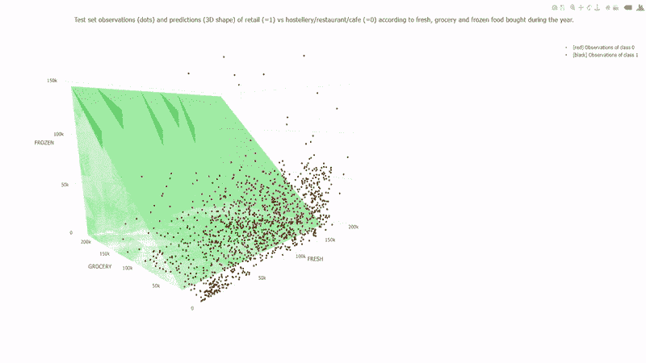

> 学习朴素贝叶斯分类器就是计算每个属性在每个类中出现的次数

朴素贝叶斯是可以应用于数据的最简单的算法。顾名思义，这种算法做出了一个假设，因为数据集中的所有变量都是“天真的”，即彼此不相关。

朴素贝叶斯是一种非常流行的分类算法，主要用于获得数据集的基本精度。

# 像我五岁一样解释

让我们假设你正在操场上散步。现在你看到一些红色的物体在你面前。这个红色的物体可以是一只蝙蝠或者一只猫或者一个球。你肯定会假设它会是一个球。但是为什么会这样呢？

让我们假设你正在制造一台机器，你已经给了上面的任务，把一个物体分类在球棒、球和猫之间。首先，你会想到创建一个机器，它将识别对象的特征，然后将它与你的分类对象进行映射，这样，如果一个对象是圆形，那么它将是一个球，或者如果该对象是生物，那么它将是一只猫，或者在我们的情况下，如果我们的对象是红色的，那么它最有可能是一个球。

为什么会这样？因为我们从小就见过红色的球，但红色的猫或红色的蝙蝠对我们来说是不太可能的。

所以在我们的例子中，我们可以通过用我们的分类器分别映射一个对象的特征来对其进行分类。在我们的例子中，这个红色是用一只蝙蝠、一只猫和一个球映射的，但是最终，我们得到了一个有球的红色物体的最大概率，因此我们把那个有球的物体分类。

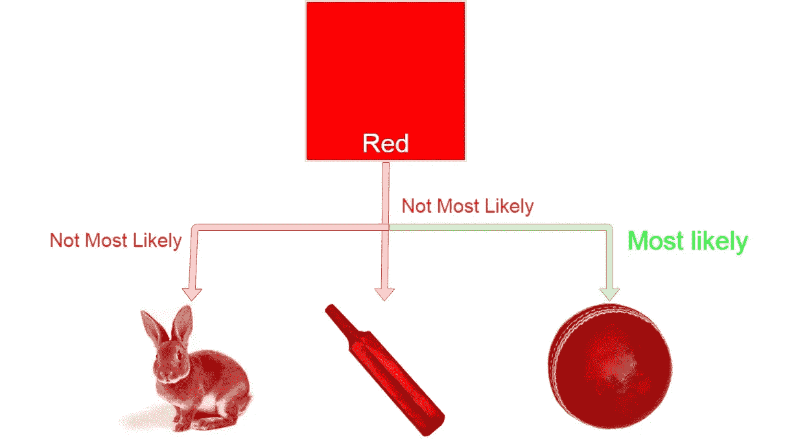

# 公式

这里 c 代表类别，例如球、猫、球棒。

x 代表单独计算的特征。

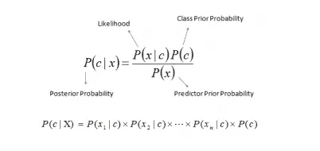

在哪里，

*   *P* ( *c|x* )是*类* c 给定*预测器* ( *特征*)的[后验概率](https://en.wikipedia.org/wiki/Posterior_probability)。
*   *P* ( *c* )是*类*的概率。
*   *P* ( *x|c* )为[似然](https://stats.stackexchange.com/questions/314623/naive-bayes-likelihood)即*预测器*给定*类*的概率。
*   *P* ( *x* )是*预测器*的[先验概率](https://en.wikipedia.org/wiki/Prior_probability)。

# 例子

假设我们有 1000 个水果的数据。水果是香蕉、橘子或其他水果，假设我们知道每种水果的 3 个特征，不管是长还是短、甜还是甜、黄还是黄，如下表所示。

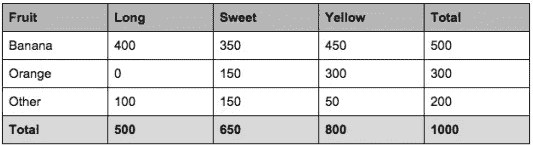

从表中我们已经知道了什么？

*   50%的水果是香蕉
*   30%是橘子
*   20%是其他水果

基于我们的训练集，我们还可以说:

*   500 根香蕉中，400 根(0.8)长，350 根(0.7)甜，450 根(0.9)黄
*   300 个橙子中，0 个是长的，150 个(0.5)是甜的，300 个(1)是黄的
*   在剩余的 200 个水果中，100 个(0.5)长，150 个(0.75)甜，50 个(0.25)黄

这将提供足够的证据来预测另一种水果的种类。

假设我们得到了一块水果的特征，我们需要预测它的类别。如果我们被告知额外的水果是长的、甜的和黄色的，我们可以使用下面的公式对它进行分类，并代入每个结果的值，不管它是香蕉、桔子还是其他水果。概率(得分)最高的一方为获胜者。

formula for reference

**香蕉:**

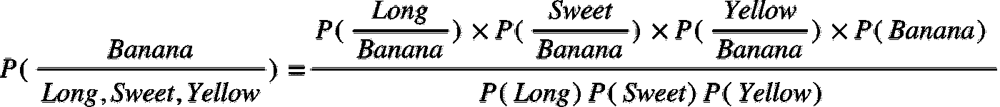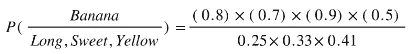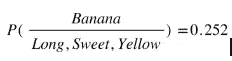

**橙色:**

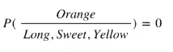

**其他水果:**

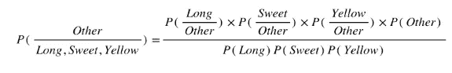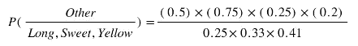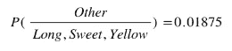

在这种情况下，基于较高的分数(香蕉 0.252)，我们可以假设这个长而甜的黄色水果实际上是香蕉。

# 用 python 实现

*   用 python 从头开始实现朴素贝叶斯算法**并在每一步都有解释，上传到我的 Github 库。**
*   **在 Scikit learn 的**帮助下，朴素贝叶斯的实现也被添加到我的 Github 存储库中。****

** [## 2796 gaur av/朴素贝叶斯解释

### 这是一个非常深入的解释朴素贝叶斯 w.r.t 在 python 中的实现，可用于机器学习…

github.com](https://github.com/2796gaurav/Naive-bayes-explained)** 

# **优势**

*   **预测[测试数据集](https://stats.stackexchange.com/questions/19048/what-is-the-difference-between-test-set-and-validation-set)的类别是容易且快速的。在[多类预测](https://en.wikipedia.org/wiki/Multiclass_classification)中也表现出色。**
*   **当独立性假设成立时，朴素贝叶斯分类器与其他模型(如[逻辑回归](/logistic-regression-detailed-overview-46c4da4303bc))相比表现更好，并且您需要更少的训练数据。**
*   **与数字变量相比，它在分类输入变量情况下表现良好。对于数值变量，假设正态分布([钟形曲线](https://www.youtube.com/watch?v=Mj3jPE04nGM)，这是一个强假设)。**

# **不足之处**

*   **如果分类变量具有在训练数据集中未观察到的类别(在测试数据集中)，则模型将分配 0(零)概率，并且将无法进行预测。这就是通常所说的[零频率](https://datascience.stackexchange.com/questions/15526/how-to-handle-a-zero-factor-in-naive-bayes-classifier-calculation)。为了解决这个问题，我们可以使用平滑技术。最简单的平滑技术之一叫做[拉普拉斯估计](https://www.quora.com/How-does-Laplacian-add-1-smoothing-work-for-a-Naive-Bayes-classfier-algorithm)。**
*   **另一方面，朴素贝叶斯也被认为是一个糟糕的估计，所以概率输出不要太认真。**
*   **朴素贝叶斯的另一个限制是独立预测者的假设。在现实生活中，我们几乎不可能得到一组完全独立的预测值。**

# **应用程序**

*   ****实时预测:**朴素贝叶斯是一个学习能力很强的分类器，而且速度非常快。因此，它可以用于实时预测。**
*   ****多类预测:**该算法也以多类预测特性而闻名。这里我们可以预测多类目标变量的概率。**
*   ****文本分类/垃圾邮件过滤/情感分析:**朴素贝叶斯分类器最常用于[文本分类](https://www.analyticsvidhya.com/blog/2018/04/a-comprehensive-guide-to-understand-and-implement-text-classification-in-python/)(由于在多类问题中的更好结果和独立性规则)与其他算法相比具有更高的成功率。因此，它被广泛用于[垃圾邮件过滤](https://searchmidmarketsecurity.techtarget.com/definition/spam-filter)(识别垃圾邮件)和[情感分析](/sentiment-analysis-concept-analysis-and-applications-6c94d6f58c17)(在社交媒体分析中，识别积极和消极的客户情感)**
*   ****推荐系统:**朴素贝叶斯分类器和[协同过滤](https://en.wikipedia.org/wiki/Collaborative_filtering)一起构建了一个推荐系统，该系统使用机器学习和数据挖掘技术来过滤看不见的信息，并预测用户是否喜欢给定的资源。**

# **何时使用**

*   **文本分类**
*   **当数据集很大时**
*   **当你的训练量很小的时候**

**此外，我将添加其他机器学习算法。这篇文章的主旨是深入了解朴素贝叶斯，不使用任何硬词，从头开始解释。此外，如果您想实现朴素贝叶斯，从这些数据集开始，您可以在注释部分用代码注释您的预测得分。**

*   **[虹膜数据集](https://archive.ics.uci.edu/ml/datasets/iris)**
*   **[葡萄酒数据集](https://archive.ics.uci.edu/ml/datasets/Wine)**
*   **[成人数据集](https://archive.ics.uci.edu/ml/datasets/Adult)**

**在那之前，**

## **快乐编码:)**

**别忘了拍手拍手拍手…**

****