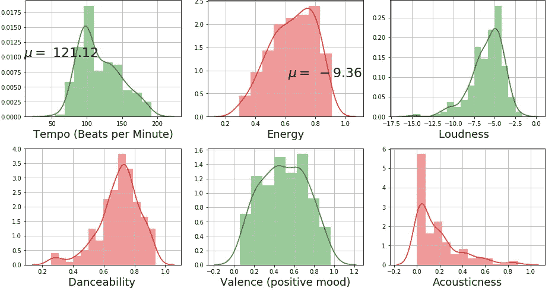
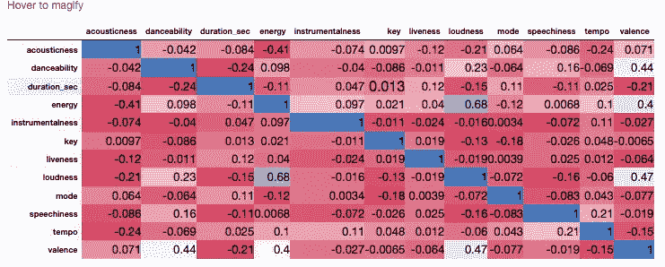
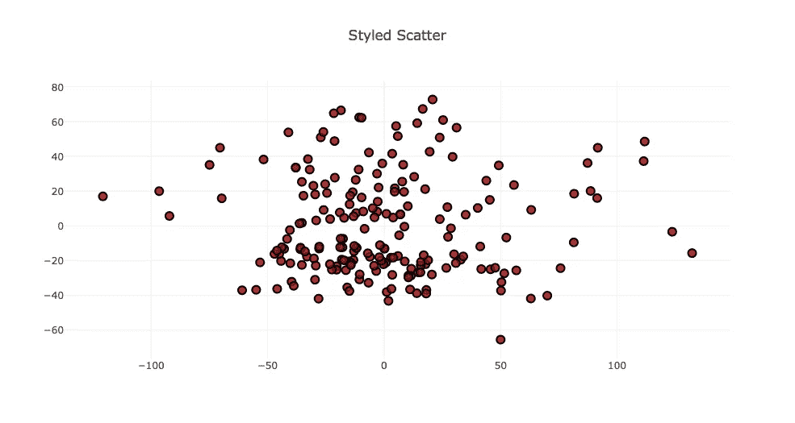
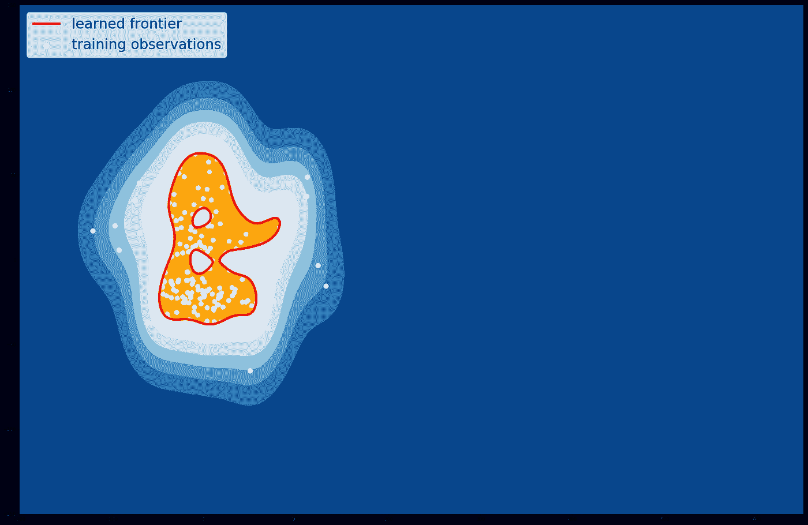
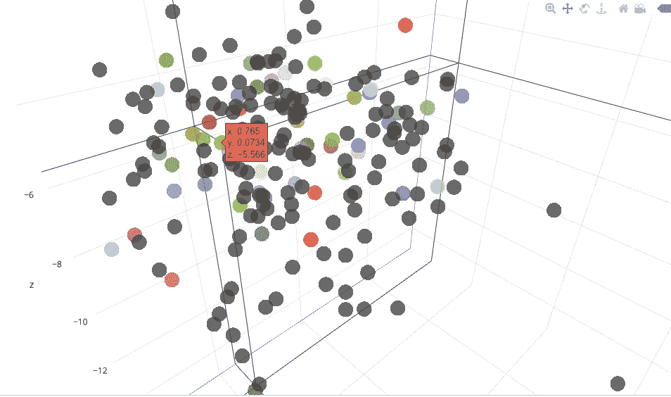
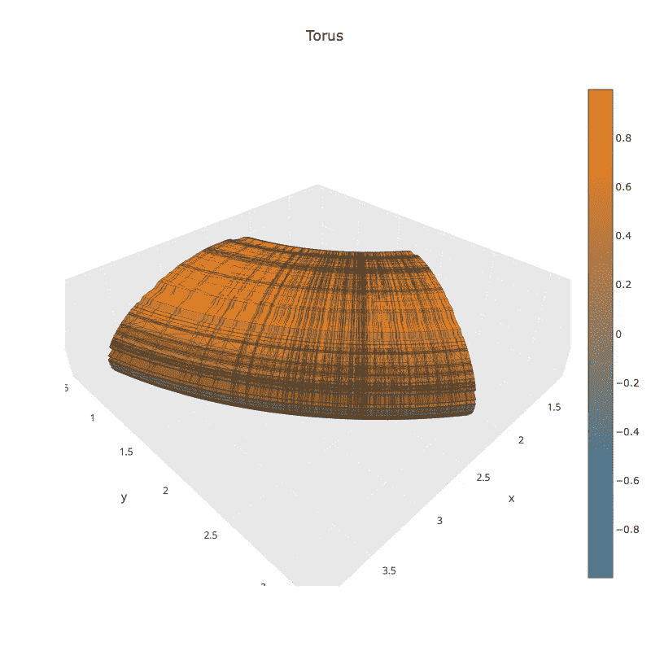

# 关于音乐的一切— 01

> 原文：<https://towardsdatascience.com/all-about-the-music-01-ad1b989260df?source=collection_archive---------6----------------------->

**音乐和机器学习**

你好。你一天花多少时间听音乐？几个小时，一周呢？据《福布斯》 的一篇文章称，美国人平均每周花 32 个小时听音乐，而且这个数字每年都在增长。嗯，我们都有自己的疯狂和不同的音乐品味。让我们玩一些数据，并试图找出是什么使一些歌曲比其他歌曲获得更多的赞赏。

受到这里的一些文章[和数据科学社区在音乐方面所做工作的启发，我决定也做一个实验。因此，今天我们将利用可视化的力量对 Spotify 本周的全球 200 强进行统计分析。](https://developer.spotify.com/web-api/get-audio-features/)

# **数据集**

该数据集由 Spotify 每周全球 200 首歌曲及其各自的 24 个歌曲属性组成，即声音、活力、舞蹈性等。我将描述用于分析目的的最重要的属性。

**节拍** —每分钟的节拍数。
**能量** —强度和活动的感性度量。它是从 0.0 到 1.0 测量的。数值越高，就越有活力。
数值越高，越容易随着这首歌起舞。
**响度** —值越高，歌曲的音量越大(以 dB 为单位)。
**效价** —从 0.0 到 1.0 的一个度量，描述一首曲目所传达的音乐积极性。高价曲目听起来更积极。
**音质** —数值越高，歌曲越有音质。

如果你想知道更多关于这些歌曲属性的技术描述，你可以访问 Spotify 的这个[链接](https://developer.spotify.com/web-api/get-audio-features/)。

# **数据提取**

我使用 Spotify [图表](https://spotifycharts.com/)来获取数据集，该数据集由 200 个链接到板上相应歌曲的 URL 组成。接下来我做了一些文本挖掘来提取每首歌的 id。我写了一个脚本，使用 Spotify 的 API 从 ID 中提取歌曲属性，并使用任务所需的适当的身份验证令牌。您可以一次提取多个轨迹的属性，但最多只能提取 100 个，所以我运行了两次相同的脚本来获取所需的数据集。替代方法可以是使用 [Echonest](https://developer.spotify.com/spotify-echo-nest-api/) API，但从中提取的信息和属性将少于 Spotify API 方法。

> 不浪费时间，让我们深入研究数据集



Histogram Distribution plot of song attributes

# 见解:-

1)根据上面的直方图分布图，本周人们更喜欢高能量的歌曲，即更适合于具有高价系数的舞蹈的歌曲。

2)音乐爱好者似乎是一个多样化的群体，他们中的一些人更喜欢每分钟节拍数更多的喧闹音乐，而一些人则更喜欢相反的组合。

3)从分布图中可以明显看出，大多数听众喜欢音乐中的声音较低。



Correlation Matrix

从上图所示的相关矩阵中，我们可以观察到，一首歌没有两个属性有很强的相关性。如果一首歌有活力，声音就会更大。这个事实似乎是真实的，因为可以看出它们具有显著的关系(蓝色的***0.68***)但不太真实，因为响度不是一首歌曲是否有活力的唯一标准**。**

一般来说，特征的数量越多，模型就越健壮。有了太多的特征，可视化和处理特征工程就成了一项乏味的任务。12 个特征将导致 144(12*12)个成对的图，以理解一对一的相似性。NAHH！我们不会那样做，我们会做降维。

# **主成分分析**

[主成分分析](https://pdfs.semanticscholar.org/53b9/966a0333c9c9198cdf03efc073e991647c12.pdf)是一种从数据集中大量可用变量中提取重要变量(以成分形式)的方法。它从高维数据集中提取低维特征集，目的是获取尽可能多的信息。随着变量的减少，观想也变得更有意义。

**它总是在对称相关或协方差矩阵上执行。这意味着矩阵应该是数字的，并且有标准化的数据**。



The scattered plot of two after PCA

> PCA 后 99%的方差被恢复，不错..一点都不差！

因此， **64%方差**由主成分 1 解释， **35%** 由主成分 2 解释。这表明，我们已经从数据集的两个主要部分中提取了大部分见解。因此，在**降维**之后，我们没有遭受任何重大的信息损失。

如果两个分量不相关，它们的方向应该是正交的。该图像基于具有 2 个预测值的模拟数据。请注意组件的方向，正如所料，它们是正交的。这表明这些成分的相关性 b/w 接近于零。



Outlier Detection using Support Vector Machines

例如，如果我们有兴趣知道是否有任何一首发行的歌曲可以根据上周的歌曲进入**全球 200 强**名单。我们会比较它是否能把它们放在**橙色区域**内。**这个橙色区域代表本周最受欢迎的歌曲。**

***让我们做一些可视化***

Song Attributes scattered into 3D space

> 灰色和蓝色看起来不错，但是我想看看更多的颜色



> **多色..嗯！我知道..我知道，你现在已经看够了那些圆形的斑点，让我们一起来建造一些坚实而科学的东西吧。**

# 标准环面方程

标准圆环被参数化为一个旋转面:一个圆围绕一个轴旋转。这种环面的一般方程是

```
f(u, v) = [ (a + b*cos(v))*cos(u), (a + b*cos(v))*sin(u),
c*sin(v) ]
```

这里，输入 u 和 v 可以是来自上述歌曲属性集的任何数字特征。环面主要应用于拓扑学领域，但与环面作用相关的具体问题出现在数学和数学物理的不同领域。



Scientific 3-D plot using the attributes danceability and tempo

[**C**](https://github.com/PrathamNawal) **颂歌和技术描述:-**

如果您一直关注这个博客，并且有兴趣了解代码和详细分析的内容。上述分析是在 [Python](https://www.python.org/) 中完成的，使用 sci-toolkit 库:Sckit- Learn、pandas、seaborn 和 plotly 进行可视化。代码、数据和 Jupyter 笔记本可在 [Github](https://github.com/PrathamNawal/All-About-the-Music/tree/master/Spotifier) 上获得。

这是我将尝试不同声音和演讲的一系列博客文章的第一篇。将它们分成片段，将声音的和弦聚在一起，产生新的回声等等。感谢阅读，敬请关注！