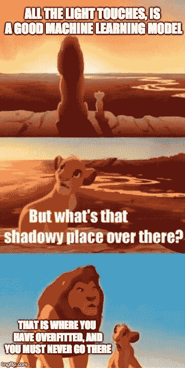
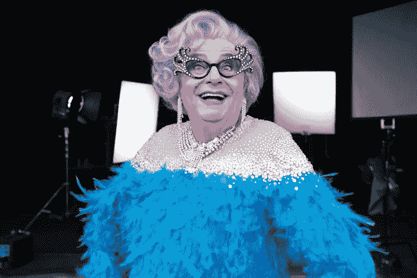
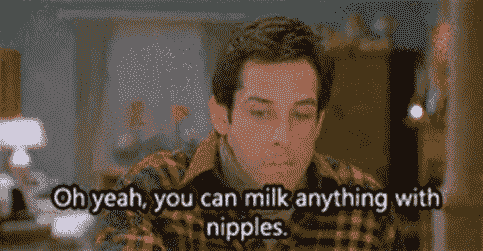
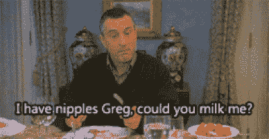

# 所有的鸟都是黑色的

> 原文：<https://towardsdatascience.com/all-birds-are-black-ec94930294b5?source=collection_archive---------17----------------------->

## 考虑偏差-方差权衡的一个简单方法

Photo by [Hannes Wolf](https://unsplash.com/@hannes_wolf?utm_source=medium&utm_medium=referral) on [Unsplash](https://unsplash.com?utm_source=medium&utm_medium=referral)

我遇到过多种方法和哲学来构建模型来代表现实世界的关系。我的统计学教授无情地强调奥卡姆剃刀和吝啬。社会科学家痴迷于在模型中寻找因果关系，通常是通过[实验](https://www.sagepub.com/sites/default/files/upm-binaries/23639_Chapter_5___Causation_and_Experimental_Design.pdf)。

Don’t go there, Simba!

在机器学习中，我们很早就被引入了**偏差-方差权衡**，以及[过度拟合](https://elitedatascience.com/overfitting-in-machine-learning)的危险。

根据维基百科，基本的想法是:

> …**偏差-方差权衡**是一组预测模型的属性，其中参数估计偏差较低的模型在样本间具有较高的参数估计方差，反之亦然。

迷路了吗？外面有很多很好的解释，但是让我们试着不用图表、数学或者希腊语来解决这个问题。

让我们从最简单的模型开始。*一个心智模型。*

# 所有的鸟都是黑色的:最简单的模型

假设你以前从未见过鸟。*曾经。(你想象中的老板)要求你:*

*   描述鸟类，一般来说，是什么样子的；
*   解释是什么造就了鸟，鸟；或者
*   预测下一只鸟在任何给定的时间和地点会是什么样子。

你可能会观察一只或几只鸟的样子，并对这种鸟做出一些概括。

接下来，假设你遇到一群乌鸦，你得出如下结论:

*   所有的鸟都有两条腿
*   所有的鸟都有喙
*   所有的鸟都有羽毛
*   **所有的鸟都是黑色的**

恭喜你！你已经建立了你的第一个鸟体模型。

当然，一个人不必是鸟类专家就能知道“所有的鸟都是黑色的”是一个不正确的结论，但是请记住——你从来没有见过鸟！你的模型是**过度拟合**，你从乌鸦身上挑出了太多的细节，并试图将其推广到整个鸟类种群。你想描述鸟，结果却描述了乌鸦。

在被老板训了一顿之后，你又回到了 bird-verse，建立了另一个模型。建议是“保持简单，笨蛋”。然后你观察一些其他的鸟，得出结论:

*   所有的鸟都有羽毛

Dame Edna has feathers. Is she a bird?

这也不太对。我们已经避免了根据某些鸟类的特殊特征进行归纳的问题。然而，我们已经走得太远了，因为我们对鸟类的普遍特征做了一个单一的声明。

不管怎么说都不是不合理的，但仍然是错误的。

这就是我们说一个模特**不合身**的时候。你只取了一个特征，但它并没有对鸟类的现状或未来给出一致的预测或解释。在这种情况下，**你想描述鸟类，但你最终抓住了每一只有羽毛的鸟**。

让我们试着把这带回统计学和机器学习的说法。在第一个模型中，我们减少了解释当地鸟类样本的*偏差*，但是当推广到另一个样本时，会有更多的*方差*。

在第二个模型中，我们得到了一个低*方差*预测器，它在推广到更多鸟类样本时表现良好，但在面对一个有羽毛但显然不是鸟类的样本时面临更多*偏差*！

# 我们每天都在建造模型

我们被过度拟合和欠拟合模型所吸引，迭代通过事物如何运作的各种模型，直到我们对事物如何运作有了满意的理解。一旦你开始简单地考虑模型，你会开始注意到到处都有偏差-方差权衡。

Greg learnt about bias-variance trade-off the hard way

建立关系、建立模型和找到我们在环境中观察到的事物的根源是人类的本性。这与我们为机器学习建立模型的方式真的没什么不同。难怪[机器最终会像我们](https://www.entrepreneur.com/article/309892)一样。

感谢阅读！如果这对您有用，或者您想提出一些改进建议，请留下评论或反馈。