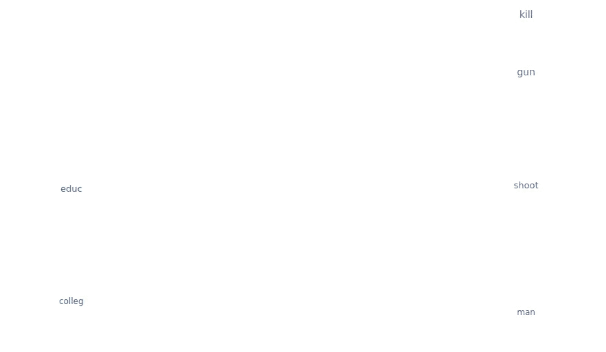
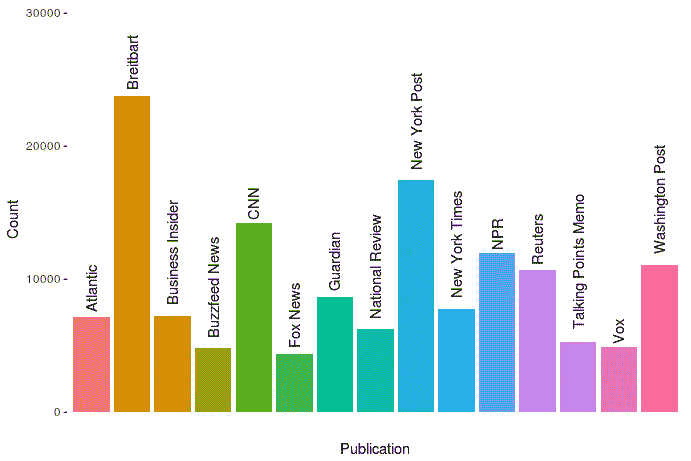
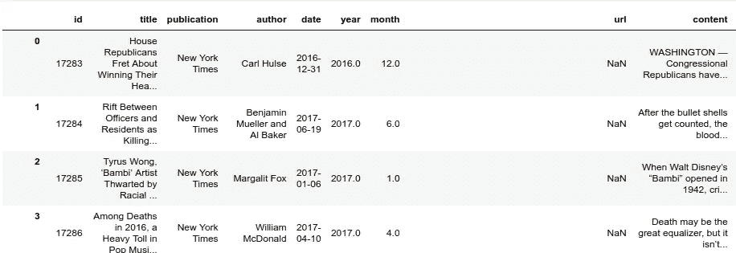
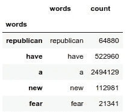
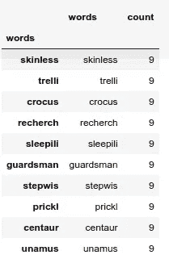
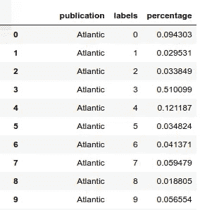

# 所有的新闻

> 原文：<https://towardsdatascience.com/all-the-news-17fa34b52b9d?source=collection_archive---------3----------------------->

## 使用 KMeans 对 143，000 篇文章进行聚类。



我最近策划了这个数据集，探索构成我们新闻的类别的一些算法近似，这是我在不同时间阅读和创作的东西。如果你有成千上万篇来自各种渠道的文章，这些文章似乎或多或少地代表了我们的国家新闻格局，你把它们变成结构化数据，你用枪指着这些数据的头，强迫它们分组，这些分组会是什么？

我决定，简单性和有效性的最佳平衡是使用无监督聚类方法，让数据自己排序，无论多么粗糙(类别，无论它们来自什么算法，几乎总是粗糙的，因为没有理由媒体不能无限小地分类)。出于各种原因(本地内存限制、能力、来自更有学问的人的建议)，我选择通过 KMeans 运行一个单词包——换句话说，如果每个单词都成为它自己的维度，每篇文章都成为单个数据点，那么会形成什么样的文章簇呢？如果你渴望跳到“那又怎样”和/或不关心代码，向下滚动直到你看到粗体字母告诉你不要这样做。代码在这里，如果有人想同行审查这一点，告诉我，如果/哪里我搞砸了，和/或给我建议。

因为 KMeans 是非确定性的，所以结果会有所不同；聚类在运行之间会有一点点变化，但是，现在已经做了很多，我可以证明它们不会有很大的变化。这里的结果或多或少是数据所固有的。

# 简要概述

数据看起来是这样的:



The number of articles in the dataset

这些出版物是基于完全不科学的笛卡尔内省过程选择的，我审视了自己，得出了一个粗略的总结，我认为这是我们国家新闻景观的合理样本。抓取这些文章的方法大致如下:

1.  从无价的 archive.org 上获取过去一年半中每份出版物的存档主页或 RSS 订阅源的链接(如此珍贵，以至于我后来给了他们钱以表示感谢(如果有人在阅读，感谢存在))。
2.  使用一个由 BeautifulSoup 拼凑而成的非常非常粗糙的 web scraper 从存档的主页上的每个链接中抓取每一篇文章。
3.  无趣的数据。
4.  清理不干净的数据。
5.  等等。

也就是说，这里的数据包含了主要从 2016 年初到 2017 年 7 月的这些出版物的文章，并且是在主页或 RSS 提要上出现的文章——即，这不是像 2016 年 8 月 13 日那样对整个领域进行贪得无厌的真空处理。

# 词干分析

这是数据的一部分:



我做了一个判断调用(你可以判断这个判断)从语料库中删除专有名词。这种想法是，A)它们太多了，B)它们没有告诉我们太多关于写作的内容和方式，C)当试图归结这些类别的本质时，它们是另一种形式的噪音。稍后您将会看到，Python 的 NLTK 是一个很棒的包，但是它并不完美，在试图清除掉一些专有名词之后，它们仍然留在了 corupus 中。

此外，我决定删除数字。这里有一行是关于 NLTK 的标记器有时会在单词末尾留下句点的倾向，我认为这是一个 bug。

堵塞过程看起来像:

```
import nltk
from nltk import pos_tag
from nltk.stem import PorterStemmer
from nltk import word_tokenize
from collections import Counter
import timestemmer = PorterStemmer()
tokenizer = nltk.data.load(‘tokenizers/punkt/english.pickle’)progress = 0 #for keeping track of where the function isdef stem(x):
    end = time.time()
    dirty = word_tokenize(x)
    tokens = []
    for word in dirty:
        if word.strip(‘.’) == ‘’: #this deals with the bug
           pass
        elif re.search(r’\d{1,}’, word): #getting rid of digits
           pass
       else:
           tokens.append(word.strip(‘.’))
   global start
   global progress
   tokens = pos_tag(tokens) #
   progress += 1
   stems = ‘ ‘.join(stemmer.stem(key.lower()) for key, value in  tokens if value != ‘NNP’) #getting rid of proper nouns

   end = time.time() sys.stdout.write(‘\r {} percent, {} position, {} per second ‘.format(str(float(progress / len(articles))), 
 str(progress), (1 / (end — start)))) #lets us see how much time is left   start = time.time()
   return stemsstart = time.time()
articles['stems'] = articles.content.apply(lambda x: stem(x))
```

结果是一篇[文章](https://www.nytimes.com/2017/01/08/world/europe/queen-elizabeth-health.html?mcubz=3&_r=0)由此而来:

```
Queen Elizabeth II made her first public appearance in almost a month on Sunday, allaying concerns about her health after she missed Christmas and New Year’s Day church services because of what Buckingham Palace described as a persistent cold. The queen, who will turn 91 in April, attended services at St. Mary Magdalene Church in Sandringham...
```

对此:

```
made her first public appear in almost a month on , allay concern about her health after she miss and s church servic becaus of what describ as a persist cold the queen , who will turn in , attend servic at in...
```

词干处理大大减少了语料库的规模。“实现”和“实现”不是被认为是不同的词，并被赋予各自的维度，而是被简化为它们共有的词干，“现实”。这减少了噪音，因此算法不会对出版物使用过去时态而不是现在时态的决定产生影响，或者不会将复数名词视为词汇的不同部分而不是单数名词，等等。

# 创造词汇

现在进行人数统计，统计整个语料库中的每一个词干，然后可以将其转化为数据帧，用于文档术语矩阵和词汇表。

```
from collections import Counter
all_words = Counter()
start = time.time()
progress = 0
def count_everything(x):
    global start
    global all_words
    global progress
    x = x.split(‘ ‘)
    for word in x:
        all_words[word] += 1
    progress += 1
    end = time.time()
 sys.stdout.write(‘\r {} percent, {} position, {} per second ‘.format((str(float(progress / len(articles)))), 
 (progress), (1 / (end — start))))
    start = time.time()for item in articles.stems:
    count_everything(item)
```

然后将其传送到新的数据帧:

```
allwordsdf = pd.DataFrame(columns = [‘words’, ‘count’])
allwordsdf[‘count’] = pd.Series(list(all_words.values()))
allwordsdf[‘words’] = pd.Series(list(all_words.keys()))
allwordsdf.index = allwordsdf[‘words’]
```

在数据帧的开头给出:



Republican 的加入是一个很好的例子，说明词性标注者并没有完全去除专有名词。但忽略这一点，语料库现在是一个数据框架，词汇表中的每个术语都是索引中的项目，这在不久的将来会很有用。

当处理来自因特网的文本数据时的一个挑战是，非单词，如字符和符号的组合(例如，“@username”，“#hashtags”，用类似“well 1…”的省略号连接的单词)，以相对频率出现。我决定只保留 NLTK 的完整英语语料库中的单词，而不是找到并清理每一个单词。语言学家们还在争论这个语料库有多完整，但是有 236，736 个单词，这是一个相当大的数字。我们将首先通过对整个英语语料库进行词干分析，然后将该语料库与我们自己的语料库进行比较，来完成我们的数据框架的最终精简:

```
from nltk.corpus import wordsnltkstems = [stemmer.stem(word) for word in words.words()] #stem the #words in the NLTK corpus so that they’re equivalent to the words in #the allwordsdf dataframenltkwords = pd.DataFrame() #make a new dataframe with the stemmed #NLTK wordsnltkwords[‘words’] = nltkstemsallwordsdf = allwordsdf[allwordsdf[‘words’].isin(nltkwords[‘words’])] #keep only #those in the stemmed NLTK corpus
```

这将总词汇量从 89216 减少到 34527。它处理了词汇表中的每一个细节，我花了几个星期才考虑这个解决方案。

# 将单词矢量化

粗略地说，TfIdf(术语频率-逆文档频率)矢量器为每篇文章中的每个词给出一个值，该值由该词在整个语料库中的频率加权。逆向文档频率是从单词在整个数据集中的频率得出的分母。以“perspicacious”这个词为例，由于它在英语中有许多更好的替代词，这个词是一个我们很幸运几乎看不到的扯淡词。由于这种稀缺性，它的反向文档频率，或妖魔化，是低的。如果它在一篇文章中出现 15 次，那么它的 Tf 值或分子将会很高。因此，它的 TfIdf 值将是一个大分子，而不是一个小恶魔，从而产生一个大数字。因此，在我们数千维的空间中，文章在“洞察力”维度上具有价值。(当然，这还不包括向量的归一化和寻找 TfIdf 值所涉及的其他任务。)

当使用这种类型的矢量器时，包含非索引词(算法忽略的词的列表)并不重要，因为不常用的词被赋予较低的值。但它仍然是有用的，因为至少它降低了内存的使用，减少了我们的空间已经非常高的维度。此外，创建一个单词库可以确保出现在一篇文章中的非常罕见的单词不会自己聚集在一起。我选择了第 40 个分位数以上的单词。乍一看，这似乎很高，直到你看到这个分位数包含的内容:

```
allwordsdf[allwordsdf[‘count’] == allwordsdf[‘count’].quantile(.4)][:10]
```



因此，第 40 个分位数包括在整个语料库中只出现 9 次的单词——非常低，因此不倾向于提供信息。为什么不是第 50 或 60 分位数？因为必须在某个地方选择一个数字，它可能就是这个。

创建停用词，矢量词汇和矢量。写停用词和词汇表可能是多余的；我把两者都加进来是为了更好的衡量，因为我们以后需要这个词汇列表。

```
from sklearn.feature_extraction.text import TfidfVectorizerstopwords = list(allwordsdf[(allwordsdf[‘count’] >= allwordsdf[‘count’].quantile(.995)) | (allwordsdf[‘count’] <= allwordsdf[‘count’].quantile(.4))][‘words’])vecvocab = list(allwordsdf[(allwordsdf[‘count’] < allwordsdf[‘count’].quantile(.995)) & (allwordsdf[‘count’] > allwordsdf[‘count’].quantile(.4))][‘words’])vec = TfidfVectorizer(stop_words = stopwords, vocabulary = vecvocab, tokenizer=None)
```

现在要转换数据帧:

```
vec_matrix = vec.fit_transform(articles[‘stems’])
```

这就产生了一个矩阵形状的`(142570, 20193)`，也就是大约 20，000 个单词。

# 降维

把我们的 20，193 维矩阵降多少维很难回答。Sklearn 的[官方推荐](http://scikit-learn.org/stable/modules/generated/sklearn.decomposition.TruncatedSVD.html)声明，“对于潜在语义分析(我们在这里做的)，推荐值为 100。”我用所有 20，193 个维度对这些数据进行了聚类，用 100 个维度进行了聚类，用 3 个维度进行了聚类，每一次，这些聚类看起来都与有多少个维度无关。这最终归结为减少处理时间，因为创造这个包的人的智慧规定了 100 个维度，所以它是 100 个维度。

```
from sklearn.decomposition import TruncatedSVDpca = TruncatedSVD(n_components=100)vec_matrix_pca = pca.fit_transform(vec_matrix)
```

# 使聚集

更难回答的是给数据分配多少个聚类。对于 KMeans，数据过于紧密地聚集在一起，不适合分层聚类或任何自己查找聚类的算法。如上所述，我选择了十作为起点。

```
from sklearn.cluster import KMeansclf10 = KMeans(n_clusters=10, verbose = 0)clf10.fit(vec_matrix_pca)
```

现在，将我们刚刚创建的标签分配给原始数据帧，以便进行分组、可视化和分析:

`articles[‘labels’] = clf10.labels_`

我们可以看看每个出版物的文章被分配到每个标签的百分比:

```
labelsdf = articles.groupby([‘publication’, ‘labels’]).count()
pubslist = list(articles[‘publication’].unique())
labelsdf[‘percentage’] = 0for index, row in labelsdf.iterrows():
    for pub in pubslist:
        for label in range(10):
            try:
                labelsdf.loc[(pub, label), ‘percentage’] = labelsdf.loc[(pub, label), ‘id’] / labelsdf.loc[(pub), ‘id’].sum()
            except:
                passlabelsdf = labelsdf[['publication', 'labels', 'percentage']]
```

等于



诸如此类。

# 如果你向下滚动，这里是停止的地方

这些图表是在 RStudio 中用 Plotly 制作的，plot ly 是一个有时质量不佳但仍然有用的数据软件包。

这些是聚类，每个聚类中的前 200 个单词及其 TfIdf 值。单词越大，确定是什么组成的集群就越重要。它们不会被政治联盟、基调或其他任何东西所瓦解；当数据聚集在一起时，会按类别分解。记住，我们选了十个；我们可以选择 8 或 20 个并得到不同的集群，但这些是最突出的。一个是关于俄罗斯的所有事情-丑闻，另一个是关于外交政策，另一个是关于教育等等。随意探索。(Plotly 允许用户放大，但字不会变大；我已经通知了当局来解决这个问题。)

下面是出版物是如何按组分类的。(同样，对于隐私獾用户来说，[这个](https://plot.ly/~snapcrack/12)就是。)

还有最后一个 viz，如果它大小引起了问题，我很抱歉，但是我认为它很重要。

它的名字(“articlestest”)应该表明我在创建它时处于什么准备阶段，它与最终的数据集略有不同——除了其他所有东西，它还包括来自 the Verge 的长篇文章，我选择了去掉它。它是将所有数据缩减为三维的可视化，而不是 20，000 多个维度(或上面主成分分析中使用的 100 个维度)。添加边缘会给人一种与移除边缘时截然不同的形状，我完全不确定这是为什么。但是如果你观察它，你可以看到每个集群在三维空间中形成的位置，你可以双击右边的每个出版物名称，只保留那个出版物。如果你点击它们，你会看到几乎每一个都是无形的数据点云，除了路透社，它形成了一个几乎完美的 l。

# 推论性的结论

不同的人可能会对这些数据和图表有不同的解读，但我是这样解读的:当被迫分组时，出版物被归类为路透社和其他。

我不认为这是对数据的过度提取。数据科学的一个主要哲学基础是，潜在的真理和联系是由表面现象引发的，一个人说话的语气或穿着的风格比我们愿意承认的方式泄露了更多关于我们的信息。这些出版物中的一个以与其他出版物如此不同的形式出现，完全基于它覆盖的主题，这将被合理地认为是考虑它与数据集的其他成员根本不同的原因。

诸如此类的结论应该经得起纯粹反思的考验——考虑到阅读这些出版物的体验，这些结论有意义吗？

在 Medium 的几个门下，[兰詹·罗伊](https://medium.com/u/2faf1ea1b2fb?source=post_page-----17fa34b52b9d--------------------------------) [写了一篇文章](https://medium.com/@ranjanxroy/about-that-vice-charlottesville-documentary-3db02e92fcb7)关于 Vice 的夏洛茨维尔分部看似不可思议的病毒式传播。他提醒我们，Vice 现在是另一个默多克资助的暴行机器。我不同意罗伊的观点，即视频的点击率如此容易地归因于 HBO 的阴谋诡计(因此暗示病毒传播可以被预测地设计，但它不能)，但就我们的目的而言，他以一个有益的反思结束了这篇文章:

> 我们越是接受耸人听闻的现实，我们就越糟。只要我们让我们的蜥蜴脑控制我们对世界的感知，我们就没有机会。如果我们没有意识到我们所观看的背后的动机，疯狂的人总是会赢。
> 
> 这是价值十亿美元的媒体，由拥有福克斯的同一个人出资。它完善了让你下去的艺术。记住，在一个我们每天花费 116 分钟消费广告资助的社交媒体的世界里，**最响亮的声音总是会赢得**。[强调他的]

除了路透社之外，该数据集中的所有出版物都有一些共同点。它们完全由广告和/或订阅资助(Vox 和 BuzzFeed 也有风险投资，但它们是基于广告的模式)，它们的存在依赖于点击。相比之下，路透社的新闻产品仅仅是一家大型信息集团的公众形象。或许更重要的是，它是一家新闻通讯社，其报道包括我们金融世界的事务，因此被赋予了不同于其他媒体的使命——可以说比《纽约时报》更重要，它必须覆盖所有新闻，而不会陷入人物驱动的真人秀，而该数据集的每个其他公民似乎都非常喜欢这样做。在所有这些事件中，它的声音倾向于保持最适度的室内音量，如果路透社能够激起愤怒的话，没有一个全球性事件会激起比生活更大的愤怒。也许这是隶属于财经出版社，宏观分析世界的产物；非金融媒体的叙述未能对伦敦银行间同业拆借利率(LIBOR)的变化和一个疯子的政策提议给予同等的重视，尽管按理说应该如此。这里的所有其他出版物似乎都带有乌托邦的暗示，它们内容的潜台词通常是，如果我们在食谱中混合了正确的成分，一个完美的世界就会实现，而你感到愤怒的事情实际上是我们和天堂之间的事情。在我作为读者的经历中，我从来没有感觉到路透社有任何类似的东西。

这不应被解释为断言《纽约时报》和《布莱巴特》因此是同一批中风患者。我今天在《泰晤士报》上读到了一篇设计精美的文章，内容是关于生物发光在深海生物中是多么普遍。不言而喻，在布莱巴特找到这样一份文件的可能性几乎为零，这是我对政治光谱的这一领域感到非常悲哀的事情之一，也是对其截然相反的反对者的一份谈话要点备忘录。但这才是重点:给一个算法看你写的关于深海生物的故事数量，它就会显示你是谁。在更精细的分辨率下，我们可能会发现《纽约时报》和《福克斯新闻频道》之间的鸿沟，或者《NPR 时报》和《纽约邮报》之间的鸿沟。看到上面的第三个聚类了吗，所有的单词都用较低的 TfIdf 值进行了压缩，没有突出的内容。它实际上是其他主题的整个丛林，你可以在那个集群上运行算法，并获得新的分组和区别——这些*集群中的一个*也将是不同类型故事的压缩，你可以在机器学习的分形中一遍又一遍地这样做。这里的区别不是唯一的，但从数据的空中视角来看，这是第一个。

*作为一个创造内容的人，我在法律上有义务经营一份个人时事通讯。可以在这里* *报名参加* [*。*](https://tinyletter.com/asthompson)