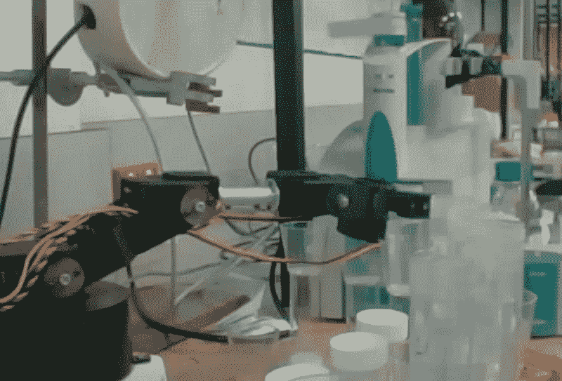
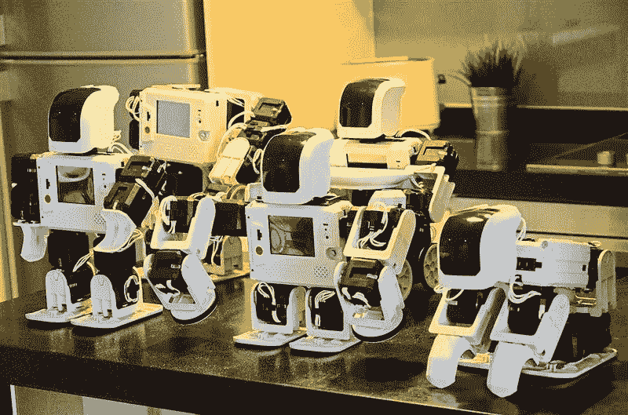

# 您需要了解的所有机器人流程自动化(RPA)统计数据

> 原文：<https://towardsdatascience.com/all-the-robotic-process-automation-rpa-stats-you-need-to-know-bcec22eaaad9?source=collection_archive---------2----------------------->

如果你在过去几年里一直关注科技行业，你可能已经听到了很多关于机器人过程自动化(RPA)及其改变我们工作方式的潜力的讨论。专业领域正从智能自动化初创企业及其应用的爆炸式增长中受益匪浅，这些应用的目的是简化工作流程、实现任务自动化，并让人类工人专注于高价值的工作。WorkFusion 拥有[一套智能自动化产品](https://www.workfusion.com/?utm_source=other&utm_medium=medium&utm_name=karl-utermohlen&utm_term=all-the-robotic-process-automation-(rpa)-stats-you-need-to-know)来帮助您扩大运营规模并降低管理成本。

没有一个放之四海而皆准的统计数据可以准确评估 RPA 可以为您的公司节省多少资金，它可以自动化多少工作流程，以及在不雇佣数百名员工的情况下您的运营规模可以有多大。这主要是因为不同的公司有不同的技术、系统、流程，并且他们在不同的行业工作。然而，有一些 RPA 数字可以让您了解该技术可以提供多少自动化，以及它可以提高您的 ROI 多少。

以下是围绕该技术的一些关键数据:

**1)它能帮你实现什么自动化**

RPA 在各种规模的企业中变得越来越普遍，帮助他们自动化繁重的工作，如会计和 IT 任务，以帮助保持您的运营顺利进行。这项技术非常有助于减少任何人工操作中必然会出现的人为错误。得益于人工智能(AI)、机器学习(ML)、大数据、语音识别技术和深度神经网络方面的最新进展，RPA 在后台和前台实现了基于规则的流程自动化。

该技术有助于降低成本、提高准确性、改善服务交付、帮助解决合规和监管问题，同时还能改善客户体验。这些基于规则的流程中大约 70%到 80%可以实现自动化，从而让企业以比离岸更低的成本在国内运营。使用 RPA 的公司不需要依赖离岸或外包合作伙伴，从而确保 100%的准确性。

**2)减少工时**

根据 [*软件测试和大数据 Hadoop*](http://www.pavantestingtools.com/2017/10/robotic-process-automation-statistics.html#.WsaCtdPwbMI) 的研究，大约 10%到 20%的人类工作时间花费在枯燥、重复的计算机任务上，相当大一部分时间浪费在可以轻松自动化的流程上。该公司的研究人员估计，IT 部门也有 30%的时间花在低级别的基本任务上。此外，大约 50%的公司在每张人工处理的发票上花费 5-25 美元。

企业平均错过了大约 50%的自动化机会，而 13%的员工认为这些重复的任务是浪费时间。此外，98%的 IT 业务领导表示，自动化流程对于推动业务收益至关重要。可以自动化的主要任务依次为:

*   文件和记录管理。
*   索赔、预订和发票管理。
*   客户关系管理。
*   人力资源流程。
*   它处理。

WorkFusion 有一个 [RPA 平台](https://www.workfusion.com/robotic-process-automation-rpa?utm_source=other&utm_medium=medium&utm_name=karl-utermohlen&utm_term=all-the-robotic-process-automation-(rpa)-stats-you-need-to-know)，可以帮助公司在 RPA Express 中自动化这些任务和更多任务。

**3)RPA 的未来**

Hadoop 的研究人员估计，到 2025 年，公司将通过 RPA 节省 5 万亿至 7 万亿美元。该公司还预测，到同一年，RPA 软件将能够完成相当于 1 . 4 亿全时当量的任务。 [*Statista*](https://www.statista.com/statistics/647202/worldwide-robotic-process-automation-market-revenues/) 认为，到 2019 年，RPA 行业价值将达到 31 亿美元，到 2020 年将达到 49 亿美元。据 Forrester 预测，到 2021 年，这一数字更有可能达到 29 亿美元左右。

*AB Newswire* 补充道，RPA 市场目前由北美地区主导，亚太地区在医疗保健、零售、IT、BFSI 和电信行业也在高速采用该技术。中国和印度已经开始推出外包服务，推动了这些地区的市场。在欧洲，RPA 预计将在制造业和物流业增长，尤其是在德国、俄罗斯、西班牙和丹麦。

**底线…**

没有人知道 RPA 在以前只能手动执行的自动化任务中会走多远，但该技术在转变企业运营方式方面有很大的潜力。未来几年，世界各地的几乎每个行业都将受益于智能自动化系统的功能。只要企业在寻找新的解决方案、更低的开销和更高的投资回报，RPA 就会继续变得更加复杂和流行。