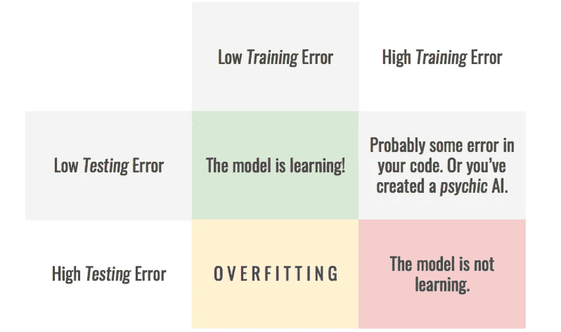
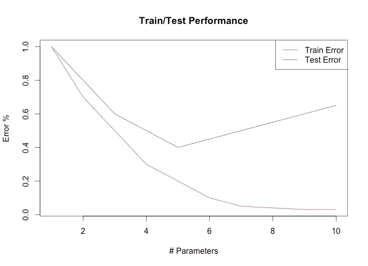
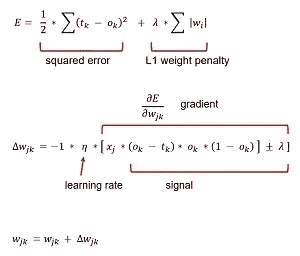
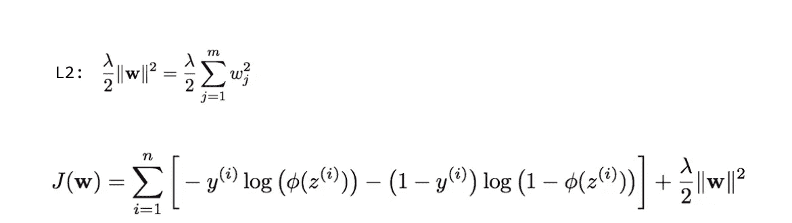
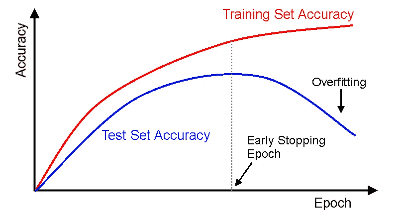
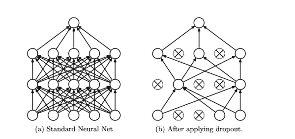

# 关于正规化，你需要知道的是

> 原文：<https://towardsdatascience.com/all-you-need-to-know-about-regularization-b04fc4300369?source=collection_archive---------3----------------------->

## 过度拟合的原因以及正则化如何改善它

**爱丽丝** **:** 嘿鲍勃！！！我已经对我的模型进行了 10 个小时的训练，但是我的模型产生了非常差的准确性，尽管它在训练数据上表现得非常好，这是什么问题？

鲍勃:哦！！看起来你的模型在训练数据上过度拟合了，你使用正则化了吗？

艾丽斯:那是什么？

这种与过度拟合相关的问题在 ML 中很常见，有许多方法可以避免这种问题，但是为什么会出现这种问题？

训练一个模型的过程似乎很简单:

1.  收集数据
2.  预处理数据
3.  设计一个模型
4.  训练模型

## 但是在这个过程中间发生了什么呢？什么导致过度拟合，为什么正则化给出了解决方案？

过度拟合的主要原因可以追溯到开始的两个过程，数据的收集和预处理。具有不均匀特征分布、包含噪声、数据中的随机波动、非常高的方差的数据集合可能对模型训练产生相反的影响。这些随机误差和波动在训练时被模型很好地学习，以至于训练数据模型的精度变得非常高，导致数据的过度拟合。有时超过要求的训练会导致过度适应。

source : [https://stats.stackexchange.com/](https://stats.stackexchange.com/)

## 那么，怎样才能避免过度拟合的问题呢？

可以容易地观察到，权重越高，非线性就越高，因此一种简单的方法是在更新权重时惩罚权重。在这一点上，我们有两个这样的技术使用这个想法。

1.  **L1 定额:**

其工作方式是在我们需要减少的误差函数中添加一个带有参数 **λ** 的惩罚项。这里 w 不过是权重矩阵。

这里， **λ** 是一个超参数，其值由我们决定。如果 **λ** 很高，它会对误差项增加很高的惩罚，使得学习到的超平面几乎是线性的，如果 **λ** 接近 0，它对误差项几乎没有影响，不会导致正则化。

L1 正则化也经常被视为一种特征选择技术，因为它将不需要的特征的相应权重清零。L1 在非稀疏情况下的计算效率也很低。L1 有时可能被称为**套索回归**。

2. **L2 常模:**

L2 的正规化可能看起来与 L1 没有太大的不同，但它们有着几乎不相似的影响。这里重量“w”分别平方，然后相加。L1 的特征选择属性在这里丢失了，但是它在非稀疏情况下提供了更好的效率。有时 L2 被称为山脊回归。参数 **λ** 的作用与 L1 相同。

**提前停止:**到目前为止，我们已经添加了惩罚来控制权重值，但也有其他方法来调整，如果在训练过程中，训练误差开始下降，测试误差开始上升，我们会停止训练。这将为我们提供所需的列车测试误差设置。这种技术通常被称为**提前停止**。这种技术可能会给我们想要的结果，但一般来说，有些人不建议这样做。

source : deeplearning4j.org

**退出:**这是 Srivastava 等人(2014 年)首次提出的一种有趣的正则化神经网络的方法，该论文提出，一个层中的一些节点必须随机选取，并且应该在训练期间被丢弃/忽略。

source : commonlounge.com

每个节点都有被丢弃的概率，假设一个节点的 drop_prob =0.4，那么它有 40%的机会被丢弃，60%的机会被拾起。每次这个概率都会导致神经网络改变形状，每次看起来都是一个新的网络。这种技术似乎很好地解决了正则化的问题。丢弃的概率不是很高，因为这将使网络稀疏，从而导致不匹配。

**数据扩充:**我们可能会看到计算机视觉中的过拟合问题，数据扩充是解决这一问题的更好方法。我们只需要自己放大图像，比如翻转、裁剪、旋转图像。

source: medium.com

这种类型的增强似乎产生更好的结果，因为它提供了在一些变形图像和其他变化上进行训练的机会，并且当可用数据较少时，数据增强也有帮助。

这些是一些有助于解决过度拟合的正则化技术。有时调整超参数可能会得到想要的结果，但如果没有改善，那么上述技术肯定可以解决这个问题。