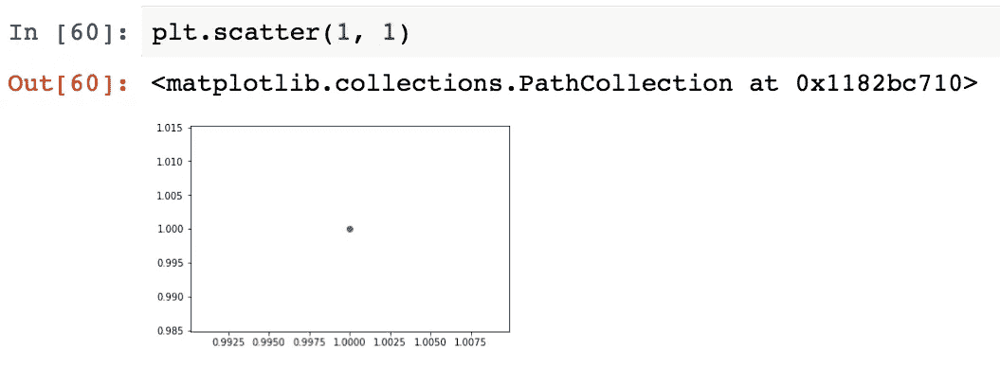
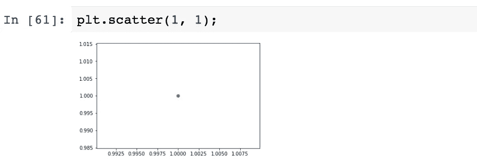
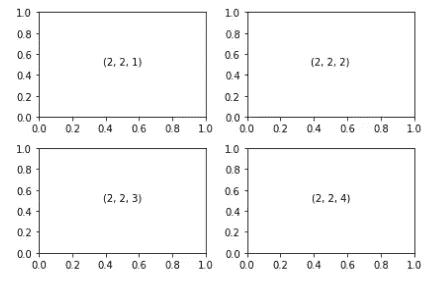
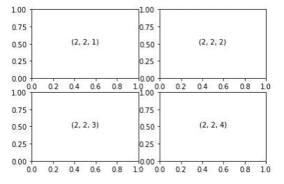
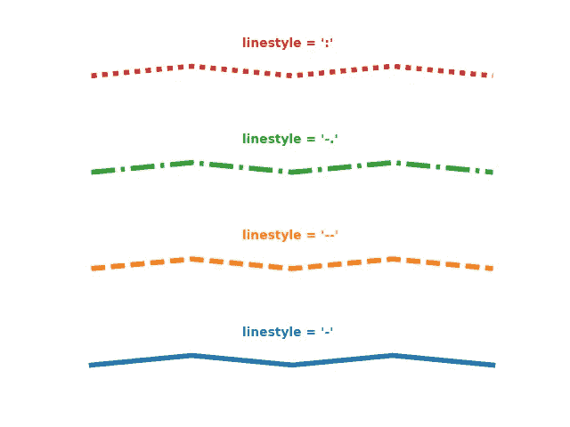
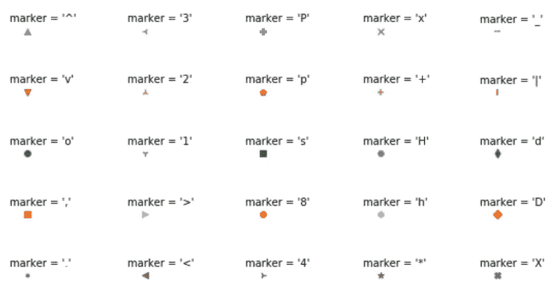
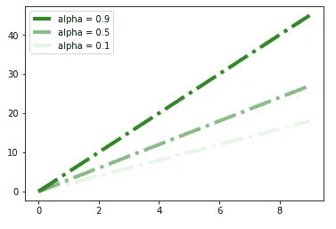
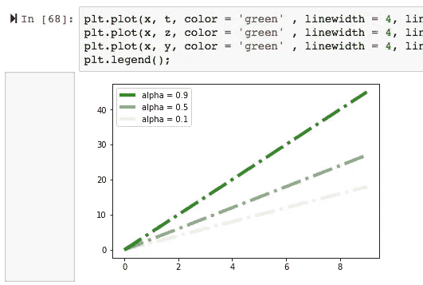

# 为赶时间的人准备的 Matplotlib 指南

> 原文：<https://towardsdatascience.com/all-your-matplotlib-questions-answered-420dd95cb4ff?source=collection_archive---------0----------------------->


“person working on MacBook Pro” by [rawpixel](https://unsplash.com/@rawpixel?utm_source=medium&utm_medium=referral) on [Unsplash](https://unsplash.com?utm_source=medium&utm_medium=referral)

Matplotlib 是最流行的二维图形库，但有时很难让你的图形看起来恰到好处。

*如何更改图例上的标签名称？我如何设置刻度线？如何将刻度改为对数？如何向我的绘图添加注释和箭头？如何在绘图中添加网格线？*

本文是关于如何自定义 Matplotlib 绘图的常见问题和答案的汇编。这是快速 Matplotlib 绘图的一个很好的备忘单，而不是 Matplotlib 库的介绍。如果您不熟悉这个库，请在这里查看文档。本文涵盖的主题包括地块和地块属性、轴、图例、注释和地块保存。从今天开始编写生产质量的图形！

# 开始提示

首先，确保导入 matplotlib。

```
import matplotlib.pyplot as plt
```

在 Jupyter Notebook 中，您可以在下面包含这一行，这样您就不必每次想要制作一个情节时都调用`plt.show()`。

```
%matplotlib inline
```

另一个方便的提示是，如果你不想让这个烦人的消息出现`<matplotlib.collections.PathCollection at 0x1182bc710>`，只需在你的代码行中添加一个分号，如下图所示。

**之前:**



**之后:**



# 剧情和支线剧情

问:我如何增加我身材的尺寸？

很多时候，默认大小太小。您可以添加参数 figsize，并以英寸为单位指定宽度和高度，如下所示。

```
plt.figure(figsize=(20,10))
```

***问:什么是支线剧情？我如何创建和浏览支线剧情？***

子图是存在于单个图形中的多组较小的轴。下面是一个 2 x 2 形式的四个支线剧情的例子。



这些支线剧情是用下面的代码创建的。我们调用`plt.subplot`并指定三个号码。它们指的是行数、列数和你想要激活的子情节数。

```
for i in range (1, 5):
   plt.subplot(2, 2, i)
   plt.text(0.5,0.5, str((2, 2, i)), ha=’center’, fontsize = 10)
   plt.tight_layout()
```

在上面的支线剧情中，剧情中的文字是对这三个数字的引用。子情节编号的排序是从左上角开始的，从数字 1 开始。例如，左上图是 1 号支线剧情，右上图是 2 号支线剧情，左下图是 3 号支线剧情，右下图是 4 号支线剧情。

请注意，您必须专门调用`plt.subplot(2, 2, 1)`来激活该支线剧情。

***问:我的支线剧情安排看起来不太好。我如何修理它？***

这是一个你的支线剧情被挤压的例子。我们可以通过调用`plt.tight_layout()`来修复它，它会清理支线剧情之间的填充，以获得更清晰的外观。

**在**之前



**在**之后


***问:。如何在绘图中添加网格线？***

```
plt.grid(True)
```

# 样式和属性

问:我如何改变我的线条颜色/宽度/样式？

您可以传入参数 color、linewidth 和 linestyle。

```
plt.plot(x, y, color = ‘green’ , linewidth = 2, linestyle = “-”)
```

以下是您可以设定的一些线型选项。



Photo from [https://python-graph-gallery.com/121-line-chart-customization/](https://python-graph-gallery.com/121-line-chart-customization/)

问:如何更改我的标记样式或颜色？

您可以像下面这样传入参数标记和颜色。

```
plt.scatter(x, y, marker = ‘o’, color = ‘red’)
```

这里有一些标记选项，您可以根据自己的喜好设定。



问:我如何改变线条的透明度？

将 alpha 参数传入您的绘图。Alpha 可以设置为 0 到 1，其中 0 表示完全透明，1 表示不透明。

```
plt.plot(x, y, alpha = 0.1)
```

下图显示了透明度在 alpha 级别为 0.9、0.5 和 0.1 时的样子



# 神话；传奇

***问:我如何给我的剧情添加一个传说？***

如果图例没有自动出现在您的绘图上，您可以使用以下代码来显示图例。

```
plt.legend()
```

问:我如何改变我的图例出现的位置？

您可以将以下选项传递给`loc`参数:右上、左上、左下、右下、右下、左中、右中、下中、上中、居中。

```
plt.legend(loc = ‘lower right’);
```

***问:如何更改图例上的标签名称？***

**选项 1:**

假设您有十个图例项，您只想更改第一个图例项的标签。将图例保存到变量 L 后，可以用`“L.get_texts()[0]”`调用图例的第一项，手动将文本设置成你想要的。在下面的例子中，我将图例设置为“123 行”。

```
L = plt.legend()
L.get_texts()[0].set_text('line123')
```

**选项 2:**

或者，您可以创建一个标签名称列表，并将图例标签设置为与您创建的列表相同。

```
mylabels = ['happy', 'sad', 'nervous', 'angry', 'neutral']
plt.legend(labels = my_labels)
```

问:我如何改变我的图例的大小？

要设置特定绘图的图例大小，可以传入 fontsize 参数。

```
plt.legend(fontsize = 10);
```

或者，不使用数字，您可以这样做。

```
plt.legend(fontsize = 'x-large');
```

# 轴线

***问:如何命名我的 x 轴和 y 轴标签，如何更改字体大小？***

根据您想要使用的轴，您可以调用“ylabel”或“xlabel ”,如下所示。第一项是轴的名称。要设置字体的大小，插入 fontsize 参数，如下所示。

```
plt.ylabel('Income', fontsize = 15) #for y label
plt.xlabel('Age', fontsize = 15) #for x label
```

***问:如何设置刻度线？***

第一个参数是要设置刻度线的位置，第二个参数是刻度线旁边的标签。

```
plt.yticks([0,2,4,6,7,10], [“0”, “2B”, "4B”, “8B”, “10B”])
plt.xticks([0,1,2,3,4,5], [“0”, “1oz”, "2oz”, “3oz”, “4oz”])
```

***问:我如何设置坐标轴的范围？***

```
plt.ylim(-1.0,1.0) #for y axis
plt.xlim(0, 50) #for x axis
```

***问:如何将刻度改为对数？***

```
plt.yscale(“log”) #for y axis
plt.xsclae("log") #for x axis
```

# 附注

***问:如何给我的剧情添加注释和箭头？***

我们可以创建注释并指定坐标来注释到`xy`参数。`xytext`定义标签的坐标。如果我们也想要箭头，我们需要使用`arrowprops`来显示箭头。

```
plt.annotate(‘sentosa’, xy = (5.0, 3.5), xytext(4.25, 4.0), arrowprops={'color': 'red'})
```

# 保存绘图

现在你已经有了自己喜欢的定制剧情，那就保存吧！我把我的地块叫做“地块 1”，但是给你的地块起一个更独特的名字！这将把绘图保存到您的工作目录中。

```
plt.savefig('plot1.jpg')
```

# 最后一点

如果你的 Jupyter 笔记本上有大量的二维图形，你的笔记本会变得很慢。这发生在我参与的一个项目中。如果您将鼠标悬停在图形的左侧，将会出现如下所示的灰色框。通过双击那个灰框，我可以隐藏我的情节，这样 Jupyter 笔记本就可以正常运行了。这也有助于滚动。



希望你喜欢这个 Matplotlib 概述。不可能涵盖大规模 Matplotlib 库中的所有内容，但是如果您认为本文中应该包含其他 Matplotlib 特性，请告诉我。

期待我的下一篇关于在 Matplotlib 中制作动画的文章！