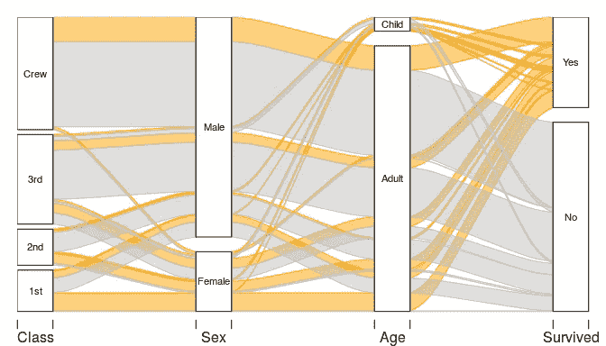
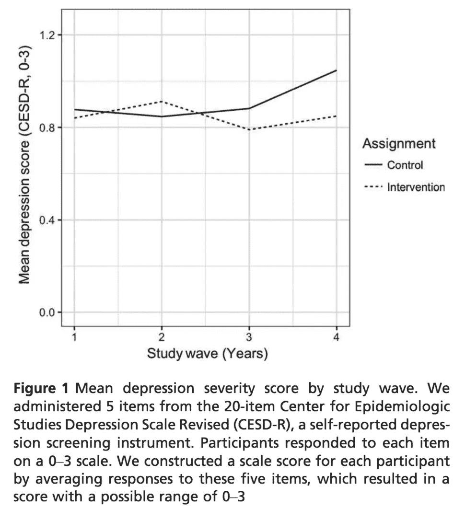
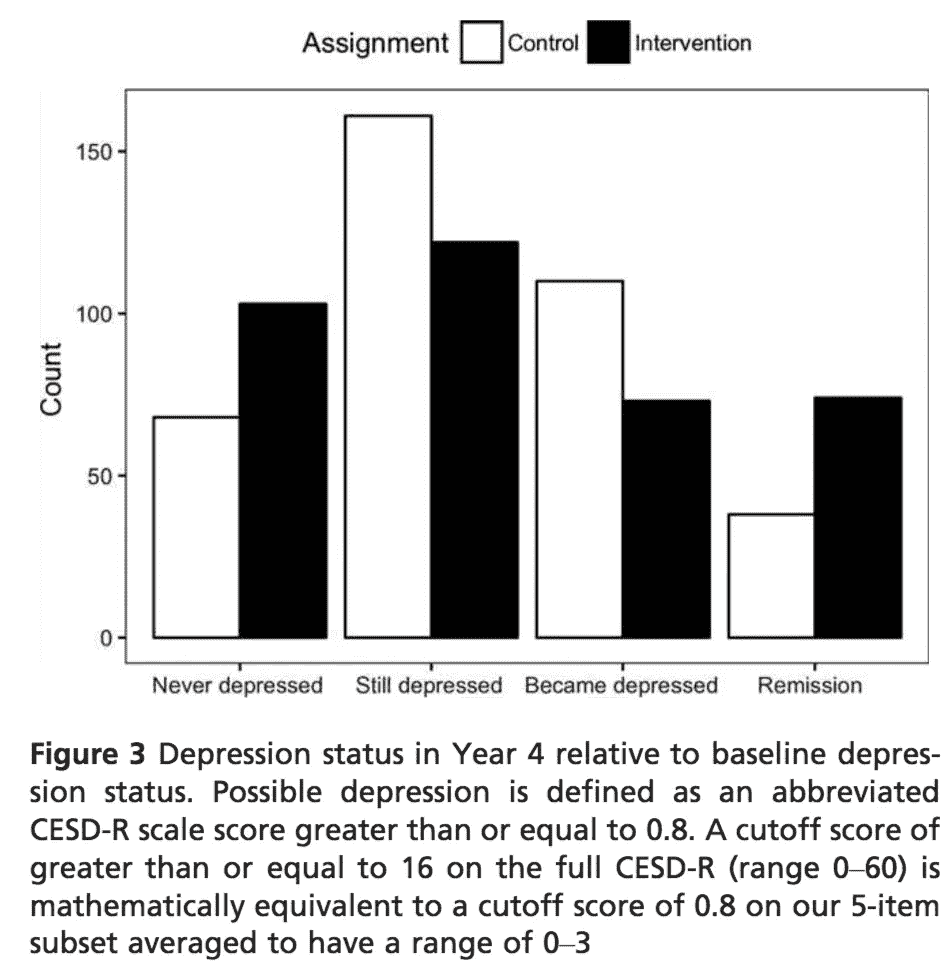
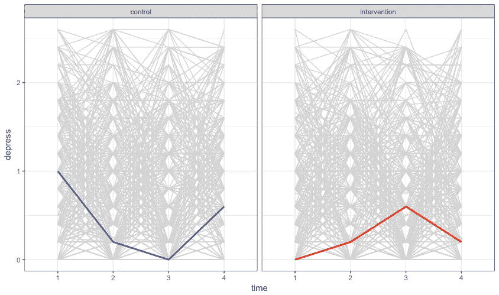
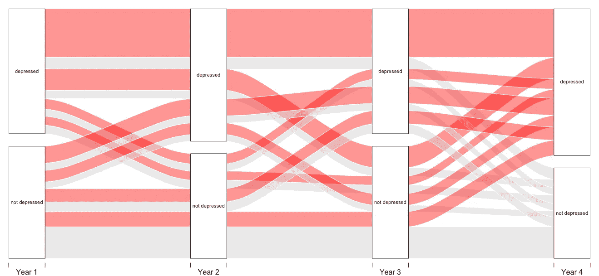

# 冲积图

> 原文：<https://towardsdatascience.com/alluvial-diagrams-783bbbbe0195?source=collection_archive---------6----------------------->

## 随着时间的推移绘制路径

我与人合著的一篇论文上周发表在 T4 的《儿童心理学和精神病学杂志》上。本文报告了一项关于学校支持干预对肯尼亚孤儿抑郁症影响的二次分析结果。在为[公共存档](https://ericpgreen.github.io/JCPP2018/jcpp.html)准备数据的过程中，我认为尝试将我们关于萧条的纵向数据可视化为冲积图会很不错。

下图是 r 的`[alluvial](https://github.com/mbojan/alluvial)` [包](https://github.com/mbojan/alluvial)的作者 Michał Bojanowski 创建的`Titanic`数据集冲积图的示例。该图从乘客是否幸存开始向后流动。例如，你可以从`Survived=="No"`追溯到泰坦尼克号的大部分船员都没有生还。

Alluvial diagram of the Titanic dataset [created by Michal Bojanowski](https://cran.r-project.org/web/packages/alluvial/vignettes/alluvial.html).

我将向您展示如何使用这个包来创建一个不同类型的冲积图，描述个人如何跨时间点流动。

# 数据

我的同事在肯尼亚设计了一项随机分组试验，招募了 26 所小学的 800 多名青少年参与学校支持(即免学费、校服和护士出诊)研究。作为基线调查的一部分，孩子们被问及一份名为 [CESD-R](http://cesd-r.com/) 的问卷中的一部分问题，以评估抑郁症的严重程度。然后，一半的学校被随机分配接受学校支持干预，研究小组跟踪这些孩子超过四年。

在我们的二次分析中，我们创建了一个抑郁指标，它是五个 CESD-R 问题的平均值，这些问题被重新调整为 0 到 3 的范围。分数越高，表示严重性越高。

# 群体意味着随着时间的推移

这是我们论文中的图 1，显示了按研究组和年份划分的平均抑郁分数。这是试验数据的简明摘要，但它并没有给我们一种个体如何随时间变化的感觉。所有的信息都被压缩成了。

# 从一年级到四年级抑郁状态的变化

该线图显示，平均而言，各组在严重程度方面是相似的，直到第 4 年，当对照组的分数增加时，产生了与治疗组的分离。让我们来探索一下第 4 年发生了什么。

查看数据的一种方法是根据参与者的年度严重程度评分将他们标记为“可能抑郁”或“没有抑郁”，并将研究组在第 4 年的这种状态与他们在第 1 年开始时的状态进行比较。这就是我们在图 3 中所做的，将每个人标记为:

*   **从未抑郁**(低于第 1 年和第 4 年可能抑郁的分数线)
*   **仍然低迷**(高于第 1 年和第 4 年的临界值)
*   **下降**(低于第 1 年的临界值，但高于第 4 年)
*   **缓解**(高于第 1 年的临界值，但低于第 4 年的临界值)

# 个体变化

这个数字暗示了一个事实，即参与者对他们的第四年抑郁分数有不同的途径，但数据仍然是按组总结的。让我们试着去掉所有的汇总，显示每个青少年在每个时间点的分数。

下面是获取原始数据并将其整理成正确形状以便绘图的脚本:

现在我们可以把每个人的年度得分画成一条线:

Individual scores over time faceted by study arm. The blue line is participant #2, and the red line is participant #3\. Everyone else is grey.

真是一团糟！数据科学可能既是艺术又是科学，但这个情节完全属于艺术阵营。

# 更细致的聚合

现在，我将使用`alluvial`包按照路径将参与者聚集在一起。代码如下:

为了使事情简单，这个情节没有在学习臂上刻面，但是这样的刻面是可能的。要把握的更大图景是冲积图如何追踪参与者在纵向数据集中采取的所有可能路径。

例如，得分从未超过抑郁临界值的青少年在底部形成一条灰色直线带，从第 4 年的“不抑郁”一直回到第 3、2 和 1 年的“不抑郁”。有一个平行的*一直按下的*组，由顶部的直线红带代表。中间的波浪是一次或多次改变状态的参与者。

下次您看到基于前/后数据的报告时，您可能会想知道在两次观察之间发生了什么。如果你真的收集纵向数据，试着用冲积图绘制这种变化。