# Tweep & Vader 的(几乎)实时 Twitter 情绪分析

> 原文：<https://towardsdatascience.com/almost-real-time-twitter-sentiment-analysis-with-tweep-vader-f88ed5b93b1c?source=collection_archive---------2----------------------->

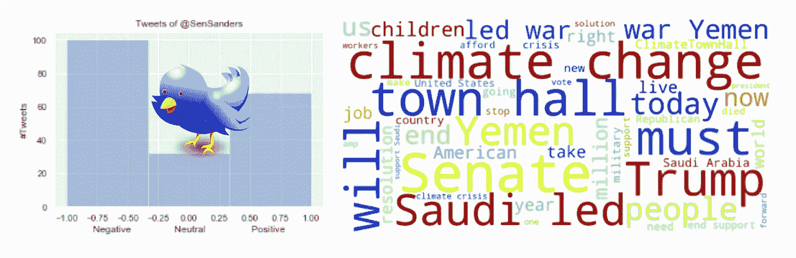

这篇文章的想法是捕捉推文，根据最常用的词和标签对它们进行分析，并根据它们的情绪(积极、消极或中立)对它们进行分类。我们将不仅使用从历史数据库中捕获的推文作为数据集，例如， *@realDonaldTrump:* 发送的最后 200 条推文

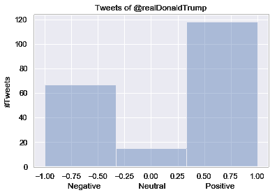

还包括在某一特定时刻生成的所有实时推文，例如，在包含作品*川普*或*墙*的*纽约州*地区发送的推文

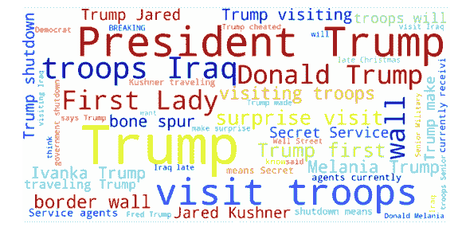

对于情感分析，我们将使用 [VADER](https://github.com/cjhutto/vaderSentiment) ( *效价感知词典和情感推理机*)，这是一个基于词典和规则的情感分析工具*，专门针对社交媒体中表达的情感*。对于 Tweepy 捕获， [API Tweepy](https://tweepy.readthedocs.io/en/3.7.0/getting_started.html) 将是被选中的那个！

# 使用 Vader 进行情感分析

安装 Vader 的最简单方法是使用 pip 命令:

```
pip install vaderSentiment
```

接下来，让我们调用库并创建“分析器”:

```
from vaderSentiment.vaderSentiment import SentimentIntensityAnalyzeranalyser = SentimentIntensityAnalyzer()
```

您只需在下面的函数中输入一个文本字符串即可获得分数:

```
analyser.polarity_scores("The movie is good")
```

结果将是一个字典:

```
{'compound': 0.4404, 'neg': 0.0, 'neu': 0.508, 'pos': 0.492}
```

上面的结果意味着这个句子几乎是半肯定的(' pos': 0.492)，或多或少是中性的(' neu': 0.508)，而绝不是否定的(' neg': 0.0)。事实上，最重要的结果是分数:“复合”，它可以表明文本是“好的”(大于零的值)。让我们来分析同一句话，但带有负面情绪:

```
analyser.polarity_scores("The movie is very bad")
```

结果是:

```
{'compound': -0.5849, 'neg': 0.487, 'neu': 0.513, 'pos': 0.0}
```

因此，我们得出结论，只寻找复合的结果，文本必须表现出消极情绪。

不仅如此，你还可以有不同程度的这种情绪:

> “电影很烂”== >复合:-0.5849
> 
> “电影很烂”== >复合:-0.7398
> 
> “这部电影很糟糕！！!"== >复合:-0.7984

诸如此类…

> 简而言之，正面、负面和中性分数表示属于这些类别的文本的比例，并且复合分数是计算所有词典评级的总和的度量，这些评级已经在-1(最极端负面)和+1(最极端正面)之间标准化。

关于 Vader 的更详细的教程，请参见这篇中型文章:[在 Python 中使用 VADER 简化情感分析](https://medium.com/analytics-vidhya/simplifying-social-media-sentiment-analysis-using-vader-in-python-f9e6ec6fc52f)

回到我们的分析，复合分数的范围是[-1，1]，即:

*   [-1 到 0):负数，
*   [0]:中性
*   (0 到+1):正

因此，让我们编写一个函数来仅捕获通用文本的这 3 种状态:

```
def sentiment_analyzer_scores(text):
    score = analyser.polarity_scores(text)
    lb = score['compound']
    if lb >= 0.05:
        return 1
    elif (lb > -0.05) and (lb < 0.05):
        return 0
    else:
        return -1
```

测试…

1.  情操 _ 分析器 _ 分数(“电影很烂！”)== >结果:-1
2.  情操 _ 分析器 _ 分数(“电影很长！！!")== >结果:0
3.  感悟 _ 分析器 _ 分数(“电影很好看！”)== >结果:1

# 在其他语言中使用 Vader

Vader 确实是一个很好的工具，但不幸的是，它是建立在英语之上的(Vader 不能直接与其他语言一起工作)。

但如果你生活或工作在说其他语言的国家，你可以很容易地创建一个“转机”，并在应用 Vader 之前将你的文本从原始语言翻译成英语。

为此，我们将使用 *Googletrans，*一个实现了 Google Translate API 的免费且无限制的 python 库(详情请参考 [API 文档](https://py-googletrans.readthedocs.io/en/latest))。

要安装 Googletrans，您可以使用 pip 命令:

```
pip install googletrans
```

和我们对维达做的一样，让我们导入库并调用翻译器:

```
from googletrans import Translator
translator = Translator()
```

让我们测试一个简单的西班牙语翻译:

```
translator.translate('hola, todo bien?').text
```

结果是:

```
'hello, all right?'
```

让我们尝试对一段西班牙文本进行“情感分析”:“la pelicula es mala”(“电影很糟糕”)

```
text = translator.translate('la pelicula es mala').text
analyser.polarity_scores(text)
```

结果是:

```
{'compound': -0.5423, 'neg': 0.538, 'neu': 0.462, 'pos': 0.0}
```

和我们一开始得到的结果完全一样！太好了！因此，我们可以将之前的函数更新到现在，还可以获得任何语言的任何文本的情感分析！

```
def sentiment_analyzer_scores(text, engl=True):
    if engl:
        trans = text
    else:
        trans = translator.translate(text).text score = analyser.polarity_scores(trans)
    lb = score['compound']
    if lb >= 0.05:
        return 1
    elif (lb > -0.05) and (lb < 0.05):
        return 0
    else:
        return -1
```

请注意，首先，我测试了语言是否是“英语”，如果是，不需要翻译，我们可以直接使用维达，即使没有互联网连接。当然，对于其他语言，互联网连接是强制性的，因为 Google Translate API 需要访问其在线服务。

您可以通知翻译您正在使用的语言，但在我们的情况下，我们将把这项工作留给做得很好的 Google(自动语言检测)。例如，让我们用葡萄牙语测试文本:“今天天气很好，阳光充足。”:

```
text = 'o dia esta lindo, com muito sol'
sentiment_analyzer_scores(text, False)
```

将结果为 1(“积极情绪”)。

太好了！在这一点上，我们可以分析几乎任何语言文本背后的情感！那么，为什么不从推文中提取“文本”呢？这将是我们的下一步行动！

# 准备 Tweepy 来捕捉推文

首先，让我们安装 Tweeppy:

```
pip install tweepy
```

需要指出的是，Twitter 要求所有请求都使用 Oauth 进行身份验证。本教程考虑到你实际上是一名 Twitter 开发者，拥有访问 tweets 的所有必要“钥匙”。

Tweepy 尽量让 OAuth 对你来说不那么痛苦。要开始这个过程，我们需要向 Twitter 注册我们的客户端应用程序。创建一个新的应用程序，一旦你完成，你应该有你的消费者令牌和秘密。把这两个放在手边，你会需要它们的。更多详情请前往[认证教程](https://tweepy.readthedocs.io/en/v3.5.0/auth_tutorial.html#auth-tutorial)。

安装 Tweepy 并准备好所有令牌后，让我们开始:

```
import tweep
```

获得授权:

```
consumer_key = 'YOUR KEY HERE'
consumer_secret = 'YOUR KEY HERE'
access_token = 'YOUR KEY HERE'
access_token_secret = 'YOUR KEY HERE'auth = tweepy.OAuthHandler(consumer_key, consumer_secret)
auth.set_access_token(access_token, access_token_secret)api = tweepy.API(auth)
```

就是这样！您已经准备好捕捉推文了！

# 从 id 中读取和分析推文

首先，我将从我的大学获得几条推文:

```
tweets = api.user_timeline('[@ingenieriaUDD_](http://twitter.com/ingenieriaUDD_)', count=5, tweet_mode='extended')
for t in tweets:
    print(t.full_text)
    print()
```

结果是:

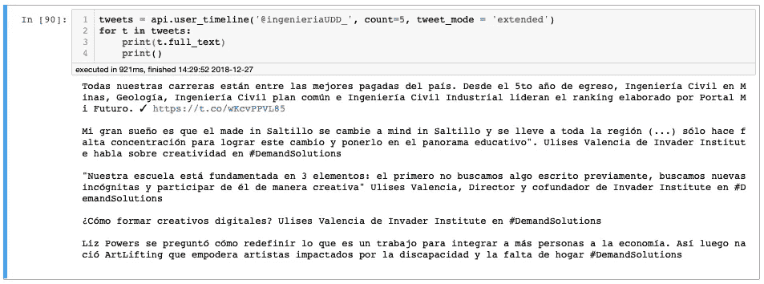

太好了！但是，仅仅打印推文并不能帮助我们走上“数据科学征服之路”！我们需要将它们放在一个数据集上(在这一点上，只是一个列表)以供将来分析。因此，一个简单的函数可以帮助我们:

```
def list_tweets(user_id, count, prt=False):
    tweets = api.user_timeline(
        "@" + user_id, count=count, tweet_mode='extended')
    tw = []
    for t in tweets:
        tw.append(t.full_text)
        if prt:
            print(t.full_text)
            print()
    return tw
```

分析一下唐纳德·特朗普发的推文怎么样？

```
user_id = ‘realDonaldTrump’ 
count=200tw_trump = list_tweets(user_id, count)
```

在 tw_trump 上，我们将有一个列表，其中每个列表项都是 trump 的一条推文。例如，让我们看看我们的列表中保存的 200 条推文中的一条，在这种情况下，第三条推文被捕获:

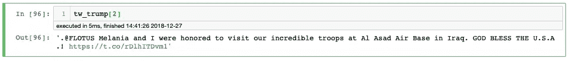

嗯，这是可以的，但我们可以看到，有一些推文的部分，事实上并没有帮助我们分析它的情绪，如网址，其他一些用户标识，数字等。我们应该做一些清洁工作:

```
def remove_pattern(input_txt, pattern):
    r = re.findall(pattern, input_txt)
    for i in r:
        input_txt = re.sub(i, '', input_txt)        
    return input_txtdef clean_tweets(lst):
    # remove twitter Return handles (RT [@xxx](http://twitter.com/xxx):)
    lst = np.vectorize(remove_pattern)(lst, "RT @[\w]*:")
    # remove twitter handles ([@xxx](http://twitter.com/xxx))
    lst = np.vectorize(remove_pattern)(lst, "@[\w]*")
    # remove URL links (httpxxx)
    lst = np.vectorize(remove_pattern)(lst, "https?://[A-Za-z0-9./]*")
    # remove special characters, numbers, punctuations (except for #)
    lst = np.core.defchararray.replace(lst, "[^a-zA-Z#]", " ")return lst
```

现在，我们干净的推特:

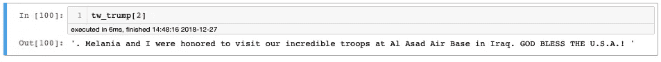

这条推特上的情绪怎么样？

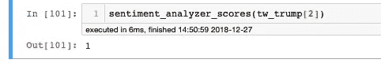

是的，显然是积极的情绪(“1”)。

当然，我们可以比这好得多。让我们创建一个函数来捕捉和显示唐纳德·特朗普最后 200 条推文的情绪:

```
def anl_tweets(lst, title='Tweets Sentiment', engl=True ):
    sents = []
    for tw in lst:
        try:
            st = sentiment_analyzer_scores(tw, engl)
            sents.append(st)
        except:
            sents.append(0)
    ax = sns.distplot(
        sents,
        kde=False,
        bins=3)
    ax.set(xlabel='Negative                Neutral                 Positive',
           ylabel='#Tweets',
          title="Tweets of @"+title)
    return sents
```

这个函数的返回是一个列表，其中每个 tweet 的情感评分结果(-1、0 或 1)用作输入参数。

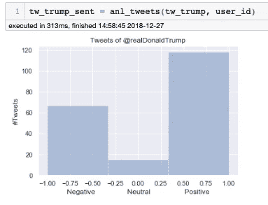

# 用词云分析推文

另一个有趣的快速分析是从一系列推文中产生的“词汇云”中获取一个峰值。为此，我们将使用 [word_cloud](https://github.com/amueller/word_cloud) ，这是 Python 中的一个小单词云生成器。在[博客](http://peekaboo-vision.blogspot.de/2012/11/a-wordcloud-in-python.html)或[网站](http://amueller.github.io/word_cloud/)上了解更多信息。

首先，安装 word_cloud:

```
pip install wordcloud
```

现在，让我们创建一个从 tweet 列表生成单词云的通用函数:

```
def word_cloud(wd_list):
    stopwords = set(STOPWORDS)
    all_words = ' '.join([text for text in wd_list])
    wordcloud = WordCloud(
        background_color='white',
        stopwords=stopwords,
        width=1600,
        height=800,
        random_state=21,
        colormap='jet',
        max_words=50,
        max_font_size=200).generate(all_words) plt.figure(figsize=(12, 10))
    plt.axis('off')
    plt.imshow(wordcloud, interpolation="bilinear");
```

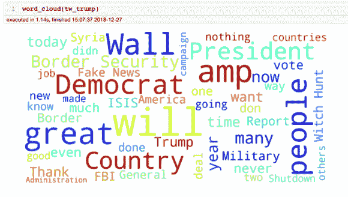

现在我们已经定义了所有的函数，我们可以对任何一个 tweetser 生成的任何一组 tweet 进行重复分析。让我们对奥巴马最后的 200 条推文做同样的尝试:

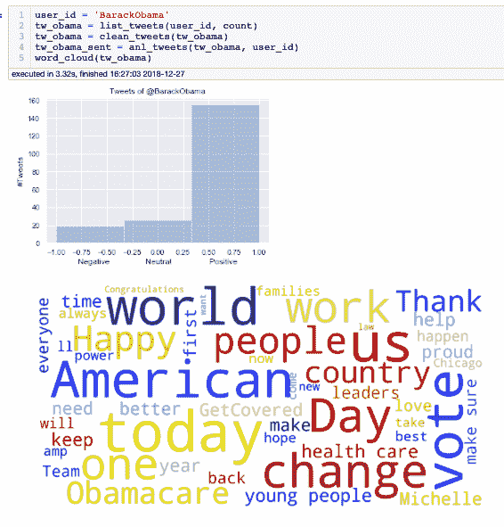

# 特定过滤器的流推文

twitter 流 API 用于实时下载 Twitter 消息。这对于获取大量的 tweets，或者使用站点流或用户流创建实时提要非常有用。Tweepy 通过处理身份验证、连接、创建和销毁会话、读取传入消息和部分路由消息，使使用 twitter 流 API 变得更加容易。

创建 tweet 实时监听器最重要的参数:

# 轨道

> 以逗号分隔的短语列表，将用于确定哪些推文将在流上发布。一个短语可以是由空格分隔的一个或多个术语，如果该短语中的所有术语都出现在 Tweet 中，则该短语将匹配，而不管顺序和大小写。根据这个模型，你可以把逗号想象成逻辑 OR，而空格相当于逻辑 AND(例如‘the Twitter’是 AND twitter，而‘the，Twitter’是 OR twitter)。

# 语言

> *除非明确说明，否则此参数可用于所有流式传输端点。将此参数设置为逗号分隔的 BCP 47 语言标识符列表，对应于 Twitter 的高级搜索页面上列出的任何语言，将只返回被检测为以指定语言编写的推文。例如，使用* ***language = en，*** *连接将仅流传输被检测为英语的推文。*
> 
> *其他语言代码示例:
> –es:西班牙语
> –pt:葡萄牙语*

# 跟随

> *逗号分隔的用户 id 列表，表示哪些用户的 Tweets 应该在流上发送。不支持跟踪受保护的用户。对于每个指定的用户，该流将包含:
> –用户创建的推文。
> –用户转发的推文。
> –回复用户创建的任何推文。
> –用户创建的任何推文的转发。
> –手动回复，无需按下回复按钮即可创建(如“@twitterapi 我同意”)。*

# 位置

> *一个逗号分隔的经度，纬度对列表，指定一组过滤推文的边界框。只有落在请求的边界框内的地理定位的推文才会被包括在内——与搜索 API 不同，用户的位置字段不用于过滤推文。每个边界框应该被指定为一对经度和纬度对，首先是边界框的西南角。例如:*
> 
> *-122.75，36.8，-121.75，37.8 == >旧金山
> -74，40，-73，41。== >纽约市*

将创建一个函数来轻松处理“监听”过程中可能出现的任何错误。其中一个参数是我们必须保持窗口打开的时间(秒)。该功能会自动将捕获的推文保存在一个. csv 类型的文件中，以供后期数据分析。

> *bellow 函数的灵感来源于原始代码，位于:* [*https://stack overflow . com/questions/38281076/tweepy-streamlistener-to-CSV*](https://stackoverflow.com/questions/38281076/tweepy-streamlistener-to-csv)

```
def twitter_stream_listener(file_name,
                            filter_track,
                            follow=None,
                            locations=None,
                            languages=None,
                            time_limit=20):
    class CustomStreamListener(tweepy.StreamListener):
        def __init__(self, time_limit):
            self.start_time = time.time()
            self.limit = time_limit
            # self.saveFile = open('abcd.json', 'a')
            super(CustomStreamListener, self).__init__() def on_status(self, status):
            if (time.time() - self.start_time) < self.limit:
                print(".", end="")
                # Writing status data
                with open(file_name, 'a') as f:
                    writer = csv.writer(f)
                    writer.writerow([
                        status.author.screen_name, status.created_at,
                        status.text
                    ])
            else:
                print("\n\n[INFO] Closing file and ending streaming")
                return False def on_error(self, status_code):
            if status_code == 420:
                print('Encountered error code 420\. Disconnecting the stream')
                # returning False in on_data disconnects the stream
                return False
            else:
                print('Encountered error with status code: {}'.format(
                    status_code))
                return True  # Don't kill the stream def on_timeout(self):
            print('Timeout...')
            return True  # Don't kill the stream # Writing csv titles
    print(
        '\n[INFO] Open file: [{}] and starting {} seconds of streaming for {}\n'
        .format(file_name, time_limit, filter_track))
    with open(file_name, 'w') as f:
        writer = csv.writer(f)
        writer.writerow(['author', 'date', 'text']) streamingAPI = tweepy.streaming.Stream(
        auth, CustomStreamListener(time_limit=time_limit))
    streamingAPI.filter(
        track=filter_track,
        follow=follow,
        locations=locations,
        languages=languages,
    )
    f.close()
```

让我们测试一下这个功能，听听人们在这个确切的时刻发出的关于特朗普和他著名的墙的所有推文！

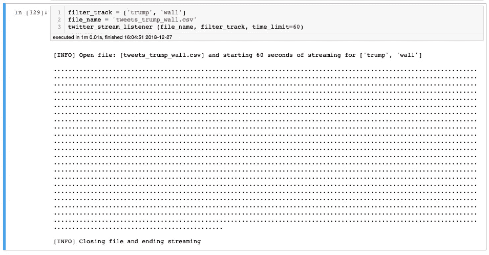

每条推文都是一个印在 Jupyter 笔记本上的“点”,这有助于查看“听众是否活跃并捕捉到了推文”。生成了一个文件(tweets_trump_wall.csv ),保存在笔记本所在的同一个目录下。

在这 60 秒的窗口时间内，许多推文被捕获。这是有意义的，因为我们不限制语言或地点。

# 用熊猫分析推特数据集

我可以说这里的工作差不多完成了。我们现在有了一个数据集。csv 格式，其中实时推文被捕获。现在，让我们使用我们的老熊猫来(几乎)实时读取文件，并继续数据集清理和探索阶段！

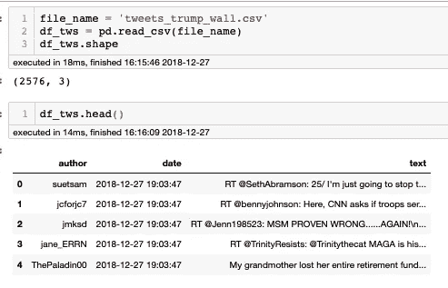

在 60 秒内，有 2576 条推文被捕获。数据集有 3 列，一列是作者，一列是日期，第三列是 tweet 文本。在本教程中，我们将只对最后一个感兴趣，但是对于更复杂的分析(如网络科学)，手头上有所有 3 个信息是很有趣的。

> 在一个网络科学项目中，将包含发件人回复的 id(RT @ XXX:)的推文的初始部分分离出来也是很有趣的。这里我们将清除它。

正如我们之前所做的，首先要做的是清理数据集，使用之前创建的相同函数:

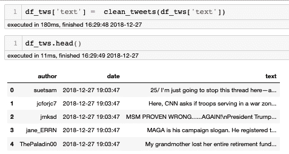

现在我们将生成一个新的列，在那里我们将存储每条单独推文的情感分析。

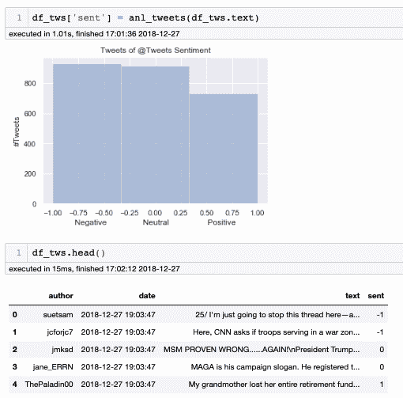

让我们来看看它的单词云:

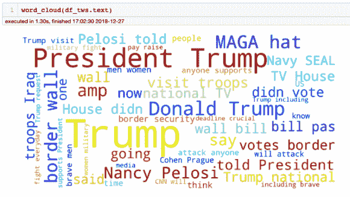

# 探索积极和消极的推文

在这一点上，我们可以过滤推文，将它们分为正面和负面，做任何我们认为有趣的分析。例如，每组推文的单词云是什么？

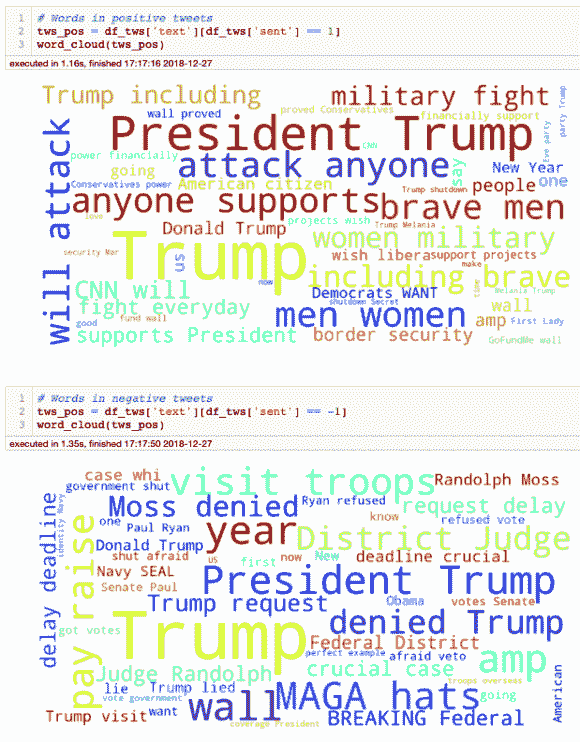

# 收集标签

我们将执行的最后一个分析将会查看在每种情况下生成的标签。为此，我们将在本教程中使用 Prateek Joshi 开发的函数:[使用数据集和代码进行 Twitter 情感分析的综合实践指南](https://www.analyticsvidhya.com/blog/2018/07/hands-on-sentiment-analysis-dataset-python/)。我建议访问他的网站。我从普拉蒂克那里学到了很多。

```
def hashtag_extract(x):
    hashtags = []
    # Loop over the words in the tweet
    for i in x:
        ht = re.findall(r"#(\w+)", i)
        hashtags.append(ht)
    return hashtags# extracting hashtags from positive tweetsHT_positive = hashtag_extract(df_tws['text'][df_tws['sent'] == 1])# extracting hashtags from negative tweets
HT_negative = hashtag_extract(df_tws['text'][df_tws['sent'] == -1])# unnesting list
HT_positive = sum(HT_positive,[])
HT_negative = sum(HT_negative,[])
```

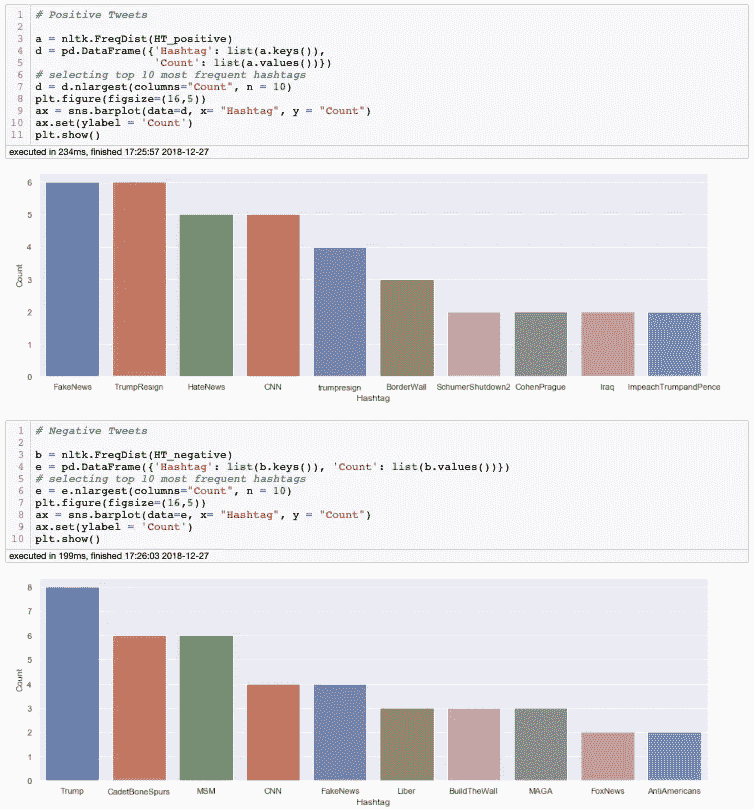

# 结论

就这些了，伙计们！

希望您对数据科学的奇妙世界有了更多的了解！

> *在我们结束之前，我要感谢 Claudio Aracena 教授*[](https://www.linkedin.com/in/caracena2/)**，他是我在智利 UDD 大学的数据科学硕士，是他启发了我写这篇文章。**

*和往常一样，你可以在我的数据仓库上找到 Jupyter 笔记本: [Git_Hub](https://github.com/Mjrovai/Python4DS/tree/master/Almost_Real_Time_Twitter_Sentiment_Analysis) 。*

*来自世界南部的 Saludos！*

*在我的下一篇文章中再见！*

*马塞洛*