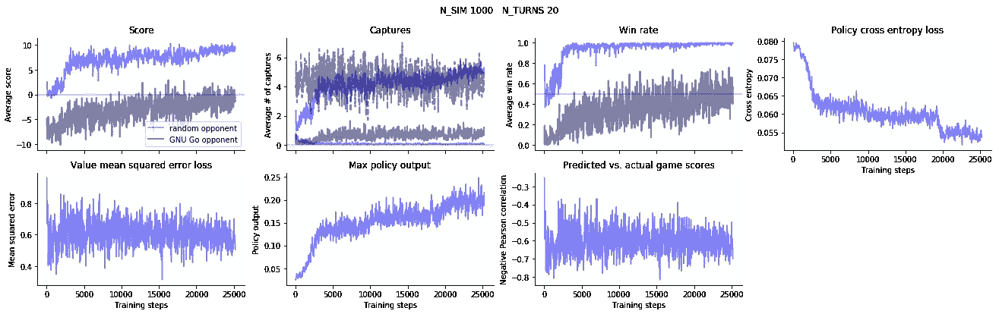
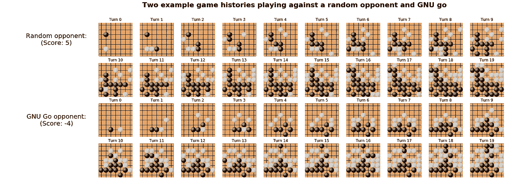
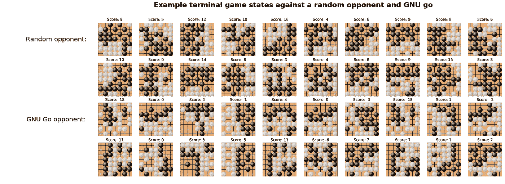
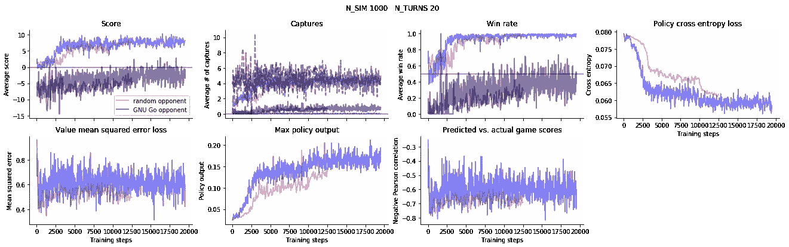

# AlphaZero 实现和教程

> 原文：<https://towardsdatascience.com/alphazero-implementation-and-tutorial-f4324d65fdfc?source=collection_archive---------6----------------------->

## 使用自定义 TensorFlow 操作和自定义 Python C 模块实现 AlphaZero 的演练

**注意(2020 年 1 月 27 日):**我已经发布了这个故事的[更新](https://medium.com/@cody2007.2/how-i-trained-a-self-supervised-neural-network-to-beat-gnugo-on-small-7x7-boards-6b5b418895b7)，在那里我获得了性能更好的模型。你也可以[看我](https://youtu.be/a5vq1OjZrCU)对战改进后的网络。

我在这里描述了我在 Github 上实现的 AlphaZero 算法[，它是用 Python 编写的，带有自定义 Tensorflow GPU 操作和一些用于树搜索的 C 语言辅助函数。](https://github.com/cody2007/alpha_go_zero_implementation)

AlphaZero 算法经历了三次主要的迭代，先是叫做 [AlphaGo](http://web.iitd.ac.in/~sumeet/Silver16.pdf) ，然后改进到不使用任何预训练叫做 [AlphaGo Zero](http://discovery.ucl.ac.uk/10045895/1/agz_unformatted_nature.pdf) ，最后进一步推广到其他游戏叫做 [AlphaZero](https://arxiv.org/abs/1712.01815) 。我的实现与 AlphaZero 最相似，然而，所有的变体都相对相似。我为游戏 Reversi 实现了类似的 GPU 功能，但目前我只有 Go GPU 代码可用(如果有人感兴趣，我可以提供前者)。

我写这篇文章的动机是使用相对最少的硬件(单个 GPU)在其他棋盘游戏上使用该算法，因此，我没有试图逐字实现该算法(例如，所有游戏都以预设的回合数进行，而不是使用自动程序在游戏结束时自动重新分配算法)。

我在公共领域发布这些代码、描述和所有其他材料。如果你觉得有用，我很乐意听听。如果你在理解我的代码时有任何问题，我也很乐意尽我所能，在时间允许的范围内提供帮助。我的电子邮件是 X@Y.com。其中 X 是 cody2007，Y 是 protonmail.com。

网络有多好？没那么好——我基本上一直都能打败它，而且我完全是个围棋新手。然而，这种实现似乎确实有效——在训练期间，它对 GNU Go 的分数确实稳步上升(对于使用简单评分系统的 20 回合游戏，网络在大约 50%的时间里开始击败 GNU Go,并且它至少可以在大约 100%的时间里击败完全随机的玩家。

不过有一点是，滥用我使用的评分系统需要走捷径。我通过计算每个玩家在棋盘上的所有石头加上每个玩家完全包围的所有空位来给游戏打分。出于这个原因，神经网络似乎喜欢(尤其是在游戏接近尾声时)将石头放在由另一个玩家安全控制的区域。这大大降低了其他玩家的分数(除了边界上的石头数量之外，其他玩家将不再获得该领土的任何分数)，即使该策略在游戏进行超过 20 轮后将不再有效。参见下面关于提高性能的[部分。](https://medium.com/p/f4324d65fdfc#2700)

## 目录

*   [编译并运行代码](https://medium.com/p/f4324d65fdfc#c6cb)
*   [可视化算法训练](https://medium.com/p/f4324d65fdfc#cdaf)
*   [播放训练好的网络](https://medium.com/p/f4324d65fdfc#866b)
*   [算法概述](https://medium.com/p/f4324d65fdfc#6052)
*   [代码概述](https://medium.com/p/f4324d65fdfc#dc99)
*   [模型架构](https://medium.com/p/f4324d65fdfc#c10e)
*   [培训脚本的演练](https://medium.com/p/f4324d65fdfc#1e9d)
*   [训练速度](https://medium.com/p/f4324d65fdfc#784b)
*   [进一步提高性能](https://medium.com/p/f4324d65fdfc#2700)

# 编译和运行代码

本节假设您已经安装了 Python 2.7、Tensorflow、Nvidia toolkit、GNU C 编译器(GCC)和标准开发环境，以及一些基本的 Python 包:numpy、scipy、colorama。安装和配置一个 Ipython (Jupyter)笔记本服务器来可视化培训进度也是有用的(在下面的中有更多的[描述)。如果你想玩网络游戏，你可能还想安装 Pygame Python 包(在下面的](https://medium.com/p/f4324d65fdfc#cdaf)中会有更多的[描述)。](https://medium.com/p/f4324d65fdfc#866b)

所有代码都已经在 Ubuntu 18.04 上使用 Python 2.7、Tensorflow v1.7.0 进行了测试和编写，并使用 NVCC v 9 . 0 . 176(Nvidia Cuda 编译器)进行了编译。我在一个 Nvidia Titan X 卡上运行和测试所有代码，该卡配有四核英特尔 i5–6600k CPU @ 3.50 GHz 和 16 Gb RAM。我还没有在其他配置上测试过它，但我怀疑它可能会在不同版本的 Cuda 工具包和 Tensorflow 上编译和运行。

## 编译代码

编译包括编译 Tensorflow 操作和 Python C 模块。我已经将编译命令写入脚本 [build.sh](https://github.com/cody2007/alpha_go_zero_implementation/blob/master/build.sh) 。因此，为了进行编译，您应该能够将目录更改为您下载代码的位置，并简单地运行它:

`cd ~/alpha_go_zero_implementation
./build.sh`

如果你有一个比我旧的 Nvidia GPU 卡(或者即使你有一个新的并且想要更好的性能)，你需要调整 [build.sh](https://github.com/cody2007/alpha_go_zero_implementation/blob/master/build.sh) 脚本中的`-arch=sm_52`标志来匹配你的卡的计算能力。你可以找到你的卡的计算能力，可能有几种方法，但是 Tensorflow 可以很容易地告诉你——在 Python 中你可以运行:

`import tensorflow as tf`
`sess = tf.InteractiveSession()`

这生成了相当多的文本，但是如果您看一下最后一行，应该是这样的:

`Created TensorFlow device (/job:localhost/replica:0/task:0/device:GPU:0 with 11435 MB memory) -> physical GPU (device: 0, name: GeForce GTX TITAN X, pci bus id: 0000:01:00.0, ***compute capability: 5.2***)`

(请注意上面的计算容量陈述，因此“sm_52”是我的最佳选择)。

## 调整代码的内存需求(如果需要)

当前配置的代码需要大约 7.8 Gb 的 RAM(几乎所有这些都来自树搜索缓冲区)。然而，可以通过调整 [py_util/includes.h](https://github.com/cody2007/alpha_go_zero_implementation/blob/master/py_util/includes.h) 中的常量`TREE_BUFFER_SZ`和`MV_BUFFER_SZ`来缩减这种内存使用(代价是需要`N_SIM`，控制用于构建树的每回合模拟游戏的数量，在 [bp_tree.py](https://github.com/cody2007/alpha_go_zero_implementation/blob/master/bp_tree.py) 中，由于树缓冲区的大小减小，也将减少)。

## 运行代码

有时，树搜索超过了缓冲区大小，这时代码应该检测到这一点并终止。出于这个原因，我创建了一个 shell 脚本，名为 [run.sh](https://github.com/cody2007/alpha_go_zero_implementation/blob/master/run.sh) 来循环运行主训练脚本[BP _ tree . py](https://github.com/cody2007/alpha_go_zero_implementation/blob/master/bp_tree.py)——如果训练终止，它将重新启动它。因此，在命令行中，您可以将当前目录更改为下载代码的位置，并执行 [run.sh](https://github.com/cody2007/alpha_go_zero_implementation/blob/master/run.sh) 。例如:

`cd ~/alpha_go_zero_implementation`

由于脚本偶尔会终止，如果您开始训练一个新的模型，您需要小心。 [bp_tree.py](https://github.com/cody2007/alpha_go_zero_implementation/blob/master/bp_tree.py) 通过加载脚本顶部变量`**save_nm**`中指定的模型文件来工作。如果`**save_nm**`设置为`None`，脚本将从零开始。所以，当开始训练一个新的模型时，一旦你开始运行脚本，你应该更新`**save_nm**`来指示新的模型文件名。如果不这样做，每次脚本(自动)重新启动时，它都将从头开始。理论上，这可以通过修改代码来从树缓冲区溢出中恢复，而不是简单地终止来解决，但是我还没有发现这种麻烦足以证明实现这种行为的时间是正确的。

虽然没有必要，但我经常在一个 [GNU Screen](https://en.wikipedia.org/wiki/GNU_Screen) 会话中运行所有这些，这样我就可以关闭我的控制台，让代码继续运行(使用`screen -r`重新连接)。

# 可视化算法训练

我已经包含了一个 Jupyter 笔记本，用于可视化网络训练进度，并绘制神经网络玩的示例游戏(参见文件[notebooks/training _ visualizations . ipynb](https://github.com/cody2007/alpha_go_zero_implementation/blob/master/notebooks/training_visualizations.ipynb))。下面我展示了笔记本中的输出示例。

**Black = neural network; white = opponent**

**Black = neural network; white = opponent**

# 播放训练好的网络

脚本 [play_network_gui.py](https://github.com/cody2007/alpha_go_zero_implementation/blob/master/play_network_gui.py) 允许你使用 [PyGame](https://pygame.org) 通过一个简单的 gui 来玩网络。将脚本中的变量`**save_nm**`设置为模型文件的名称。你可以在两种模式下玩网络游戏:只运行网络(最快，没有树搜索)，或者用树搜索。将`**run_net**`设置为`True`可以让你在没有树形搜索的情况下玩游戏，设置为`False`可以启用树形搜索。

# 算法概述

对算法最好的描述直接来自原文( [AlphaGo](http://web.iitd.ac.in/~sumeet/Silver16.pdf) 、 [AlphaGo Zero](http://discovery.ucl.ac.uk/10045895/1/agz_unformatted_nature.pdf) 、 [Alpha Zero](https://arxiv.org/abs/1712.01815) )不过，我再简单总结一下。这个想法是使用由神经网络引导的树搜索，该神经网络被训练来估计可能的好棋。树搜索是一种简单的蛮力方法，在每一步棋中，从当前位置到最后一局都要进行多次博弈，以确定某一步棋有多好。树搜索基于神经网络的输出选择移动，并且随着神经网络被训练，树搜索变得更加专注于探索成功的策略。神经网络是如何训练的？它被训练来估计来自树搜索的一组汇总统计(树搜索访问每个移动的频率，以及每个移动导致网络赢得游戏的可能性)。在训练过程中，网络与自己对抗，不需要人工训练。

# 代码概述

我已经将控制围棋规则和运动的所有代码放在 tensorflow GPU 操作中(在子目录 [kernels/](https://github.com/cody2007/alpha_go_zero_implementation/blob/master/kernels/) 中)。我保存在 CPU 上的树结构(在子目录 [py_util/](https://github.com/cody2007/alpha_go_zero_implementation/blob/master/py_util/) 中)。我以前也将树搜索实现为 tensflow GPU 操作，但出于两个原因，我决定将其转移到 CPU。首先，当运行超过 1000 次模拟的树搜索时，我开始遇到 GPU 内存限制。第二，我发现在 CPU 上保留树搜索代码可以提高大约 2 倍的速度(尽管我没有在优化 GPU 树搜索实现上投入太多时间)。

## GPU 游戏数据结构

所有 GPU 数据结构都在 [row-major-order](https://en.wikipedia.org/wiki/Row-_and_column-major_order) 中，并在 [cuda_includes.h](https://github.com/cody2007/alpha_go_zero_implementation/blob/master/cuda_includes.h) 中定义。

板子以尺寸`[BATCH_SZ, MAP_SZ_X, MAP_SZ_Y]`储存。

*   `**board**`代表当前正在评估的游戏板。
*   `**board2**`代表在进行树搜索评估时使用的游戏备份(备份和恢复棋盘的代码在[kernels/session _ backup . Cu . cc](https://github.com/cody2007/alpha_go_zero_implementation/blob/master/kernels/session_backup.cu.cc)中)
*   `**board_prev**`和`**board_pprev**`代表当前前一圈和两圈的棋盘，以防止重复移动(同样`**board_prev2**`和`**board_pprev2**`是类似于`**board2**`的备份)
*   `**n_captures**`和`**n_captures2**`(形状`[N_PLAYERS, BATCH_SZ]`)表示每个玩家在当前游戏中捕获的次数。这仅用于统计，算法实际上并不需要。
*   `**ai_to_coord**`(形状`[BATCH_SZ]`)是随机播放器选择的坐标，也是算法不需要的(它是[内核/move_random_ai.cu](https://github.com/cody2007/alpha_go_zero_implementation/blob/master/kernels/move_random_ai.cu) 的输出，并输入到[内核/move_unit.cu](https://github.com/cody2007/alpha_go_zero_implementation/blob/master/kernels/move_unit.cu) )
*   `**valid_mv_map_internal**`(形状`[BATCH_SZ, MAP_SZ]`)这是每个棋盘的二进制图，表示哪些位置是有效移动(1)，哪些不是(0)。它是[内核/create_batch.cu](https://github.com/cody2007/alpha_go_zero_implementation/blob/master/kernels/create_batch.cu) 的输出，由[内核/move_unit.cu](https://github.com/cody2007/alpha_go_zero_implementation/blob/master/kernels/move_unit.cu) 使用，以确保只进行有效的移动。

## CPU 树数据结构

所有 CPU 树数据结构(在[py _ util/_ py _ util . c](https://github.com/cody2007/alpha_go_zero_implementation/blob/master/py_util/_py_util.c)Python 模块中使用)也在 [row-major-order](https://en.wikipedia.org/wiki/Row-_and_column-major_order) 中。它们在 [py_util/includes.h](https://github.com/cody2007/alpha_go_zero_implementation/blob/master/py_util/includes.h) 中定义，并预先分配为固定大小，以避免需要不断分配和释放内存。必须注意不要超过缓冲区的大小(否则代码会终止)。

**节点数据结构:**
每个节点代表一个棋盘状态，并包含一个指针，指向一个列表:有效的棋步、它们的访问计数、平均 Q 值和由神经网络分配的获胜概率。这些值(访问计数和平均 Q 值)在网络每次移动时都会更新——所有导致当前状态的游戏状态都通过 [py_util/backup_visit.c](https://github.com/cody2007/alpha_go_zero_implementation/blob/master/py_util/backup_visit.c) 函数进行更新。

*   `**tree_sz**`(形状`[BATCH_SZ]`)表示节点数(有子节点)。它不应该超过`TREE_BUFFER_SZ`，否则我们就有一个[内存溢出](https://en.wikipedia.org/wiki/Buffer_overflow)。
*   `**tree_start**` (shape `[BATCH_SZ]`)是代表当前板卡状态的节点的索引(应该总是> = 0 且小于 tree_sz)。
*   `**tree_player**`(形状`[BATCH_SZ, TREE_BUFFER_SZ]`)代表每个节点下一个移动的玩家。
*   `**tree_parent**`(形状`[BATCH_SZ, TREE_BUFFER_SZ]`)表示每个节点的父节点索引。值-1 表示我们在树的根部。
*   `**tree_list_sz**`(形状`[BATCH_SZ, TREE_BUFFER_SZ]`)表示对于每个节点(游戏状态)，可用的子节点(可能的移动)的数量。对于所有已初始化的节点，该值将始终至少为 1(表示无移动)，并且永远不会超过`1 + MAP_SZ`(有效移动不可能超过电路板尺寸)。
*   `**tree_list_start**`(形状`[BATCH_SZ, TREE_BUFFER_SZ]`)表示，对于每个节点，我们可以在其中找到孩子和他们的统计数据(访问计数，Q 值的总和)的索引。这不应该超过`MV_BUFFER_SZ`，否则我们会有一个[内存溢出](https://en.wikipedia.org/wiki/Buffer_overflow)。

**列表数据结构:**
如上所述，每个游戏状态(我称之为节点)都与一个有效移动、访问计数、平均 Q 值和概率的列表相关联。这些结构每个都存储在一个大的缓冲区中，节点数据结构包含一个指针(`tree_list_start`)在这个缓冲区中指向一组连续的条目(`tree_list_sz`表示条目的数量)。

*   `**list_sz**` (shape `BATCH_SZ`)包含列表中活动元素的数量。随着列表的增长，元素被添加到末尾，每个游戏的`**list_sz**`条目也相应地增加。对于任何给定的游戏，它都不应该超过`MV_BUFFER_SZ`，因为这是下面描述的列表缓冲区的大小。
*   `**list_valid_mv_inds**` (shape `[BATCH_SZ, MV_BUFFER_SZ]`)对于每场游戏，它包含下一个移动的玩家的有效移动指数。
*   `**list_valid_tree_inds**` (shape `[BATCH_SZ, MV_BUFFER_SZ]`)对于每个游戏，它包含有效的节点索引(这是一个指向上述结构的指针——变量以`**tree_**`开始)。有了节点索引，就可以从`**tree_list_start**`索引中查找下一组叶子。`**list_valid_tree_inds**`如果未初始化，将为-1。当网络移动到一个未初始化的节点时，它将被 [py_util/register_mv.c](https://github.com/cody2007/alpha_go_zero_implementation/blob/master/py_util/register_mv.c) 函数初始化。
*   `**list_q_total**`(形状`[BATCH_SZ, MV_BUFFER_SZ]`)对于每一个游戏，它代表了游戏中这里和向前访问的所有状态的 Q 值的总和。除以访问次数得到平均值。
*   `**list_prob**`(形状`[BATCH_SZ, MV_BUFFER_SZ]`对于每一场比赛，都包含了网络对比赛获胜概率的预估。该值只需设置一次(与访问计数和平均 Q 值不同)，并在 [py_util/choose_moves.c](https://github.com/cody2007/alpha_go_zero_implementation/blob/master/py_util/choose_moves.c) 中设置。
*   `**list_visit_count**`(形状`[BATCH_SZ, MV_BUFFER_SZ]`)对于每一局游戏，它包含这步棋及其后的每一步棋的次数。

# 模型架构

我的所有测试都集中在一个 5 层残差的卷积神经网络上，每层有 128 个滤波器(尽管这些参数可以通过改变 [bp_tree.py](https://github.com/cody2007/alpha_go_zero_implementation/blob/master/bp_tree.py) 很容易地改变)。这是一个比 AlphaGo 论文中报告的网络更小的网络，并且受到我自己的硬件和时间限制的影响。

# 培训脚本的演练

这里有一个训练脚本的演练， [bp_tree.py](https://github.com/cody2007/alpha_go_zero_implementation/blob/master/bp_tree.py) 。通常，它设置并加载通用变量和状态信息。然后进入主循环，首先通过自玩生成训练批次，然后除了随机反射和旋转棋盘之外，还会以随机洗牌的顺序对其进行训练。在循环结束时，它将保存并评估网络，然后重复循环。

脚本的第一部分只是导入模块，并设置加载和保存神经网络模型的目录。值得一提的两个文件是 [global_vars.py](https://github.com/cody2007/alpha_go_zero_implementation/blob/master/global_vars.py) 文件，它包含例如批量大小，以及[architectures/tree _ TF _ op . py](https://github.com/cody2007/alpha_go_zero_implementation/blob/master/architectures/tree_tf_op.py)文件，它使用将在本脚本稍后定义的参数在 Tensorflow 中构建神经网络。

接下来，我们设置是否希望脚本开始训练一个新的网络，或者加载并恢复训练一个现有的网络(通过设置`**save_nm**`变量)。此外，我们还创建了一个希望保存在模型文件中的变量列表，以及将用于记录性能的变量。

现在我们要么初始化一个新模型，要么加载它。这是您更改模型或训练参数的地方，例如层数、过滤器、损失函数权重或梯度下降步长。同样，如果你想减小梯度下降步长，你可以在`if`语句的`else`分支中设置`EPS`变量。

接下来是保存和恢复当前树位置的函数(为简洁起见，此处省略)，以及一个用于生成输入 Tensorflow 的字典的简单函数。之后，是执行树搜索的主函数。首先备份当前树状态:

然后，我们进入主要的模拟和轮流循环，每个玩家都要走一步。然后，我们向前运行神经网络，以获得它对每一步都会导致它赢得游戏的概率的估计(脚本中的`**pol**` 变量)。我们还得到它对当前游戏状态的 Q 值估计(脚本中的`**val**`变量)，以及当前玩家可以进行的有效移动的列表(由[内核/create_batch.cu](https://github.com/cody2007/alpha_go_zero_implementation/blob/master/kernels/create_batch.cu) 函数生成)。如果我们不在模拟的第一步，那么脚本会将 Q 值备份到导致当前状态的所有游戏状态。

有了有效移动的列表，我们就可以通过调用来自上面编译的 Python C 模块的`pu.add_valid_mvs`函数来更新树。接下来，查询树以基于网络概率和 Q 值估计找到下一步。然后，我们在树中注册移动，然后进行移动(这将更新包含板状态的 GPU 内存结构，以下面的行开始:`arch.sess.run`最终调用[内核/move_unit.cu](https://github.com/cody2007/alpha_go_zero_implementation/blob/master/kernels/move_unit.cu) 函数)。

最后，在每次模拟结束时，我们必须备份谁赢得了每场比赛(网络正在玩自己，但这是必要的，以了解哪一套动作赢得了训练)。我们还恢复了之前在树中的位置。

接下来是一些额外的初始化代码(这里没有显示)。之后，是主要的训练循环。首先我们调用[kernels/init _ state . Cu](https://github.com/cody2007/alpha_go_zero_implementation/blob/master/kernels/init_state.cu)tensor flow 操作，它在 GPU 上初始化一组新的游戏板。我们还通过调用 [py_util/init_tree.c](https://github.com/cody2007/alpha_go_zero_implementation/blob/master/py_util/init_tree.c) 来初始化树数据结构。接下来，对于每个回合，我们运行模拟代码来播放`N_SIM`(例如。1000)游戏。然后，我们为每个玩家保存棋盘状态(稍后用作训练输入)，并获得有效走法的列表。

和以前一样，使用`run_sim`函数，我们在树中注册有效的移动，然后使用树来选择当前玩家的下一步移动。然而，这一次不是选择具有最大树搜索值(反映了访问计数、Q 值和网络概率估计)的移动，而是在概率上与树搜索访问每个移动的次数成比例地移动。然后，像以前一样，我们在树中注册移动。最后，我们修剪树( [py_util/prune_tree.c](https://github.com/cody2007/alpha_go_zero_implementation/blob/master/py_util/prune_tree.c) )，这意味着我们移除所有不再可访问的节点和叶子(那些表示从当前移动中不再可能的分支)。

现在，为了构建我们的训练批次，我们确定谁赢得了每场比赛(我们训练网络来预测它——Q 值，或脚本中的`**val**`变量),并确定树搜索将为给定的比赛状态选择每一步的概率(我们也训练网络来预测它——脚本中的`**pol**`变量)。[py _ util/return _ probs _ map . c](https://github.com/cody2007/alpha_go_zero_implementation/blob/master/py_util/return_probs_map.c)函数从我们之前的模拟中返回每个回合、玩家、游戏和移动的概率。它的尺寸是:`[N_TURNS, N_PLAYERS, BATCH_SZ, MAP_SZ_X, MAP_SZ_Y]`。

最后，我们准备训练网络。我们打乱了训练步骤的顺序，然后旋转和反射棋盘，这给了网络更多种类的输入进行训练，并防止它过度适应任何一个游戏。

然后，我们执行实际的反向传播步骤。对于诊断，我们加载损失函数值来监控训练进度。这些值随后在临时变量中递增，并在脚本中打印、保存和重置。

脚本的其余部分(这里没有显示)将保存模型，并根据随机对手和 GNU Go 算法对其进行评估。该代码中还包含打印语句，用于查看一些损失函数输出。

# 训练速度

在我的设置中(硬件描述见页面顶部)，生成 128 个游戏玩 20 回合，每回合 1000 次模拟，大约需要 40 分钟。我的代码随机旋转并反映棋盘，并在所有回合的每次移动中进行训练(因此在 40 分钟内，它生成 20 个训练批次)。我在这一页上展示的图代表了大约一个月的训练[ (25000 训练步* (40 分钟/ 20 训练步))/(60 分钟/小时* 24 小时/天)] = 34 天。

# 进一步提高性能

我注意到当游戏模拟的数量从 500 增加到 1000 时，性能有所提高(见下文；蓝色= 1000 次模拟；红色= 500 次模拟)。请注意，相对于 GNU Go 算法，胜率略有增加。我怀疑模拟的额外增加也可能提高性能，但我没有测试这一点。奇怪的是， [AlphaZero 的论文](https://arxiv.org/abs/1712.01815)只使用了 800 次模拟，然而，还有其他可能让他们获得更好性能的差异，如超参数调整(我没有系统地完成)，以及增加网络规模。在我对游戏 Reversi 进行的一些旧测试中，我注意到随着模拟数量的增加，性能有了更显著的提高，而随着网络规模(层数和过滤器数量)的增加，性能几乎没有提高。然而，这些结果可能不适用于围棋，因为状态空间和每回合的移动次数都在急剧增加。如果其他人对此有想法，我会很高兴听到(我的电子邮件在页面顶部)。

**比较 1000 次与 500 次模拟**

**blue** = 1000 simulations; **red** = 500 simulations
(Darker colors are games played against GNU Go, lighter colors are against an opponent making random moves)

另外一个我认为会提高性能的变化与评分系统有关(基于我在 Computer Go 邮件列表中的讨论)。正如文章开头提到的，网络可以通过在其他玩家“安全”控制的区域放置石头来增加分数。解决这个问题需要:实现一个辞职机制(目前，所有的游戏都是每个玩家转 20 次)，并增加每个玩家可以转的次数，以便可以在安全控制的区域内捕获流散的石头。因为我用的是小棋盘(7x7 ),如果回合数增加，放弃机制可能会很关键，因为否则玩家可能会用完所有的棋步，被迫开始填充自己的领地，使他们容易被俘获。

我计划实施辞职机制，并在某个时候增加回合数，并将尝试在此链接到我的结果。