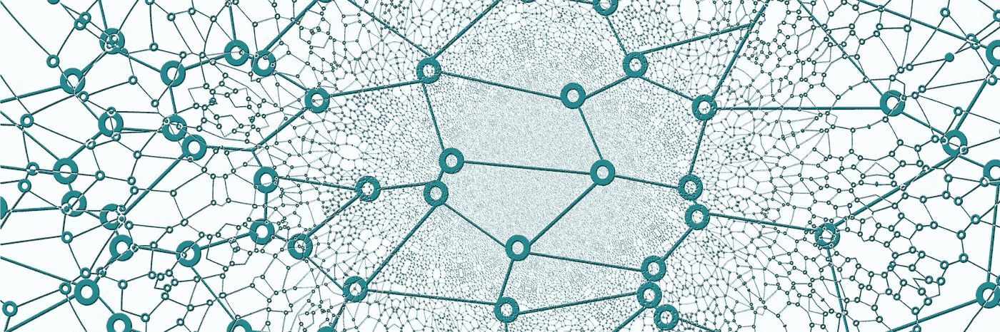
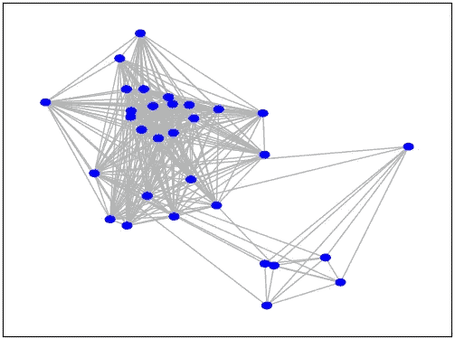
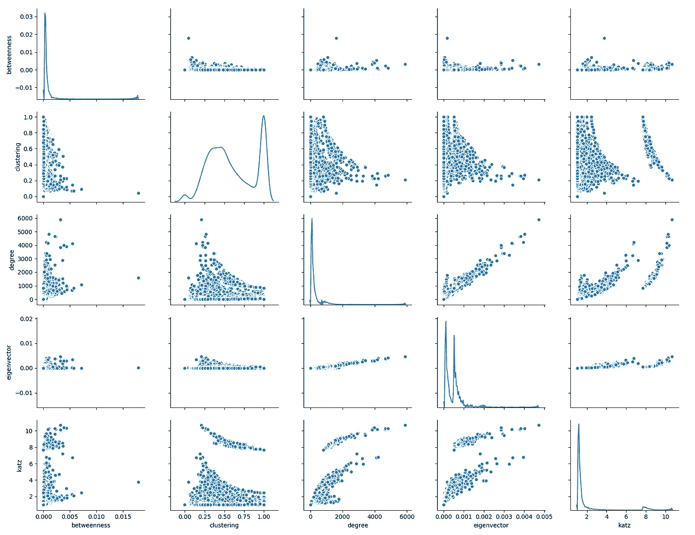
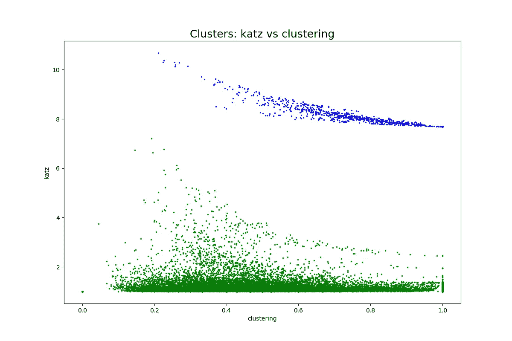
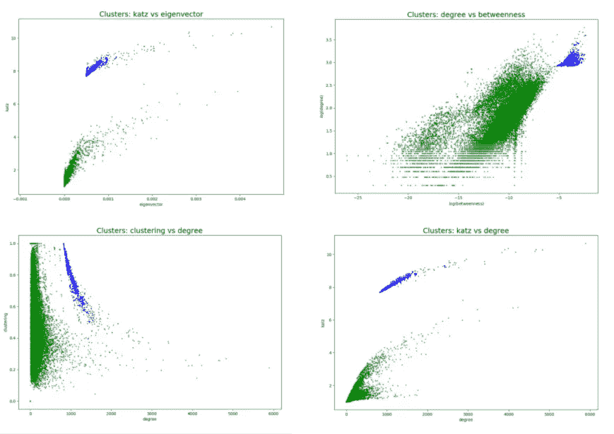
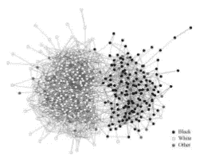

# 用网络科学进行客户分析

> 原文：<https://towardsdatascience.com/amazon-customer-analysis-57eabb66e2ed?source=collection_archive---------10----------------------->

## 用于客户细分的用户评论网络

在过去的一二十年里，美国人继续偏爱可追踪的支付方式，这为零售商和供应商提供了丰富的客户数据来源。数据科学家使用这些数据来帮助企业在库存、营销和供应链等方面做出更明智的决策。有几种工具和技术可以进行客户细分，网络分析可能是一种强有力的工具。

在之前的文章[中，我们看到了复杂网络分析在社交媒体僵尸检测中的效用](https://chatbotslife.com/bot-detection-with-network-science-dde6525005f2)。在这里，我们将看到网络科学的工具是如何应用于客户分析的，仅以 Amazon.com 产品评论的两个元数据为例。我们将首先提供关于数据集的信息，以及网络是如何创建的。然后，我们将深入到以自我为中心和全局指标的网络分析中。然后我们将解释这些信息告诉我们什么，最后从商业角度推测它可能意味着什么。

## 关于数据集

这项工作中使用的数据集是由加州大学圣地亚哥分校的 Julian McAuley 博士提供的[。它“包含来自亚马逊的产品评论和元数据，包括 1996 年 5 月至 2014 年 7 月的 1.428 亿条评论”。产品评论数据集包含用户 ID、产品 ID、评级、有用性投票和每个评论的评论文本。](http://jmcauley.ucsd.edu/data/amazon/)

这项工作中建立的网络来自健康和个人护理评论 5 核数据集，这意味着它只包含至少有 5 个评论的用户和产品。在 2014 年 1 月至 7 月期间，进一步对数据集进行了抽样审查。总而言之，这个采样数据集包含超过 25，000 个要分析的用户帐户，每个帐户至少有 5 条评论。

## 关于网络结构

Figure 1\. A sample from the constructed network showing two connected cliques. All nodes represent accounts that have reviewed some product. Thus, all nodes that reviewed a given product form a clique, and any given node that reviewed multiple products will connect multiple cliques.

数据集中的每个用户帐户由网络表示中的一个节点来表示。如果节点的帐户共享已审核的产品，则节点由边连接。*在该图中，网络由针对每种产品的[集团](https://en.wikipedia.org/wiki/Clique_(graph_theory))的集合组成。产品集团将由作为两个集团成员的节点连接(审查多个产品)。图 1 示出了网络中的一个集团的例子。

## 自我中心网络分析

分析从计算网络中每个节点的几个关键自我中心度量**开始(自我中心的意思是以该节点为中心):度-目标节点共享一条边的节点数量，中心性-网络中节点的相对重要性(在这项工作中，使用了特征向量 Katz 和中间中心性)，以及聚类系数-目标节点邻域中可能存在的[三元组](http://Figure 1\. A sample from the constructed network showing two connected cliques. All nodes represent accounts that have reviewed some product, and as a result, are all connected.)的比例。

每个节点的这些计算指标在下面的图 2 中相互对照。

Figure 2\. A pairwise plot of clustering coefficient, degree, eigenvector centrality and Katz centrality of each node in the review network. The plots in the diagonal are the probability density functions of the metric.

值得注意的是，在大多数样地中，存在由低密度区域分隔的两个不同的集群。在运行聚类算法将节点分成两类:绿色(24，201 个节点)和蓝色(821 个节点)之后，Katz 中心性与聚类系数的关系图如图 3 所示。

Figure 3\. Two clusters identified with the [DBSCAN clustering algorithm](https://scikit-learn.org/stable/modules/clustering.html#dbscan).

在节点被识别并标记为“绿色”或“蓝色”后，指标将被重新绘制，如图 4 所示。Katz 中心性与聚类图中的节点类被分成在其他成对图中看到的相同的不同聚类。这证实了导致聚集现象的机制对于每个度量对都是一致的。也就是说，一个图中的一个集群中的节点的类成员关系依赖于它在其他图中的成员关系。

Figure 4\. Pairwise plots with cluster membership. Clockwise from top-left: Katz vs eigenvector centrality, log(degree) vs log(betweenness centrality), clustering coefficient vs degree, Katz centrality vs degree.

一个特别值得注意的观察是 Katz 与特征向量中心性图中的聚类。Katz 中心性的计算方式与特征向量中心性几乎相同，区别在于节点最初被赋予“自由”中心性。该图表明，与具有可比特征向量中心性的绿色节点相比，该自由初始中心性更多地提高了蓝色节点的 Katz 中心性。

有两个网络属性可以解释这一点。首先,“蓝色”节点的度数往往比“绿色”节点的度数高得多(如图 4 中包含度数的图所示)。第二是“蓝色”节点的平均聚类系数是 0.74，而“绿色”节点的平均聚类系数是 0.59。一般来说，度数大的节点往往比度数小的节点具有更小的聚类系数，因为完成相同比例的三元组需要更多的连通性(这与度数的阶乘有关)。“蓝色”节点具有更高的度*和*更高的平均聚类系数，这一事实表明它们比“绿色”节点位于网络中更密集的区域。因此,“蓝色”节点的 Katz 中心性计算的自由初始中心性增加是复合的。

## 网络协调性

识别出两个不同的节点类别后，确定网络的分类性是有意义的。也就是说，蓝色节点往往不与绿色节点连接(同配混合，如图 5 所示)，还是它们很好地混合在一起(异配混合)？

Figure 5\. An assortively mixed network. Credit: M. J. Newman

这可以用模块化值来回答:连接相同类型节点的边的分数减去随机期望的分数。正模块度值表示分类混合；负值表示异配混合。虽然在理论上，该值被限制在 1 以上，但是大多数网络结构不会随机产生 0 个预期的同质边。考虑到这一点，通常通过假设连接相同类型节点的边的分数为 1 来计算网络结构所允许的最大模块化值。

评论网络的模块化值被发现是 0.302，0.419 是最大可能的模块化值。因此，网络具有很强的分类混合性；也就是说，“蓝色”和“绿色”节点的连接程度明显低于偶然情况下的预期。在产品评论的背景下，这意味着“蓝色”和“绿色”用户在很大程度上是在评论(并且，可能是购买)不同的产品组。

## 结论

对这一评论网络的分析得出的结论是，有两个客户群对不同的产品群很感兴趣。其中一个客户群比另一个要小得多，但联系更加紧密，这表明它代表了更多的小众利益。历史销售信息将允许确定这个利基群体对收入的贡献。如果它贡献了与其规模不相称的数量，零售商可以通过扩大或定制其服务和产品来增加收入。

___________________________________________________________________

*多边是指边的权重

* *边权重*被*考虑在度和中心性的计算中