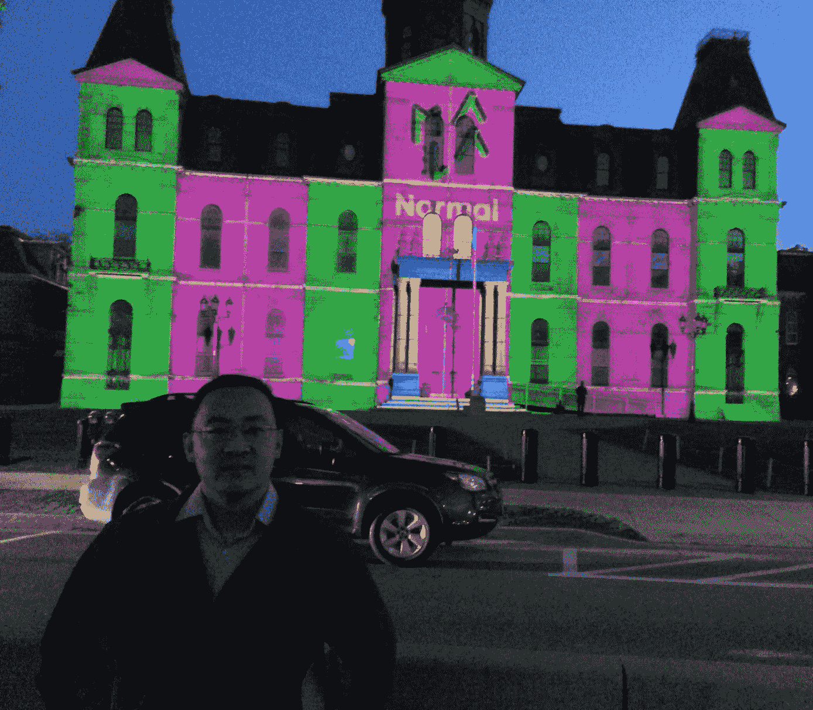
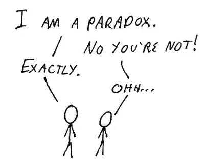
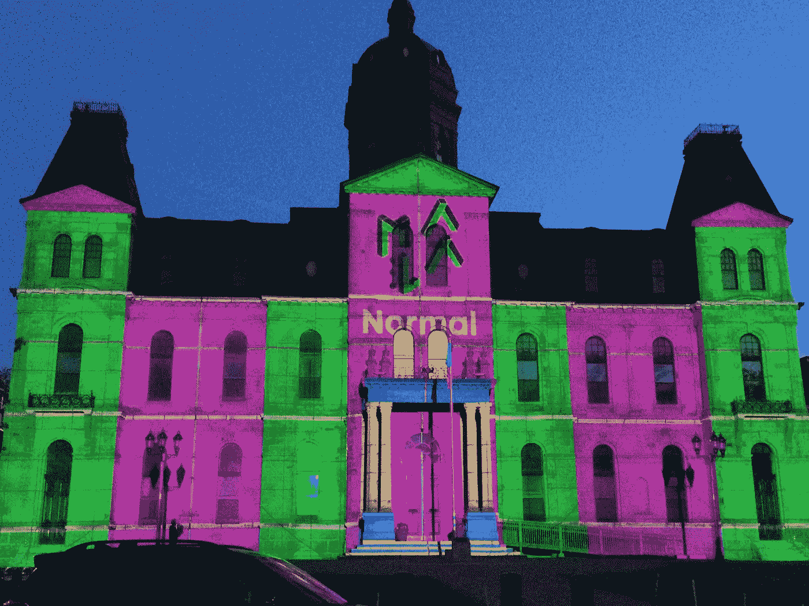

# 一个不正常的人在寻找一个有趣的数字

> 原文：<https://towardsdatascience.com/an-abnormal-man-looking-for-an-interesting-number-8b013d273af9?source=collection_archive---------4----------------------->

拍了下面这张图，从写着“正常”的建筑里，照片里的不正常的家伙——我——想起了一个“有趣”的悖论。

假设我按顺序列出自然数:

*   1
*   2
*   3
*   4
*   …

现在让我们说说这些数字中的一些有趣的东西:

*   1 是所有数中的第一个数，它是所有其他数的约数
*   2 是第一个也是唯一的质数
*   3 是第一个古怪的表亲
*   4 是第一个完美的正方形
*   …

假设具有有趣性质的数称为“有趣”数。
而不有趣的数字才是“正常”的数字。

使用此定义，列表将如下所示:

*   1 是一个有趣的数字
*   2 是一个有趣的数字
*   3 是一个有趣的数字
*   4 是一个有趣的数字
*   …

现在假设数字 **x** 是列表中的第一个“正常”数字。

*   1 是一个有趣的数字
*   2 是一个有趣的数字
*   3 是一个有趣的数字
*   4 是一个有趣的数字
*   …
*   **x 是一个正常的数字**
*   …

但是如果 **x** 是第一个“正常”数，那么它就是一个“有趣”的数，因为它有一个有趣的性质:成为第一个“正常”数。

另一方面，如果我们认为 **x** 是一个“有趣”的数，因为它具有作为第一个“正常”数的性质，那么它就不再是一个“正常”数，现在它是一个“有趣”数，这样就失去了作为第一个“正常”数的性质，然后不再是“有趣”的了…

真是一团糟！不“有趣”？

告诉你一个有趣的事情，这个问题就是数学家朱尔斯·理查德在 1905 年描述的“理查德数的悖论”。

这个链接(https://en.wikipedia.org/wiki/Richard%27s_paradox)讲述了更多关于理查德悖论的细节，但方式没有这里有趣。

另一个类似的悖论是“骗子悖论”。一个只会说谎的人会说“我在说谎。”但由于他只是在撒谎，所以他在这份声明中说的是实话。但如果他说的是真话，他就不是只说假话的人。

这些悖论不仅“干扰”了普通人类的思维，也干扰了历史上最伟大的数学家的思维。

奥地利数学家库尔特·哥德尔在 1931 年用他的不完全性定理摧毁了所有数学的基础，他证明了数学不可能同时是完全的和一致的。也就是数学有极限。哥德尔在数学基础中发现了一个“错误”——它不能同时摆脱这些怪异的悖论，并回答其所有命题的真或假。哥德尔用一个复杂版本的理查德悖论证明了这一点。

这是一个很长的故事，涉及到像戴维·希尔伯特和伯特兰罗素这样的思想巨人，这是另一天。

顺便说一句，我认为《建筑之光》的作者用“有趣”的方式写“正常”只是为了让建筑不再“正常”，从而迷惑我们的头脑…

其他著述:[https://medium.com/@arnaldogunzi](https://medium.com/@arnaldogunzi)

主要博客:【https://ideiasesquecidas.com/ 