# 不等式约束优化的 ADMM-牛顿法

> 原文：<https://towardsdatascience.com/an-admm-newton-method-for-inequality-constrained-optimization-37a470c58a5c?source=collection_archive---------9----------------------->

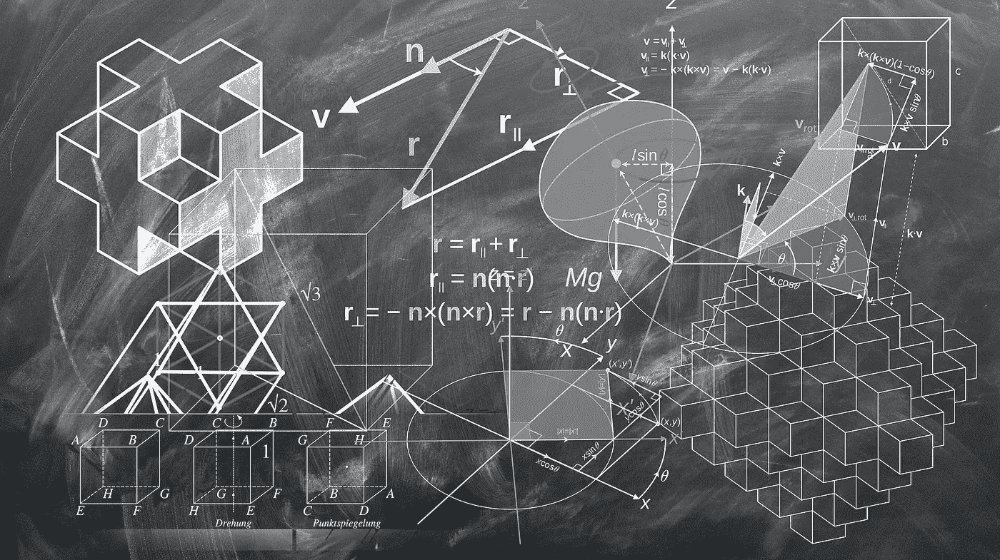

**代码** : [Github](https://github.com/zl376/admm_newton_con)

数值优化在包括机器学习在内的许多领域都是必不可少的。在某些情况下，约束被转换为未知变量，这使得应用普通的无约束优化技术变得不那么简单，需要更复杂的方法(例如 L-BFGS-B)。

看起来，如果成本函数的梯度和 hessian 是已知的(对于像逻辑回归这样的许多问题来说都是如此)，那么对于不等式约束来说，问题就相对容易了。这把钥匙叫做 **ADMM** 。

# 问题

这种 ADMM(交替方向乘子法)方法解决了下面的约束优化问题:

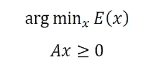

# 算法

使用**罚函数**和**变量替换**将不等式约束替换为等式约束；

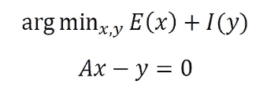

在哪里，

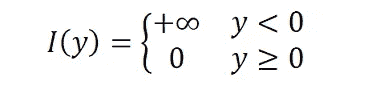

然后，等式约束问题可以转化为它的增广拉格朗日(原始-对偶)问题:

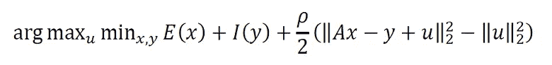

并用 ADMM [1]求解:

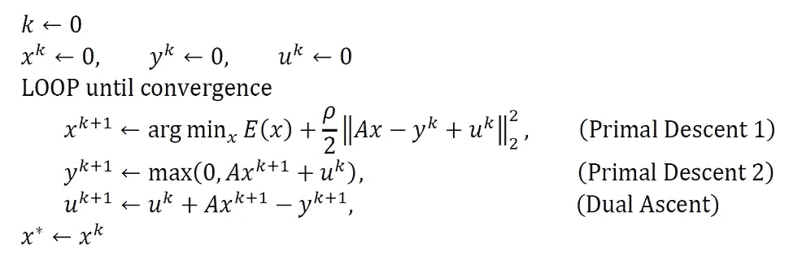

Pseudocode for ADMM

## 原始子问题中的牛顿更新

对于原始下降 1，可以使用**牛顿**更新获得解决方案，这依赖于原始损失函数的梯度和 hessian 的可用性:

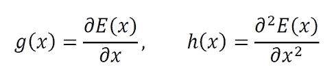

和下面的反演:

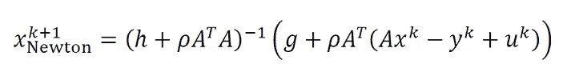

这种反演可以通过**直接反演**或**迭代法**(如 CG**【2】)进行。**

**ADMM-牛顿法现在完成了。**

# **示例:逻辑回归**

**考虑具有标签(l)、特征(f)和对权重(x)的正性约束的逻辑回归，则我们有:**

**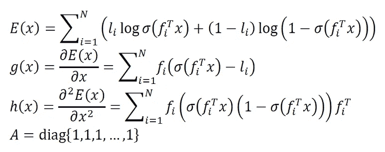**

**使用 sigmoid 函数:**

**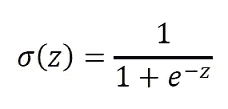**

## **模拟数据的结果**

**生成 200 个样本，每个样本具有 10 维特征向量:**

```
feature, label = make_classification(n_samples=200, n_features=10, n_redundant=0, n_informative=5, random_state=0)
```

**和 ADMM 参数被设置为:**

*   **\rho = 1**
*   **max_iter = 1000**
*   **tol = 1E-6**

**有/无约束条件下回归权重的比较:**

**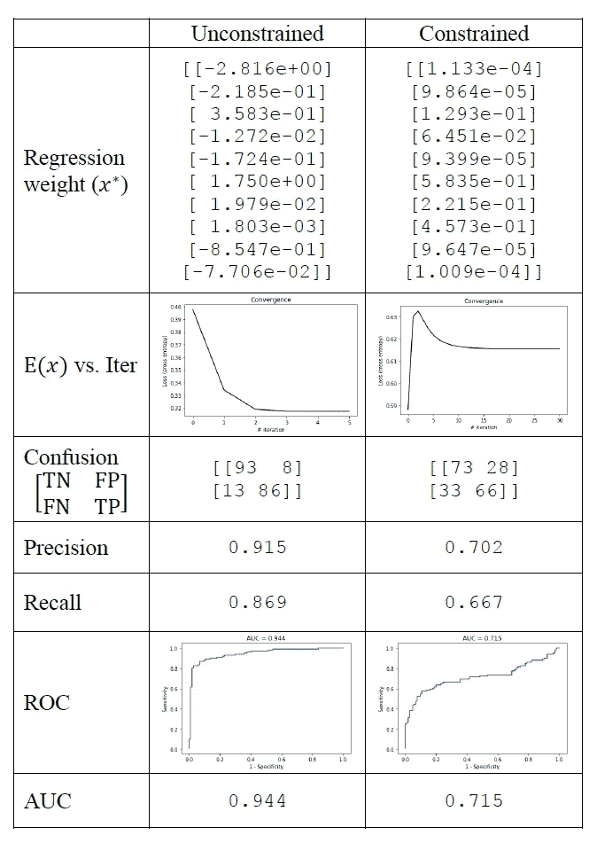**

**约束是有效的，因为输出权重都是正的。请注意，这不再是全局最小值(由于约束)，而是次优性能(AUC)。**

# **关于方法的注释**

**这种方法要求损失函数 E(x)的梯度和 hessian 要么显式(作为矩阵)可用，要么隐式(使用函数)可用。**

# **参考**

1.  **史蒂芬·博伊德、尼尔·帕里克、朱立伦、博尔哈·佩莱托和乔纳森·埃克斯坦(2011)，“通过交替方向乘数法进行分布式优化和统计学习”，《机器学习的基础和趋势:第 3 卷第 1 号，第 1–122 页。**
2.  **Jorge Nocedal，S. Wright，“数值优化”，施普林格科学，1999 年。**