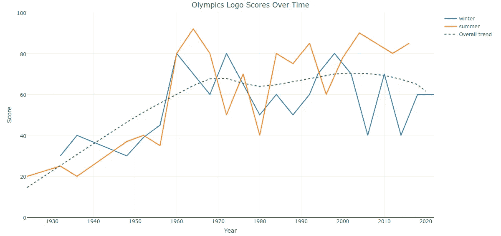
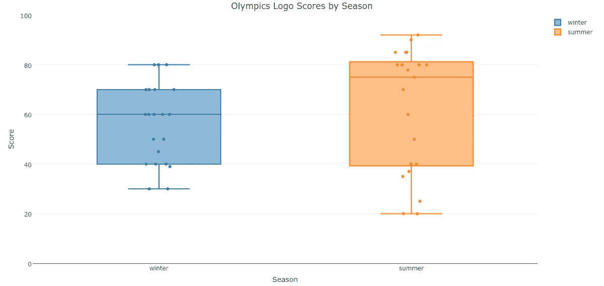

# 奥运标志评分分析

> 原文：<https://towardsdatascience.com/an-analysis-of-olympics-logo-ratings-22238ef3acce?source=collection_archive---------0----------------------->

今天早上，我在 Quartz 上读到了一篇关于奥运标志的有趣文章。米尔顿·格拉泽(Milton Glaser)是许多其他项目中“我❤纽约”标志背后的获奖平面设计师，他对 1924 年以来的每届夏季和冬季奥运会标志进行了评级。我觉得看看他的收视率有没有什么有趣的规律会很有趣。

首先，我们将使用“rvest”包提取包含所有分数的文本。然后我们将过滤掉无关的文本，这样我们只剩下分数。

```
# clear the way
rm(list=ls())# load libraries
library(dplyr)
library(ggplot2)
library(plotly)
library(rvest)# extract score for each Olympics
olympics_logo_scores <- 
 read_html("[http://qz.com/755251/on-a-scale-from-1-100-milton-glaser-rates-every-single-olympic-logo-design-in-history/](http://qz.com/755251/on-a-scale-from-1-100-milton-glaser-rates-every-single-olympic-logo-design-in-history/)") %>%
 html_nodes('p') %>% 
 html_text()# extract scores
olympics_logo_scores <- olympics_logo_scores[which(substr(olympics_logo_scores, 1, 5) == 'Score')]
```

然后，我们将进行第二次呼叫，以获取每届奥运会的名称。

```
# Get olympics names
olympics_logo_names <- 
 read_html("[http://qz.com/755251/on-a-scale-from-1-100-milton-glaser-rates-every-single-olympic-logo-design-in-history/](http://qz.com/755251/on-a-scale-from-1-100-milton-glaser-rates-every-single-olympic-logo-design-in-history/)") %>%
 html_nodes('h2') %>% 
 html_text()
```

我们将把名字和分数数据合并到一个数据帧中，此外还有一列表示奥运会是在夏季还是冬季举行的。

```
# create combined df
olympic_logo_score_df <- 
 data.frame('olympics' = olympics_logo_names,
 'logo_score' = olympics_logo_scores,
 'season' = ifelse(grepl('Summer', olympics_logo_names), 'summer', 'winter'))# convert from factor to character
olympic_logo_score_df$olympics <- as.character(olympic_logo_score_df$olympics)
```

然后，我们将分两步从每一行中提取分数:首先，我们将拆分“out”上的字符串，去掉每个得分短语的第二部分，其中包含“满分 100 分”

```
# extract score (part 1 of 2)
olympic_logo_score_df$logo_score <- sapply(strsplit(as.character(olympic_logo_score_df$logo_score), 'out'), `[[`, 1)
```

然后我们将删除所有非数字字符，只留下数字分数。你会注意到有一个 NA，它与 2020 年东京夏季奥运会相关联。

```
# extract score (part 2 of 2)
olympic_logo_score_df$logo_score <- as.numeric(gsub("[^0-9]", "", olympic_logo_score_df$logo_score))
```

我们将使用类似的方法从完整的奥林匹克名称中提取数字年份。

```
# drop alpha characters
olympic_logo_score_df$year <- gsub("[^0–9]", "", olympic_logo_score_df$olympics)
```

我马上注意到的第一件事是夏季和冬季奥运会在同一年举行，直到 1992 年以后。92 年后，冬季奥运会在每届夏季奥运会后两年举行(或者两年前，取决于你对哪个更感兴趣)。整洁！

我在这个分析中的主要问题是时间和标志等级之间的关系。Glaser 比老游戏更喜欢新 logos 吗？让我们找出答案。使用 plotly，我们可以绘制按季节分组的徽标等级随时间变化的图表。

```
# graph scores over time by season
plot_ly(olympic_logo_score_df,
 x = year,
 y = logo_score,
 type = "line",
 group = season,
 text = olympics) %>%
 add_trace(y = fitted(loess(logo_score ~ year)),
 x = year,
 name = 'Overall trend',
 line = list(dash = 5)) %>% 
 layout(title = 'Olympics Logo Scores Over Time',
 yaxis = list(range = list(0,100),
 title = 'Score'),
 xaxis = list(title = 'Year'))
```



[Fully interactive plot available here](https://plot.ly/~raphifix/10/olympics-logo-scores-over-time/)

我们可以看到格拉泽确实更喜欢现代的标志，而不是早期夏季和冬季奥运会的标志。

与夏季奥运会相比，冬季奥运会的标志似乎普遍低于趋势水平。让我们调查一下他的偏好是否会因奥运会的类型而异。

```
# boxplot by season
plot_ly(olympic_logo_score_df,
 y = logo_score,
 type = "box",
 group = season,
 boxpoints = "all",
 pointpos = 0) %>% 
 layout(title = 'Olympics Logo Scores by Season',
 yaxis = list(range = list(0,100),
 title = 'Score'),
 xaxis = list(title = 'Season'))
```



[Fully interactive plot available here](https://plot.ly/~raphifix/12/olympics-logo-scores-by-season/)

我们可以看到夏季奥运会标志的分数比冬季奥运会标志的分数有更大的变化。然而，夏季奥运会标志的中位数也更高，表明 Glaser 通常更喜欢夏季奥运会标志。