# 使用 Python 进行时间序列分析和预测的端到端项目

> 原文：<https://towardsdatascience.com/an-end-to-end-project-on-time-series-analysis-and-forecasting-with-python-4835e6bf050b?source=collection_archive---------0----------------------->


Photo credit: Pexels

[时间序列](https://en.wikipedia.org/wiki/Time_series)分析包括分析时间序列数据的方法，以提取有意义的统计数据和数据的其他特征。时间序列预测是使用模型根据以前观察到的值来预测未来值。

时间序列广泛用于非平稳数据，如经济、天气、股票价格和本文中的零售额。我们将展示预测零售时间序列的不同方法。我们开始吧！

# 数据

我们使用的是[超市销售数据](https://community.tableau.com/docs/DOC-1236)，可以从[这里](https://community.tableau.com/docs/DOC-1236)下载。

```
import warnings
import itertools
import numpy as np
import matplotlib.pyplot as plt
warnings.filterwarnings("ignore")
plt.style.use('fivethirtyeight')
import pandas as pd
import statsmodels.api as sm
import matplotlibmatplotlib.rcParams['axes.labelsize'] = 14
matplotlib.rcParams['xtick.labelsize'] = 12
matplotlib.rcParams['ytick.labelsize'] = 12
matplotlib.rcParams['text.color'] = 'k'
```

在超市销售数据中有几个类别，我们从家具销售的时间序列分析和预测开始。

```
df = pd.read_excel("Superstore.xls")
furniture = df.loc[df['Category'] == 'Furniture']
```

我们有良好的 4 年家具销售数据。

```
furniture['Order Date'].min(), furniture['Order Date'].max()
```

***时间戳(' 2014–01–06 00:00:00 ')，时间戳(' 2017–12–30 00:00:00 ')***

# 数据预处理

这一步包括删除我们不需要的列，检查缺少的值，按日期合计销售额等等。

```
cols = ['Row ID', 'Order ID', 'Ship Date', 'Ship Mode', 'Customer ID', 'Customer Name', 'Segment', 'Country', 'City', 'State', 'Postal Code', 'Region', 'Product ID', 'Category', 'Sub-Category', 'Product Name', 'Quantity', 'Discount', 'Profit']
furniture.drop(cols, axis=1, inplace=True)
furniture = furniture.sort_values('Order Date')furniture.isnull().sum()
```

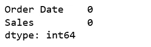

Figure 1

```
furniture = furniture.groupby('Order Date')['Sales'].sum().reset_index()
```

# 使用时间序列数据进行索引

```
furniture = furniture.set_index('Order Date')
furniture.index
```

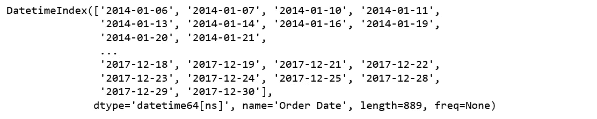

Figure 2

我们当前的日期时间数据可能很难处理，因此，我们将使用该月的平均日销售额，并且我们使用每个月的月初作为时间戳。

```
y = furniture['Sales'].resample('MS').mean()
```

快速一瞥 2017 年家具销售数据。

```
y['2017':]
```

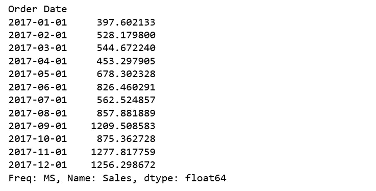

Figure 3

# **可视化家具销售时间序列数据**

```
y.plot(figsize=(15, 6))
plt.show()
```

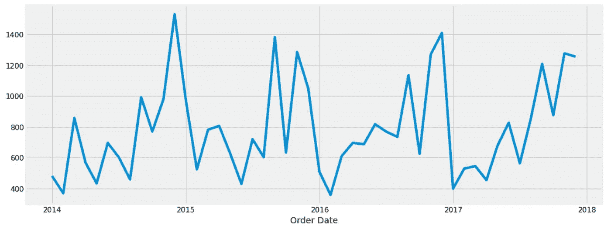

Figure 4

当我们绘制数据时，出现了一些明显的模式。该时间序列具有季节性模式，例如销售额总是在年初低，在年底高。在任何一年中，总会有一个上升的趋势，在年中会有几个低的月份。

我们还可以使用一种称为时间序列分解的方法来可视化我们的数据，这种方法允许我们将时间序列分解为三个不同的部分:趋势、季节性和噪声。

```
from pylab import rcParams
rcParams['figure.figsize'] = 18, 8decomposition = sm.tsa.seasonal_decompose(y, model='additive')
fig = decomposition.plot()
plt.show()
```

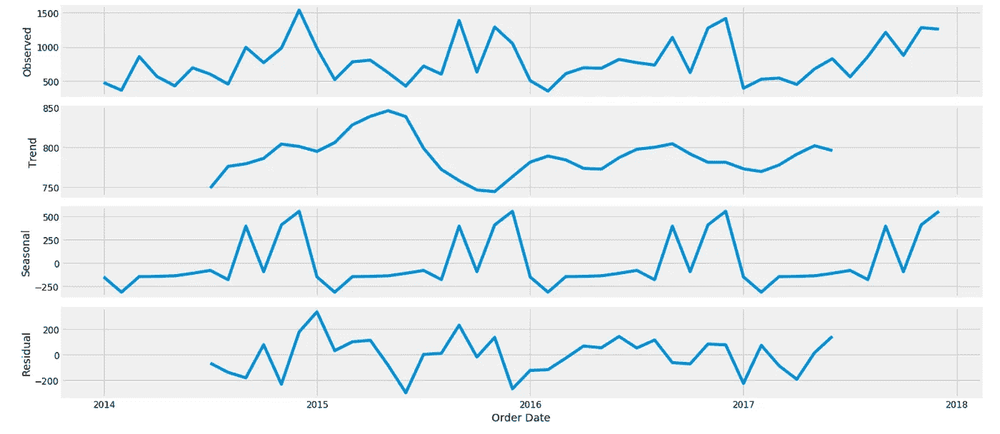

Figure 5

上图清楚地显示了家具销售的不稳定性，以及其明显的季节性。

# **ARIMA 时间序列预测**

我们将应用一种最常用的时间序列预测方法，称为 ARIMA，它代表自回归综合移动平均。

ARIMA 模型用符号`ARIMA(p, d, q)`表示。这三个参数说明了数据中的季节性、趋势和噪声:

```
p = d = q = range(0, 2)
pdq = list(itertools.product(p, d, q))
seasonal_pdq = [(x[0], x[1], x[2], 12) for x in list(itertools.product(p, d, q))]print('Examples of parameter combinations for Seasonal ARIMA...')
print('SARIMAX: {} x {}'.format(pdq[1], seasonal_pdq[1]))
print('SARIMAX: {} x {}'.format(pdq[1], seasonal_pdq[2]))
print('SARIMAX: {} x {}'.format(pdq[2], seasonal_pdq[3]))
print('SARIMAX: {} x {}'.format(pdq[2], seasonal_pdq[4]))
```

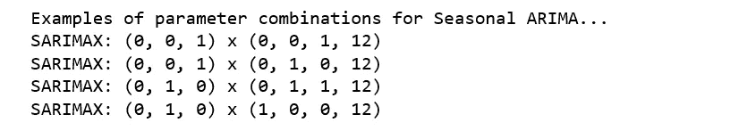

Figure 6

这一步是为我们的家具销售 ARIMA 时间序列模型选择参数。我们在这里的目标是使用“网格搜索”来找到为我们的模型产生最佳性能的最佳参数集。

```
for param in pdq:
    for param_seasonal in seasonal_pdq:
        try:
            mod = sm.tsa.statespace.SARIMAX(y,
                                            order=param,
                                            seasonal_order=param_seasonal,
                                            enforce_stationarity=False,
                                            enforce_invertibility=False)results = mod.fit()print('ARIMA{}x{}12 - AIC:{}'.format(param, param_seasonal, results.aic))
        except:
            continue
```

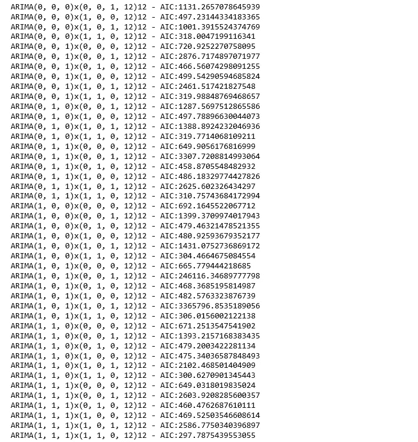

Figure 7

上面的输出表明`SARIMAX(1, 1, 1)x(1, 1, 0, 12)`产生最低的`AIC`值 297.78。因此，我们应该认为这是最佳选择。

# 拟合 ARIMA 模型

```
mod = sm.tsa.statespace.SARIMAX(y,
                                order=(1, 1, 1),
                                seasonal_order=(1, 1, 0, 12),
                                enforce_stationarity=False,
                                enforce_invertibility=False)results = mod.fit()print(results.summary().tables[1])
```

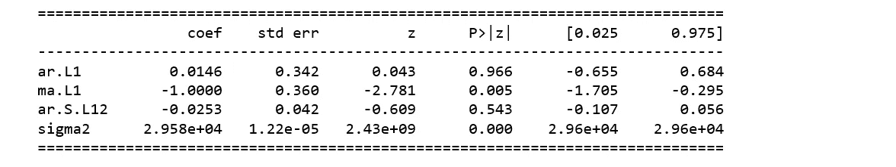

Figure 8

我们应该始终运行模型诊断来调查任何不寻常的行为。

```
results.plot_diagnostics(figsize=(16, 8))
plt.show()
```

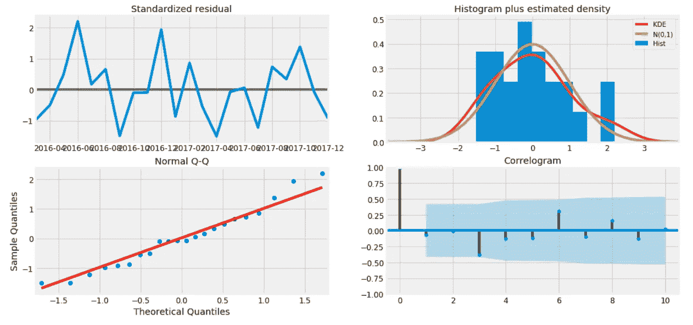

Figure 9

它并不完美，但是，我们的模型诊断表明，模型残差接近正态分布。

# **验证预测**

为了帮助我们了解预测的准确性，我们将时间序列的预测销售额与实际销售额进行比较，并将预测从 2017 年 1 月 1 日开始设置到数据结束。

```
pred = results.get_prediction(start=pd.to_datetime('2017-01-01'), dynamic=False)
pred_ci = pred.conf_int()ax = y['2014':].plot(label='observed')
pred.predicted_mean.plot(ax=ax, label='One-step ahead Forecast', alpha=.7, figsize=(14, 7))ax.fill_between(pred_ci.index,
                pred_ci.iloc[:, 0],
                pred_ci.iloc[:, 1], color='k', alpha=.2)ax.set_xlabel('Date')
ax.set_ylabel('Furniture Sales')
plt.legend()plt.show()
```

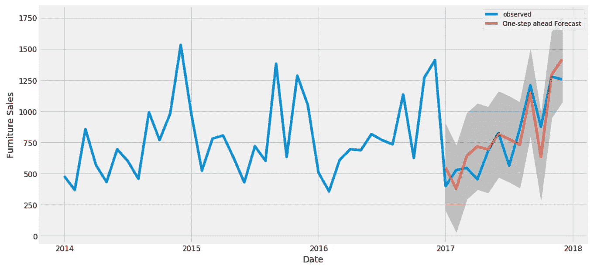

Figure 10

线形图显示了观测值与滚动预测值的对比。总的来说，我们的预测与真实值非常吻合，显示了从年初开始的上升趋势，并在年底抓住了季节性。

```
y_forecasted = pred.predicted_mean
y_truth = y['2017-01-01':]mse = ((y_forecasted - y_truth) ** 2).mean()
print('The Mean Squared Error of our forecasts is {}'.format(round(mse, 2)))
```

***我们预测的均方差是 22993.58***

```
print('The Root Mean Squared Error of our forecasts is {}'.format(round(np.sqrt(mse), 2)))
```

***我们预测的均方根误差是 151.64***

在统计学中，估计量的[均方误差(MSE)](https://en.wikipedia.org/wiki/Mean_squared_error) 衡量误差的平方平均值，即估计值和估计值之间的平均平方差。MSE 是对估计量质量的一种度量，它总是非负的，MSE 越小，我们就越接近找到最佳拟合线。

[均方根误差(RMSE)](https://en.wikipedia.org/wiki/Root-mean-square_deviation) 告诉我们，我们的模型能够在实际销售额的 151.64 范围内预测测试集中的平均每日家具销售额。我们的家具日销售量从 400 件左右到 1200 多件不等。在我看来，到目前为止这是一个相当不错的模型。

# **生成和可视化预测**

```
pred_uc = results.get_forecast(steps=100)
pred_ci = pred_uc.conf_int()ax = y.plot(label='observed', figsize=(14, 7))
pred_uc.predicted_mean.plot(ax=ax, label='Forecast')
ax.fill_between(pred_ci.index,
                pred_ci.iloc[:, 0],
                pred_ci.iloc[:, 1], color='k', alpha=.25)
ax.set_xlabel('Date')
ax.set_ylabel('Furniture Sales')plt.legend()
plt.show()
```

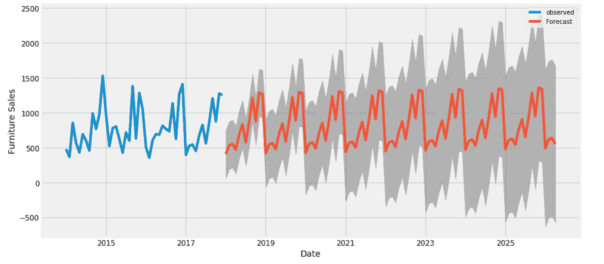

Figure 11

我们的模型清楚地捕捉到了家具销售的季节性。随着我们对未来的进一步预测，我们对自己的价值观变得不那么自信是很自然的。这反映在我们的模型生成的置信区间上，随着我们向未来进一步发展，置信区间变得更大。

上面对家具的时间序列分析让我对其他类别感到好奇，随着时间的推移，它们是如何相互比较的。因此，我们将比较家具和办公用品供应商的时间序列。

# **家具与办公用品的时间序列**

根据我们的数据，这些年来，办公用品的销售额远远高于家具。

```
furniture = df.loc[df['Category'] == 'Furniture']
office = df.loc[df['Category'] == 'Office Supplies']
furniture.shape, office.shape
```

***((2121，21)，(6026，21))***

# 数据探索

我们将比较两个类别在同一时期的销售额。这意味着将两个数据帧合并成一个，并将这两个类别的时间序列绘制成一个图。

```
cols = ['Row ID', 'Order ID', 'Ship Date', 'Ship Mode', 'Customer ID', 'Customer Name', 'Segment', 'Country', 'City', 'State', 'Postal Code', 'Region', 'Product ID', 'Category', 'Sub-Category', 'Product Name', 'Quantity', 'Discount', 'Profit']
furniture.drop(cols, axis=1, inplace=True)
office.drop(cols, axis=1, inplace=True)furniture = furniture.sort_values('Order Date')
office = office.sort_values('Order Date')furniture = furniture.groupby('Order Date')['Sales'].sum().reset_index()
office = office.groupby('Order Date')['Sales'].sum().reset_index()furniture = furniture.set_index('Order Date')
office = office.set_index('Order Date')y_furniture = furniture['Sales'].resample('MS').mean()
y_office = office['Sales'].resample('MS').mean()furniture = pd.DataFrame({'Order Date':y_furniture.index, 'Sales':y_furniture.values})
office = pd.DataFrame({'Order Date': y_office.index, 'Sales': y_office.values})store = furniture.merge(office, how='inner', on='Order Date')
store.rename(columns={'Sales_x': 'furniture_sales', 'Sales_y': 'office_sales'}, inplace=True)
store.head()
```

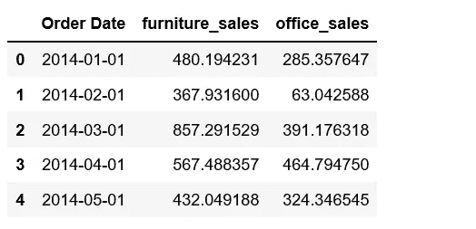

Figure 12

```
plt.figure(figsize=(20, 8))
plt.plot(store['Order Date'], store['furniture_sales'], 'b-', label = 'furniture')
plt.plot(store['Order Date'], store['office_sales'], 'r-', label = 'office supplies')
plt.xlabel('Date'); plt.ylabel('Sales'); plt.title('Sales of Furniture and Office Supplies')
plt.legend();
```

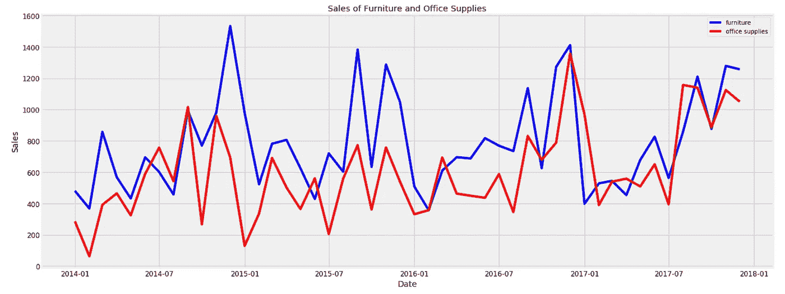

Figure 13

我们观察到家具和办公用品的销售也有类似的季节性模式。年初是这两个类别的淡季。对于办公用品来说，夏天似乎也很安静。此外，在大多数月份里，家具的平均日销售额都高于办公用品。这是可以理解的，因为家具的价值应该远远高于办公用品。偶尔，办公用品的日平均销售额会超过家具。让我们来看看办公用品的销售额第一次超过家具的销售额是什么时候。

```
first_date = store.ix[np.min(list(np.where(store['office_sales'] > store['furniture_sales'])[0])), 'Order Date']print("Office supplies first time produced higher sales than furniture is {}.".format(first_date.date()))
```

***办公用品首次产生高于家具的销量是 2014–07–01***。

那是 2014 年 7 月！

# **用 Prophet 进行时间序列建模**

脸书于 2017 年发布的预测工具 [Prophet](https://research.fb.com/prophet-forecasting-at-scale/) 旨在分析时间序列，这些时间序列在不同的时间尺度上显示模式，如每年、每周和每天。它还具有高级功能，可以对节假日对时间序列的影响进行建模，并实现自定义的变点。因此，我们使用 Prophet 来启动并运行一个模型。

```
from fbprophet import Prophetfurniture = furniture.rename(columns={'Order Date': 'ds', 'Sales': 'y'})
furniture_model = Prophet(interval_width=0.95)
furniture_model.fit(furniture)office = office.rename(columns={'Order Date': 'ds', 'Sales': 'y'})
office_model = Prophet(interval_width=0.95)
office_model.fit(office)furniture_forecast = furniture_model.make_future_dataframe(periods=36, freq='MS')
furniture_forecast = furniture_model.predict(furniture_forecast)office_forecast = office_model.make_future_dataframe(periods=36, freq='MS')
office_forecast = office_model.predict(office_forecast)plt.figure(figsize=(18, 6))
furniture_model.plot(furniture_forecast, xlabel = 'Date', ylabel = 'Sales')
plt.title('Furniture Sales');
```

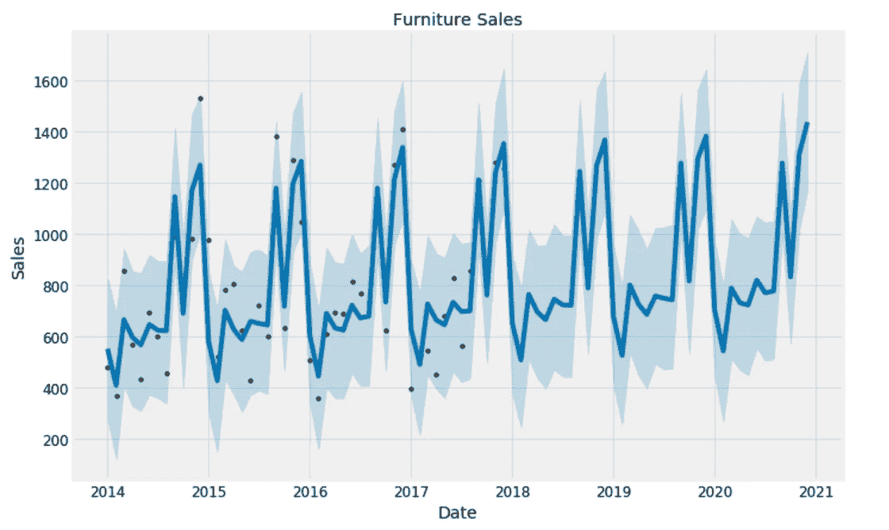

Figure 14

```
plt.figure(figsize=(18, 6))
office_model.plot(office_forecast, xlabel = 'Date', ylabel = 'Sales')
plt.title('Office Supplies Sales');
```

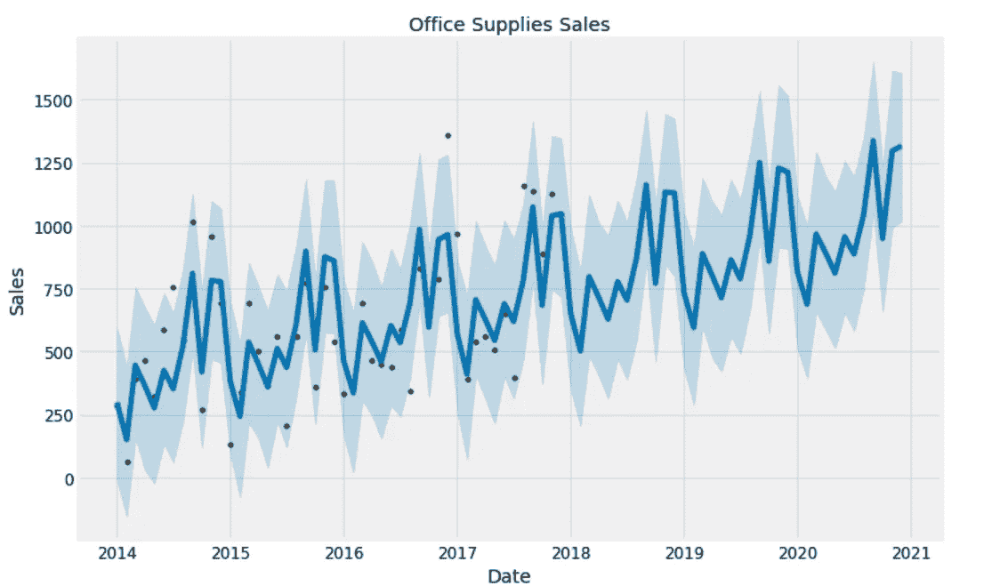

Figure 15

# **比较预测**

我们已经有了这两个类别未来三年的预测。我们现在将他们放在一起比较他们对未来的预测。

```
furniture_names = ['furniture_%s' % column for column in furniture_forecast.columns]
office_names = ['office_%s' % column for column in office_forecast.columns]merge_furniture_forecast = furniture_forecast.copy()
merge_office_forecast = office_forecast.copy()merge_furniture_forecast.columns = furniture_names
merge_office_forecast.columns = office_namesforecast = pd.merge(merge_furniture_forecast, merge_office_forecast, how = 'inner', left_on = 'furniture_ds', right_on = 'office_ds')forecast = forecast.rename(columns={'furniture_ds': 'Date'}).drop('office_ds', axis=1)
forecast.head()
```

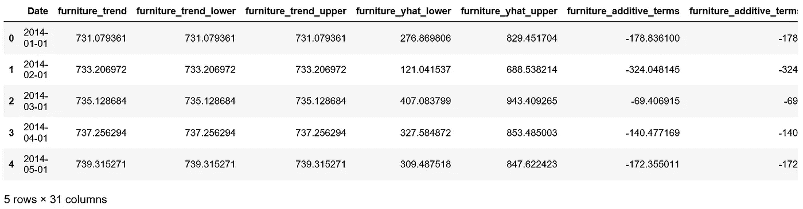

Figure 16

# 趋势和预测可视化

```
plt.figure(figsize=(10, 7))
plt.plot(forecast['Date'], forecast['furniture_trend'], 'b-')
plt.plot(forecast['Date'], forecast['office_trend'], 'r-')
plt.legend(); plt.xlabel('Date'); plt.ylabel('Sales')
plt.title('Furniture vs. Office Supplies Sales Trend');
```

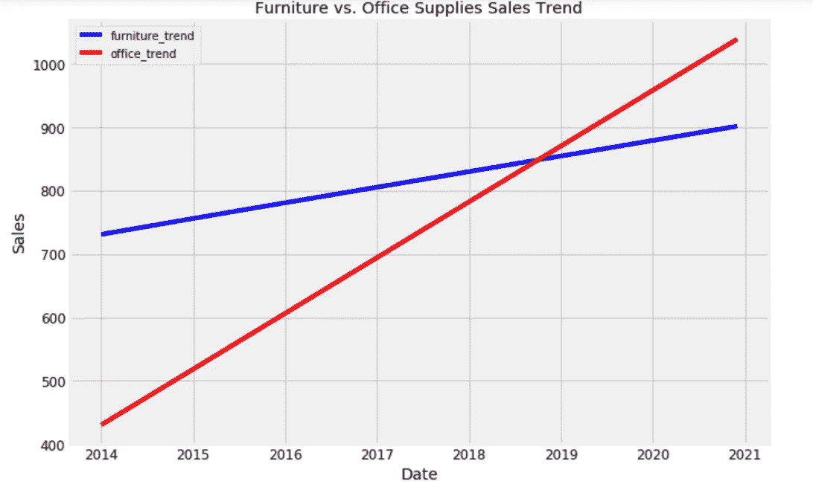

Figure 17

```
plt.figure(figsize=(10, 7))
plt.plot(forecast['Date'], forecast['furniture_yhat'], 'b-')
plt.plot(forecast['Date'], forecast['office_yhat'], 'r-')
plt.legend(); plt.xlabel('Date'); plt.ylabel('Sales')
plt.title('Furniture vs. Office Supplies Estimate');
```

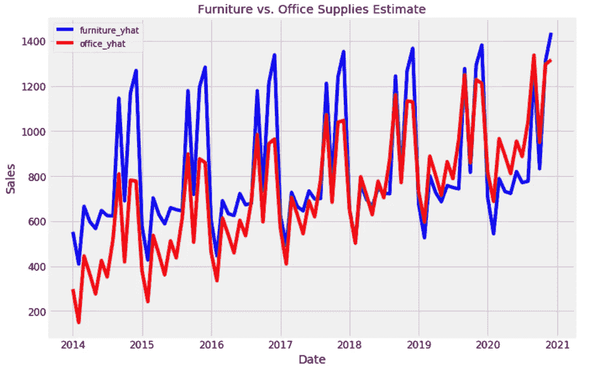

Figure 18

# **趋势和模式**

现在，我们可以使用 Prophet 模型来检查数据中这两个类别的不同趋势。

```
furniture_model.plot_components(furniture_forecast);
```

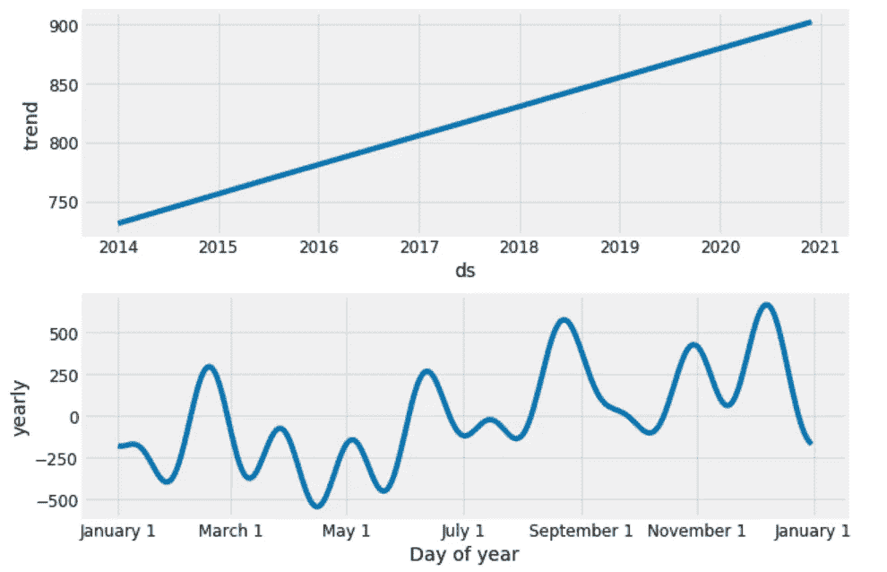

Figure 19

```
office_model.plot_components(office_forecast);
```

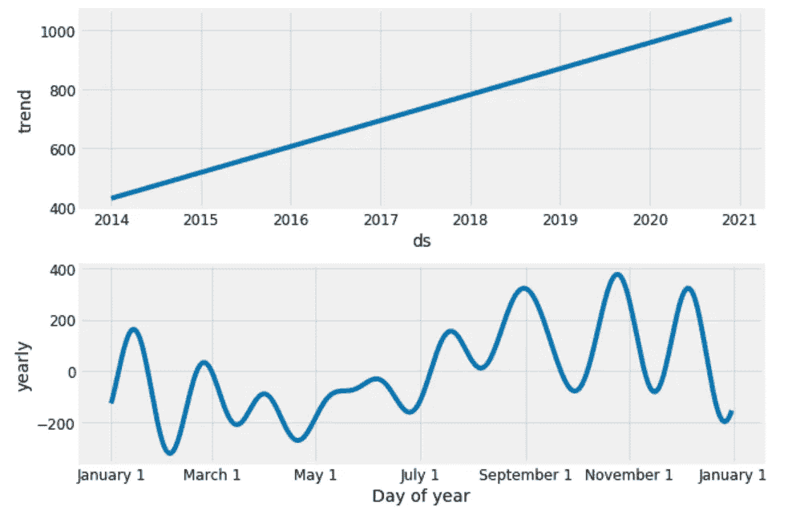

Figure 20

很高兴看到家具和办公用品的销售一直呈线性增长，并将继续增长，尽管办公用品的增长似乎略显强劲。

家具最差的月份是四月，办公用品最差的月份是二月。家具最好的月份是 12 月，办公用品最好的月份是 10 月。

今后可以探索的时间序列分析方法有很多，如不确定界预测、变点和异常检测、外部数据源预测时间序列等。我们才刚刚开始。

源代码可以在 [Github](https://github.com/susanli2016/Machine-Learning-with-Python/blob/master/Time%20Series%20Forecastings.ipynb) 上找到。我期待听到反馈或问题。

参考资料:

[Python 3 中的 ARIMA 时间序列预测指南](https://www.digitalocean.com/community/tutorials/a-guide-to-time-series-forecasting-with-arima-in-python-3)

[Python 3 中的 Prophet 时间序列预测指南](https://www.digitalocean.com/community/tutorials/a-guide-to-time-series-forecasting-with-prophet-in-python-3)