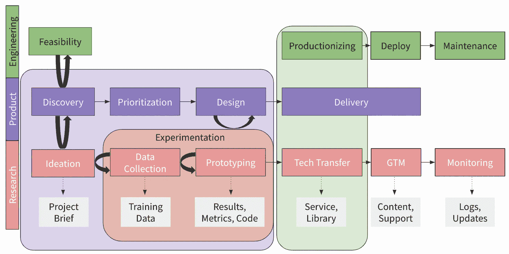
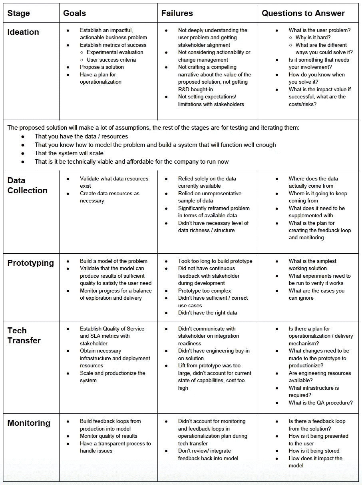

# 一个影响机器学习的实验性开发过程

> 原文：<https://towardsdatascience.com/an-experimental-development-process-for-making-an-impact-with-ai-f09c8155a4fe?source=collection_archive---------13----------------------->

## 如何避免生产道路上的常见错误

Photo by [Alex Eckermann](https://unsplash.com/@alexeckermann?utm_source=medium&utm_medium=referral) on [Unsplash](https://unsplash.com?utm_source=medium&utm_medium=referral)

利用机器学习来提供切实的用户价值，这真的很难建立产品功能和内部运营工具。不仅仅是因为很难处理数据(确实如此)，或者是因为人工智能有许多琐碎的用途，虽然很简洁，但并不那么有用(确实有)，而是因为几乎从来没有这样的情况，你会有一个明确定义和限定的问题交给你，而且在纯粹的技术方面之外还有许多未知因素可能在任何时候破坏你的项目。我看到了许多关于技术方面的优秀文章，提供了如何处理数据和建立机器学习模型的代码和建议，以及如何雇用工程师和科学家的人员方面，但这只是一部分。另一部分是如何引导技术和人通过障碍，让这种工作产生影响。

幸运的是，我已经因为许多原因多次未能部署人工智能来提供商业和用户价值，并看到从初创公司到财富 500 强数据科学和研究小组的朋友和同事都在为同样的问题而挣扎。技术几乎总是有价值的，人也是有能力的，但是造成差异的是人们如何一起工作，他们在研究什么技术。换句话说，我相信你能雇佣到技术过硬的人，他们能很好地应用他们的工具，但是除非是合适的人在合适的时间为合适的业务问题构建合适的东西，否则这些都没用。(是的，没错，但这比你想象的要难)。

在这篇文章中，我试图巩固学到的知识，引用我认为有用的现有文章(对我肯定错过的参考文献表示歉意)，并为**添加一些色彩，说明为什么构建实验产品很难，它与其他工程有什么不同，你的过程可能会是什么样子，以及你可能会在哪里遇到失败点。**

警告:对于这种动态的任何东西，您都需要使有意义的部分适应您自己的需求，并不断地发展它，但是大多数基本构件应该是适用的。这里也没什么聪明的，大多是常识，但是很多事情回想起来就是那样。我试图做的是将事情放入一个支持实验性开发过程的概念框架中——建立一个问题，定义指标，构建一些简单的端到端的东西，可以学习和迭代——这在理论上看似相似，但在实践中与许多开发人员、经理，特别是 R&D 以外的人所习惯的完全不同。

请随意跳到[摘要](#28e6)或[延伸阅读](#4e5e)。

# 为什么是实验性开发过程

在我们最熟悉的软件工程中，我们从一组需要作为软件实现的特定产品或业务需求开始开发。当前流行的基于小特性的 sprints 的增量构建项目的过程已经建立，并且对于围绕可预测性而不是围绕实验的**构建非常有用。它们是为构建软件而优化的，我们可能会发明产品功能，但不是技术——所以我们知道它会工作，并且可以估计大概需要多长时间。这绝非易事。仍然存在不确定性、软件和设计约束以及成本/时间/性能权衡，但是这些权衡以及处理它们的方法更容易理解。在高层次上，这些对于实验开发是有意义的，但是当应用时，它们经常导致失败，因为很难估计一个实验会在什么时候进行得有多好。**

另一方面，当我们开始对人工智能功能进行产品开发，或者优化内部业务流程时，我们有许多未决问题，主要是:

*   问什么问题才是正确的？
*   解决这个问题的最佳方案是什么？
*   我们有这方面的数据吗？
*   效果如何？
*   我们能在多大程度上将其投入生产？

除了软件和设计的限制，**我们对问题和解决方案本身有不确定性**。因此，这些产品具有很高的实验和操作风险。实验风险之所以存在，是因为根据定义，有许多未知因素。这种风险存在于用户双方(即问题，他们实际上想要什么？)和技术方面(即解决方案，我们实际上能构建什么？)，两者紧密相连。

> 当我们试验我们可以构建什么以及它的性能如何时，我们改变了我们对它如何最好地解决用户问题的理解，并进化出正确的问题。

因此，这些**特性几乎从来没有一个明确的终点，每一次迭代都创造了对问题**的进一步理解，并开启了新的解决方案。

运营风险与任何项目一样存在，并随着实验过程而增加，因为时间表的不确定性和迭代解决方案会导致更长的项目生命周期和错过交付机会。按照可预测的时间表建立一个实验项目是非常困难的。

事实上，不管你在上面花了多少时间，期望第一次(多次)构建错误是有用的。这意味着你不会完全理解每件事，也不会在做任何事情之前就把它做好。数据产品有一个自然的进化过程:指导原则是我们**有一个合理的、可行的但不完美的解决方案，我们用它来收集更多的知识**来改进解决方案。

# 失败

一些最常见的实验和操作故障如下。不管你做什么，不要期望完全避免它们，但是你绝对可以学会减少它们。

**没有找到解决方案。**不是因为它被测试了，失败了，项目被关闭了，这很好，但是陷入了一个没有尽头的问题的迭代中。这通常是因为没有建立用户成功标准，或者没有一个项目涉众频繁参与的进度跟踪机制。

**构建尚未量产的解决方案**。这通常伴随着早期没有足够的组织或利益相关者的支持，没有建立工程部署可行性或考虑基础设施的成本，或技术转移和维护的时间，或开始采用过于复杂的解决方案，这无法从原型进行转移。

**产生一个解决方案，但不对其进行迭代。**这通常伴随着缺乏用于重建和重新部署解决方案的适当基础设施，以及收集反馈和监控指标的必要数据管道。

**构建无用的解决方案。一切顺利，但仍是一次失败，可以说是浪费了更多时间以来最糟糕的一次。发生这种情况的原因有很多，但最常见的是，从一开始就没有与风险承担者就有影响且可操作的问题达成一致，从而解决了对业务价值不明确的问题。**

我们都多次经历过这些失败，这对每个人来说都是令人沮丧的。

> 你认为你浪费了时间，觉得你没有能力产生影响，利益相关者认为你没有与用户共情，不理解业务问题，工程不知道你在做什么，认为你什么也没做，而与此同时，公司的其他人都在努力赶上最后期限。随着时间的推移，这导致了可信度的丧失，并质疑如果实验项目最终没有真正解决商业问题，它们会带来什么价值。

# 实验开发阶段

没有人喜欢为了过程而过程；它们增加了开销，当[执行得不好时(这是很可能的)](https://www.laetusinpraesens.org/docs/systfail.php)它们会占用原本有效率的时间。但是，除非你是独自工作，即使这样，你也需要一些组织结构。一个过程只有在帮助你实现一个结果的范围内才是好的，所以确保这个过程不是目标，并且尽可能的轻量级。

我们关注的最终结果是解决业务或用户需求。但是让我们把它分解成中间结果:

*   **识别有影响的业务问题**
*   **快速解决问题**
*   **学习并迭代它**

对于所有这些结果来说，成功的最重要的预测因素是确保每个参与者都理解并同意解决什么问题以及如何解决(在企业中:你需要与利益相关者保持一致)**。开始时不只是一次，而是随着事情不可避免地不断出现。因为这需要你、产品、设计、工程和任何其他业务利益相关者之间持续和积极的沟通，下面的大部分内容实际上只是为了[方便你在正确的时间与某人交谈](https://www.rdisorder.eu/2017/09/13/most-difficult-thing-data-science-politics/)，告诉他们他们需要知道什么，并从他们那里获得你需要知道的信息(我们稍后将讨论什么是*什么是*，但现在请注意后者不是被动的“他们告诉你”，而是你收集信息的主动努力)。**

您需要这种交流来洞察业务或用户需求，以识别具有明确影响的具体、有价值的问题；当您对结果的质量进行反馈循环试验，以告知方向和验收，对解决方案的可行性进行工程评估；用于数据收集和管道的资源，监测绩效并为模型建立反馈回路；和生产解决方案的基础设施资源的能力。

这可以分为以下几个主要阶段— **构思、实验、数据收集、原型制作、技术转让、**和**监控** — ，如下图所示。我将假设您在一个主要利益相关者是产品和工程团队的环境中工作，但是即使名称改变了，大多数仍然适用。

Experimental development stages, assuming research, product, and engineering organization. Product and engineering stages may differ, but should have a closely corresponding one. The light pink box is dominated by your experimentation, the light purple by the user problem and solution, and the light green by engineering. Gray boxes represent expected output from each stage.

这些阶段实际上几乎从来不是连续的；而是来回往复，尤其是在构思、数据收集和原型制作之间。过程中的每个阶段至少有四个可定义的组成部分:目标、预期输入、预期输出和估计时间表。在高层次上，这些组件在项目之间是一致的，但是每个组件的确切实例化将因项目而异。

> 保持过程透明和负责任的一个关键是为每个项目维护一个共享的文档，当你经历每个阶段时，你在文档中定义组件是什么。此外，维护一个共享文档是一个好主意，该文档包含您在开发的所有阶段正在进行的所有项目的最新状态，包括您可以指出的以前的成功，以及以前的失败和失败的地方。

下表总结了我们在每个阶段努力实现的目标以及需要注意的事项；本文档的其余部分将详细描述其中的每一项。

## 思维能力

整个过程的第一步，也是最重要的一步是**确立你正在解决的问题**。这应该是一个具体的用户问题——定义不清、结构不良的问题很难解决(如果我们不知道我们想要什么，我们怎么知道我们什么时候解决了它？).它还应该对业务有很高的可衡量价值——增加客户或收入，例如提供新产品、打开新市场、提高客户满意度；或者节约成本，例如通过优化或自动化部分工作流程。

几乎每一次关于商业中的数据科学或机器学习的讨论都将从与业务保持一致开始。几乎不可能夸大这一点的重要性。识别问题的两大策略是:a)在内部提出问题，并向利益相关者“推销”解决方案；b)利益相关者带着问题来找你。实际上，它通常比这两者中的任何一个都更具协作性，但是只要存在区别， **b)更有可能暴露业务的有价值的问题，为利益相关者创造一种一致感，这将导致对你的责任，并有助于防止陷入困境**；简而言之，解决方案更有可能被建立并产生影响。

你总有一天会想，这很诱人，也是不可避免的，但我有一个很棒的新想法，是没人想过的。不幸的是，如果你不付出额外的努力来获得认同，这也很难成为一个成功的故事(不过不用担心，通过反复提供有价值的东西来建立信任后，你可能最终会成功)。如果这是你想走的路，那么一定要关注为什么你要构建的东西会提供价值，而不是你如何构建或构建什么。

那么，你怎么知道你得到了正确的问题呢？这不仅是好的，而且是必要的，在这里，你强烈地质疑利益相关者所提议的商业价值。这可能很棘手，因为许多人不习惯将对一个想法的智力挑战与对他们自己或他们角色的挑战分开，尤其是在不同的组织层面。你也不想让他们失望，减少他们与你一起工作的热情，因为他们可能会觉得奇怪，你没有抓住机会应用你的技能，但每个人都受益于尽早建立支持或反对一个项目的最强有力的理由。这需要一些实践，但是预先明确这一点，然后友好地协作实现业务价值是非常值得的。

我们都热衷于取悦他人，使用我们强大的机器学习锤子，大多数事情看起来像钉子，所以**确保应用机器学习**是有意义的(我们将在后面的阶段更多地讨论这一点，但即使在这一点上，这也将节省您的时间)。它可能会引起一些轰动，这可能是你为什么要这么做的原因，但是如果还没有什么东西，机器学习不会神奇地使一个功能变得有价值，即使你能做到，也不是每个问题都需要人工智能。如果问题可以用简单的算法解决，做[简单的事情](https://blog.insightdatascience.com/always-start-with-a-stupid-model-no-exceptions-3a22314b9aaa)，可能会伤害你的自尊心，但会有助于你的机会。现在传递一个项目比在所有工作完成后让它无用要容易得多。

另一个关键是确保你和利益相关者**理解** **用户行为将如何基于提供的输出和分析而改变，**和**需要什么样的改变管理来实现。**即使你能肯定地回答随后的技术问题(即，你有数据，能建立模型，能扩展它)，如果基于提供的输出没有行动的改变(可能因为它解决了错误的问题，或者因为输出不重要或不可变)，或者改变需要重大的改变管理(因此可能缺乏采用)，那么你没有增加价值。

在确定时机是否正确时，要考虑的有用方面是您对每个阶段的失败风险和所涉及的工作、资源依赖性(包括基础架构和数据)以及交付机制的复杂性的诚实猜测。我们将依次讨论这些问题。

> **一个好的起点是具有高影响值的问题(输出将导致用户操作)，增强现有的用户工作流(不需要他们改变它)，并且具有低风险和低工作量(可用数据、快速原型化的能力、高性能算法、简单的交付机制)。**

你能满足的越多，你就越有可能得到相对快速的价值证明。**从这些类型的问题入手有助于建立利益相关者和你对自己实现价值的能力的信心，从而建立解决高风险问题所必需的信任。**

这并不意味着你不应该处理事情不清楚的复杂问题，当然你应该这样做。我们大多数人都喜欢挑战没有简单答案的问题，只有在坚持克服困难并创造出新颖的解决方案后，我们才能宣布胜利(这就是我们做我们所做的事情的动力，对吗？).这些会带来更多的个人成长和成就感，有时解决它们会创造巨大的价值。这就是它们如此吸引人的原因。

然而，你有限制(你有限的带宽，你公司有限的跑道，等等。)，所以你不能做所有的事情，当优先处理哪个问题时，注意不要把困难(问题的困难和解决问题需要经历的困难)和价值等同起来。困难的问题通常不是最大的业务影响所在。它通常存在于更简单的问题中(或者至少是可以被重构或分解成简单问题的问题)。所以承担难题(活一点！)，就尽量简单点他们。

> 如果你发现自己花了大量的时间来反对某事(例如，说服利益相关者产出是有价值的，对基础设施征税)，这是一个好迹象，现在不是时候。有时候很难放下这些，尤其是如果你坚信它的价值，但是现在可以更好地利用这些时间。

帮助利益相关者识别这些类型的问题将增加你的工作产生影响的可能性(这是上面的 a)和 b)之间的区别变得模糊的地方)。对很多(大多数？)人工智能和机器学习仍然是未知的，他们不明白为什么预测 A 目前是不可能的，但重新构建问题以预测 B——看起来很像 A——是超级容易的，或者如何通过求解 B，你可以实际上给他们 C，D 和 E，这对他们来说实际上可能更有价值。你需要弥合这些差距。

> 即使有人要求你建立一个特定的机器学习解决方案，开一个头脑风暴会议并回到问题上来也是有益的。不要太专业，但要提出问题的不同框架，以及解决问题的不同方法的例子。

有些问题的表述可能等同于利益相关者或用户，但你知道可能会把它从不可能变得容易。真正理解问题是什么取决于你(换句话说:帮助别人理解他们的问题取决于你)。

出现问题后，下一个最重要的步骤是**确定评估指标和成功标准**；知道衡量什么和如何评估表现意味着你知道你解决问题的情况如何(以及你什么时候足够好，或者不够好)。重要的是，尽管这包括实验模型评估指标(如准确性、召回率)，但它实际上是关于与利益相关者在用户或业务成功标准上保持一致。****评估标准是你优化的，成功标准是利益相关者或用户关心的，它们不可能是相同的。例如，通常不清楚召回率提高 5%或日志丢失率下降会如何影响用户体验，可能会，也可能不会，因此重要的是将其转化为对用户或企业的实际价值(例如转换率、保存的项目数量、执行一项操作所花费的时间、售出的额外座位数量)**。在开始之前，尽最大努力就目标成功标准达成一致，否则它可能会在以后移动目标(并且是陷入无休止优化的促成因素)。******

****许多用户纠结的一个方面是，无论你做什么，模型都会出错——会有一个错误率。一些应用程序，如电影推荐，可能是宽容的，而其他应用程序，如医疗诊断，则具有更高的风险，即使一个错误也可能完全降低用户对模型的信任。确保你和利益相关者明白错误的代价是什么。开发高风险的应用程序会增加失败的几率，但这并不意味着应该避免失败。相反，尝试通过将问题分解成更简单的部分来重新构建问题，这样输出可能是部分正确的，或者即使有错误也仍然提供一些有价值的东西。****

****把错误率放在现状的背景下也是有用的。有时候，人们倾向于低估他们现在所做的任何事情中的错误，你向他们暴露了一直存在但从未量化的错误。不管是好是坏，现在它们与你的模型联系在一起了。无论您是考虑到一个否则不可能实现的功能，还是自动化以前的手动任务，如果您可以表明某些方面已经改进，即使它并不完美(例如，与人类相似的准确性，但快得多)，您就不需要太担心模型错误。****

****一旦你确定这是一个重要的问题，有了一个已知的成功标准，你就可以**提出一个解决方案。**这个解决方案就像一个假设，会做出很多假设:****

*   ****你有数据/资源****
*   ****你知道如何将问题模型化并建立一个足够好的系统****
*   ****这个系统将会扩展****
*   ****这在技术上是可行的，而且公司现在也负担得起****

****为了给你的利益相关者设定正确的期望，分解问题是很重要的，**解释为什么和哪些部分是困难的**(不要太专业)，**假设在哪里，风险和限制可能在哪里。******

****这些假设中的每一个都将在项目的下一阶段得到测试和验证，但是**每一个都将不可避免地在某些方面出错**。这完全没问题，并期望遵循你的直觉，并作出简化的假设。实验项目通常试图解决一个困难的问题，通常在你试图解决的问题开始时没有很好的理解。随着事情的拖延，不熟悉这个过程的人很容易失去热情或信心。你需要成为项目的冠军，相信它会起作用并带来价值，并在接下来的阶段全程指导它。****

# ****数据收集****

****有了问题和建议的解决方案，您需要**确定您是否有数据资源来构建它**。关于数据收集已经写了很多有用的建议，所以我就简单说一下。这是大多数项目很快遇到问题的地方。****

****每一个数据产品都依赖于可用的、干净的和可靠的数据来构建，而这几乎是不可能的。数据确实是丢失的、有噪声的和不可靠的。任何机器学习项目的大量时间都将花费在聚集和清理数据上。这通常也是最大性能提升的来源。**清理和准备数据并不在问题之外，在很大程度上，这才是问题所在。******

****这里经常需要根据可用的数据来迭代和重构用户问题。请注意，我们并不是从检查我们的数据并询问我们可以用它来解决什么问题开始，而是一旦我们手头有了问题，我们有什么数据可以用来解决它。当你理解你的数据的局限性，并重新定义问题时，向利益相关者保证这不会从根本上改变价值是很重要的。****

****在大多数情况下，数据可能部分可用，但不完整，或者结构不良，因为它不是在您的解决方案中收集的。在其他情况下，数据可能根本不存在，您必须收集数据。这包括在野外找到它，自动收集它(从用户或您的应用程序外部)，手动创建它，或众包。如果数据需要作为具有某种形式的不存在的类标签的训练集，这包括自动引导标签或手动标注。****

> ****在这一点上，较小的样本量和一些噪声是没问题的。试着收集足够多的数据，这些数据有一定的代表性，但不会成为负担，并且足够干净，这样就不会有明显的错误。除此之外，现在花太多时间在这里会有收益递减。****

****作为跑步主题，不要过早优化。无论你在这里花多少时间，你都可以花更多的时间。只是在进入其他阶段之前，你不应该在这里花太多时间，因为你知道你将使用这些数据。我见过双方都不顺利。一方面，太少或杂乱的数据被带入原型，结果证明不具有代表性。另一方面，在得到一个原型之前，大量的时间花费在收集和等待越来越多的数据上。在前一种情况下，您可以返回并在现有模型中包含更多数据，并立即衡量改进。在后一种情况下，谁知道在什么时候这就足够了。****

****在这一点上，您应该提前考虑是否可以创建健壮的数据管道，并在需要时监控数据质量，但是不要担心实际上是否会这样做(我们稍后会担心这一点)。****

# ****样机研究****

****这个阶段是实验性开发过程的必要性的主要原因。按照固定的时间表进行实验几乎是不可能的；可能需要一天来训练模型，意识到它不起作用，实现新功能，获得新数据，重新训练，重复…在意识到它不起作用之前需要一周或一个月。****

****这导致了实验和在路线图上或在内部按计划交付特性之间的自然和不可避免的冲突。追踪兔子洞很容易:尝试新数据、新模型、新特性、新架构等。它让你感到忙碌和富有成效，但你可能实际上并没有完成多少。在没有明确的用户问题或良好定义的成功标准的情况下尤其如此。最重要的目标是尽快达到你知道如何解决问题或者意识到你不能解决问题的程度。****

******过程的挑战是创造一种平衡:在确定你何时进入一个没有产出的兔子洞的同时，为探索创造空间。******

****你需要一个机制来设定目标，并在一个小的时间范围内监控你的进展，通常是每周一次。您可以创建一个按优先顺序排列的实验路线图，在内部记录结果，并经常向适当的利益相关者报告成功标准的性能变化，以验证如何继续进行。每周你都应该更新你对成功可能性的直觉，用证据表明你要么前进，要么停滞不前。****

****一个很好的论坛是正在进行的项目的演示，中间结果显示进展。在这里感到不舒服是很自然的，因为你知道这些早期的原型并不完美，你可能仍然有许多未解决的问题，但好处是创建了一个迫使项目达到中间完成点的功能，思考设计和 UX，在早期获得利益相关者的反馈并改变方向，最后，创造对可能性和进展感的兴奋。如果你等到所有的事情都整理好了才与利益相关者分享，你已经为失败做好了准备。****

> ****构建简单、可工作的原型并在外部共享是一种很好的方式，可以消除项目风险，确保核心价值，激发潜在价值，尽早暴露问题，增加认同，并保持势头。****

****我想强调尽早考虑 UX 和设计的重要性。你可能会看到一个带有一些例子或混淆矩阵的终端输出，并想象几个假设的显示(图表、列表、百分比、数字等)。).因为你知道它们的信息内容是同构的，所以如何可视化对你来说并不重要。您的利益相关者可能无法完成同样的转换。他们会被具体的例子和展示方式所吸引。这将限制更广泛的信息，使他们看不到产出的潜在价值。****

****作为正在进行的演示的一部分，不要仅仅展示终端输出；提供几个例子和模拟输出的变化。例如，一些人喜欢看数字(主要是你)，一些人喜欢看视觉效果(你仍然需要做认知工作)，而一些人只是想要直接给他们的洞察力。几乎没有人知道如何处理一个概率。****

****通常，一个好的起点是将输出浓缩成非常简单的东西，比如评级或标签。令人惊讶的是(但不是真的),大多数人不像我们一样喜欢看数字。这可能会改变您对问题建模的方式，或者只是改变输出呈现给用户的方式。****

****您很少不能相当快地构建出至少一个工作得不错的简单解决方案(至少作为基线)。在实践中，我发现在这之后陷入兔子洞的可能性很高，因为你过早地开始优化，试图改善评估指标性能，而不知道当前的解决方案对于用户成功标准是否足够好。我知道你可以做得更好，但这是一个很好的理由，让你的解决方案迅速呈现在人们面前，这样你就有东西可以交付，即使你在努力改进它。****

****其中很重要的一部分是，它是否能达到所需的质量水平。不管解决方案有多简单或复杂，不管是基于规则的还是深度学习的模型，大多数解决方案都会有所作为。我发现这在概念上是人们的一个主要症结，尤其是那些习惯于传统软件工程的人，在传统软件工程中，更明显的是验证功能是否按预期工作(软件运行或不运行)。****

****从某种意义上说，这个模型是可行的，因为它会给出一个预测，或者一个建议，或者一些结果。问题是**评估结果集对于解决用户问题是否可接受。**请注意，这并不等同于提高您的模型评估指标的性能，除非它们碰巧是相同的(这是非常不可能的)。这就是为什么有一个既定的成功标准和评估工具来衡量绩效是如此重要。****

****如果您不知道您的评估指标如何影响您的用户成功(您可能不知道)，您就没有办法确定正确的召回-精度权衡，或者日志损失或准确性阈值，并且您可以愉快地继续迭代和判断它是否足够好。****

> ****尤其是在实验评估与用户指标关系不确定的时候，你需要尽可能保持解决方案的简单，这样你就可以更快地把它提供给最终用户，并开始测试这种关系。****

****因此，您一直在努力，但算法并不奏效，或者尽管实验指标趋于稳定，但您可能无法实现满足用户需求的性能，或者数据并不像您认为的那样具有代表性，或者突破就在眼前，或者这只是一个不正确的问题。****

****你如何知道何时停止寻求一个没有结果的解决方案？这是这个过程中最难的部分之一；没有好的答案，所以这应该随着你的边做边学而不断迭代(说实话，我还不知道有谁做到了)。因为它也是最不稳定的，它需要仔细的关注和执行(让关心这个问题的利益相关者对你负责是一个好的开始)。****

****一个自然的时间是在建议的一系列实验和直觉已经用尽之后，成功的可能性似乎很低。在这里，你要评估继续(包括你没有解决的其他问题)的机会成本和成功的收益。****

****对解决方案的探索通常会导致问题的修改——你会意识到你不能很好地解决最初提出的问题，但可以解决一个密切相关的问题。因为你不知道你最终要解决哪个问题，所以你不应该过早地优化第一个解决方案:它不应该按比例构建，模型也不需要优化。**在这一点上，你需要为迭代概念验证原型进行优化。******

****也就是说，虽然不是为可伸缩性而构建，但你应该提前考虑可伸缩性，并且**找到最简单的算法，在大规模下运行。******

****从一开始就有增加复杂性的自然愿望，尝试最新的算法或包，打破以前的一切，或构建一些新颖的东西，但请记住，你是为自己做这些，用户不关心你如何做，只要它能工作。最重要的一点是要有一个可以用来收集反馈的功能系统。例如，线性模型在开始时可能工作得很好，您可以在以后根据需要增加算法的复杂性。越简单越好。****

****解决方案越复杂，启动所需的资源(计算、工程、维护)就越多，出错的地方也就越多。如果你从复杂的东西开始，你可能在原型上花费了太多的时间，降低了部署成功的可能性，所以在技术转移失败后，你可能会回到原型上。你也不需要自己构建所有的东西。使用现有的开源工具通常能让你达到目的。现在你可以把节省下来的时间用来为自己解决那个难题:)。****

# ****技术转让****

****一旦你建立并验证了一个功能系统，剩下的主要问题就是生产模型。****

> ****这通常是我们的术语给我们带来麻烦的地方——你说你已经“完成”了原型设计，涉众很容易听到“已经准备好了”,或者假设因为你已经消除了许多不确定性和未知性，问题变得更接近于软件工程，现在应该很容易或很快。****

****尽管经历了前几个阶段的不确定性，**发现如何生产解决方案**同样困难，如果不是更困难的话。****

****原型不能成功转移到生产中有许多原因。一个是缩放。在你的 Jupyter 笔记本上让一些东西足够有效地离线工作是一回事，在那里你从多个来源提取并连接数据以形成一个更小的数据集。在生产中实时做同样的事情，同时合并来自多个来源的不断变化的数据流是另一个问题。由于特征计算的计算复杂性或算法的复杂性，在更多的数据上它可能在计算上不可行。或者对数据是如何进来的或者它包含什么做出了某些假设，这些假设[在生产](https://www.voltdb.com/blog/2018/05/08/6-reasons-machine-learning-project-fail/)中不成立，并且需要在数据管道上进行大量投资，以验证、标准化、合并和提供您需要的所有数据。****

****因此，生产化通常需要简化和优化模型，并使其足够健壮和容错，以满足生产中所需的服务级别协议和服务质量。它还需要成本高昂或难以维护的基础设施，以及来自工程团队的资源分配，以进行集成，从而在产品路线图上进行集成。****

******随着对产品和工程以及业务中其他地方所需资源的不断需求，通常具有更直接或更具体的商业价值，早期调整对于成功的技术转让是绝对必要的，尽管这还不够。******

****一个相关的问题有点循环，因为你经常需要证明一个解决方案将带来的价值，以便为生产优先考虑它，但是你需要部署一个解决方案，甚至可能迭代它来收集数据以显示它的价值。与原型类似，生产交付机制越简单，就越有可能成功集成。换句话说，价值的举证责任与交付成本相关，当价值不确定时，有一个损失成本的交付增加了开发的可能性。****

****降低交付成本的最简单方法是降低您的计算需求。在建立模型的过程中，我们有一种自然的倾向，即尽可能建立最好的模型——引入更多的数据，生成更多的特征，组合更多的算法。这是相反的练习。您是否需要合并多个数据流，或者仅用一个数据流就能满足用户指标？需要在线运行，还是一天一次批量计算就够了？即使当你在计算上投入了足够的钱，你的模型或特征计算是平凡的并行化，它也是值得简化的，原因我们将在下面讨论。****

****你也可以从提供商业运作的内部工具或者狗粮功能开始。由于这些通常可以通过简单的交付机制来完成，如传递 csv 或笔记本，并且不需要像面向用户的产品功能一样完善，因此这是一种在不涉及许多其他组织资源的情况下建立价值的好方法。您也可以尝试利用现有的交付机制，如 Elasticsearch，或任何您已经使用的搜索引擎，将您的输出编入其中，从而允许它与现有数据一起立即提供。****

****最后，争取可重复的交付过程。首先，这些特性的部署可能是一次性的或临时的，您可以创建一个服务或库，并定制管道。不仅每一个都要花费大量的时间，而且随着你启动其中的几个，维护成本将开始增加，数据管道将变得繁琐。当您通过几个成功案例在您的组织内建立势头时，您应该开始考虑如何创建一个更强大的工程管道来交付这些功能，从而允许您插入新模型并使它们相对容易地可用。最终你的目标将是重用和链接你的工作的能力。通过缓存某些数据或模型工件，创建公共特性存储，并拥有健壮的 API，您不仅能够更可靠地交付到产品中，而且能够更好地完成新项目的数据收集和原型制作的早期阶段(谁不喜欢复合回报呢？).****

****生产的一个有时被忽视的非技术方面是支持走向市场的努力。即使涉及的变更管理很少，也需要对用户群进行培训。到目前为止，利益相关者希望知道没有机器学习解决方案是完美的，但用户可能不是，最终你的成功取决于他们。如果他们没有发现一个有价值的特性，即使涉众发现了，这仍然是一个失败(对于一个内部工具，涉众可能只是你的用户的一个子集，对于一个产品特性，内部涉众不是用户)。****

****用户可能不需要知道或理解内部工作方式、错误率等。以及内部利益相关者，但你可以肯定他们会有问题。您可能不直接负责处理这些问题，但是为那些负责的人提供资源确实非常有用，可以确保用户期望设置正确，并且对特性功能的误解和误解最小化('他们认为这做了*什么？*‘听着耳熟吗？).您可以通过为用户编写内容来提供帮助，因为您可能会得到同一个问题的大部分内容，即 FAQ。****

# ****监视****

****我们已经把它投入生产了，我们做得对吗？！不完全是。现在你需要**监控你的模型的性能，并根据需要进行更新。**如果做不到这一点，我会想起刘易斯·卡罗尔的名言——“在这里，我们必须尽可能跑得快，只是为了留在原地。”如果你不更新你的模型，它最终会变得陈旧，当它更新时，依赖它的用户会开始注意到有问题，它的价值会下降。****

****这个阶段是构建一个简单的解决方案并快速部署它的关键合作伙伴。在一个解决方案被生产之前，需要有一个关于如何监控和维护结果质量的计划，如何更新模型，以及从用户那里收集关于系统性能的反馈，以查看它产生了什么影响，以及它是否实现了预期的用户价值。****

****不管你的训练和测试数据是多么有代表性和精心构建的，一旦实时数据流动，你就会发现新的问题(你没有在数据收集上花太多时间，对吗？).希望你的模型能够容忍大多数错误，但是就像软件中的任何错误一样，当它们发生时，你需要注意。您最初建模的底层数据分布也可能会随时间漂移，导致您的模型以比彻底失败更微妙的方式出现问题。****

****您可以通过收集新数据、更新训练集和测试集以及定期重新训练模型来解决这些问题。机器学习功能需要反馈循环来提高我们对用户、数据和解决方案质量的理解。首先，您可以有一个简单的反馈循环，收集数据，然后用于手动重新触发再训练，以更新模型的单个版本。只要你能向涉众和用户清晰地表达出如何维护模型的计划，那就很好。****

****最终，当您理解了重新计算的必要时间表时，您可能希望模型在线更新，或者维护所有内容的版本—模型、训练和测试集—以获得可再现性和在出错时回滚的能力。其中每一个都引入了进一步的工程复杂性，除非必要，否则应该避免。但是随着您的成熟和创建更加健壮的管道，版本控制和监控将成为不可或缺的一部分。****

# ****结束语****

****机器学习和其他人工智能技术非常强大，当一切正常时，你可以利用它们产生巨大的影响。作为一名研究人员，探索困难的问题和算法很有趣，但要让人工智能解决方案变得有用，除了建立一个优化良好的模型之外，还有很多事情要做。你已经注意到了主题:经常与人交谈，并真正确保你们相互理解，提前计划下一阶段的要求，这样你就不会对它们感到惊讶，但不要过早陷入困境，尽可能长时间地让所有技术上的事情尽可能简单。****

****尽管有最好的计划，你和我仍然会失败？).没有一个过程能把你从这种困境中拯救出来，但是通过一些结构来帮助你浏览常见的陷阱，至少你可以学会减少它们。一旦你完成了几个项目，它就会变得越来越自然，一旦实验性的工作开始成为你的组织文化的一部分(文化是什么，除了一套共享的仪式？)，那你就真的会飞了。****

# ****进一步阅读****

****[1] [Domino Data Labs 管理数据科学](https://www.dominodatalab.com/wp-content/uploads/domino-managing-ds.pdf) ( [Strata 讲座](https://conferences.oreilly.com/strata/strata-ca/public/schedule/detail/64333)，[博客](https://blog.dominodatalab.com/stakeholder-driven-data-science-warby-parker/?utm_campaign=Revue%20newsletter&utm_medium=Newsletter&utm_source=Self%20Driven%20Data%20Science) )
涵盖大量挑战并呈现类似生命周期的优秀指南。****

****[2] [IBM 的 CRISP-DM](https://www.the-modeling-agency.com/crisp-dm.pdf)****

****[3] [管理数据科学的科学](https://queue.acm.org/detail.cfm?id=2767971)****

****[4] [生产 ML 系统的挑战](https://www.oreilly.com/ideas/apache-kafka-and-the-four-challenges-of-production-machine-learning-systems)****

****[5] [人工智能需求层次](https://hackernoon.com/the-ai-hierarchy-of-needs-18f111fcc007)****

****[6] [管理 DS 是不一样的](https://sloanreview.mit.edu/article/why-managing-data-scientists-is-different/)****

****[7] [关于 DS 管理的思考](https://medium.com/@HarlanH/thoughts-on-managing-data-science-team-workstreams-and-a-shiny-app-f2b25549946f)****

****[8] [人工智能启动指南](/the-ultimate-guide-to-starting-ai-d506255d7ea)****

****【9】[DS 工作流程](https://medium.com/apteo/our-data-science-workflow-b974f30a124d)****

****[10] [机器学习模型开发的最佳实践方法](http://milkandhoney.ai/insights/best-practice-approach-to-machine-learning-model-development)****

****[11] [数据科学过程被重新发现](https://www.kdnuggets.com/2016/03/data-science-process-rediscovered.html)****

****[12] [构建有价值的数据科学项目](/how-to-construct-valuable-data-science-projects-in-the-real-world-203a4f520d54)****

****[13] [数据科学中最难的事情:政治](https://www.rdisorder.eu/2017/09/13/most-difficult-thing-data-science-politics/)****

****[15] [数据科学敏捷周期](/data-science-agile-cycles-my-method-for-managing-data-science-projects-in-the-hi-tech-industry-b289e8a72818)****

****[16] [敏捷数据科学的最佳技巧](/my-best-tips-for-agile-data-science-research-b40365cc979d)****

****[17] [构建数据产品](http://firstround.com/review/everything-we-wish-wed-known-about-building-data-products/)，[进化数据产品](https://www.oreilly.com/ideas/evolution-of-data-products)****

****建议，批评，笑话？我很想听听。任何你认为有用的额外阅读，让我知道，我会添加它们。****