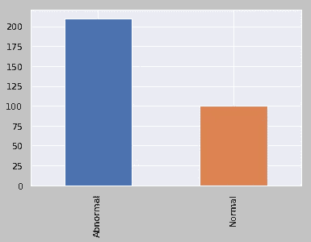
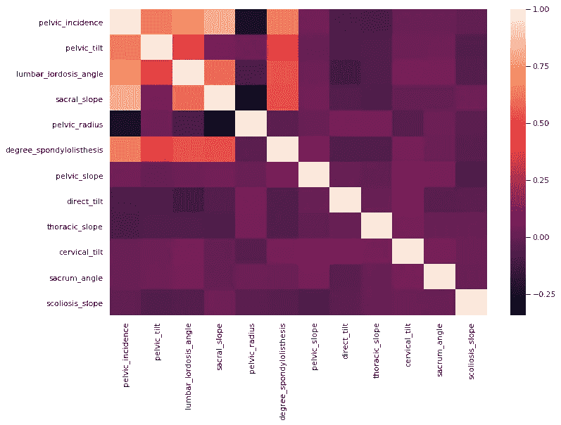
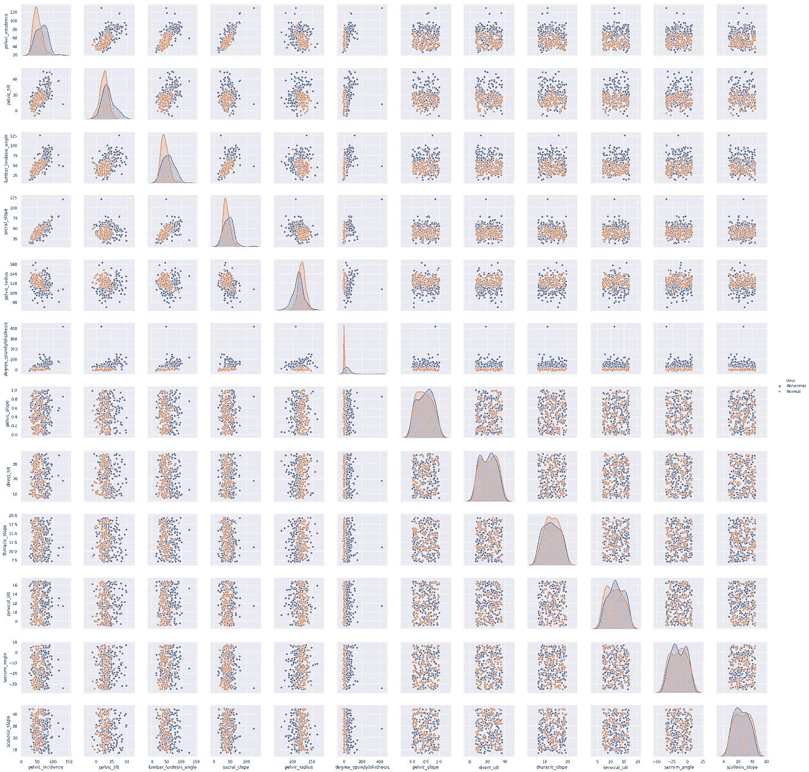
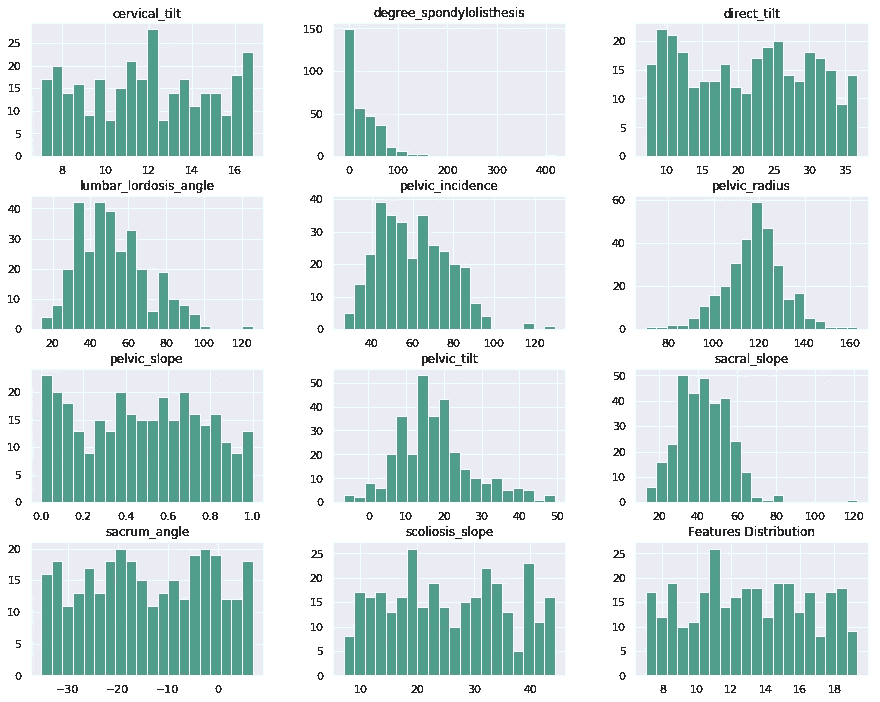
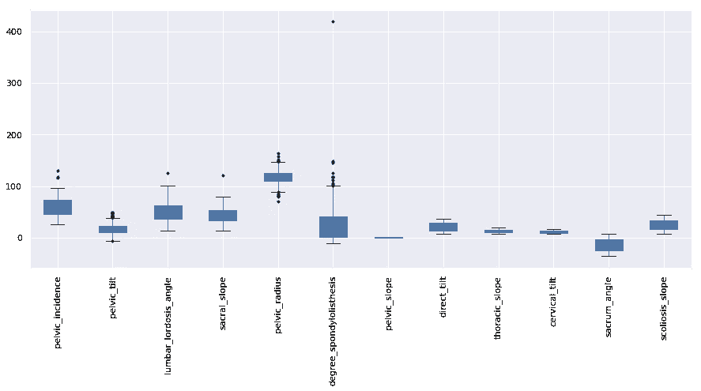
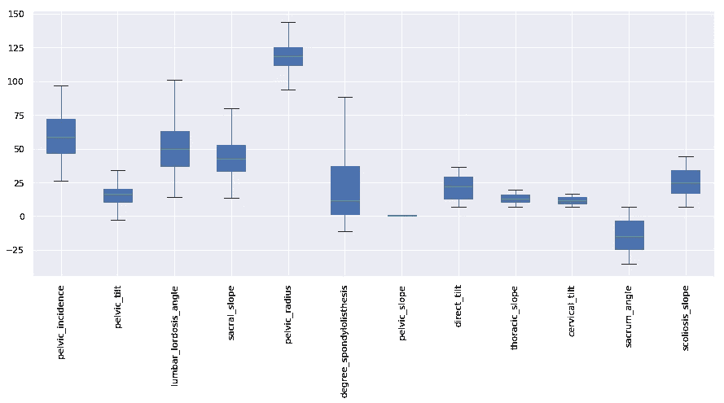
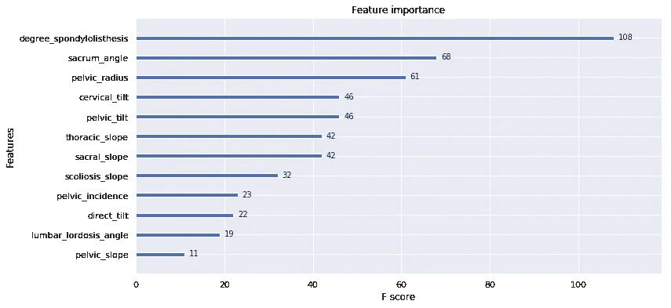
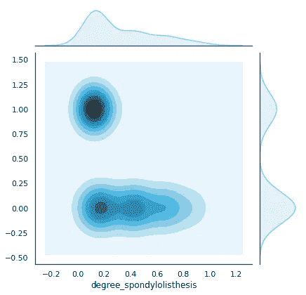

# 下腰痛的探索性数据分析

> 原文：<https://towardsdatascience.com/an-exploratory-data-analysis-on-lower-back-pain-6283d0b0123?source=collection_archive---------6----------------------->


Image collected from [https://unsplash.com/photos/XNRHhomhRU4](https://unsplash.com/photos/XNRHhomhRU4)

[**腰痛**](https://www.healthline.com/health/back-pain) ，也叫**腰痛**，不是一种病症。这是几种不同类型的医学问题的症状。它通常由下背部的一个或多个部位的问题引起，例如:

*   韧带
*   肌肉
*   神经紧张
*   构成脊柱的骨结构，称为椎体或椎骨

腰部疼痛也可能是由于附近器官(如肾脏)的问题引起的。

在这个 [EDA](https://en.wikipedia.org/wiki/Exploratory_data_analysis) 中，我将使用下背部疼痛症状[数据集](https://www.kaggle.com/sammy123/lower-back-pain-symptoms-dataset)并尝试找出该数据集的有趣见解。我们开始吧！

# 数据集描述

数据集包含:

*   **310** 观察结果
*   **12** 特征
*   **1** 标签

## 导入必要的包:

```
import numpy as np
import pandas as pd
import matplotlib.pyplot as plt
%matplotlib inlineimport seaborn as sns
sns.set()
from sklearn.preprocessing import MinMaxScaler, StandardScaler, LabelEncoder
from sklearn.svm import SVC
from sklearn.naive_bayes import GaussianNB
from sklearn.linear_model import LogisticRegression
from xgboost import XGBClassifier, plot_importance
from sklearn.model_selection import train_test_split
from sklearn.metrics import accuracy_score,confusion_matrix
```

读取`.csv`文件:

```
dataset = pd.read_csv("../input/Dataset_spine.csv")
```

查看数据集中的前 5 行:

```
dataset.head() # this will return top 5 rows 
```

移除虚拟列:

```
# This command will remove the last column from our dataset.
del dataset["Unnamed: 13"]
```

## 数据集摘要:

[DataFrame.describe()](https://pandas.pydata.org/pandas-docs/stable/generated/pandas.DataFrame.describe.html) 方法生成描述性统计数据，这些统计数据总结了数据集分布的集中趋势、离散度和形状，不包括`NaN`值。这个方法告诉我们关于数据集的很多事情。重要的一点是`describe()`方法只处理数值。它不适用于任何分类值。

现在，让我们来理解由`describe()`方法生成的统计数据:

*   `count`告诉我们一个特征中的`NoN-empty`行数。
*   `mean`告诉我们该特征的平均值。
*   `std`告诉我们该特征的标准偏差值。
*   `min`告诉我们该特性的最小值。
*   `25%`、`50%`和`75%`是每个特征的百分位数/四分位数。这种四分位数信息有助于我们发现异常值。
*   `max`告诉我们该特性的最大值。

```
dataset.describe()
```

dataset.describe() method output

重命名列以增加可读性:

```
dataset.rename(columns = {
    "Col1" : "pelvic_incidence", 
    "Col2" : "pelvic_tilt",
    "Col3" : "lumbar_lordosis_angle",
    "Col4" : "sacral_slope", 
    "Col5" : "pelvic_radius",
    "Col6" : "degree_spondylolisthesis", 
    "Col7" : "pelvic_slope",
    "Col8" : "direct_tilt",
    "Col9" : "thoracic_slope", 
    "Col10" :"cervical_tilt", 
    "Col11" : "sacrum_angle",
    "Col12" : "scoliosis_slope", 
    "Class_att" : "class"}, inplace=True)
```

[DataFrame.info()](https://pandas.pydata.org/pandas-docs/stable/generated/pandas.DataFrame.info.html) 打印关于数据帧的信息，包括`index` dtype 和`column`dtype、`non-null`值和内存使用情况。我们可以使用`info()`来知道一个数据集是否包含任何缺失值。

```
dataset.info()
```

## 可视化异常和正常情况的数量:

`abnormal`病例的趋势比`normal`病例高 2 倍。

```
dataset["class"].value_counts().sort_index().plot.bar()
```



class distribution

## 检查功能之间的相关性:

[**相关系数**](https://en.wikipedia.org/wiki/Correlation_coefficient) 是某种相关性的数值度量，表示两个变量之间的统计关系。

```
dataset.corr()
```

可视化与[热图](https://en.wikipedia.org/wiki/Heat_map)的关联:

```
plt.subplots(figsize=(12,8))
sns.heatmap(dataset.corr())
```



correlation between features

## 自定义相关图:

一个[对图](https://seaborn.pydata.org/generated/seaborn.pairplot.html)允许我们看到单个变量的分布和两个变量之间的关系。

```
sns.pairplot(dataset, hue="class")
```

在下图中，很多事情都在发生。让我们试着理解结对情节。在结对情节中，我们主要需要了解两件事。一个是特征的**分布，另一个是一个特征与所有其他特征**之间的**关系。如果我们看对角线，我们可以看到每个特征的分布。让我们考虑一下`first row X first column`，这条对角线向我们展示了`pelvic_incidence`的分布。同样，如果我们观察`second row X second column`对角线，我们可以看到`pelvic_tilt`的分布。除对角线以外的所有单元格都显示了一个要素与另一个要素之间的关系。让我们考虑一下`first row X second column`，这里我们可以说明`pelvic_incidence`和`pelvic_tilt`之间的关系。**



custom correlogram

## 使用直方图可视化要素:

一个[**直方图**](https://matplotlib.org/api/_as_gen/matplotlib.pyplot.hist.html) 是显示频率分布最常用的图形。

```
dataset.hist(figsize=(15,12),bins = 20, color="#007959AA")
plt.title("Features Distribution")
plt.show()
```



features histogram

## 检测和移除异常值

```
plt.subplots(figsize=(15,6))
dataset.boxplot(patch_artist=True, sym=”k.”)
plt.xticks(rotation=90)
```



Detect outliers using boxplot

**移除异常值:**

```
# we use tukey method to remove outliers.
# whiskers are set at 1.5 times Interquartile Range (IQR)def  remove_outlier(feature):
    first_q = np.percentile(X[feature], 25)
    third_q = np.percentile(X[feature], 75)
    IQR = third_q - first_q
    IQR *= 1.5 minimum = first_q - IQR # the acceptable minimum value
    maximum = third_q + IQR # the acceptable maximum value

    mean = X[feature].mean() """
    # any value beyond the acceptance range are considered
    as outliers.    # we replace the outliers with the mean value of that 
      feature.
    """ X.loc[X[feature] < minimum, feature] = mean 
    X.loc[X[feature] > maximum, feature] = mean # taking all the columns except the last one
# last column is the labelX = dataset.iloc[:, :-1]for i in range(len(X.columns)): 
        remove_outlier(X.columns[i])
```

移除异常值后:



features distribution after removing outliers

## 特征缩放:

[特征缩放](http://scikit-learn.org/stable/auto_examples/preprocessing/plot_scaling_importance.html)尽管标准化(或 Z 分数归一化)对于许多机器学习算法来说可能是一个重要的预处理步骤。我们的数据集包含在量级、单位和范围上差异很大的要素。但由于大多数机器学习算法在计算中使用两个数据点之间的欧几里德距离，这将产生一个问题。为了避免这种影响，我们需要将所有的特征放在相同的量级上。这可以通过[特征缩放](https://medium.com/greyatom/why-how-and-when-to-scale-your-features-4b30ab09db5e)来实现。

```
scaler = MinMaxScaler()
scaled_data = scaler.fit_transform(X)
scaled_df = pd.DataFrame(data = scaled_data, columns = X.columns)
scaled_df.head()
```

dataset head after feature scaling

## 标签编码:

像 [XGBoost](https://xgboost.readthedocs.io/en/latest/python/python_api.html) 这样的算法只能将数值作为它们的预测变量。因此，我们需要编码我们的分类值。来自`sklearn.preprocessing`包的 [LabelEncoder](http://scikit-learn.org/stable/modules/generated/sklearn.preprocessing.LabelEncoder.html) 对值在`0`和`n_classes-1`之间的标签进行编码。

```
label = dataset["class"]encoder = LabelEncoder()
label = encoder.fit_transform(label)
```

## 模型培训和评估:

```
X = scaled_df
y = labelX_train, X_test, y_train, y_test = train_test_split(X, y, test_size=0.15, random_state=0)clf_gnb = GaussianNB()
pred_gnb = clf_gnb.fit(X_train, y_train).predict(X_test)
accuracy_score(pred_gnb, y_test)# Out []: 0.8085106382978723clf_svc = SVC(kernel="linear")
pred_svc = clf_svc.fit(X_train, y_train).predict(X_test)
accuracy_score(pred_svc, y_test)# Out []: 0.7872340425531915clf_xgb =  XGBClassifier()
pred_xgb = clf_xgb.fit(X_train, y_train).predict(X_test)
accuracy_score(pred_xgb, y_test)# Out []: 0.8297872340425532
```

## 功能重要性:

```
fig, ax = plt.subplots(figsize=(12, 6))
plot_importance(clf_xgb, ax=ax)
```



feature importance

## 边缘地块

边际图[允许我们研究两个数字变量之间的关系。中间的图表显示了它们的相关性。](https://python-graph-gallery.com/82-marginal-plot-with-seaborn/)

让我们想象一下`degree_spondylolisthesis`和`class`之间的关系:

```
sns.set(style="white", color_codes=True)
sns.jointplot(x=X["degree_spondylolisthesis"], y=label, kind='kde', color="skyblue")
```



Marginal plot between `degree_spondylolisthesis and class`

就这些。感谢阅读。:)

完整代码请访问 [Kaggle](https://www.kaggle.com/nasirislamsujan/exploratory-data-analysis-lower-back-pain?scriptVersionId=5480406) 或 [Google Colab](https://colab.research.google.com/drive/1m4ZOmii2y9W8YfsWow7wLN3K8Ia84j9Y) 。

如果你喜欢这篇文章，然后给👏鼓掌。编码快乐！