# Python 中随机森林的实现和解释

> 原文：<https://towardsdatascience.com/an-implementation-and-explanation-of-the-random-forest-in-python-77bf308a9b76?source=collection_archive---------0----------------------->

([Source](https://www.pexels.com/photo/ball-ball-shaped-blur-daylight-269057/))

## 通过从单个决策树构建来使用和理解随机森林的指南。

幸运的是，有了 [Scikit-Learn](http://scikit-learn.org/) 这样的库，现在用 Python 实现[数百种机器学习算法](http://scikit-learn.org/stable/supervised_learning.html)已经很容易了。它是如此简单，以至于我们经常不需要任何关于模型如何工作的基础知识来使用它。虽然没有必要知道*所有的细节，但了解机器学习模型如何在引擎盖下工作仍然是有帮助的。这让我们能够在模型表现不佳时对其进行诊断，或者解释它是如何做出决策的，如果我们想说服他人相信我们的模型，这一点至关重要。*

在本文中，我们将看看如何在 Python 中构建和使用随机森林。除了查看代码之外，我们还将尝试了解这个模型是如何工作的。因为随机森林由许多决策树组成，所以我们将从理解单个决策树如何对简单问题进行分类开始。然后，我们将在现实世界的数据科学问题上使用随机森林。本文的完整代码可以从 GitHub 上的 [Jupyter 笔记本中获得。](https://github.com/WillKoehrsen/Machine-Learning-Projects/blob/master/Random%20Forest%20Tutorial.ipynb)

**注:**本文[最初出现在](https://enlight.nyc/random-forest) [enlight](https://enlight.nyc/) 上，这是一个社区驱动的开源平台，为那些希望学习机器学习的人提供教程。

# 理解决策树

[决策树](http://scikit-learn.org/stable/modules/tree.html)是随机森林的构建块，是一种直观的模型。我们可以把决策树想象成一系列关于我们的数据的是/否问题，最终导致一个预测的类(或者在回归情况下的连续值)。这是一个可解释的模型，因为它使分类更像我们所做的:我们对我们所拥有的可用数据进行一系列查询，直到我们做出决定(在理想世界中)。

决策树的技术[细节在于如何形成关于数据的问题。在](https://machinelearningmastery.com/classification-and-regression-trees-for-machine-learning/) [CART 算法](https://www.stat.wisc.edu/~loh/treeprogs/guide/wires11.pdf)中，通过确定问题(称为节点分裂)来构建决策树，当回答这些问题时，将导致[基尼系数杂质](https://en.wikipedia.org/wiki/Decision_tree_learning)的最大减少。这意味着决策树试图通过在特征中查找值来形成包含来自单个类的高比例样本(数据点)的节点，这些值将数据清晰地划分到各个类中。

我们稍后将详细讨论基尼系数杂质，但首先，让我们建立一个决策树，这样我们就可以在高层次上理解它。

# 简单问题的决策树

我们将从一个非常简单的二进制分类问题开始，如下所示:

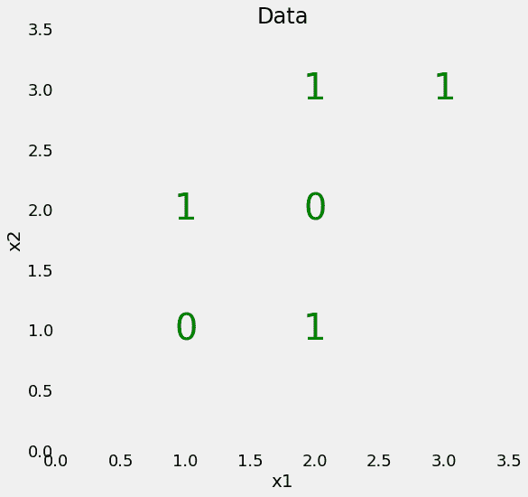

The goal is to divide the data points into their respective classes.

我们的数据只有两个特征(预测变量)，`x1`和`x2`，6 个数据点——样本——分成 2 个不同的标签。虽然这个问题很简单，但它不是线性可分的，这意味着我们不能通过数据画一条直线来对点进行分类。

然而，我们可以画出一系列的直线，将数据点分成盒子，我们称之为节点。事实上，这就是决策树在训练时所做的事情。实际上，[决策树是通过构建许多线性边界而构建的非线性模型](https://datascience.stackexchange.com/questions/6787/is-decision-tree-algorithm-a-linear-or-nonlinear-algorithm)。

为了创建一个决策树并在数据上训练(`fit`)它，我们使用 Scikit-Learn。

在训练过程中，我们为模型提供了特征和标签，因此它可以学习根据特征对点进行分类。(对于这个简单的问题，我们没有测试集，但在测试时，我们只给模型提供特征，并让它对标签进行预测。)

我们可以在训练数据上测试我们的模型的准确性:

我们看到它获得了 100%的准确率，这是我们所期望的，因为我们给了它训练的答案(`y`)，并且没有限制树的深度。事实证明，这种完全学习训练数据的能力可能是决策树的一个缺点，因为它可能会导致*过度拟合*，我们将在后面讨论。

# 可视化决策树

那么，当我们训练决策树时，实际上发生了什么呢？我发现理解决策树的一个有用的方法是可视化它，我们可以使用 Scikit-Learn 函数来实现(详情请查看笔记本或本文)。

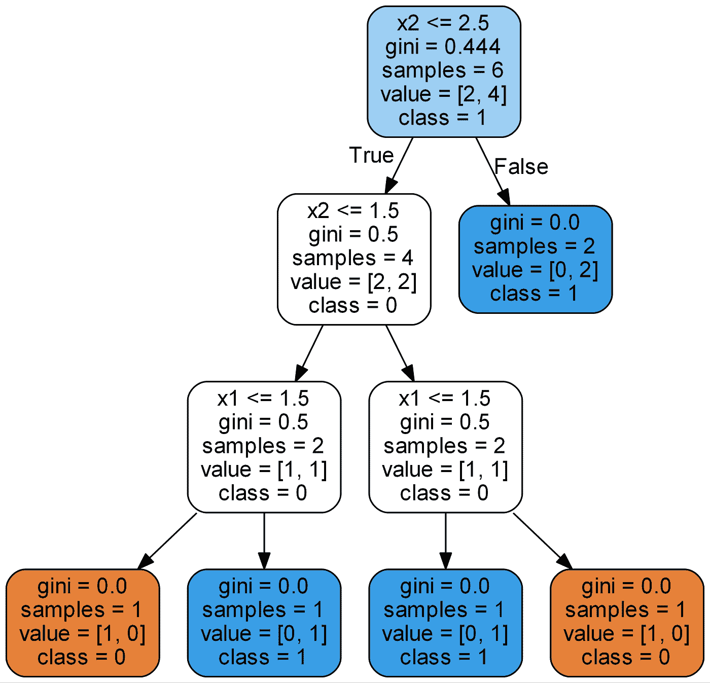

Simple decision tree

除了叶节点(彩色终端节点)之外，所有节点都有 5 个部分:

1.  根据某个要素的值询问有关数据的问题。每个问题都有一个对或错的答案来划分节点。基于问题的答案，数据点沿着树向下移动。
2.  `gini`:节点的基尼杂质。随着我们沿着树向下移动，平均加权基尼系数减少。
3.  `samples`:节点中的观察次数。
4.  `value`:每类样本的数量。例如，顶部节点具有类别 0 中的 2 个样本和类别 1 中的 4 个样本。
5.  `class`:节点中点的多数分类。在叶节点的情况下，这是对节点中所有样本的预测。

叶节点没有问题，因为它们是进行最终预测的地方。要对一个新点进行分类，只需沿着树向下移动，使用该点的特征来回答问题，直到到达一个叶节点，其中`class`是预测。

为了以不同的方式查看决策树，我们可以在原始数据上绘制决策树构建的拆分。

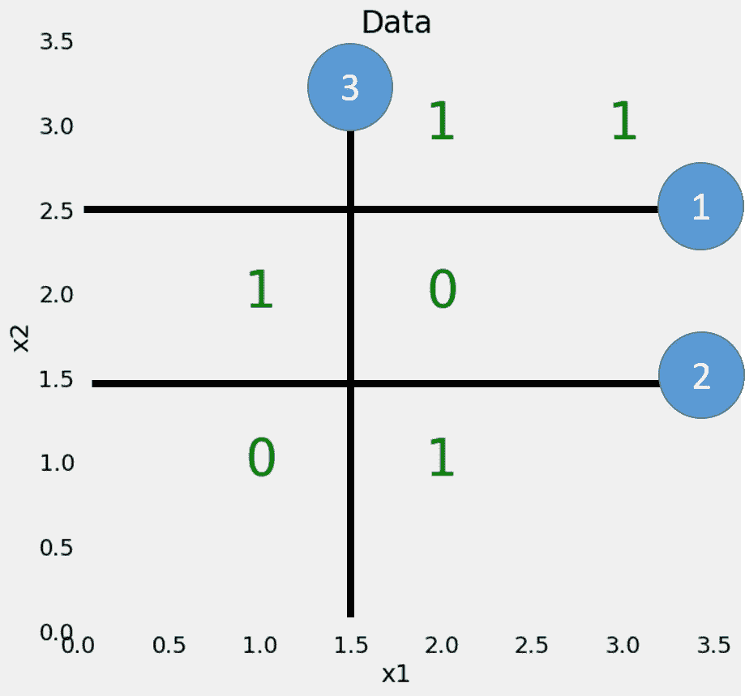

Splits made by the decision tree.

每个分割都是一条线，它根据特征值将数据点分成节点。对于这个简单的问题，没有对最大深度的限制，划分将每个点放在一个节点中，只有相同类别的点。(同样，稍后我们会看到这种对*训练*数据的完美划分可能不是我们想要的，因为它会导致*过度拟合*。)

# 基尼杂质

在这一点上，深入了解基尼系数的概念是有帮助的(数学并不可怕！)节点的 [Gini 杂质](https://en.wikipedia.org/wiki/Decision_tree_learning#Gini_impurity)是节点中随机选择的样本如果被该节点中样本的分布标记，将被错误标记的概率。例如，在顶部(根)节点中，有 44.4%的机会对基于节点中的样本标签随机选择的数据点进行错误分类。我们使用以下等式得出该值:

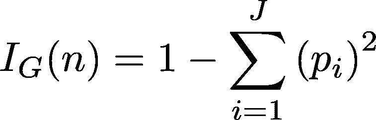

Gini impurity of a node n.

节点`n`的基尼不纯度是 1 减去所有类别`J`(对于二进制分类任务，这是 2)中每个类别`p_i`的样本分数的平方。这在文字上可能有点混乱，所以让我们算出根节点的 Gini 杂质。

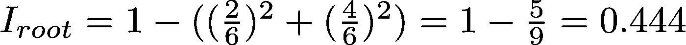

Gini Impurity of the root node

在每一个节点，决策树在特征中搜索导致基尼系数杂质*最大减少*的值。(分裂节点的另一种选择[是使用信息增益](https://datascience.stackexchange.com/questions/10228/gini-impurity-vs-entropy)，一个相关的概念)。

然后，它在贪婪的[递归过程](http://scikit-learn.org/stable/modules/tree.html#tree)中重复该分裂过程，直到它达到最大深度，或者每个节点仅包含来自一个类的样本。每一级别的加权基尼系数都必须降低。在树的第二层，总加权基尼系数为 0.333:

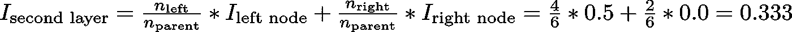

(每个节点的 Gini 杂质由该节点中来自父节点的分数加权。)您可以继续计算每个节点的基尼系数(查看答案的图片)。从一些基本的数学中，一个强大的模型出现了！

最终，最后一层的加权总 Gini 杂质变为 0，这意味着每个节点都是完全纯的，并且从该节点中随机选择的点不会被错误分类。虽然这似乎是积极的，但这意味着模型可能会过度拟合，因为节点仅使用*训练数据构建。*

# 过度适应:或者为什么一片森林比一棵树更好

你可能会问为什么不仅仅使用一个决策树呢？它似乎是完美的分类器，因为它没有犯任何错误！需要记住的一个关键点是，采油树在训练数据上没有出现错误**。我们希望如此，因为我们给了树答案，并且没有限制最大深度(级别数)。机器学习模型的目标是很好地推广到从未见过的新数据。**

**过度拟合**发生在我们有一个[非常灵活的模型](http://qr.ae/TUNozZ)(该模型具有高容量)时，该模型本质上是**通过紧密拟合来记忆**训练数据。问题是，模型不仅学习训练数据中的实际关系，还学习存在的任何噪声。一个灵活的模型被称为具有高 ***方差*** ，因为学习到的参数(例如决策树的结构)会随着训练数据而显著变化。

另一方面，不灵活的模型被认为具有高 ***偏差*** ，因为它对训练数据做出**假设**(它偏向于数据的预先设想的想法。)例如，线性分类器假设数据是线性的，并且不具有拟合非线性关系的灵活性。一个不灵活的模型甚至可能不具备拟合训练数据的能力，并且在两种情况下——高方差和高偏差——该模型都不能很好地推广到新数据。

> 创建一个如此灵活的模型来记忆训练数据与一个不灵活的模型无法学习训练数据之间的平衡被称为[偏差-方差权衡](https://en.wikipedia.org/wiki/Bias%E2%80%93variance_tradeoff)，是机器学习中的一个基本概念。

当我们不限制最大深度时，决策树容易过度拟合的原因是因为它具有无限的灵活性，这意味着它可以保持增长，直到对于每个单独的观察只有一个叶节点，从而对所有的观察进行完美的分类。如果您返回到决策树的图像，并将最大深度限制为 2(只进行一次分割)，则分类不再是 100%正确的。我们减少了决策树的方差，但代价是增加了偏差。

作为限制树的深度的一种替代方法，这减少了方差(好的)并增加了偏差(坏的)，我们可以将许多决策树组合成一个单一的集成模型，称为随机森林。

# 随机森林

[随机森林](https://www.stat.berkeley.edu/~breiman/RandomForests/cc_home.htm)是由许多决策树组成的模型。这个模型不是简单地平均预测树木(我们可以称之为“森林”)，而是使用了两个关键概念，并因此得名*随机*:

1.  构建树时对训练数据点进行随机采样
2.  分割结点时考虑的随机要素子集

## 训练观察值的随机抽样

训练时，随机森林中的每棵树都从数据点的**随机**样本中学习。使用替换抽取[样本，称为*自举，*这意味着一些样本将在单个树中多次使用。其思想是通过在不同的样本上训练每棵树，尽管每棵树相对于一组特定的训练数据可能具有较高的方差，但总体上，整个森林将具有较低的方差，但不会以增加偏差为代价。](https://en.wikipedia.org/wiki/Bootstrapping_(statistics))

在测试时，通过平均每个决策树的预测来进行预测。这种在不同的数据自举子集上训练每个个体学习者，然后对预测进行平均的过程被称为 *bagging* ，是 [*自举聚合*](https://machinelearningmastery.com/bagging-and-random-forest-ensemble-algorithms-for-machine-learning/) *的缩写。*

## 用于分割节点的随机特征子集

随机森林中的另一个主要概念是，在分割每个决策树中的每个节点时，只考虑所有特征的[子集。通常，这被设置为`sqrt(n_features)`用于分类，这意味着如果在每棵树的每个节点有 16 个特征，则只有 4 个随机特征将被考虑用于分裂节点。(也可以考虑每个节点的所有特征来训练随机森林，这在回归中是常见的。这些选项可以在](https://sebastianraschka.com/faq/docs/random-forest-feature-subsets.html) [Scikit-Learn 随机森林实现](http://scikit-learn.org/stable/modules/generated/sklearn.ensemble.RandomForestClassifier.html)中控制。

如果你能理解单个决策树、*装袋、*和随机特征子集的概念，那么你就对随机森林的工作原理有了很好的理解:

> 随机森林组合了数百或数千棵决策树，根据一组略有不同的观察值训练每棵树，考虑有限数量的特征来分割每棵树中的节点。随机森林的最终预测是通过对每棵树的预测进行平均而得到的。

为了理解为什么随机森林比单一决策树更好，想象以下场景:你必须决定特斯拉的股票是否会上涨，并且你可以接触到十几名事先对该公司一无所知的分析师。每个分析师都有较低的偏见，因为他们没有任何假设，并且可以从新闻报道的数据集中学习。

这似乎是一种理想的情况，但问题是，除了真实的信号之外，报告很可能包含噪声。因为分析师的预测完全基于数据——他们有很高的灵活性——他们会被不相关的信息左右。分析师可能会从同一数据集得出不同的预测。此外，每个分析师都有很高的方差，如果给他们一套*不同的*训练报告，他们会得出截然不同的预测。

解决方案是不要依赖任何一个人，而是集中每个分析师的投票。此外，像在随机森林中一样，允许每个分析师只访问报告的一部分，并希望噪声信息的影响将被抽样抵消。在现实生活中，我们依赖于多个来源(永远不要相信一个单独的亚马逊评论)，因此，不仅决策树是直观的，而且在随机森林中组合它们的想法也是如此。

# 实践中的随机森林

接下来，我们将使用 Scikit-Learn 在 Python 中构建一个随机森林。我们不是学习一个简单的问题，而是使用一个分成训练集和测试集的真实数据集。我们使用*测试集*来评估模型在新数据上的表现，这也让我们可以确定模型过度拟合的程度。

## 资料组

我们要解决的问题是一个二元分类任务，目标是预测个人的健康状况。这些特征是个人的社会经济和生活方式特征，标签为健康不佳的`0`和健康良好的`1`。该数据集由[疾病控制和预防中心](https://www.cdc.gov/)收集，可在获得[。](https://www.kaggle.com/cdc/behavioral-risk-factor-surveillance-system)

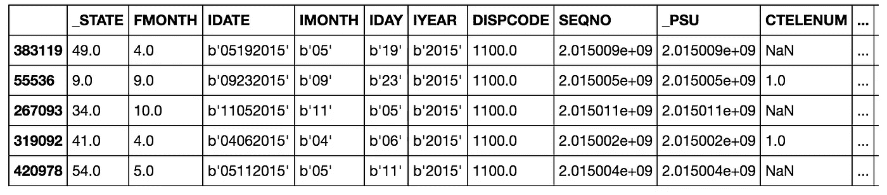

Sample of Data

一般来说，数据科学项目的 80%都花在清理、探索和创建数据特征上。然而，对于本文，我们将坚持建模。(其他步骤详见[本文](https://medium.com/p/c62152f39420?source=your_stories_page---------------------------))。

这是一个不平衡的分类问题，因此准确度不是一个合适的度量。相反，我们将测量曲线 (ROC AUC)下的[接收器操作特征面积，这是一个从 0(最差)到 1(最好)的测量值，随机猜测得分为 0.5。我们也可以绘制 ROC 曲线来评估模型。](https://developers.google.com/machine-learning/crash-course/classification/roc-and-auc)

[笔记本](https://github.com/WillKoehrsen/Machine-Learning-Projects/blob/master/Random%20Forest%20Tutorial.ipynb)包含了决策树和随机森林的实现，但是这里我们只关注随机森林。读入数据后，我们可以实例化并训练一个随机森林，如下所示:

经过几分钟的训练后，模型可以对测试数据进行预测，如下所示:

我们进行类别预测(`predict`)和预测概率(`predict_proba`)来计算 ROC AUC。一旦我们有了测试预测，我们就可以计算 ROC AUC。

# 结果

随机森林的最终测试 ROC AUC 为 **0.87** ，相比之下，具有无限最大深度的单一决策树的 ROC AUC 为 **0.67** 。如果我们查看训练分数，两个模型都达到了 1.0 ROC AUC，这也是预期的，因为我们给了这些模型训练答案，并且没有限制每个树的最大深度。

虽然随机森林过拟合(在训练数据上比在测试数据上做得更好)，但它能够比单个决策树更好地概括测试数据。随机森林具有较低的方差(好),同时保持决策树的低偏差(也是好的)。

我们还可以绘制单一决策树(顶部)和随机森林(底部)的 ROC 曲线。向左上方的曲线是更好的模型:

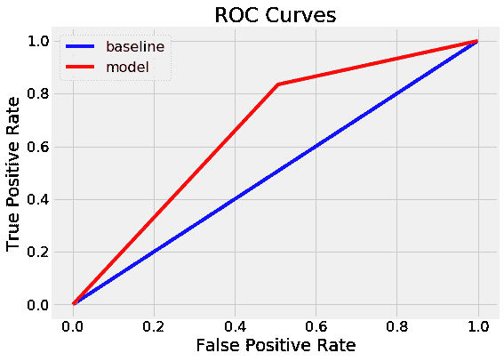

Decision Tree ROC Curve

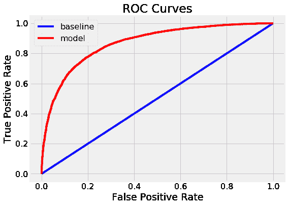

Random Forest ROC Curve

*随机森林明显优于单决策树。*

我们可以采取的模型的另一个诊断措施是绘制测试预测的混淆矩阵(详见笔记本):

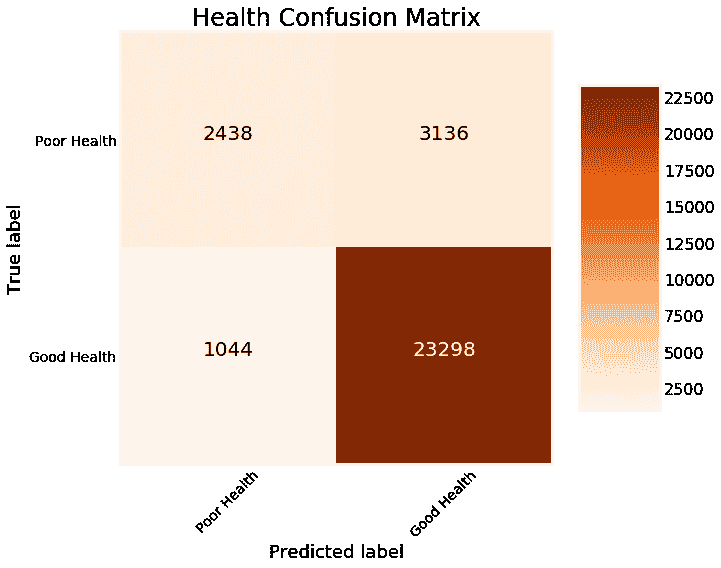

这在左上角和右下角显示了模型得到的正确预测，在左下角和右上角显示了模型错过的预测。我们可以使用这样的图来诊断我们的模型，并决定它是否足够好，可以投入生产。

## 特征重要性

随机森林中的特征重要性表示在该特征上分割的所有节点上基尼系数杂质减少的总和。我们可以用这些来试着找出随机森林认为最重要的预测变量。可以从经过训练的随机森林中提取特征重要性，并将其放入 Pandas 数据帧中，如下所示:

通过告诉我们什么样的变量在类之间是最有辨识力的，特征重要性可以给我们对问题的洞察力。例如，这里的`DIFFWALK,` 表示患者是否行走困难，这是在问题上下文中有意义的最重要特征。

通过从最重要的要素构建附加要素，要素重要性可用于要素工程。我们也可以通过移除低重要性特征来使用特征重要性进行[特征选择](http://scikit-learn.org/stable/modules/feature_selection.html)。

## 可视化森林中的树

最后，我们可以想象森林中的一棵决策树。这一次，我们必须限制树的深度，否则它会太大而无法转换成图像。为了制作下图，我将最大深度限制为 6。这仍然会产生一棵我们无法完全解析的大树！然而，考虑到我们对决策树的深入研究，我们掌握了我们的模型是如何工作的。

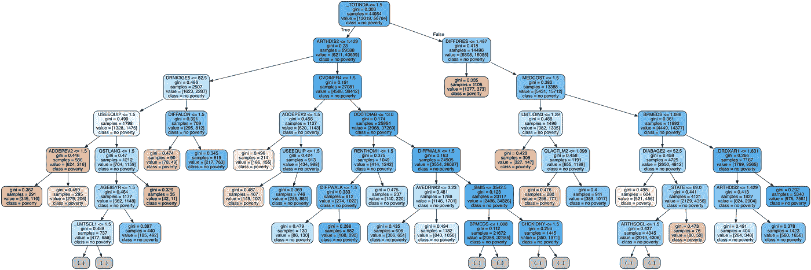

Single decision tree in random forest.

# 后续步骤

下一步是优化随机森林，我们可以使用 Scikit-Learn 中的`[RandomizedSearchCV](http://scikit-learn.org/stable/modules/generated/sklearn.model_selection.RandomizedSearchCV.html)` [通过随机搜索来实现。](http://scikit-learn.org/stable/modules/generated/sklearn.model_selection.RandomizedSearchCV.html)优化是指在给定数据集上为模型寻找最佳超参数。最佳超参数会因数据集而异，因此我们必须对每个数据集分别执行优化(也称为模型调整)。

我喜欢把模型调整看作是为机器学习算法寻找最佳设置。我们可以在随机森林中优化的示例包括决策树的数量、每个决策树的最大深度、分割每个节点时考虑的最大特征数量以及叶节点中所需的最大数据点数量。

关于随机森林模型优化的随机搜索的实现，请参考 [Jupyter 笔记本。](https://github.com/WillKoehrsen/Machine-Learning-Projects/blob/master/Random%20Forest%20Tutorial.ipynb)

# 完整的运行示例

下面的代码是用 [repl.it](http://repl.it) 创建的，展示了一个完整的 Python 中随机森林的交互式运行示例。请随意运行并更改代码(加载包可能需要一些时间)。

Complete Python example of random forest.

# 结论

虽然我们可以在不了解任何东西的情况下用 Python 构建强大的机器学习模型，但我发现了解幕后发生的事情更有效。在本文中，我们不仅用 Python 构建并使用了一个随机森林，而且还从基础开始，加深了对该模型的理解。

我们首先查看了一个单独的决策树，即随机森林的构建块，然后查看了如何通过将数百个决策树组合成一个称为随机森林的集合模型来克服单个决策树的高方差。随机森林使用观察值的随机采样、要素的随机采样和平均预测的概念。

本文中需要理解的关键概念是:

1.  **决策树**:基于一系列关于特征值的问题做出决策的直观模型。具有导致过度拟合训练数据的低偏差和高方差。
2.  **基尼系数**:决策树在分割每个节点时试图最小化的一种度量。表示根据样本在节点中的分布，从节点中随机选择的样本被错误分类的概率。
3.  **Bootstrapping** :用替换法对随机观测值集进行抽样。
4.  **随机特征子集**:当考虑决策树中每个节点的分裂时，选择一组随机特征。
5.  **随机森林**:由许多决策树组成的集成模型，使用自举、随机特征子集和平均投票进行预测。这是一个装袋合奏的例子。
6.  **偏差-方差权衡**:机器学习中的一个核心问题，描述了一个具有高灵活性(高方差)的模型和一个不灵活的模型(高偏差)之间的平衡，前者可以很好地学习训练数据，但代价是不能推广到新数据，后者不能学习训练数据。随机森林减少了单个决策树的方差，从而对新数据进行更好的预测。

希望这篇文章已经给了您开始在您的项目中使用 random forest 所需的信心和理解。随机森林是一个强大的机器学习模型，但这不应该阻止我们了解它是如何工作的。我们对一个模型了解得越多，我们就越有能力有效地使用它，并解释它是如何做出预测的。

一如既往，我欢迎评论、反馈和建设性的批评。可以在推特上找到我。本文最初发表在研究机器学习的开源社区 [enlight](https://enlight.nyc/) 上。我要感谢 enlight 和 [repl.it](http://repl.it) 在文章中提供代码。